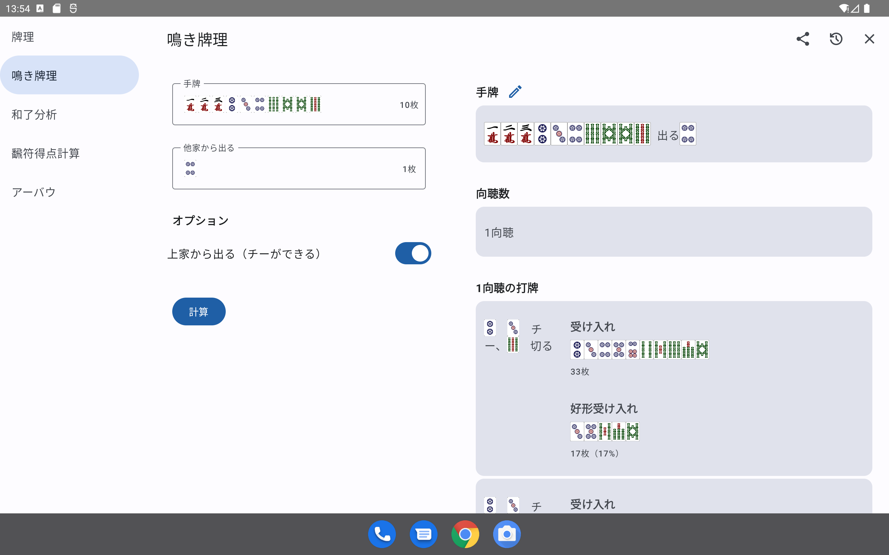
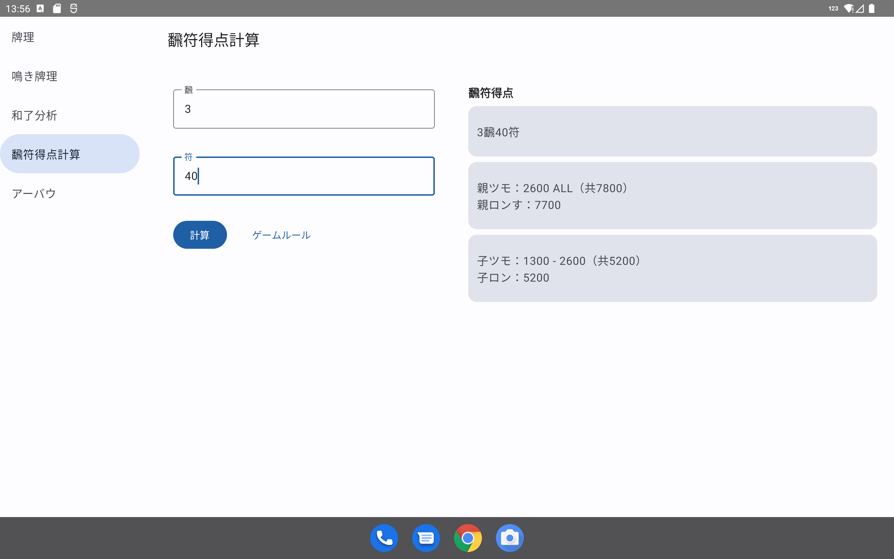

リーチ麻雀計算機
======

[中文](README-ZH.md) [English](README.md)

Web版：

- https://ssttkkl.github.io/mahjong-utils-app/
- https://mahjong-utils-app.vercel.app

Android版：

- [Releases](https://github.com/ssttkkl/mahjong-utils-app/releases)ページにアクセスし、最新リリースで**composeApp-release.apk**をダウンロードしてください。

デスクトップ版：

- JAR (Javaが必要): [Releases](https://github.com/ssttkkl/mahjong-utils-app/releases)ページにアクセスし、最新リリースで**mahjong-utils-app-xxx-vvv.jar** (xxxはOSとアーキテクチャ、vvvはバージョン名)をダウンロードしてください。ダブルクリックで実行します。（例: Windows X64ユーザーは**mahjong-utils-app-windows-x64-xxx-release.jar**をダウンロードしてください）
- インストールパッケージ (Java不要): [Releases](https://github.com/ssttkkl/mahjong-utils-app/releases)ページにアクセスし、最新リリースで**mahjong-utils-app-vvv.xxx** (xxxはOSのパッケージ形式、vvvはバージョン名)をダウンロードしてください。ダブルクリックでインストールします。（例: Windows X64ユーザーは**mahjong-utils-app-vvv.exe**をダウンロードしてください）

iOS版：

- リポジトリをクローンし、自分でビルドする必要があります。Xcode、Cocoapods、およびJDK (>= 11) が必要です。
- リポジトリをクローンし、**iosApp**で`pod install`を実行し、Xcodeで**iosApp/iosApp.xcworkspace**を開いてビルドできます。

## 機能

- 牌理：牌効率・良形効率（一向聴のみ）・向聴戻しを含みます。

- 鳴き牌理：鳴き（チー・ポン・カン・パス）の牌効率・良形効率（一向聴のみ）・向聴戻しを含まれます。

- 和了分析：初期設定は雀魂や天鳳のルールに従いますが、ある程度カスタマイズ可能です。

  

- 飜符による得点計算：初期設定は麻雀魂や天鳳のルールに従いますが、ある程度カスタマイズ可能です。

## 追加情報

アルゴリズムはローカルで実行され、ネットワークアクセスは行いません。

アプリはKotlin/MultiplatformおよびCompose Multiplatformを基に作られています。PRは歓迎します。

バグや翻訳ミスを発見した場合は、[issue](https://github.com/ssttkkl/mahjong-utils-app/issues)に報告してください。

## ライセンス

MIT
