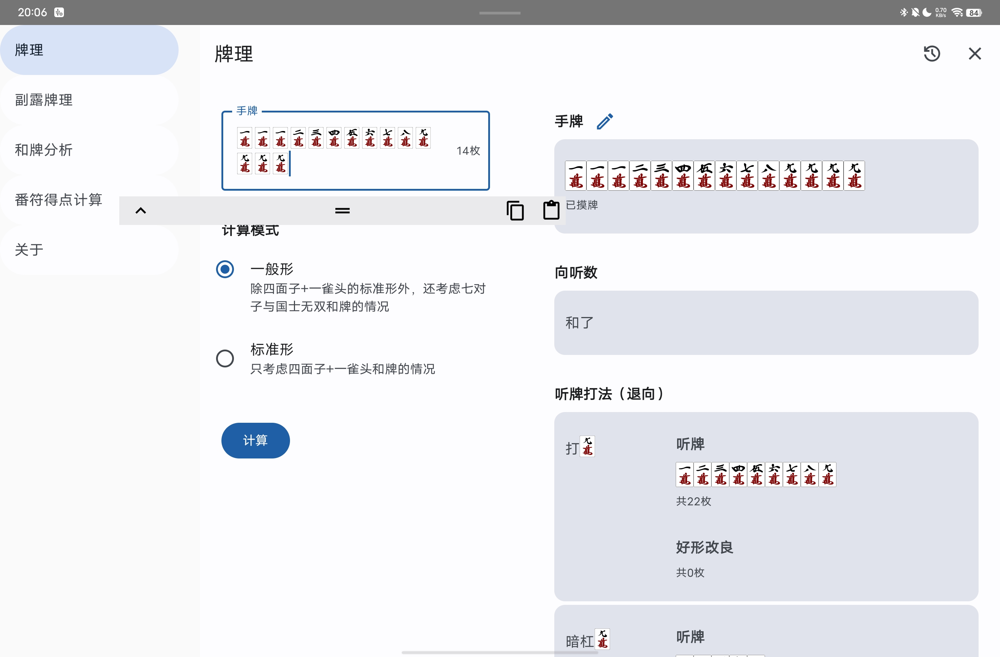
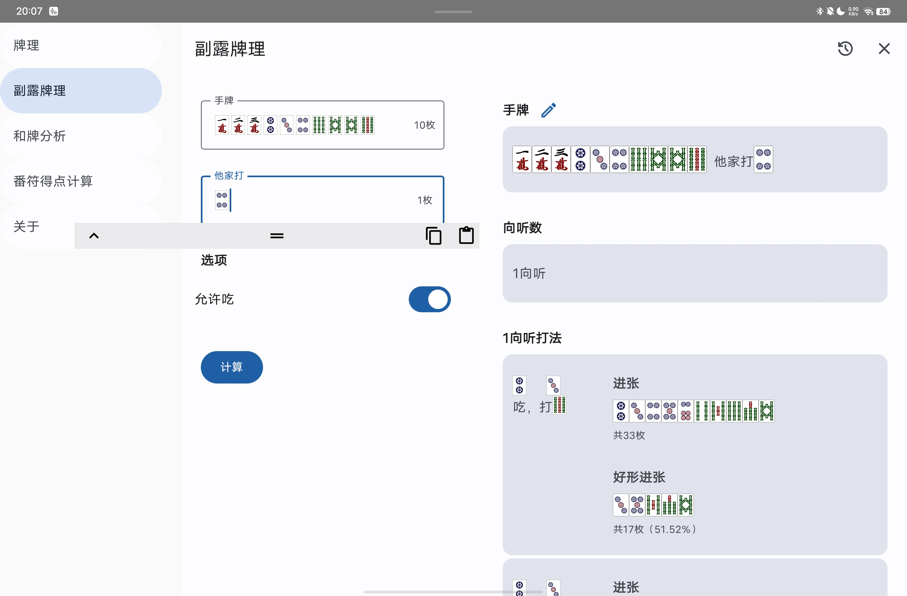
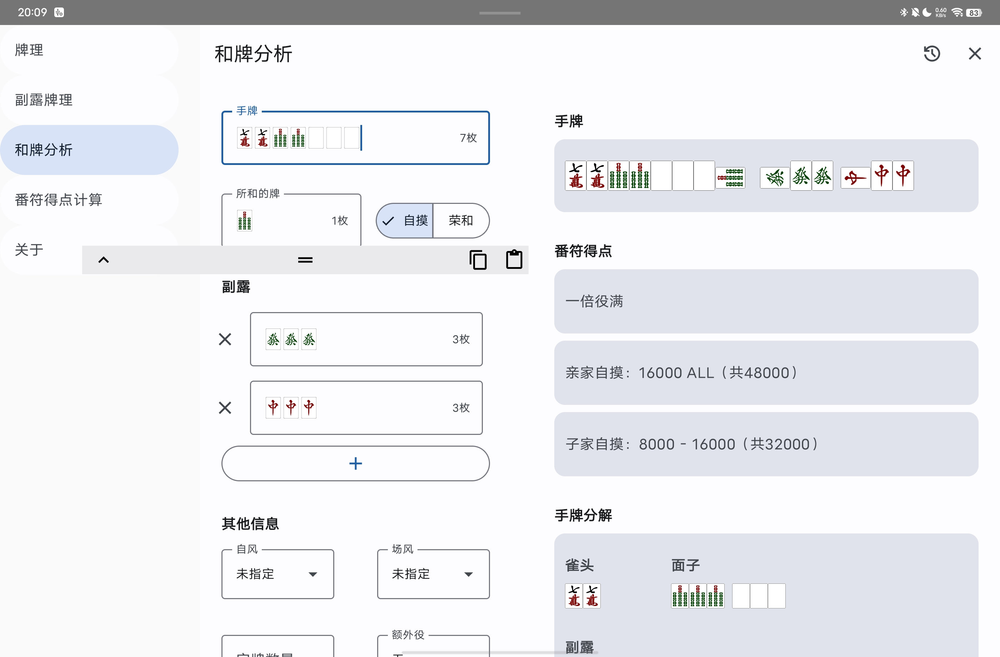
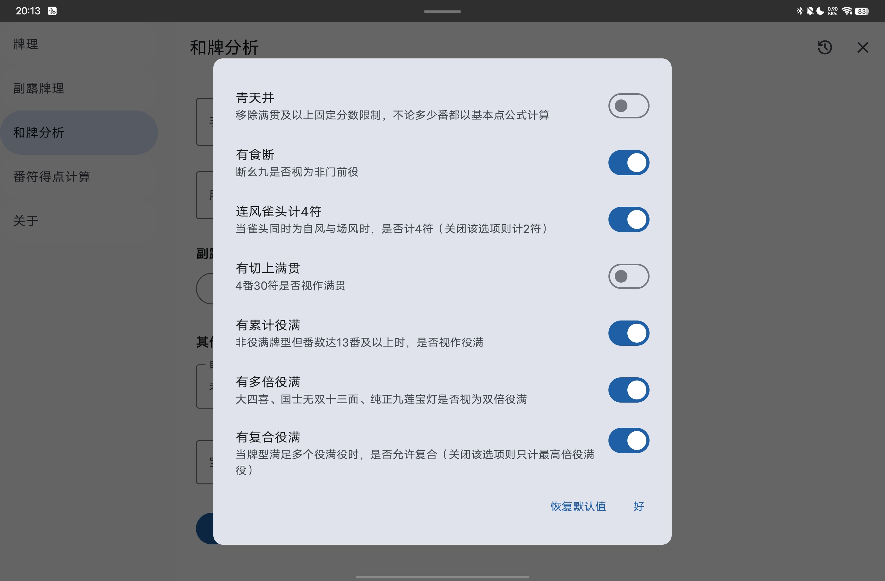
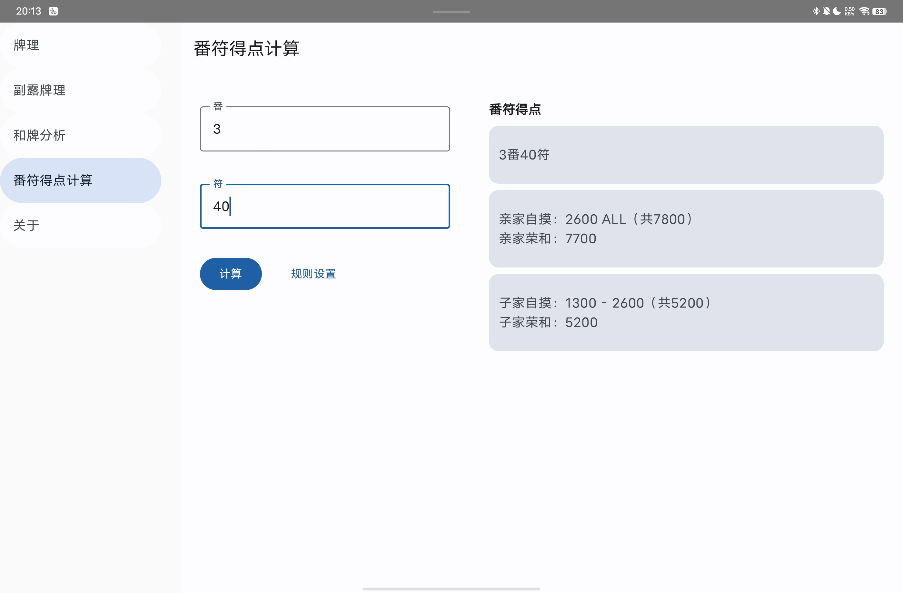

日麻牌理计算器
======

[English](README.md) [日本語](README-JA.md)

Web版：

- https://ssttkkl.github.io/mahjong-utils-app/
- https://mahjong-utils-app.vercel.app

安卓版：

- 前往[Releases](https://github.com/ssttkkl/mahjong-utils-app/releases)页面下载最新版本的**composeApp-release.apk**

桌面版：

- JAR（需要安装Java）：前往[Releases](https://github.com/ssttkkl/mahjong-utils-app/releases)页面下载最新版本对应平台的**mahjong-utils-app-xxx.jar**，双击运行即可。例如Windows系统需要下载mahjong-utils-app-windows-x64-xxx-release.jar
- 安装包（无需安装Java）：前往[Releases](https://github.com/ssttkkl/mahjong-utils-app/releases)页面下载最新版本对应平台的**mahjong-utils-app-xxx.xxx**，双击安装即可。例如Windows系统需要下载mahjong-utils-app-xxx.exe

iOS版：

- 前往[Releases](https://github.com/ssttkkl/mahjong-utils-app/releases)页面下载最新版本的**iosApp-unsigned.ipa**
- 使用[Sideloadly](https://sideloadly.io/)或其他任何自签名安装工具，对IPA进行签名并安装到你的设备。

## 功能

- 牌理：包括进张、好形进张（仅一向听）、退向打法

- 副露牌理：吃碰杠PASS四种打法下的进张、好形进张（仅一向听）、退向打法

- 和牌分析：默认为雀魂/天凤规则，可以定制少部分规则

- 番符得点计算：默认为雀魂/天凤规则，可以定制少部分规则

## App说明

算法为纯手工自制，App无需网络，纯本地计算

App基于Kotlin/Multiplatform与Compose Multiplatform技术栈开发，欢迎PR

可能会有些小Bug，欢迎通过GitHub的issue区反馈问题

## LICENSE

MIT
