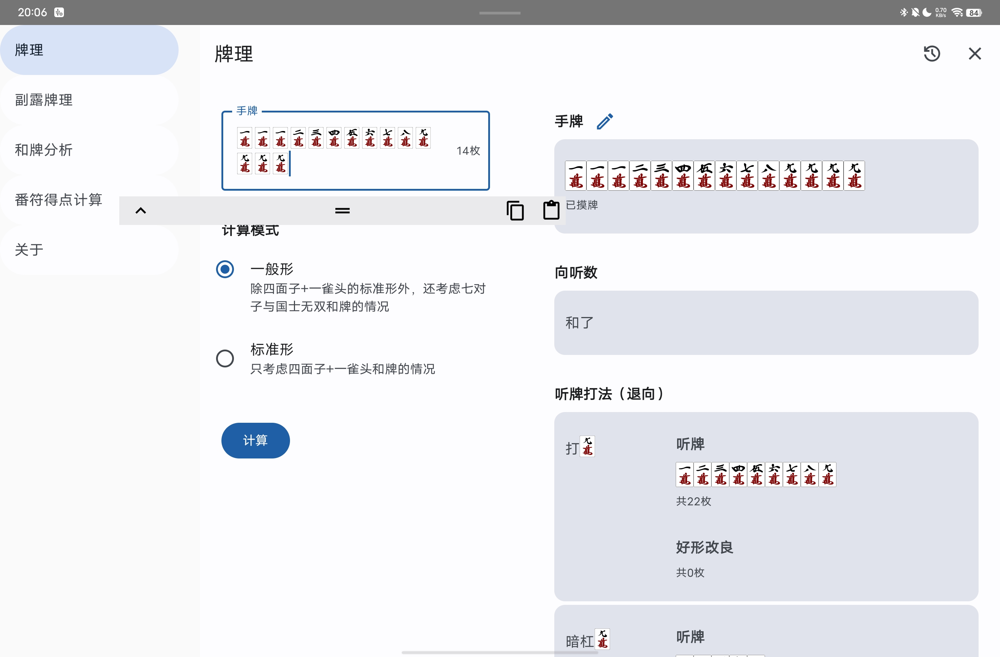
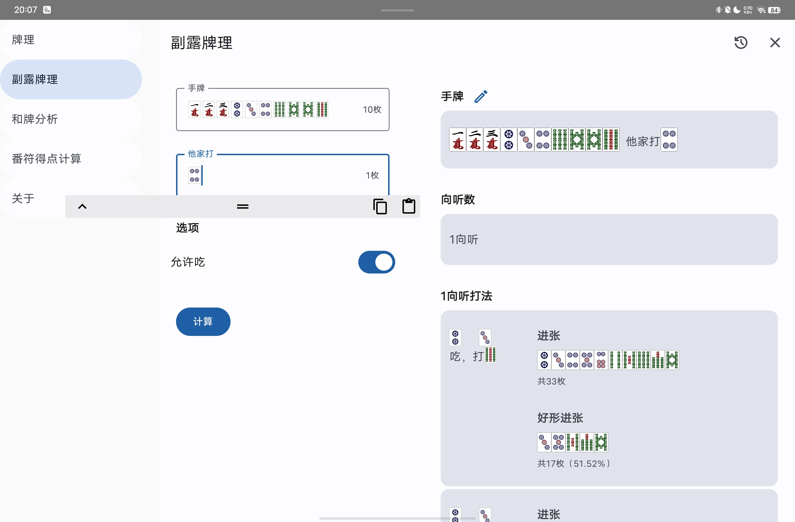
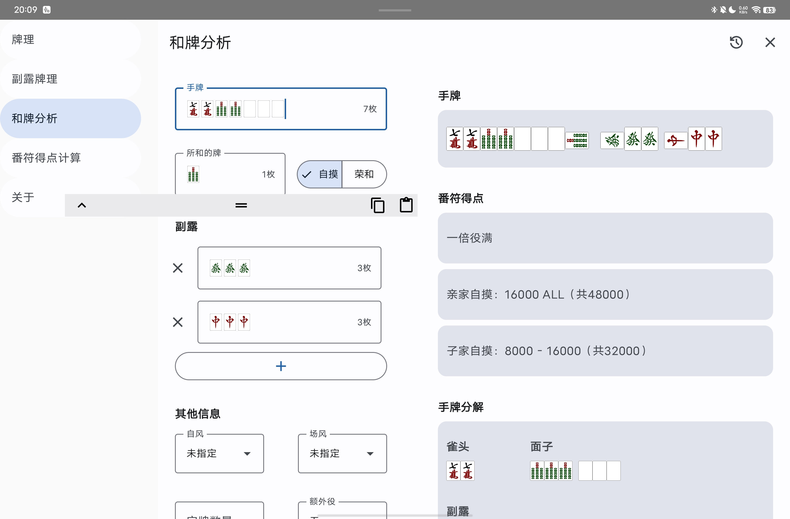
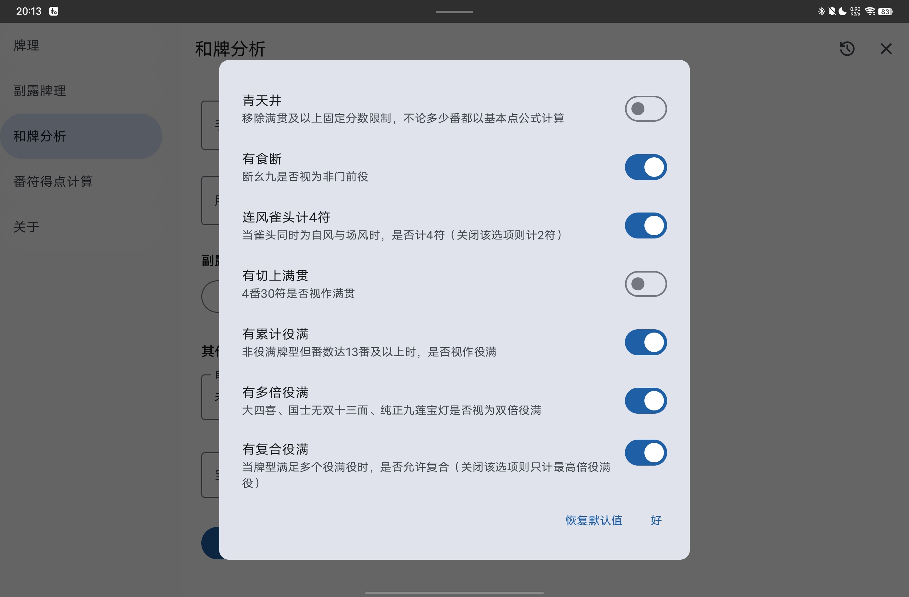
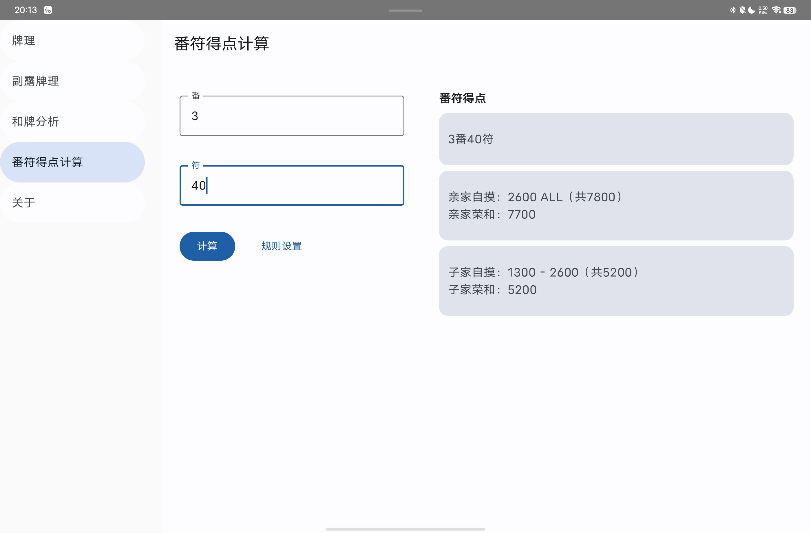

日麻牌理计算器
======

Web版地址：

- https://mahjong-utils-app.vercel.app
- https://ssttkkl.github.io/mahjong-utils-app/

支持平台：

- [x] Android
- [x] iOS
- [x] Desktop
- [x] Web

## 功能

- 牌理：包括进张、好形进张（仅一向听）、退向打法

- 副露牌理：吃碰杠PASS四种打法下的进张、好形进张（仅一向听）、退向打法

- 和牌分析：默认为雀魂/天凤规则，可以定制少部分规则

- 番符得点计算：默认为雀魂/天凤规则，可以定制少部分规则

## App说明

算法为纯手工自制，App无需网络，纯本地计算

App基于Kotlin/Multiplatform与Compose Multiplatform技术栈开发，欢迎PR

可能会有些小Bug，欢迎通过GitHub的issue区反馈问题

## LICENSE

MIT
