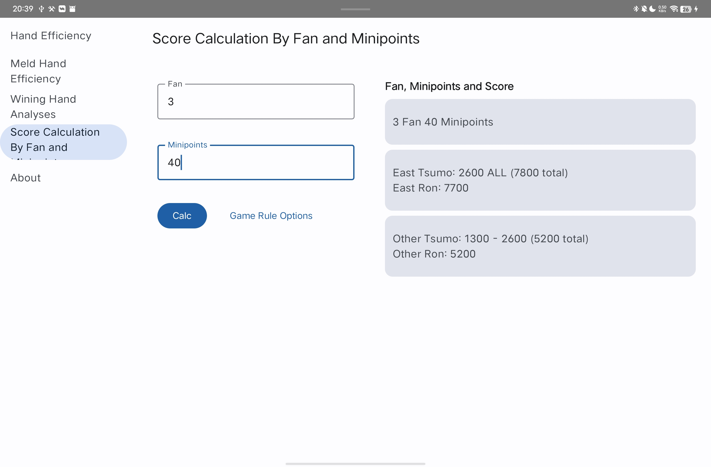
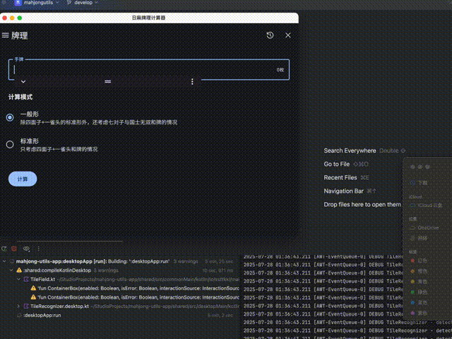

Riichi Mahjong Calculator
======

[中文](README-ZH.md) [日本語](README-JA.md)

For Web:

- https://ssttkkl.github.io/mahjong-utils-app/
- https://mahjong-utils-app.vercel.app

For Android:

- Download from F-Droid:

- Or go to [Releases](https://github.com/ssttkkl/mahjong-utils-app/releases) and download
  **composeApp-release.apk** in the latest release.

For Desktop:

- Go to [Releases](https://github.com/ssttkkl/mahjong-utils-app/releases) and download installer/JAR
  for your OS in the latest release.

| OS            | Installer File (install to run, no Java required) | JAR File (click to run, Java 11+ required)        |
|---------------|---------------------------------------------------|---------------------------------------------------|
| Windows (x64) | mahjong-utils-app-xxx-**x64.exe**                 | mahjong-utils-app-**windows-x64**-xxx-release.jar |
| macOS (arm64) | mahjong-utils-app-xxx-**arm64.dmg**               | mahjong-utils-app-**macos-arm64**-xxx-release.jar |
| macOS (x64)   | mahjong-utils-app-xxx-**x64.dmg**                 | mahjong-utils-app-**macos-x64**-xxx-release.jar |
| Linux (x64)   | mahjong-utils-app-xxx-**x86_64.AppImage**         | mahjong-utils-app-**linux-x64**-xxx-release.jar   |

For iOS:

- Go to [Releases](https://github.com/ssttkkl/mahjong-utils-app/releases) and download
  **iosApp-unsigned.ipa** in the latest release.
- Sign it yourself and install using [Sideloadly](https://sideloadly.io/) or any other signing
  tools.

## Features

- Hand Efficiency: Includes tile efficiency, good-shape tile efficiency (for one-shanten only), and
  backwards strategy.

- Meld Hand Efficiency: Tile efficiency for chow, pung, kong, and pass; includes good-shape tile
  efficiency (for one-shanten only) and backwards strategy.

- Winning Hand Analysis: Defaults to Mahjong Soul/Tenhou rules, with customizable rules to some
  extent.

- Score Calculation By Fan and Minipoints: Defaults to Mahjong Soul/Tenhou rules, with customizable
  rules to some extent.

### Image Recognition for Mahjong Tiles

Any input field that requires Mahjong tiles can utilize the image recognition feature.
Open the menu from the input keyboard, or long-press/right-click on the input field
to select options like "Recognize from Image". You can also paste from the clipboard
using the shortcut `Ctrl`+`V` (or `Cmd`+`V` on macOS).

Note: For optimal recognition results, use screenshots from ~Majsoul~ (the trained model is
specifically designed for ~Majsoul~).

## Addition

The algorithm runs at local, no network access will be made.

App based on Kotlin/Multiplatform and Compose Multiplatform, PR is welcomed.

If you find any bug or incorrect translation, please report
in [issue](https://github.com/ssttkkl/mahjong-utils-app/issues).

## LICENSE

MIT
