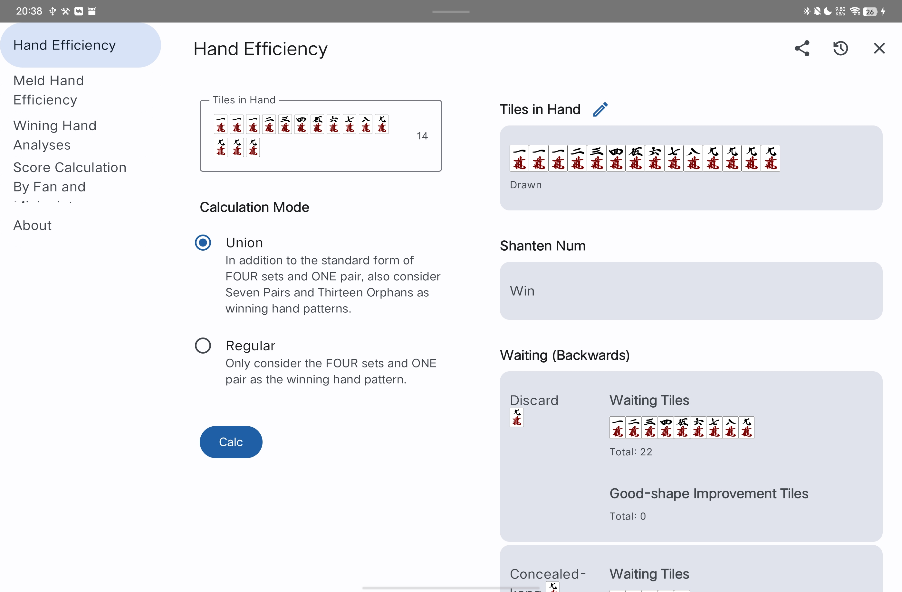
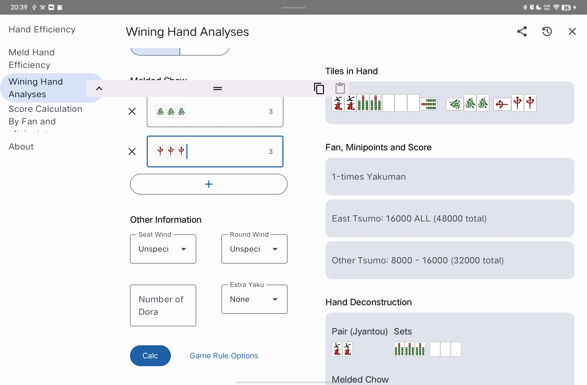

Riichi Mahjong Calculator
======

[中文](README-ZH.md) [日本語](README-JA.md)

For Web:

- https://ssttkkl.github.io/mahjong-utils-app/
- https://mahjong-utils-app.vercel.app

For Android:

- Download from F-Droid:

- Or go to [Releases](https://github.com/ssttkkl/mahjong-utils-app/releases) and download **composeApp-release.apk** in the latest release.

For Desktop:

- JAR (Java required): Go to [Releases](https://github.com/ssttkkl/mahjong-utils-app/releases) and download **mahjong-utils-app-xxx-vvv.jar** (xxx is your OS and arch, and vvv is the version name) in the latest release. Double-click to run. (For example, Windows X64 users should download **mahjong-utils-app-windows-x64-xxx-release.jar**)
- Install Package (non Java required): Go to [Releases](https://github.com/ssttkkl/mahjong-utils-app/releases) and download **mahjong-utils-app-vvv.xxx** (xxx is your OS package format, and vvv is the version name) in the latest release. Double-click to install. (For example, Windows X64 users should download **mahjong-utils-app-vvv.exe**)

For iOS:

- Go to [Releases](https://github.com/ssttkkl/mahjong-utils-app/releases) and download **iosApp-unsigned.ipa** in the latest release.
- Sign it yourself and install using [Sideloadly](https://sideloadly.io/) or any other signing tools.

## Features

- Hand Efficiency: Includes tile efficiency, good-shape tile efficiency (for one-shanten only), and backwards strategy.

- Meld Hand Efficiency: Tile efficiency for chow, pung, kong, and pass; includes good-shape tile efficiency (for one-shanten only) and backwards strategy.

- Winning Hand Analysis: Defaults to Mahjong Soul/Tenhou rules, with customizable rules to some extent.

- Score Calculation By Fan and Minipoints: Defaults to Mahjong Soul/Tenhou rules, with customizable rules to some extent.

## Addition

The algorithm runs at local, no network access will be made.

App based on Kotlin/Multiplatform and Compose Multiplatform, PR is welcomed.

If you find any bug or incorrect translation, please report in [issue](https://github.com/ssttkkl/mahjong-utils-app/issues).

## LICENSE

MIT
