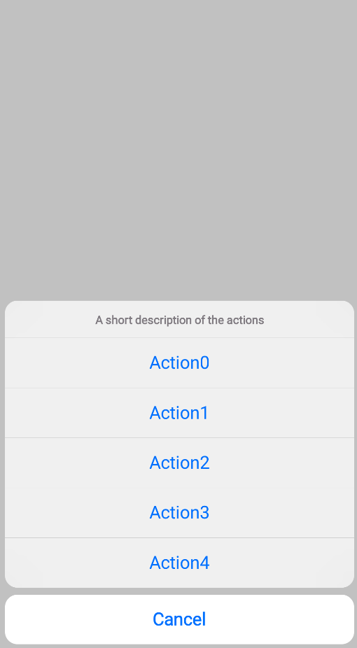

# ActionSheet(操作表)

操作表组件(用于提供一组可供用户选择的操作，以便完成任务)，UI风格对齐iOS UIActionSheet风格, 并支持自定义弹窗UI(底部弹出内容场景)

[组件使用示例](https://github.com/Tencent-TDS/KuiklyUI/blob/main/core/src/commonMain/kotlin/com/tencent/kuikly/core/views/ActionSheetView.kt)

## 属性

支持所有[基础属性](basic-attr-event.md#基础属性)，此外还支持：

### showActionSheet

控制ActionSheet是否显示，不显示时不占用布局(必须设置该属性)

| 参数 | 描述 | 类型 |
| -- | -- | -- |
| showActionSheet | ActionSheet是否显示 | Boolean |

:::tabs

@tab:active 示例

```kotlin{3,10}
@Page("demo_page")
internal class TestPage : BasePager() {
    private var showActionSheet by observable(true) // 定义响应式变量

    override fun body(): ViewBuilder {
        val ctx = this
        return {
            ActionSheet {
                attr {
                    showActionSheet(ctx.showActionSheet)
                    descriptionOfActions("A short description of the actions")
                    actionButtons("Cancel", "Action0", "Action1", "Action2", "Action3", "Action4")
                }
                event {
                    clickActionButton { index->
                        ctx.showActionSheet = false
                    }
                }
            }
        }
    }
}
```

@tab 效果

<div align="center">

</div>

:::

### descriptionOfActions

关于ActionSheet的简短描述

| 参数 | 描述 | 类型 |
| -- | -- | -- |
| description | 关于ActionSheet的简短描述 | String |

### actionButtons

ActionSheet点击的按钮，如取消，Action0, Action1, Action2, ..(必须设置)

| 参数 | 描述 | 类型 |
| -- | -- | -- |
| cancelButtonTitle | 取消按钮标题 | String |
| buttonTitles | 可变数量的actions标题 | String |

### actionButtonsCustomAttr

ActionSheet点击的按钮的自定义按钮文字样式，如Cancel（红色或加粗），Action0（默认蓝色，加粗）(可选设置)

| 参数 | 描述 | 类型 |
| -- | -- | -- |
| cancelButtonTitleAttr | 取消选项Text属性块 | TextAttr.() -> Unit |
| buttonsAttr | 可变数量其他选项Text属性块 | TextAttr.() -> Unit |

### customContentView

自定义整个前景View UI(代替自带的即整个bottom白色块区域)

| 参数 | 描述 | 类型 |
| -- | -- | -- |
| viewCreator | 前景View | ViewContainer<*, *>.() -> Unit |

### customBackgroundView

自定义整个背景View UI（代替自带的即整个背景黑色蒙层，注意需要设置该View布局为全屏尺寸）

| 参数 | 描述 | 类型 |
| -- | -- | -- |
| viewCreator | 前景View | ViewContainer<*, *>.() -> Unit |

### inWindow

全屏显示该ActionSheet(默认为false)

| 参数 | 描述 | 类型 |
| -- | -- | -- |
| window | 是否全屏显示 | Boolean |

## 事件

支持所有[基础事件](basic-attr-event.md#基础事件)，此外还支持：

### clickActionButton

按钮被点击事件回调，回参对应被点击的button的index(index值和actionButtons传入button的下标一致)

### clickBackgroundMask

背景蒙层点击事件回调，用于在自定义前景UI场景下，可能会点击背景蒙层关闭弹窗。回调参数为[ClickParams](./basic-attr-event.md#click事件)

### alertDidExit

actionSheet完全退出(不显示&动画结束)回调，业务此时可以关闭页面(若有需要)