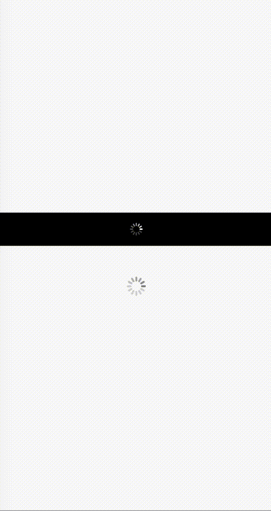

# ActivityIndicator(活动指示器)

活动指示器（旋转菊花样式），外观上显示圆形加载指示器。ios系统限制为默认`size(20f, 20f)`, 所以多端统一固定尺寸为20f，若想修改显示大小，可通过缩放属性实现，如`transform(Scale(1.5f, 1.5f))`

[组件使用示例](https://github.com/Tencent-TDS/KuiklyUI/blob/main/demo/src/commonMain/kotlin/com/tencent/kuikly/demo/pages/demo/kit_demo/DeclarativeDemo/ActivityIndicatorExamplePage.kt)

## 属性

支持所有[基础属性](basic-attr-event.md#基础属性)，此外还支持：

### isGrayStyle

是否为灰色样式菊花（默认为白色），该属性无法动态修改

| 参数 | 描述 | 类型 |
| -- | -- | -- |
| isGrayStyle | 是否为灰色样式菊花 | Boolean |

:::tabs

@tab:active 示例

```kotlin{15,17-23}
@Page("demo_page")
internal class TestPage : BasePager() {
    override fun body(): ViewBuilder {
        return {
            attr {
                allCenter()
            }
            View {
                attr {
                    backgroundColor(Color.BLACK)
                    size(pagerData.pageViewWidth, 50f)
                    allCenter()
                }
                // 默认尺寸20*20
                ActivityIndicator {}
            }
            ActivityIndicator {
                attr {
                    isGrayStyle(true) // 灰色菊花
                    transform(Scale(1.5f, 1.5f))
                    marginTop(50f)
                }
            }
        }
    }
}
```

@tab 效果

<div align="center">

</div>

:::

## 事件

支持所有[基础事件](basic-attr-event.md#基础事件)