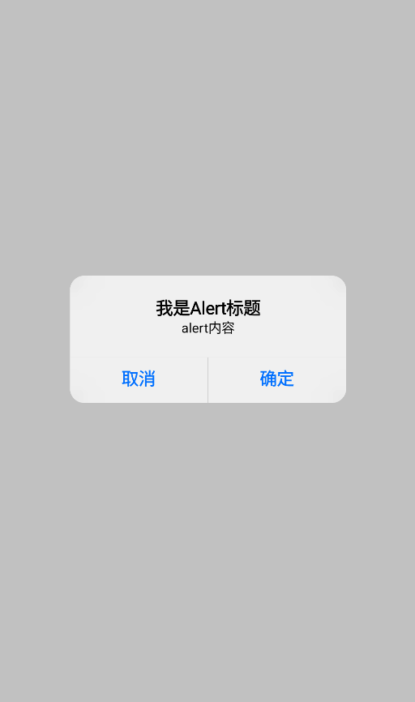

# AlertDialog(提示对话框)

提示对话框组件，UI风格对齐iOS UIAlertController风格, 并支持自定义弹窗UI

[组件使用示例](https://github.com/Tencent-TDS/KuiklyUI/blob/main/demo/src/commonMain/kotlin/com/tencent/kuikly/demo/pages/demo/AlertDIalogDemoPage.kt)

## 属性

支持所有[基础属性](basic-attr-event.md#基础属性)，此外还支持：

### showAlert

控制Alert是否显示，不显示时不占用布局(必须设置该属性)

| 参数 | 描述 | 类型 |
| -- | -- | -- |
| showAlert | Alert是否显示 | Boolean |

:::tabs

@tab:active 示例

```kotlin{3,10}
@Page("demo_page")
internal class TestPage : BasePager() {
    private var showAlert by observable(true)  // 定义响应式变量

    override fun body(): ViewBuilder {
        val ctx = this
        return {
            AlertDialog {
                attr {
                    showAlert(ctx.showAlert)
                    title("我是Alert标题")
                    message("alert内容")
                    actionButtons("取消", "确定")
                    inWindow(true)
                }
                event {
                    clickActionButton { index ->
                        ctx.showAlert = false
                    }
                    willDismiss {
                        ctx.showAlert = false
                    }
                }
            }
        }
    }
}
```

@tab 效果

<div align="center">

</div>

:::

### title

Alert标题（当message不为空时可选）

| 参数 | 描述 | 类型 |
| -- | -- | -- |
| title | Alert标题 | String |

### message

Alert内容（当title不为空时可选）

| 参数 | 描述 | 类型 |
| -- | -- | -- |
| message | Alert内容 | String |

### message

Alert点击的按钮，如取消，确定(必须设置)

| 参数 | 描述 | 类型 |
| -- | -- | -- |
| buttonTitles | 可变数量按钮标题参数 | String |

### actionButtonsCustomAttr

Alert点击按钮的自定义按钮文字样式，如取消（红色或加粗），确定（默认蓝色，加粗）（可选设置）

| 参数 | 描述 | 类型 |
| -- | -- | -- |
| buttonsAttr | 可变数量Text属性块 | TextAttr.() -> Unit |

### customContentView

自定义整个前景View UI（代替自带的即整个白色块区域，该自定义前景内容UI会被居中显示）

| 参数 | 描述 | 类型 |
| -- | -- | -- |
| viewCreator | 前景View | ViewContainer<*, *>.() -> Unit |

### customBackgroundView

自定义整个背景View UI（代替自带的即整个背景黑色蒙层，注意需要设置该View布局为全屏尺寸）

| 参数 | 描述 | 类型 |
| -- | -- | -- |
| viewCreator | 前景View | ViewContainer<*, *>.() -> Unit |

### inWindow

全屏显示该Alert(默认为false)

| 参数 | 描述 | 类型 |
| -- | -- | -- |
| window | 是否全屏显示 | Boolean |

## 事件

支持所有[基础事件](basic-attr-event.md#基础事件)，此外还支持以下事件：

### willDismiss<Badge text="H5实现中" type="warn"/> <Badge text="微信小程序实现中" type="warn"/> 

系统返回事件（back按钮或右滑）回调

### clickActionButton

按钮被点击事件回调，回参对应被点击的button的index(index值和actionButtons传入button的下标一致)

### clickBackgroundMask

背景蒙层点击事件回调，用于在自定义前景UI场景下，可能会点击背景蒙层关闭弹窗。回调参数为[ClickParams](./basic-attr-event.md#click事件)

### alertDidExit

alert弹窗完全退出(不显示&动画结束)回调，业务此时可以关闭页面(若有需要)

