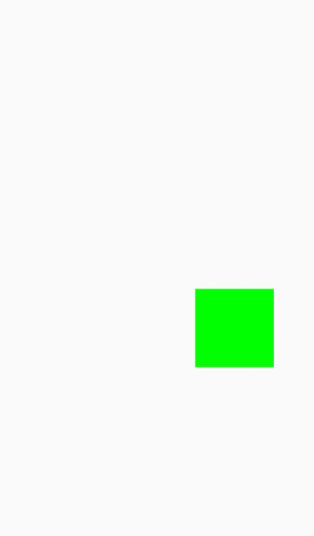

# 基础属性和事件

基础属性和事件，是每一个``Kuikly``组件都包含的属性和事件。

## 基础属性

``Kuikly``组件的基础属性按照功能可划分为**样式属性**和**布局属性**

1. **样式属性**: 描述组件样式的属性
2. **布局属性**: 描述组件如何布局的属性

下面我们来看**样式属性**

### backgroundColor方法

背景颜色

<div class="table-01">

| 参数           | 描述 | 类型  |
|:-------------|:-------------------------|:------| 
| color        | 背景颜色值 | Color |

</div>

::: tabs

@tab:active 示例

```kotlin {12}
internal class TestPage : BasePager() {

    override fun body(): ViewBuilder {
        return {
            attr {
                allCenter()
            }

            View {
                attr {
                    size(50f, 50f)
                    backgroundColor(Color.GREEN)
                }
            }
        }
    }
}
```

@tab 效果
<div align="center">

</div>

:::

### backgroundLinearGradient方法

设置组件的背景颜色为线性渐变颜色

<div class="table-01">

| 参数           | 描述 | 类型  |
|:-------------|:-------------------------|:------| 
| direction        | 渐变方向 | Direction |
| colorStops | 渐变颜色配置对象,为可变参数，可指定多个颜色进行渐变。ColorStop.color为渐变颜色，ColorStop.stopIn01颜色终止位置 | vararg ColorStop |

</div>

Direction可选值:
```kotlin
enum class Direction(value: Int) {
    TO_TOP(0),
    TO_BOTTOM(1),
    TO_LEFT(2),
    TO_RIGHT(3),
    TO_TOP_LEFT(4),
    TO_TOP_RIGHT(5),
    TO_BOTTOM_LEFT(6),
    TO_BOTTOM_RIGHT(7),
}
```

:::tip 注意
**渐变颜色终止位置，在Android平台，只有API >= 29才生效**
:::

::: tabs

@tab:active 示例

```kotlin {14,15,23,24,25,26}
internal class TestPage : BasePager() {

    override fun body(): ViewBuilder {
        return {
            attr {
                backgroundColor(Color.WHITE)
                allCenter()
            }

            View {
                attr {
                    size(100f, 100f)
                    // 从上到下平均渐变
                    backgroundLinearGradient(Direction.TO_BOTTOM,
                        ColorStop(Color.RED, 0f), ColorStop(Color.GREEN, 1f))
                }
            }

            View {
                attr {
                    size(100f, 100f)
                    marginTop(20f)
                    backgroundLinearGradient(Direction.TO_RIGHT,
                        ColorStop(Color.RED, 0f),
                        ColorStop(Color.GREEN, 0.3f), // 绿色渐变到30%后停止
                        ColorStop(Color.BLACK, 1f) // 30% ~ 100%是绿色到黑色渐变
                    )
                }
            }
        }
    }
}
```

@tab 效果
<div align="center">

</div>

:::

### boxShadow方法

为组件设置阴影效果。该方法接收**BoxShadow**对象作为参数

<div class="table-01">

| 参数        | 描述 | 类型 |
|:----------|:-------------------------|:------| 
| offsetX | 阴影效果相对于组件的X坐标偏移量 | Float |
| offsetY | 阴影效果相对于组件的Y坐标偏移量 | Float |
| shadowRadius | 阴影效果扩散半径 | Float |
| shadowColor | 阴影颜色 | Color |

</div>

:::tabs

@tab:active 示例

```kotlin{13}
@Page("demo_page")
internal class TestPage : BasePager() {
    override fun body(): ViewBuilder {
        return {
            attr {
                allCenter()
            }

            View {
                attr {
                    size(100f, 100f)
                    backgroundColor(Color.YELLOW)
                    boxShadow(BoxShadow(0f, 0f, 10f, Color.GREEN))
                }
            }
        }
    }
}
```

@tab 效果
<div align="center">

</div>

:::

### borderRadius方法

为组件设置圆角。该方法接收**BorderRectRadius**对象作为参数

<div class="table-01">

| 参数        | 描述      | 类型    
|:----------|:--------|:------| 
| topLeftCornerRadius | 左上角圆角半径 | Float |
| topRightCornerRadius | 右上角圆角半径 | Float |
| bottomLeftCornerRadius | 左下角圆角半径 | Float |
| bottomRightCornerRadius | 右下角圆角半径 | Float |

</div>

****

::: tabs

@tab:active 示例

```kotlin{13}
@Page("demo_page")
internal class BorderRadiusPage : BasePager() {
    override fun body(): ViewBuilder {
        return {
            attr {
                allCenter()
            }

            View {
                attr {
                    size(100f, 100f)
                    backgroundColor(Color.GREEN)
                    borderRadius(BorderRectRadius(20f, 20f, 5f, 20f))
                }
            }
        }
    }
}
```

@tab 效果
<div align="center">

</div>

:::

### border方法

为组件设置边框样式。该方法接收**Border**对象作为参数

<div class="table-01">

| 参数        | 描述                                            | 类型              
|:----------|:----------------------------------------------|:----------------| 
| lineWidth | 边框线宽                                          | Float           |
| lineStyle | 边框线样式。SOLID: 实线样式; DOTTED: 点线样式; DASHED: 虚线样式 | BorderStyle(枚举) |
| color | 边框样色                                          | Color           |

</div>

::: tabs

@tab:active 示例

```kotlin{14}
@Page("demo_page")
internal class BorderPage : BasePager() {
    override fun body(): ViewBuilder {
        return {
            attr {
                allCenter()
            }

            View {
                attr {
                    size(100f, 100f)
                    backgroundColor(Color.GREEN)
                    borderRadius(20f)
                    border(Border(2f, BorderStyle.SOLID, Color.BLACK))
                }
            }
        }
    }
}
```

@tab 效果

<div align="center">

</div>

:::

### visibility方法

设置组件是否可见, 所有组件默认可见

:::tabs

@tab:active 示例

```kotlin{21}
@Page("demo_page")
internal class VisibilityPage : BasePager() {
    override fun body(): ViewBuilder {
        return {
            attr {
                allCenter()
            }

            View { // 默认可见
                attr {
                    size(100f, 100f)
                    backgroundColor(Color.GREEN)
                    marginBottom(20f)
                }
            }
            
            View { 
                attr { 
                    size(100f, 100f)
                    backgroundColor(Color.RED)
                    visibility(false) // 不可见
                }
            }
        }
    }
}
```

@tab 效果

<div align="center">

</div>

:::

### opacity方法

设置组件的alpha值

::: tabs

@tab:active 示例

```kotlin{14}
@Page("demo_page")
internal class AlphaPage : BasePager() {
    override fun body(): ViewBuilder {
        return {
            attr {
                allCenter()
            }

            View { // 默认可见
                attr {
                    size(100f, 100f)
                    backgroundColor(Color.GREEN)
                    marginBottom(20f)
                    opacity(0.5f)
                }
            }
        }
    }
}
```

@tab 效果

<div align="center">

</div>

:::

### touchEnable方法

是否允许组件可触摸交互

### transform方法

设置组件的缩放scale，旋转rotate，位移translate和transform动作的中心点anchor。transform方法参数对象为:

* Rotate

设置组件的旋转角度

<div class="table-01">

| 参数        | 描述      | 类型
|:----------|:--------|:----------------| 
| angle | 顺时针旋转角度 | Float           |

</div>

::: tabs

@tab:active 示例

```kotlin{13}
@Page("demo_page")
internal class RotatePage : BasePager() {
    override fun body(): ViewBuilder {
        return {
            attr {
                allCenter()
            }

            View { // 默认可见
                attr {
                    size(100f, 100f)
                    backgroundColor(Color.GREEN)
                    transform(rotate = Rotate(45f))
                }
            }
        }
    }
}
```

@tab 效果

<div align="center">

</div>

:::

* Scale

设置组件的缩放系数

<div class="table-01">

| 参数  | 描述     | 类型
|:----|:-------|:----------------| 
| x   | x轴缩放系数 | Float           |
| y   | y轴缩放系数 | Float           |

</div>

:::tabs

@tab:active 示例

```kotlin{13}
@Page("demo_page")
internal class ScalePage : BasePager() {
    override fun body(): ViewBuilder {
        return {
            attr {
                allCenter()
            }

            View { // 默认可见
                attr {
                    size(100f, 100f)
                    backgroundColor(Color.GREEN)
                    transform(scale = Scale(1.5f, 1.5f))
                }
            }
        }
    }
}
```

@tab 效果

<div align="center">

</div>

:::

* Translate

设置组件的位移

<div class="table-01">

| 参数  | 描述                              | 类型
|:----|:--------------------------------|:----------------| 
| percentageX   | 在X轴上, 相对自身宽度位移的百分比. 取值范围[-1, 1] | Float           |
| percentageY   | 在Y轴上, 相对自身高度位移百分比，取值范围[-1, 1]   | Float           |

</div>

:::tabs

@tab:active 示例

```kotlin{13-14}
@Page("demo_page")
internal class TransformPage : BasePager() {
    override fun body(): ViewBuilder {
        return {
            attr {
                allCenter()
            }

            View { // 默认可见
                attr {
                    size(100f, 100f)
                    backgroundColor(Color.GREEN)
                    // 往右移动100f, 往下移动100f
                    transform(translate = Translate(1f, 1f))
                }
            }
        }
    }
}
```

@tab 效果

<div align="center">

</div>

:::

* Anchor

设置组件做Transform时, 中心点的位置

<div class="table-01">

| 参数  | 描述                                     | 类型
|:----|:---------------------------------------|:----------------| 
| x   | 在X轴上的中心位置, 相对自身组件的宽度的百分比位置 取值范围[-1, 1] | Float           |
| y   | 在Y轴上的中心位置, 相对自身组件高度的百分比位置，取值范围[-1, 1]  | Float           |

</div>

### zIndex方法

设置组件的层级位置。组件的层级是按照书写顺序来叠放的，使用zIndex方法可更改组件的叠放顺序

:::tabs

@tab:active 示例

```kotlin{10}
@Page("demo_page")
internal class ZIndexPage : BasePager() {
    override fun body(): ViewBuilder {
        return {
            View { // View1
                attr {
                    size(100f, 100f)
                    backgroundColor(Color.GREEN)
                    absolutePosition(100f, 20f)
                    zIndex(1) // 将层级太高, 位置View2之上
                }
            }
            View { // View2
                attr {
                    size(100f, 100f)
                    absolutePosition(120f, 40f)
                    backgroundColor(Color.RED)
                }
            }
        }
    }
}
```

@tab 效果

<div align="center">

</div>

:::

### overflow方法

当组件的孩子超出组件的大小时，是否要对子组件超出的区域进行裁剪。在Kuikly中默认子组件大小超出父组件时, 父组件默认不会裁剪,
子组件超出父组件部分能让能够显示

:::tip 注意
overflow的默认表现在iOS开发者看来是很正常的，因此iOS默认对子View超出父View的区域是不会裁剪的。
但是对于Android开发者来说会有不同，因此Android系统默认会不显示子View超出父View的区域
:::

:::tabs

@tab:active 示例

```kotlin{16,27,32}
@Page("demo_page")
internal class OverflowPage : BasePager() {
    override fun body(): ViewBuilder {
        return {
            attr {
                allCenter()
            }
            View { // View1
                attr {
                    size(100f, 100f)
                    backgroundColor(Color.GREEN)
                }

                View {
                    attr {
                        size(120f, 50f) // 宽度超出父亲能够显示, 因为overflow默认是false
                        backgroundColor(Color.RED)
                    }
                }
            }

            View {
                attr {
                    marginTop(40f)
                    backgroundColor(Color.BLUE)
                    size(100f, 100f)
                    overflow(true)
                }

                View {
                    attr {
                        size(200f, 50f) // 不能超出父View, 因为父View将overflow设为true
                        backgroundColor(Color.GRAY)
                    }
                }
            }
        }
    }
}
```

@tab 效果

<div align="center">

</div>

:::

### keepAlive方法

设置组件是否常驻。常用于**有状态的组件**。如果一个组件被设置为true，并且这个组件是可滚动的容器的直接孩子的话(例如List, PageList, SlidePage), 当
组件被滑出屏幕外, 组件**不会被可滚动容器移除**。

### animate方法

设置组件的动画参数, 具体效果和写法可以参看[动画文档](../../DevGuide/animation-basic.md)

### accessibility方法

无障碍化属性, 当应用处于TalkBack模式时, 元素获取焦点后, 元素会语音读出该值

---

下面只描述布局相关属性方法的定义, 更详细的描述, 可查看[Kuikly的布局教程](../../DevGuide/layout.md)

### width方法

指定组件的宽度

<div class="table-01">

| 参数    | 描述    | 类型    |
|:------|:------|-------|
| width | 设置组件的宽度 | Float |

</div>

### height方法

设置组件的高度

<div class="table-01">

| 参数     | 描述      | 类型    |
|:-------|:--------|-------|
| height | 设置组件的高度 | Float |

</div>

### maxWidth方法

设置组件的最大宽度, 如果组件的宽度未达到最大宽度, 会优先尊重组件的宽度

<div class="table-01">

| 参数       | 描述        | 类型    |
|:---------|:----------|-------|
| maxWidth | 设置组件的最大宽度 | Float |

</div>

### maxHeight方法

设置组件的最大高度, 如果组件的高度未达到最大高度, 会优先尊重组件的高度

<div class="table-01">

| 参数        | 描述        | 类型    |
|:----------|:----------|-------|
| maxHeight | 设置组件的最大高度 | Float |

</div>

### minWidth

设置组件的最小宽度, 如果组件的宽度未小于最小宽度, 会优先尊重组件的宽度

<div class="table-01">

| 参数       | 描述        | 类型    |
|:---------|:----------|-------|
| minWidth | 设置组件的最小宽度 | Float |

</div>

### minHeight

设置组件的最小高度, 如果组件的高度未小于最小高度, 会优先尊重组件的高度

<div class="table-01">

| 参数        | 描述        | 类型    |
|:----------|:----------|-------|
| minHeight | 设置组件的最小高度 | Float |

</div>

### margin方法

设置组件相对于父组件的margin值

<div class="table-01">

| 参数     | 描述  | 类型    |
|:-------|:----|-------|
| top    | 上边距 | Float |
| left   | 左边距 | Float |
| bottom | 下边距 | Float |
| right  | 右边距 | Float |

</div>

### padding方法

设置组件自身的padding值

<div class="table-01">

| 参数     | 描述  | 类型    |
|:-------|:----|-------|
| top    | 上边距 | Float |
| left   | 左边距 | Float |
| bottom | 下边距 | Float |
| right  | 右边距 | Float |

</div>

:::tip 注意
叶子组件不支持padding方法, 可使用margin方法达到相同的效果
:::

### flexDirection方法

设置组件的孩子布局的方向, 排列方向即为主轴方法。此方法接收类型FlexDirection枚举

<div class="table-01">

| 参数     | 描述         | 类型    |
|:-------|:-----------|-------|
| COLUMN    | 孩子从上往下排列布局 | FlexDirection |
| COLUMN_REVERSE   | 孩子从下往上排列布局 | FlexDirection |
| ROW | 孩子从左往右排列布局 | FlexDirection |
| ROW_REVERSE  | 孩子从右往左排列布局 | Float |

</div>

### flexWrap方法

设置组件的孩子超出组件时，是否换行

<div class="table-01">

| 参数          | 描述          | 类型    |
|:------------|:------------|-------|
| NOWRAP      | 孩子超出组件时，不换行 | FlexWrap |
| WRAP        | 孩子超出组件时，换行  | FlexWrap |

</div>

### justifyContent方法

指定组件孩子做主轴上布局时的对齐方式。此方法接收类型FlexJustifyContent的枚举

<div class="table-01">

| 参数     | 描述                                                                            | 类型    |
|:-------|:------------------------------------------------------------------------------|-------|
| FLEX_START    | 子组件在父容器的起始位置往主轴方向排列                                                           | FlexJustifyContent |
| CENTER   | 子组件在容器的主轴方向居中排列                                                               | FlexJustifyContent |
| FLEX_END | 子组件在容器的终止位置往主轴方向排列                                                            | FlexJustifyContent |
| SPACE_BETWEEN  | 孩子在主轴方向均匀排列, 子组件之间的间距相同, 第一个子组件从父组件起始位置开始布局, 最后一个子组件布局在父组件结束位置                | FlexJustifyContent |
| SPACE_AROUND | 孩子在主轴方向均匀排列, 子组件之间的间距相同, 第一个子组件与父组件的起始位置的间距，最后一个子组件与父组件的终止位置之间的间距为子组件之间的间距的一半 | FlexJustifyContent |
| SPACE_EVENLY  | 孩子在主轴方向均匀排列, 子组件之间的间距, 第一个子组件与父组件起始位置的间距, 最后一个子组件布局与父组件结束位置的间距都一样             | FlexJustifyContent |

</div>

### alignItems方法

指定子组件在交叉轴方向的排列方式。例如若子组件本来是沿着竖直方向排列的（即主轴竖直，那么交叉轴方向为水平方向）。
则alignItems决定了它们在水平方向的排列方式。此方法接收类型FlexAlign的枚举, 默认值为**FlexAlign.STRETCH**

<div class="table-01">

| 参数     | 描述                   | 类型    |
|:-------|:---------------------|-------|
| FLEX_START    | 子组件在父容器中沿着交叉轴的起始位置对齐 | FlexAlign |
| CENTER   | 子组件在父容器中沿着交叉轴的中间位置对齐 | FlexAlign |
| FLEX_END | 子组件在父容器中沿着交叉轴的终止位置对齐 | FlexAlign |
| STRETCH  | 子组件在交叉轴上撑满父容器        | FlexAlign |

</div>

### alignSelf方法

**justifyContent方法**和**alignItems方法**都是用于父组件指定子组件的布局方式。而alignSelf方法则是用于子组件自己指定在父组件
的交叉轴方向的排列方式（此样式设置在子元素上），其值会覆盖父元素的alignItems的值。该方法接收类型FlexAlign的枚举

<div class="table-01">

| 参数     | 描述                   | 类型    |
|:-------|:---------------------|-------|
| FLEX_START    | 子组件在父容器中沿着交叉轴的起始位置对齐 | FlexAlign |
| CENTER   | 子组件在父容器中沿着交叉轴的中间位置对齐 | FlexAlign |
| FLEX_END | 子组件在父容器中沿着交叉轴的终止位置对齐 | FlexAlign |
| STRETCH  | 子组件在交叉轴上撑满父容器        | FlexAlign |

</div>

### positionType方法

指定组件在父容器中的排列方式, 该方法接收类型FlexPositionType的枚举。默认值为**FlexPositionType.RELATIVE**, 即使组件默认在父容器为相对布局

<div class="table-01">

| 参数     | 描述                   | 类型    |
|:-------|:---------------------|-------|
| RELATIVE    | 子组件在父容器中的朴烈方式为相对排列布局 | FlexPositionType |
| ABSOLUTE   | 子组件在父容器中的排列方式为绝对布局   | FlexPositionType |

</div>

### left方法

left方法是指将本组件的定位到距离**左边**的多少距离，而左边的定义取决于**positionType**方法设置的值。如果设置了**FlexPositionType.RELATIVE**,
那么left的作用相当于设置了marginLeft; 如果设置了**FlexPositionType.ABSOLUTE**, 那么left的作用是将元素的左边定位到距离父元素左边的left值。

### top方法

top方法是指将本组件的定位到距离**上边**的多少距离，而上边的定义取决于**positionType**方法设置的值。如果设置了**FlexPositionType.RELATIVE**,
那么top的作用相当于设置了marginTop; 如果设置了**FlexPositionType.ABSOLUTE**, 那么top的作用是将元素的上边定位到距离父元素上边的top值。

### right方法

right方法是指将本组件的定位到距离**右边**的多少距离，而右边的定义取决于**positionType**方法设置的值。如果设置了**FlexPositionType.RELATIVE**,
那么right的作用相当于设置了marginRight; 如果设置了**FlexPositionType.ABSOLUTE**, 那么right的作用是将元素的上边定位到距离父元素右边的right值。

### bottom方法

bottom方法是指将本组件的定位到距离**下边**的多少距离，而下边的定义取决于**positionType**方法设置的值。如果设置了**FlexPositionType.RELATIVE**,
那么bottom的作用相当于设置了marginBottom; 如果设置了**FlexPositionType.ABSOLUTE**, 那么bottom的作用是将元素的上边定位到距离父元素下边的bottom值。

---

## 基础事件

每个``Kuikly``组件除了包含基础样式外，还包含一些通用的基础事件。这些事件是原生端的UI组件触发通知到``Kuikly``组件。

### click事件

``click``事件意为单击事件，如果组件有设置单击事件，当``Kuikly``组件被点击时，会触发``click``闭包回调。``click``闭包中含有
``ClickParams``类型参数，以此来描述单击事件的信息

<div class="table-01">

**ClickParams**

| 参数  | 类型     | 说明 |
|:----|:-------|:--|
| x   | Float  | 相对于被点击组件的坐标x |
| y   | Float  | 相对于被点击组件的坐标y |

</div>

**示例**

```kotlin {13,14,15,16,17,18}
internal class ClickEventPage : BasePager() {
    override fun body(): ViewBuilder {
        return {
            attr {
                allCenter()
            }

            View {
                attr {
                    size(100f, 100f)
                }

                event {
                    click { clickParams ->
                        val x = clickParams.x
                        val y = clickParams.y
                    }
                }
            }
        }
    }
}
```

### doubleClick事件

``doubleClick``事件为双击事件，当``Kuikly``组件有设置双击事件，并且``Kuikly``组件被双击时，会触发``doubleClick``闭包回调。
``doubleClick``回调闭包中含有``ClickParams``类型参数，以此来描述双击事件的信息

**示例**

```kotlin {13,14,15,16,17,18}
internal class DoubleClickEventPage : BasePager() {
    override fun body(): ViewBuilder {
        return {
            attr {
                allCenter()
            }

            View {
                attr {
                    size(100f, 100f)
                }

                event {
                    doubleClick { clickParams ->
                        val x = clickParams.x
                        val y = clickParams.y
                    }
                }
            }
        }
    }
}
```

### longPress事件

``longPress``事件为长按事件，当``Kuikly``组件有设置长按事件，并且``Kuikly``组件被长按时，会触发``longPress``闭包回调。
``longPress``回调闭包中含有``LongPressParams``类型参数，以此来描述长按事件的信息

<div class="table-01">

**LongPressParams**

| 参数  | 类型     | 说明 |
|:----|:-------|:--|
| x   | Float  | 相对于被长按组件的坐标x |
| y   | Float  | 相对于被长按组件的坐标y |
| state | String | 长按状态："start", "move", "end" |

</div>

**示例**

```kotlin {13,14,15,16,17,18}
internal class LongPresskEventPage : BasePager() {
    override fun body(): ViewBuilder {
        return {
            attr {
                allCenter()
            }

            View {
                attr {
                    size(100f, 100f)
                }

                event {
                    longPress { longPressParams ->
                        val x = longPressParams.x
                        val y = longPressParams.y
                        val state = longPressParams.state // start | move | end
                    }
                }
            }
        }
    }
}
```

### pan事件

``pan``事件为拖拽事件, 常用于实现跟手拖拽的效果。当``Kuikly``组件有设置``pan``事件，并且``Kuikly``组件被拖拽时，会触发``pan``闭包回调。
``pan``回调闭包中含有``PanGestureParams``类型参数，以此来描述拖拽事件的信息。

<div class="table-01">

**PanGestureParams**

| 参数  | 描述     | 类型 |
|:----|:-------|:--|
| x   | 相对于被拖拽的组件的坐标x  | Float |
| y   | 相对于被拖拽的组件的坐标y  | Float |
| state | String | 拖拽状态："start", "move", "end" |
| pageX   | 拖拽点相对于页面的坐标x  | Float |
| pageY   | 拖拽点相对于页面的坐标y  | Float |

</div>

**示例**

```kotlin {14-23}
@Page("demo_page")
internal class PanEventPage : BasePager() {
    override fun body(): ViewBuilder {
        return {
            attr {
                allCenter()
            }
            View { // View1
                attr {
                    size(100f, 100f)
                    backgroundColor(Color.GREEN)
                }
                
                event { 
                    pan { panGestureParams -> 
                        val x = panGestureParams.x
                        val y = panGestureParams.y
                        val state = panGestureParams.state
                        val pageX = panGestureParams.pageX
                        val pageY = panGestureParams.pageY
                    }
                }
            }
        }
    }
}
```

### animationCompletion事件

``animationCompletion``事件为动画结束事件。当``Kuikly``组件有设置``animationCompletion``事件，并且``Kuikly``组件动画结束时，会触发``animationCompletion``闭包回调。
``animationCompletion``回调闭包中含有``AnimationCompletionParams``类型参数，以此来描述动画结束事件的信息。

<div class="table-01">

**animationCompletion**

| 参数  | 描述     | 类型 |
|:----|:-------|:--|
| finish   | 动画是否正常结束。1表示动画正常结束；0表示动画被取消  | Int |
| attr   | 标识哪个属性动画结束  | String |

</div>

**示例**

```kotlin {14-19}
@Page("demo_page")
internal class AnimationEventPage : BasePager() {
    override fun body(): ViewBuilder {
        return {
            attr {
                allCenter()
            }
            View { // View1
                attr {
                    size(100f, 100f)
                    backgroundColor(Color.GREEN)
                }

                event {
                    animationCompletion { animationCompletionParams -> 
                        val finish = animationCompletionParams.finish == 1
                        val animationAttrKey = animationCompletionParams.attr
                    }
                }
            }
        }
    }
}
```

### layoutFrameDidChange事件

``layoutFrameDidChange``事件为组件布局信息发生变化。当``Kuikly``组件有设置``layoutFrameDidChange``事件，并且``Kuikly``组件布局结束后，会触发``layoutFrameDidChange``闭包回调。
``layoutFrameDidChange``回调闭包中含有``Frame``类型参数，以此来描述组件布局信息发生事件的信息。

<div class="table-01">

**Frame**

| 参数  | 描述     | 类型 |
|:----|:-------|:--|
| x   | 组件在父容器的x值  | Float |
| y   | 组件在父容器的y值  | Float |
| width   | 组件宽度  | Float |
| height   | 组件高度  | Float |

</div>

**示例**

```kotlin {14-21}
@Page("demo_page")
internal class LayoutEventPage : BasePager() {
    override fun body(): ViewBuilder {
        return {
            attr {
                allCenter()
            }
            View { // View1
                attr {
                    size(100f, 100f)
                    backgroundColor(Color.GREEN)
                }

                event {
                    layoutFrameDidChange { frame ->
                        val x = frame.x
                        val y = frame.y
                        val width = frame.width
                        val height = frame.height
                    }
                }
            }
        }
    }
}
```

### willAppear事件

``willAppear``会在组件将要可见时触发(还未完全可见)。当``Kuikly``组件有设置``willAppear``事件，并且``Kuikly``组件将要可见时，会触发``willAppear``闭包回调。

**示例**

```kotlin {14-18}
@Page("demo_page")
internal class WillAppearEventtPage : BasePager() {
    override fun body(): ViewBuilder {
        return {
            attr {
                allCenter()
            }
            View { // View1
                attr {
                    size(100f, 100f)
                    backgroundColor(Color.GREEN)
                }

                event {
                    willAppear { 
                        // 组件将要可见
                    }
                }
            }
        }
    }
}
```

### didAppear事件

``didAppear``会在组件完全可见时触发。当``Kuikly``组件有设置``didAppear``事件，并且``Kuikly``组件完全可见时，会触发``didAppear``闭包回调。

**注:** 根节点请使用页面事件 pageDidAppear

**示例**

```kotlin {14-18}
@Page("demo_page")
internal class DidAppearEventPage : BasePager() {
    override fun body(): ViewBuilder {
        return {
            attr {
                allCenter()
            }
            View { // View1
                attr {
                    size(100f, 100f)
                    backgroundColor(Color.GREEN)
                }

                event {
                    didAppear {
                        // 组件完全可见
                    }
                }
            }
        }
    }
}
```

### willDisappear事件

``willDisappear``会在组件将要不可见时触发(还没完全不可见)。当``Kuikly``组件有设置``willDisappear``事件，并且``Kuikly``组件将要不可见时，会触发``willDisappear``闭包回调。

**示例**

```kotlin {14-18}
@Page("demo_page")
internal class WillDisappearEventPage : BasePager() {
    override fun body(): ViewBuilder {
        return {
            attr {
                allCenter()
            }
            View { // View1
                attr {
                    size(100f, 100f)
                    backgroundColor(Color.GREEN)
                }

                event {
                    willDisappear {
                        // 组件将要不可见
                    }
                }
            }
        }
    }
}
```

### didDisappear事件

``didDisappear``会在组件完全不可见时触发。当``Kuikly``组件有设置``didDisappear``事件，并且``Kuikly``组件完全不可见时，会触发``didDisappear``闭包回调。

**示例**

```kotlin {14-18}
@Page("demo_page")
internal class DidDisappearEventPage : BasePager() {
    override fun body(): ViewBuilder {
        return {
            attr {
                allCenter()
            }
            View { // View1
                attr {
                    size(100f, 100f)
                    backgroundColor(Color.GREEN)
                }

                event {
                    didDisappear {
                        // 组件完全不可见
                    }
                }
            }
        }
    }
}
```

### appearPercentage事件

``appearPercentage``事件为组件可见的百分比。当``Kuikly``组件有设置``appearPercentage``事件，并且``Kuikly``组件开始出现时, ``appearPercentage``事件会
根据出现的百分比，会触发``appearPercentage``闭包回调。

**示例**

```kotlin {14-18}
@Page("demo_page")
internal class AppearPercentageEventPage : BasePager() {
    override fun body(): ViewBuilder {
        return {
            attr {
                allCenter()
            }
            View { // View1
                attr {
                    size(100f, 100f)
                    backgroundColor(Color.GREEN)
                }

                event {
                    appearPercentage { percentage01 -> 
                        // percentage01为[0,1]的露出百分比，1为100%，0为0%]
                    }
                }
            }
        }
    }
}
```


