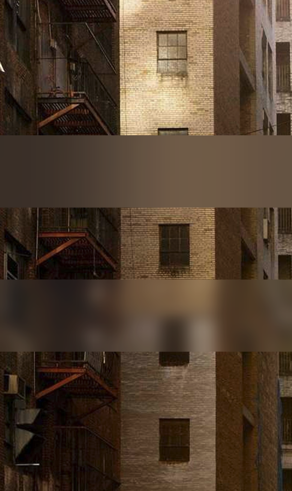

# Blur(高斯模糊)

高斯模糊（毛玻璃）组件，盖住其他view可进行动态高斯模糊布局位置下方的视图

[组件使用示例](https://github.com/Tencent-TDS/KuiklyUI/blob/main/demo/src/commonMain/kotlin/com/tencent/kuikly/demo/pages/demo/kit_demo/DeclarativeDemo/BlurExamplePage.kt)

## 属性

支持所有[基础属性](basic-attr-event.md#基础属性)，此外还支持：

### blurRadius

高斯模糊半径，最大为12.5f（默认：10f）

| 参数 | 描述 | 类型 |
| -- | -- | -- |
| radius | 高斯模糊半径 | Float |

:::tabs

@tab:active 示例

```kotlin{15-27}
@Page("demo_page")
internal class TestPage : BasePager() {
    override fun body(): ViewBuilder {
        return {
            attr {
                allCenter()
            }
            Image {
                attr {
                    absolutePosition(0f,0f,0f,0f)
                    size(pagerData.pageViewWidth, pagerData.pageViewHeight)
                    src("https://picsum.photos/id/221/1500/2500")
                }
            }
            Blur {
                attr {
                    size(pagerData.pageViewWidth, 100f)
                    blurRadius(10f)
                }
            }
            Blur {
                attr {
                    marginTop(100f)
                    size(pagerData.pageViewWidth, 100f)
                    blurRadius(1f)
                }
            }
        }
    }
}
```

@tab 效果

<div align="center">

</div>

:::

## 事件

支持所有[基础事件](basic-attr-event.md#基础事件)