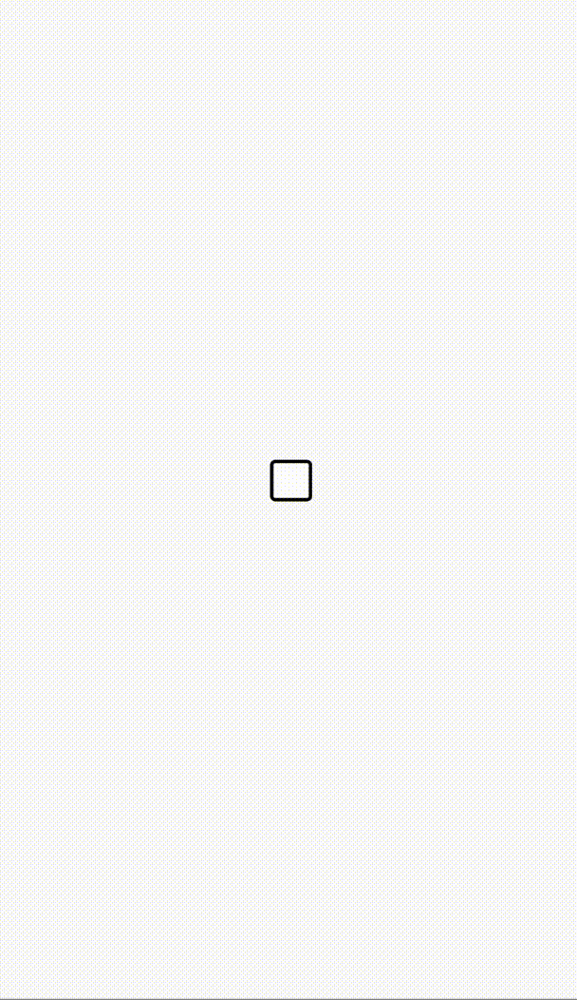

# CheckBox(复选框)

复选框组件，可用作单击选中态/非选中态的切换展示

[组件使用示例](https://github.com/Tencent-TDS/KuiklyUI/blob/main/demo/src/commonMain/kotlin/com/tencent/kuikly/demo/pages/demo/CheckBoxExamplePage.kt)

## 属性

支持所有[基础属性](basic-attr-event.md#基础属性)，此外还支持：

### checked

设置`CheckBox`是否选中

| 参数 | 描述 | 类型 |
| -- | -- | -- |
| value | 是否选中 | Boolean |

### disable

设置`CheckBox`是否禁用

| 参数 | 描述 | 类型 |
| -- | -- | -- |
| value | 是否禁用 | Boolean |

### checkedImageSrc

设置选中状态的图片资源

| 参数 | 描述 | 类型 |
| -- | -- | -- |
| imageSrc | 选中状态的图片资源路径 | String |

### defaultImageSrc

设置默认状态的图片资源

| 参数 | 描述 | 类型 |
| -- | -- | -- |
| imageSrc | 默认状态的图片资源路径 | String |

### disableImageSrc

设置禁用状态的图片资源

| 参数 | 描述 | 类型 |
| -- | -- | -- |
| imageSrc | 禁用状态的图片资源路径 | String |

### checkedViewCreator

设置选中状态的视图创建器

| 参数 | 描述 | 类型 |
| -- | -- | -- |
| creator | 选中状态的视图创建器 | ViewContainer<*, *>.() -> Unit |

### defaultViewCreator

设置默认状态的视图创建器

| 参数 | 描述 | 类型 |
| -- | -- | -- |
| creator | 默认状态的视图创建器 | ViewContainer<*, *>.() -> Unit |

### disableViewCreator

设置禁用状态的视图创建器

| 参数 | 描述 | 类型 |
| -- | -- | -- |
| creator | 设置禁用状态的视图创建器 | ViewContainer<*, *>.() -> Unit |

## 事件

支持所有[基础事件](basic-attr-event.md#基础事件)，此外还支持：

### checkedDidChanged

单选框选中状态变化的回调，回调会传入是否选中的状态：

| 参数 | 描述 | 类型 |
| -- | -- | -- |
| checked | 是否选中| Boolean |

:::tabs

@tab:active 示例

```kotlin{8-20}
@Page("demo_page")
internal class TestPage : BasePager() {
    override fun body(): ViewBuilder {
        return {
            attr {
                allCenter()
            }
            CheckBox {
                attr {
                    size(30f, 30f)
                    checked(true)
                    defaultImageSrc("https://vfiles.gtimg.cn/wuji_dashboard/xy/componenthub/Efeg39sG.png")
                    checkedImageSrc("https://vfiles.gtimg.cn/wuji_dashboard/xy/componenthub/m5kRYKMt.png")
                }
                event {
                    checkedDidChanged {
                        KLog.i("CheckBox", "checkedDidChanged:" + it.toInt())
                    }
                }
            }
        }
    }
}
```

@tab 效果

<div align="center">

</div>

:::