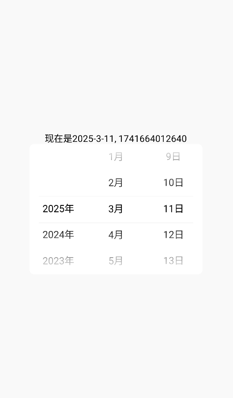

# DatePicker(日期选择器)

`DatePicker`是基于`Scroller`实现的日期选择器，

[组件使用示例](https://github.com/Tencent-TDS/KuiklyUI/blob/main/demo/src/commonMain/kotlin/com/tencent/kuikly/demo/pages/demo/kit_demo/DeclarativeDemo/ScrollPickerExamplePage.kt)

## 属性

支持所有[基础属性](basic-attr-event.md#基础属性)

## 事件

支持所有[基础事件](basic-attr-event.md#基础事件)，此外还支持：

### chooseEvent

设置日期选择器的选择事件，当用户选择日期时触发回调，回调传入参数为`DatePickerDate`类型

**DatePickerDate**

| 成员 | 描述 | 类型 |
| -- | -- | -- |
| timeInMillis | 当前选择日期的时间戳，单位毫秒 | Long |
| centerItemIndex | 当前选择日期 | Date |

**Date**

| 成员 | 描述 | 类型 |
| -- | -- | -- |
| year | 当前选择日期的年 | Int |
| month | 当前选择日期的月 | Int |
| day | 当前选择日期的日 | Int |

:::tabs

@tab:active 示例

```kotlin{18-32}
@Page("demo_page")
internal class TestPage : BasePager() {
    private var date: Date by observable(Date(0,0,0))
    private var dateTimestamp : Long by observable(0L)

    override fun body(): ViewBuilder {
        val ctx = this
        return {
            attr {
                allCenter()
                flexDirectionColumn()
            }
            Text {
                attr {
                    text("现在是${ctx.date}, ${ctx.dateTimestamp}")
                }
            }
            DatePicker {
                attr {
                    width(300f)
                    backgroundColor(Color.WHITE)
                    borderRadius(8f)
                }
                event {
                    chooseEvent {
                        it.date?.let {
                            ctx.date = it
                        }
                        ctx.dateTimestamp = it.timeInMillis
                    }
                }
            }
        }
    }
}
```

@tab 效果

<div align="center">

</div>

:::