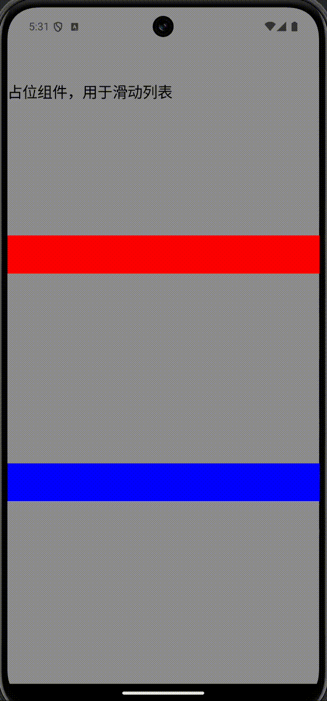

# Hover(悬停置顶)
用于列表下的自动悬停（列表滚动可自动悬浮置顶）视图组件

## 属性

支持所有[基础属性](basic-attr-event.md#基础属性)，此外还支持：

### bringIndex

设置置顶层级（同一列表多个`HoverView`设置该属性，值越大层级越高）。

| 参数 | 描述 | 类型 |
| -- | -- | -- |
| index | 置顶层级值 | Int |

### hoverMarginTop <Badge text="H5实现中" type="warn"/> <Badge text="微信小程序实现中" type="warn"/>

设置悬停距离列表顶部距离（默认为 0）。

| 参数 | 描述 | 类型 |
| -- | -- | -- |
| offset | 悬停距离列表顶部的距离 | Float |

:::tabs

@tab:active 示例

```kotlin{18-31}
@Page("demo_page")
nternal class TestPage : BasePager() {
    override fun body(): ViewBuilder {
        return {
            List {
                attr {
                    flex(1f)
                    backgroundColor(Color.GRAY)
                }
                Text {
                    attr {
                        marginTop(100f)
                        size(pagerData.pageViewWidth, 2000f)
                        text("占位组件，用于滑动列表")
                        fontSize(20f)
                    }
                }
                Hover {
                    attr {
                        absolutePosition(top = 300f, left =0f, right =0f)
                        height(50f)
                        backgroundColor(Color.RED)
                    }
                }
                Hover {
                    attr {
                        absolutePosition(top = 600f, left =0f, right =0f)
                        height(50f)
                        backgroundColor(Color.BLUE)
                    }
                }
            }
        }
    }
}
```

@tab 效果

<div align="center">

</div>

:::