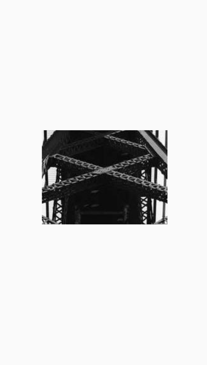

# Image(图片)

``Image``组件用于展示图片

## 属性

支持所有[基础属性](basic-attr-event.md#基础属性)

### src <Badge text="isDotNineImage小程序支持中" type="warn"/>

设置图片加载的数据源，目前 Kuikly 支持 4 种图片加载方式：

- 网络图片
- base64 字符串
- assets 图片（1.1版本起支持），使用指引：[assets 资源与图片](../../DevGuide/assets-resource.md)
- File 图片（1.1版本起支持）

Kuikly约定用“**assets://**”前缀标识资源图片路径，用“**file://**”前缀标识应用沙盒目录图片路径，用“**data:image**”前缀标识base64图片内容，用“**http//**”或“**https//**”标识网络图片路径。同时提供了`ImageUri`类，通过`ImageUri.commonAssets(path)`、`ImageUri.pageAssets(path)`、`ImageUri.file(path)`方法能快速将`path`加上对应前缀传入`src`属性。如果业务自行实现了图片各端的图片适配器，也可根据不同的前缀来使用不同方式加载图片。

<div class="table-01">

**src**

| 参数  | 描述     | 类型 |
|:----|:-------|:--|
| src | 图片数据源  | String or ImageUri |
| isDotNineImage | 是否为.9图 | Boolean |

</div>

:::tabs

@tab:active 示例

```kotlin{23,33,41,49}
@Page("demo_page")
internal class TestPage : BasePager() {

    var localImagePath: String by observable("")
    
    override fun created() {
        Utils.bridgeModule(pagerId).getLocalImagePath(imageUrl) {data ->
            localImagePath = data?.optString("localPath", "") ?: ""
        }
    }

    override fun body(): ViewBuilder {
        val ctx = this
        return {
            attr {
                allCenter()
            }

						// 网络图片
            Image {
                attr {
                    size(240f, 180f)
                    src("https://vfiles.gtimg.cn/wupload/xy/componenthub/5mml0yzf.jpeg") // cdn url
                }
            }

						// base64
            Image {
                attr {
                    marginTop(30f)
                    size(10f, 17f)
                    // base64 字符串
                    src("data:image/png;base64,iVBORw0KGgoAAAANSUhEUgAAAAsAAAASBAMAAAB/WzlGAAAAElBMVEUAAAAAAAAAAAAAAAAAAAAAAADgKxmiAAAABXRSTlMAIN/PELVZAGcAAAAkSURBVAjXYwABQTDJqCQAooSCHUAcVROCHBiFECTMhVoEtRYA6UMHzQlOjQIAAAAASUVORK5CYII=")
                }
            }
            
						// assets 图片
            Image {
                attr {
                    size(240f, 180f)
                    src(ImageUri.pageAssets("panda.png"))
                }
            }
            
            // file 图片
            Image {
                attr {
                    // 本地图片路径
                    src(ImageUri.file(ctx.localImagePath))
                }
            }
        }
    }
}
```

@tab 效果

<div align="center">

</div>

:::

### placeholderSrc

设置图片加载时的图片占位图

<div class="table-01">

**src**

| 参数  | 描述     | 类型 |
|:----|:-------|:--|
| placeholder | 占位图路径  | String |

</div>

:::tabs

@tab:active 示例

```kotlin{16,24}
@Page("demo_page")
internal class TestPage : BasePager() {
    override fun body(): ViewBuilder {
        return {
            attr {
                allCenter()
            }
            Image {
                attr {
                    alignSelfCenter()
                    margin(all = 8f)
                    backgroundColor(0xFFE5E5E5)
                    size(width = 240f, height = 180f)
                    src("https://picsum.photos/200/300?test=1")
                    resizeCover()
                    placeholderSrc("https://vfiles.gtimg.cn/wuji_dashboard/xy/starter/59ef6918.gif")
                    boxShadow(BoxShadow(2f, 2f, 10f, Color.BLACK))
                }
            }
        }
    }
}
```

@tab 效果

<div align="center">

</div>

:::

### resizeCover方法

在保持图片宽高比的情况下下缩放图片，直到宽度和高度都大于等于组件的大小。这样图片完全覆盖甚至超出容器，容器中不留任何空白

:::tabs

@tab:active 示例

```kotlin{16}
@Page("demo_page")
internal class TestPage : BasePager() {

    lateinit var inputRef: ViewRef<InputView>

    override fun body(): ViewBuilder {
        val ctx = this
        return {
            attr {
                allCenter()
            }

            Image {
                attr {
                    size(240f, 180f)
                    resizeCover()
                    src("https://vfiles.gtimg.cn/wupload/xy/componenthub/5mml0yzf.jpeg") // cdn url
                }
            }

        }
    }
}
```

@tab 效果

<div align="center">

</div>

:::

### resizeContain方法

在保持图片宽高比的情况下缩放图片，直到宽度和高度都小于等于组件的大小。这样图片完全被包裹在容器中，容器中可能留有空白。

:::tabs

@tab:active 示例

```kotlin{16}
@Page("demo_page")
internal class TestPage : BasePager() {

    lateinit var inputRef: ViewRef<InputView>

    override fun body(): ViewBuilder {
        val ctx = this
        return {
            attr {
                allCenter()
            }

            Image {
                attr {
                    size(240f, 180f)
                    resizeContain()
                    backgroundColor(Color.GRAY)
                    src("https://vfiles.gtimg.cn/wupload/xy/componenthub/5mml0yzf.jpeg") // cdn url
                }
            }

        }
    }
}
```

@tab 效果

<div align="center">

</div>

:::

### resizeStretch方法

拉伸图片并且不维持宽高比，直到宽高都刚好填满容器大小。

:::tabs

@tab:active 示例

```kotlin{16}
@Page("demo_page")
internal class TestPage : BasePager() {

    lateinit var inputRef: ViewRef<InputView>

    override fun body(): ViewBuilder {
        val ctx = this
        return {
            attr {
                allCenter()
            }

            Image {
                attr {
                    size(240f, 180f)
                    resizeStretch()
                    backgroundColor(Color.GRAY)
                    src("https://vfiles.gtimg.cn/wupload/xy/componenthub/5mml0yzf.jpeg") // cdn url
                }
            }

        }
    }
}
```

@tab 效果

<div align="center">

</div>

:::

### blurRadius

设置图片高斯模糊半径

<div class="table-01">

| 参数  | 描述     | 类型 |
|:----|:-------|:--|
| blurRadius | 模糊半径  | Float |

</div>

:::tabs

@tab:active 示例

```kotlin{12}
@Page("demo_page")
internal class TestPage : BasePager() {
    override fun body(): ViewBuilder {
        return {
            attr {
                allCenter()
            }
            Image {
                attr {
                    size(width = 240f, height = 180f)
                    src("https://picsum.photos/id/20/200/300")
                    blurRadius(2f)
                }
            }
        }
    }
}
```

@tab 效果

<div align="center">

</div>

:::

### tintColor <Badge text="微信小程序实现中" type="warn"/>

将指定颜色应用于图像，生成一个新的已染色的图像。

<div class="table-01">

| 参数  | 描述     | 类型 |
|:----|:-------|:--|
| color | 要应用于图像的颜色。非透明部分将被此颜色覆盖  | Color |

</div>

:::tabs

@tab:active 示例

```kotlin{18}
@Page("demo_page")
internal class TestPage: BasePager() {
    override fun body(): ViewBuilder {
        return {
            attr {
                allCenter()
            }
            Image {
                attr {
                    resizeContain()
                    size(pagerData.pageViewWidth * 0.6f, 100f)
                    src(ImageUri.pageAssets("panda.png"))
                }
            }
            Image {
                attr {
                    resizeContain()
                    tintColor(Color.RED)
                    size(pagerData.pageViewWidth * 0.6f, 100f)
                    src(ImageUri.pageAssets("panda.png"))
                }
            }
        }
    }
}
```

@tab 效果

<div align="center">

</div>

:::

### maskLinearGradient<Badge text="H5实现中" type="warn"/> <Badge text="微信小程序实现中" type="warn"/>

设置图片组件的渐变遮罩（其渐变遮罩像素颜色的alpha值会应用在图片组件同位置像素的alpha上）

<div class="table-01">

| 参数  | 描述     | 类型 |
|:----|:-------|:--|
| direction | 渐变的方向 | Direction |
| colorStops | 可变数量的像素颜色渐变标识 | ColorStop |

ColorStop类构建接收两个参数

| 参数  | 描述     | 类型 |
|:----|:-------|:--|
| color | 颜色的透明度用于遮罩 | Color |
| stopIn01 | 取值范围为[0, 1]，标识图片对应方向上位置的百分比，相邻的两个stopIn01位置会形成渐变 | Float |

</div>

:::tabs

@tab:active 示例

```kotlin{12}
@Page("demo_page")
internal class TestPage : BasePager() {
    override fun body(): ViewBuilder {
        return {
            attr {
                allCenter()
            }
            Image {
                attr {
                    absolutePosition(80f,0f,0f,0f)
                    resizeCover()
                    maskLinearGradient(Direction.TO_BOTTOM, ColorStop(Color.WHITE, 0f), ColorStop(Color(red255 = 255, green255 = 255, blue255 = 255, 0f), 1f))
                    src("https://picsum.photos/id/221/1500/2500")
                }
            }
        }
    }
}
```

@tab 效果

<div align="center">

</div>

:::

### capInsets <Badge text="微信小程序实现中" type="warn"/>

当图片需要拉伸时，设置图片拉伸区域，图像边缘不会被拉伸，中间的区域被拉伸

<div class="table-01">

| 参数  | 描述     | 类型 |
|:----|:-------|:--|
| top | 距离图片上边缘偏移 | Float |
| left | 距离图片左边缘偏移 | Float |
| bottom | 距离图片下边缘偏移 | Float |
| right | 距离图片右边缘偏移 | Float |


</div>

:::tabs

@tab:active 示例

```kotlin{21}
@Page("demo_page")
internal class TestPage : BasePager() {
    override fun body(): ViewBuilder {
        return {
            attr {
                allCenter()
            }
            Image {
                attr {
                    resizeContain()
                    size(pagerData.pageViewWidth * 0.6f, 50f)
                    src("https://vfiles.gtimg.cn/wuji_dashboard/xy/componenthub/gjCqDSbr.png")
                }
            }
            Image {
                attr {
                    marginTop(30f)
                    resizeStretch()
                    size(pagerData.pageViewWidth * 0.6f, 50f)
                    src("https://vfiles.gtimg.cn/wuji_dashboard/xy/componenthub/gjCqDSbr.png")
                    capInsets(12f, 25f, 12f, 12f)
                }
            }
        }
    }
}
```

@tab 效果

<div align="center">

</div>

:::

## 事件

支持所有[基础事件](basic-attr-event.md#基础事件)

### loadSuccess

``loadSuccess``事件为``Image``组件加载成功后触发的回调，如果组件有设置该事件，当``Image``组件的图片加载成功时，会触发``loadSuccess``闭包回调。``loadSuccess``闭包中含有
``LoadSuccessParams``类型参数，以此来描述加载成功事件的信息

<div class="table-01">

**LoadSuccessParams**

| 参数  | 描述     | 类型 |
|:----|:-------|:--|
| src | 图片数据源  | String |

</div>

**示例**

```kotlin{22-24}
@Page("demo_page")
internal class TestPage : BasePager() {

    lateinit var inputRef: ViewRef<InputView>

    override fun body(): ViewBuilder {
        val ctx = this
        return {
            attr {
                allCenter()
            }

            Image {
                attr {
                    size(240f, 180f)
                    resizeStretch()
                    backgroundColor(Color.GRAY)
                    src("https://vfiles.gtimg.cn/wupload/xy/componenthub/5mml0yzf.jpeg") // cdn url
                }

                event {
                    loadSuccess { loadSuccessParams ->
                        val src = loadSuccessParams.src
                    }
                }
            }

        }
    }
}
```

### loadFailure

``loadFailure``事件为``Image``组件加载失败后触发的回调，如果组件有设置该事件，当``Image``组件的图片加载失败时，会触发``loadFailure``闭包回调。``loadFailure``闭包中含有
``LoadFailureParams``类型参数，以此来描述加载成功事件的信息

<div class="table-01">

**LoadFailureParams**

| 参数  | 描述     | 类型 |
|:----|:-------|:--|
| src | 图片数据源  | String |
| errorCode | 错误码(从1.1.86版本开始支持)  | Int |

</div>

**示例**

```kotlin{22-24}
@Page("demo_page")
internal class TestPage : BasePager() {

    lateinit var inputRef: ViewRef<InputView>

    override fun body(): ViewBuilder {
        val ctx = this
        return {
            attr {
                allCenter()
            }

            Image {
                attr {
                    size(240f, 180f)
                    resizeStretch()
                    backgroundColor(Color.GRAY)
                    src("https://example.org/404")
                }

                event {
                    loadFailure { loadFailureParams ->
                        val src = loadFailureParams.src
                        val errorCode = loadFailureParams.errorCode
                    }
                }
            }

        }
    }
}
```

### loadResolution

``loadResolution``事件为``Image``组件图片分辨率获取成功时的回调，如果组件有设置该事件，当``Image``获取图片分辨率成功时，会触发``loadResolution``闭包回调。``loadResolution``闭包中含有``LoadResolutionParams``类型参数：

<div class="table-01">

**LoadResolutionParams**

| 参数  | 描述     | 类型 |
|:----|:-------|:--|
| width | 分辨率实际像素宽大小  | Int |
| height | 分辨率实际像素高大小  | Int |

</div>

**示例**

```kotlin{22-24}
@Page("demo_page")
internal class TestPage : BasePager() {

    lateinit var inputRef: ViewRef<InputView>

    override fun body(): ViewBuilder {
        val ctx = this
        return {
            attr {
                allCenter()
            }

            Image {
                attr {
                    size(240f, 180f)
                    resizeStretch()
                    backgroundColor(Color.GRAY)
                    src("https://vfiles.gtimg.cn/wupload/xy/componenthub/5mml0yzf.jpeg") // cdn url
                }

                event {
                    loadResolution {
                        KLog.i("TestPage", "imageWidth: ${it.width}, iamgeHeight:${it.height}")
                    }
                }
            }

        }
    }
}
```


