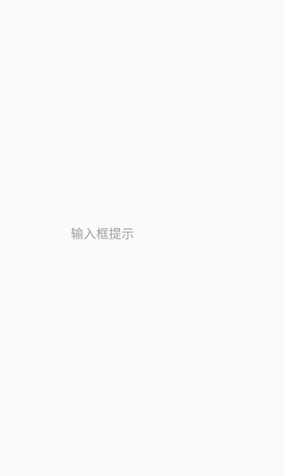
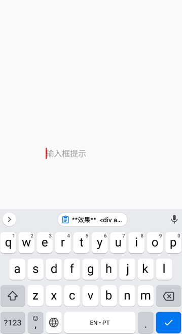
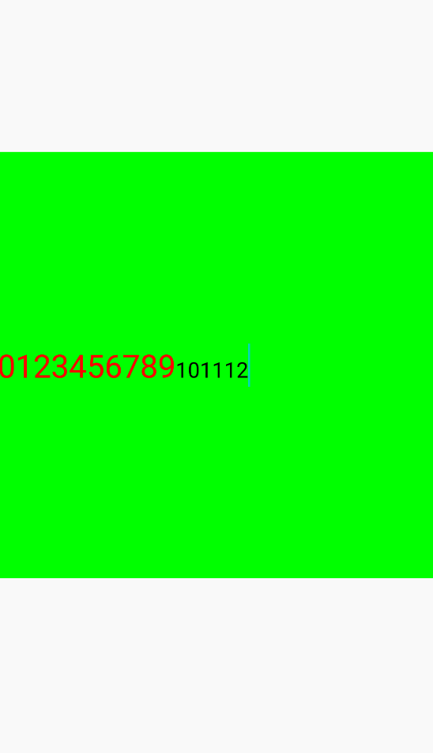

# Input(单行输入框)

``Input``组件为单行输入框

[组件使用示例](https://github.com/Tencent-TDS/KuiklyUI/tree/main/demo/src/commonMain/kotlin/com/tencent/kuikly/demo/pages/demo/InputViewDemoPage.kt)

## 属性

支持所有[基础属性](basic-attr-event.md#基础属性)

### text方法

作用和``Text``组件的[text属性方法一致](text.md#text方法)

### fontSize方法

作用和``Text``组件的[fontSize属性方法一致](text.md#fontSize方法)

### fontWeightNormal方法

作用和``Text``组件的[fontWeightNormal属性方法一致](text.md#fontWeightNormal方法)

### fontWeightBold方法

作用和``Text``组件的[fontWeightBold属性方法一致](text.md#fontWeightBold方法)

### color方法

指定输入框输入文本的颜色, 作用和``Text``组件的[color属性方法一致](text.md#color方法)

### textAlignLeft方法

作用和``Text``组件的[textAlignLeft属性方法一致](text.md#textAlignLeft方法)

### textAlignCenter方法

作用和``Text``组件的[textAlignCenter属性方法一致](text.md#textAlignCenter方法)

### textAlignRight方法

作用和``Text``组件的[textAlignRight属性方法一致](text.md#textAlignRight方法)

### keyboardTypePassword方法

设置输入框的内容类型为密码类型

### keyboardTypeNumber方法

设置输入框的内容类型为数字类型

### keyboardTypeEmail方法

设置输入框的内容类型为邮件类型

### returnKeyTypeSearch方法

设置输入法的下一步按钮类型为搜索类型

### returnKeyTypeSend方法

设置输入法的下一步按钮类型为发送类型

### returnKeyTypeDone方法

设置输入法的下一步按钮类型为完成类型

### returnKeyTypeNext方法

设置输入法的下一步按钮类型为下一步类型

### returnKeyTypeContinue方法<Badge text="仅iOS" type="warn"/>

设置输入法的下一步按钮类型为继续类型

### returnKeyTypeGo方法

设置输入法的下一步按钮类型为前往类型

### returnKeyTypeGoogle方法<Badge text="仅iOS" type="warn"/>

设置输入法的下一步按钮类型为谷歌类型

### placeholder方法<Badge text="微信小程序实现中" type="warn"/>

设置输入框的提示文本

<div class="table-01">

**placeholder方法**

| 参数  | 描述     | 类型 |
|:----|:-------|:--|
| placeholder | 提示文本值  | String |

</div>

:::tabs

@tab:active 示例

```kotlin{12}
@Page("demo_page")
internal class TestPage : BasePager() {
    override fun body(): ViewBuilder {
        return {
            attr {
                allCenter()
            }

            Input {
                attr {
                    size(200f, 40f)
                    placeholder("输入框提示")
                }
            }
        }
    }
}
```

@tab 效果

<div align="center">

</div>

:::

### placeholderColor <Badge text="微信小程序实现中" type="warn"/>

设置输入框提示文本颜色

<div class="table-01">

**placeholderColor属性方法**

| 参数  | 描述     | 类型 |
|:----|:-------|:--|
| color | 提示文本颜色  | Long `|` Color |

</div>

:::tabs

@tab:active 示例

```kotlin{13}
@Page("demo_page")
internal class TestPage : BasePager() {
    override fun body(): ViewBuilder {
        return {
            attr {
                allCenter()
            }

            Input {
                attr {
                    size(200f, 40f)
                    placeholder("输入框提示")
                    placeholderColor(Color.BLUE)
                }
            }
        }
    }
}
```

@tab 效果

<div align="center">

</div>

:::

### tintColor方法 <Badge text="微信小程序实现中" type="warn"/>

设置输入框光标颜色

<div class="table-01">

**tintColor方法**

| 参数  | 描述     | 类型 |
|:----|:-------|:--|
| color | 输入框光标颜色  | Long `|` Color |

</div>

:::tabs

@tab:active 示例

```kotlin{13}
@Page("demo_page")
internal class TestPage : BasePager() {
    override fun body(): ViewBuilder {
        return {
            attr {
                allCenter()
            }

            Input {
                attr {
                    size(200f, 40f)
                    placeholder("输入框提示")
                    tintColor(Color.RED)
                }
            }
        }
    }
}
```

@tab 效果

<div align="center">

</div>

:::

### maxTextLength

限制输入框的输入字符长度

<div class="table-01">

**tintColor方法**

| 参数  | 描述     | 类型 |
|:----|:-------|:--|
| color | 输入框光标颜色  | Long `|` Color |

</div>

**示例**

```kotlin{13}
@Page("demo_page")
internal class TestPage : BasePager() {
    override fun body(): ViewBuilder {
        return {
            attr {
                allCenter()
            }

            Input {
                attr {
                    size(200f, 40f)
                    placeholder("输入框提示")
                    maxTextLength(20) // 限制最多输入20个字符
                }
            }
        }
    }
}
```

### autofocus方法

是否自动获取焦点, 获取焦点后会触发软键盘的弹起

<div class="table-01">

**autofocus方法**

| 参数  | 描述     | 类型 |
|:----|:-------|:--|
| focus | 是否自动获取焦点  | Boolean |

</div>

**示例**

```kotlin{13}
@Page("demo_page")
internal class TestPage : BasePager() {
    override fun body(): ViewBuilder {
        return {
            attr {
                allCenter()
            }

            Input {
                attr {
                    size(200f, 40f)
                    placeholder("输入框提示")
                    autofocus(true)
                }
            }
        }
    }
}
```

### editable方法

是否可编辑


<div class="table-01">

**editable方法**

| 参数  | 描述     | 类型 |
|:----|:-------|:--|
| editable | 是否可编辑  | Boolean |

</div>

**示例**

```kotlin{13}
@Page("demo_page")
internal class TestPage : BasePager() {
    override fun body(): ViewBuilder {
        return {
            attr {
                allCenter()
            }

            Input {
                attr {
                    size(200f, 40f)
                    placeholder("输入框提示")
                    editable(false) // 不可编辑
                }
            }
        }
    }
}
```

### inputSpans方法<Badge text="鸿蒙实现中" type="warn"/><Badge text="H5实现中" type="warn"/> <Badge text="微信小程序实现中" type="warn"/>

设置输入文本的文本样式配合`textDidChange`来更改`spans`实现输入框富文本化。


<div class="table-01">

**inputSpans方法**

| 参数  | 描述     | 类型 |
|:----|:-------|:--|
| spans | 富文本样式  | InputSpans |

</div>

`InputSpans`可以通过`addSpan`来添加`InputSpan`样式。`InputSpan`可用来设置`Input`的文本样式，详细使用方法见以下示例：

**示例**

:::tabs

@tab:active 示例

```kotlin{18}
@Page("demo_page")
internal class TestPage : BasePager() {
    var spans by observable(InputSpans())
    lateinit var ref: ViewRef<InputView>
    
    override fun body(): ViewBuilder {
        val ctx = this
        return {
            attr {
                allCenter()
            }
            Input {
                ref {
                    ctx.ref = it
                }
                attr {
                    size(pagerData.pageViewWidth, 400f)
                    inputSpans(ctx.spans)
                    backgroundColor(Color.GREEN)
                }
                event {
                    textDidChange(true) { it ->
                        val hightSpan = {
                            InputSpan().apply {
                                color(Color.RED)
                                if (it.text.length <= 10) {
                                    text(it.text)
                                } else {
                                    text(it.text.substring(0, 10))
                                }
                                fontSize(30f)
                            }
                        }
                        val normalSpan = {
                            InputSpan().apply {
                                color(Color.BLACK)
                                text(it.text.substring(10, it.text.length))
                                fontSize(20f)
                            }
                        }
                        val spans = InputSpans()

                        if (it.text.length <= 10) {
                            spans.addSpan(hightSpan.invoke())
                        } else {
                            spans.addSpan(hightSpan.invoke())
                            spans.addSpan(normalSpan.invoke())
                        }
                        ctx.spans = spans
                    }
                }
            }
        }
    }
}
```

@tab 效果

<div align="center">

</div>

:::


## 事件

支持所有[基础事件](basic-attr-event.md#基础事件)

### textDidChange

``textDidChange``事件意为输入框文本变化事件，如果组件有设置该事件事件，当``Input``组件输入内容发生变化时，会触发``textDidChange``闭包回调。``textDidChange``闭包中含有
``InputParams``类型参数，以此来描述输入框文本变化事件的信息

<div class="table-01">

**InputParams**

| 参数  | 描述     | 类型 |
|:----|:-------|:--|
| text | 当前输入的文本  | String |

</div>

**示例**

```kotlin{16-18}
@Page("demo_page")
internal class TestPage : BasePager() {
    override fun body(): ViewBuilder {
        return {
            attr {
                allCenter()
            }

            Input {
                attr {
                    size(200f, 40f)
                    placeholder("输入框提示")
                }
                
                event { 
                    textDidChange { 
                        val text = it.text // 变化后的文本
                    }
                }
            }
        }
    }
}
```

### inputFocus

``inputFocus``事件意为输入框获取到焦点事件，如果组件有设置该事件事件，当``Input``组件获取到焦点时，会触发``inputFocus``闭包回调。``inputFocus``闭包中含有
``InputParams``类型参数，以此来描述输入框获取到焦点事件的信息

**示例**

```kotlin{16-18}
@Page("demo_page")
internal class TestPage : BasePager() {
    override fun body(): ViewBuilder {
        return {
            attr {
                allCenter()
            }

            Input {
                attr {
                    size(200f, 40f)
                    placeholder("输入框提示")
                }

                event {
                    inputFocus { inputParams -> 
                        val text = inputParams.text
                    }
                }
            }
        }
    }
}
```

### inputBlur

``inputBlur``事件意为输入框失去焦点事件，如果组件有设置该事件事件，当``Input``组件失去焦点时，会触发``inputBlur``闭包回调。``inputBlur``闭包中含有
``InputParams``类型参数，以此来描述输入框失去焦点事件的信息

**示例**

```kotlin{16-18}
@Page("demo_page")
internal class TestPage : BasePager() {
    override fun body(): ViewBuilder {
        return {
            attr {
                allCenter()
            }

            Input {
                attr {
                    size(200f, 40f)
                    placeholder("输入框提示")
                }

                event {
                    inputBlur { inputParams ->
                        val text = inputParams.text
                    }
                }
            }
        }
    }
}
```

### keyboardHeightChange<Badge text="H5实现中" type="warn"/> <Badge text="微信小程序实现中" type="warn"/>

``keyboardHeightChange``事件意为软键盘高度变化事件，如果组件有设置该事件事件，当软键盘高度变化时，会触发``keyboardHeightChange``闭包回调。``keyboardHeightChange``闭包中含有
``KeyboardParams``类型参数，以此来描述软键盘高度变化事件的信息

<div class="table-01">

**KeyboardParams**

| 参数  | 描述     | 类型 |
|:----|:-------|:--|
| height | 软键盘高度  | Float |
| duration | 软键盘高度变化动画时长  | Float |

</div>

**示例**

```kotlin{16-18}
@Page("demo_page")
internal class TestPage : BasePager() {
    override fun body(): ViewBuilder {
        return {
            attr {
                allCenter()
            }

            Input {
                attr {
                    size(200f, 40f)
                    placeholder("输入框提示")
                }

                event {
                    keyboardHeightChange { keyboardParams -> 
                        
                    }
                }
            }
        }
    }
}
```

### inputReturn <Badge text="微信小程序实现中" type="warn"/>

``inputReturn``事件意为软键盘触发了Return事件，如果组件有设置该事件事件，当软键盘触发了Return事件时，会触发``inputReturn``闭包回调。``inputReturn``闭包中含有
``InputParams``类型参数，以此来描述软键盘触发了Return事件的信息

**示例**

```kotlin{16-18}
@Page("demo_page")
internal class TestPage : BasePager() {
    override fun body(): ViewBuilder {
        return {
            attr {
                allCenter()
            }

            Input {
                attr {
                    size(200f, 40f)
                    placeholder("输入框提示")
                }

                event {
                    onTextReturn { param ->

                    }
                }
            }
        }
    }
}
```

### textLengthBeyondLimit <Badge text="微信小程序实现中" type="warn"/>

``textLengthBeyondLimit``事件意为输入框发生了输入超出最大输入字符的事件，如果组件有设置该事件事件，当输入框发生了输入超出最大输入字符的事件，会触发``textLengthBeyondLimit``闭包回调。``textLengthBeyondLimit``闭包中含有
``InputParams``类型参数，以此来描述输入框触发了输入超出最大输入字符的事件的信息

**示例**

```kotlin{16-18}
@Page("demo_page")
internal class TestPage : BasePager() {
    override fun body(): ViewBuilder {
        return {
            attr {
                allCenter()
            }

            Input {
                attr {
                    size(200f, 40f)
                    placeholder("输入框提示")
                }

                event {
                    textLengthBeyondLimit { param ->

                    }
                }
            }
        }
    }
}
```

## 方法

### setText

设置输入框的文本值

<div class="table-01">

**setText**

| 参数  | 描述     | 类型 |
|:----|:-------|:--|
| text | 文本  | String |

</div>

**示例**

```kotlin{26-28}
@Page("demo_page")
internal class TestPage : BasePager() {

    lateinit var inputRef: ViewRef<InputView>

    override fun body(): ViewBuilder {
        val ctx = this
        return {
            attr {
                allCenter()
            }

            Input {
                ref {
                    ctx.inputRef = it
                }

                attr {
                    size(200f, 40f)
                    placeholder("输入框提示")
                }
            }
        }
    }

    private fun setInputText() {
        inputRef.view?.setText("设置输入框文本")
    }
}
```

### focus

主动让输入框获取焦点, 焦点获取成功后，软键盘会自动弹起

**示例**

```kotlin{26-28}
@Page("demo_page")
internal class TestPage : BasePager() {

    lateinit var inputRef: ViewRef<InputView>

    override fun body(): ViewBuilder {
        val ctx = this
        return {
            attr {
                allCenter()
            }

            Input {
                ref {
                    ctx.inputRef = it
                }

                attr {
                    size(200f, 40f)
                    placeholder("输入框提示")
                }
            }
        }
    }

    private fun focus() {
        inputRef.view?.focus()
    }
}
```

### blur

主动让输入框失去焦点, 焦点失去以后，软键盘会自动收起

**示例**

```kotlin{26-28}
@Page("demo_page")
internal class TestPage : BasePager() {

    lateinit var inputRef: ViewRef<InputView>

    override fun body(): ViewBuilder {
        val ctx = this
        return {
            attr {
                allCenter()
            }

            Input {
                ref {
                    ctx.inputRef = it
                }

                attr {
                    size(200f, 40f)
                    placeholder("输入框提示")
                }
            }
        }
    }

    private fun blur() {
        inputRef.view?.blur()
    }
}
```

### cursorIndex <Badge text="小程序支持中" type="warn"/>

获取光标当前位置

**示例**

```kotlin{26-29}
@Page("demo_page")
internal class TestPage : BasePager() {

    lateinit var inputRef: ViewRef<InputView>

    override fun body(): ViewBuilder {
        val ctx = this
        return {
            attr {
                allCenter()
            }

            Input {
                ref {
                    ctx.inputRef = it
                }

                attr {
                    size(200f, 40f)
                    placeholder("输入框提示")
                }
            }
        }
    }

    private fun getCursor() {
        ref.view?.cursorIndex {
            KLog.i("Input", "index: $it")
        }
    }
}
```

### setCursorIndex <Badge text="小程序支持中" type="warn"/>

设置当前光标位置

**setCursorIndex**

| 参数  | 描述     | 类型 |
|:----|:-------|:--|
| index | 光标位置  | Int |

**示例**

```kotlin{26-28}
@Page("demo_page")
internal class TestPage : BasePager() {

    lateinit var inputRef: ViewRef<InputView>

    override fun body(): ViewBuilder {
        val ctx = this
        return {
            attr {
                allCenter()
            }

            Input {
                ref {
                    ctx.inputRef = it
                }

                attr {
                    size(200f, 40f)
                    placeholder("输入框提示")
                }
            }
        }
    }

    fun setCursorIndex(index: Int) {
        ref.view?.setCursorIndex(index)
    }
}
```


