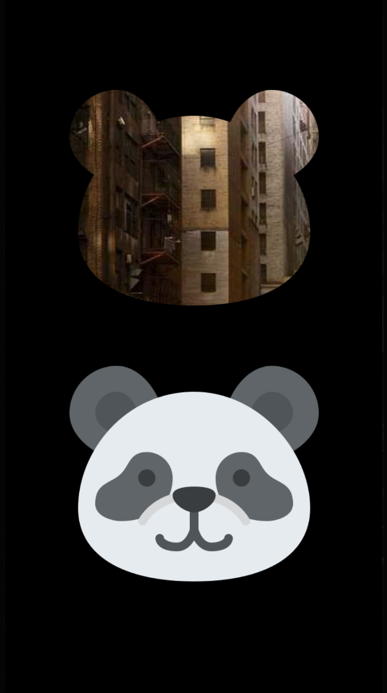

# Mask(遮罩)
<Badge text="鸿蒙实现中" type="warn"/> <Badge text="H5实现中" type="warn"/> <Badge text="微信小程序实现中" type="warn"/>
创建一个遮罩视图。遮罩视图的 alpha 通道用于屏蔽视图内容。Mask的构造需传入两个参数：

| 参数 | 描述 | 类型 |
| -- | -- | -- |
| maskFromView | 构建遮罩视图的源视图 | ViewContainer<*, *>.() -> Unit |
| maskToView | 遮罩视图作用的目标视图 | ViewContainer<*, *>.() -> Unit |

:::tabs

@tab:active 示例

```kotlin{9-25}
@Page("demo_page")
internal class TestPage : BasePager() {
    override fun body(): ViewBuilder {
        return {
            attr {
                allCenter()
                backgroundColor(Color.BLACK)
            }
            Mask({
                Image {
                    attr {
                        size(300f, 300f)
                        resizeStretch()
                        src(ImageUri.pageAssets("panda.png"))
                    }
                }
            }, {
                Image {
                    attr {
                        size(300f, 300f)
                        resizeStretch()
                        src("https://picsum.photos/id/221/351/400")
                    }
                }
            })
            Image {
                attr {
                    size(300f, 300f)
                    resizeStretch()
                    src(ImageUri.pageAssets("panda.png"))
                }
            }
        }
    }
}
```

@tab 效果

<div align="center">

</div>

:::