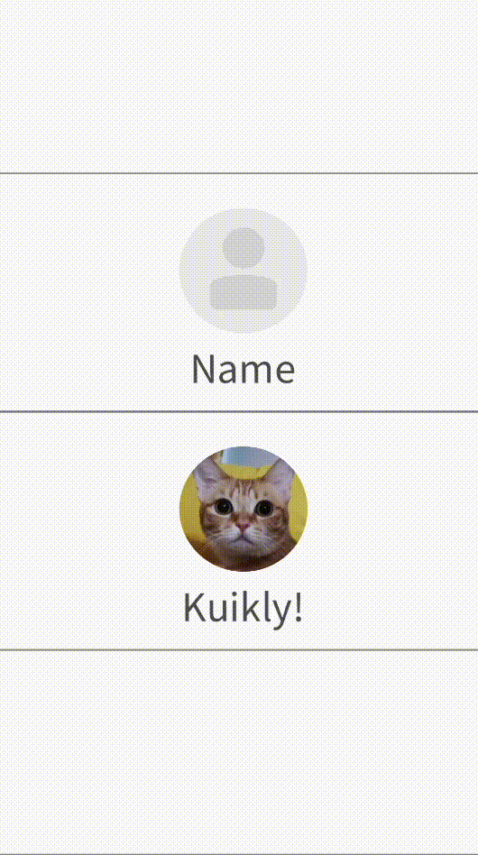

# PAG(动画播放)

类Lottie播放动画的组件

[组件用法](https://github.com/Tencent-TDS/KuiklyUI/blob/main/demo/src/commonMain/kotlin/com/tencent/kuikly/demo/pages/demo/PAGViewDemoPage.kt)

## 属性

支持所有[基础属性](basic-attr-event.md#基础属性)，此外还支持：

### src <Badge text="微信小程序实现中" type="warn"/>

设置`PAGView`的源文件路径，支持URL或本地文件路径

| 参数 | 描述 | 类型 |
| -- | -- | -- |
| src | 源文件路径 | String |

### repeatCount <Badge text="微信小程序实现中" type="warn"/>

设置动画重复次数，默认值为 1，表示动画仅播放一次。0 表示动画将无限次播放

| 参数 | 描述 | 类型 |
| -- | -- | -- |
| repeatCount | 动画重复次数 | Int |

### autoPlay <Badge text="微信小程序实现中" type="warn"/>

设置是否自动播放，默认值为 true

| 参数 | 描述 | 类型 |
| -- | -- | -- |
| play | 是否自动播放 | Boolean |

### replaceLayerContents<Badge text="H5实现中" type="warn"/> <Badge text="微信小程序实现中" type="warn"/>

替换当前 PAG 资源中的图像图层信息，需要传入`PAGReplaceItem`类型参数

**PAGReplaceItem**

| 成员 | 描述 | 类型 |
| -- | -- | -- |
| type | 替换类型 0 文本 1 图片 | Int |
| layerName | layerName & layerIndex 图层选择方式，根据名称或者顺序，二选一 | String |
| layerIndex | layerName & layerIndex 图层选择方式，根据名称或者顺序，二选一 | Int |
| text | 文本替换时指定 | String |
| imageFilePath | 图片替换文件路径 | String |
| imageFileAsset | 图片替换Asset资源路径 | String |
| imageViewRef | 图片替换同页面下其他 View 的 nativeRef | String |
| imageFilePath | MemoryCacheModule.get(key) 可获得 bitmap 的 key | String |

注：图片替换时`imageFilePath`、`imageFileAsset`、`imageFileAsset`、`imageFilePath`指定其一

:::tabs

@tab:active 示例

```kotlin{20-31}
@Page("demo_page")
internal class TestPage : BasePager() {
    override fun body(): ViewBuilder {
        return {
            attr {
                allCenter()
            }
            PAG {
                attr {
                    size(pagerData.pageViewWidth, 200f)
                    src(ImageUri.pageAssets("user_avatar.pag"))
                    repeatCount(0)
                }
            }
            PAG {
                attr {
                    size(pagerData.pageViewWidth, 200f)
                    src(ImageUri.pageAssets("user_avatar.pag"))
                    repeatCount(0)
                    replaceLayerContents(
                        PAGReplaceItem(
                            PAGReplaceItem.TYPE_TEXT,
                            layerName = "text_user_note",
                            text = "Kuikly!"
                        ),
                        PAGReplaceItem(
                            PAGReplaceItem.TYPE_IMAGE,
                            layerName = "img_user_avatar",
                            imageFileAsset = ImageUri.pageAssets("user_portrait.png").toUrl(getPager().pageName)
                        ),
                    )
                }
            }
        }
    }
}
```

@tab 效果

<div align="center">

</div>

:::

## 事件

支持所有[基础事件](basic-attr-event.md#基础事件)，此外还支持：

### loadFailure <Badge text="微信小程序实现中" type="warn"/>

设置加载失败时的事件回调

### animationStart <Badge text="微信小程序实现中" type="warn"/>

设置动画开始时的事件回调

### animationEnd <Badge text="微信小程序实现中" type="warn"/>

设置动画结束时的事件回调

### animationCancel <Badge text="微信小程序实现中" type="warn"/>

设置动画取消时的事件回调

### animationRepeat <Badge text="微信小程序实现中" type="warn"/>

设置动画重复时的事件回调

## 方法

### play <Badge text="微信小程序实现中" type="warn"/>

设置动画重复时的事件回调播放动画（autoPlay属性为true时不需要手动调用该接口）

### stop <Badge text="微信小程序实现中" type="warn"/>

停止动画