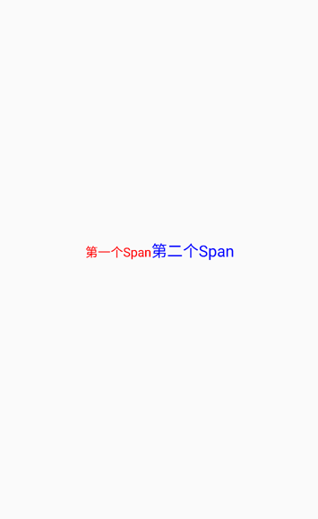
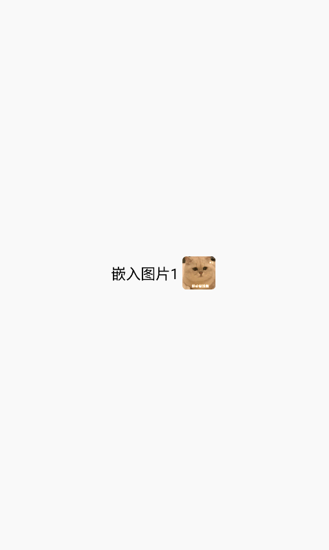
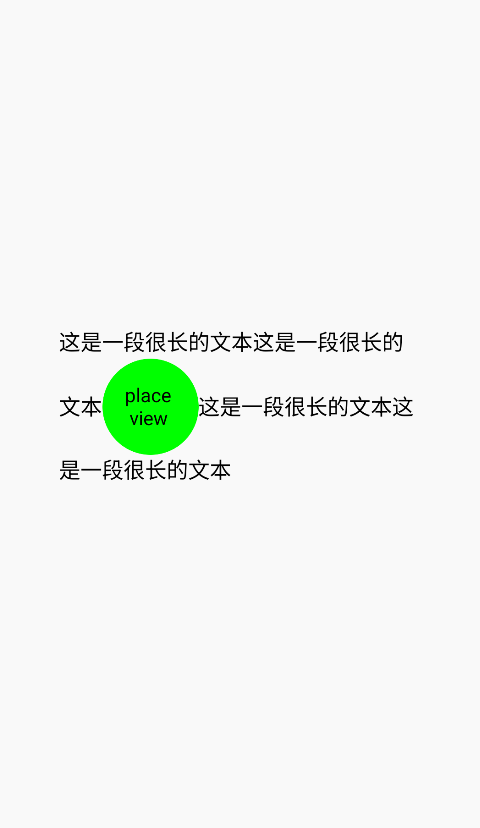

# RichText(富文本)

``RichText``组件能够让不同的文本应用上不同的样式，他继承至``TextView``组件，因此继承了``Text``组件的所有属性。

[组件使用示例](https://github.com/Tencent-TDS/KuiklyUI/tree/main/demo/src/commonMain/kotlin/com/tencent/kuikly/demo/pages/demo/kit_demo/DeclarativeDemo/TextExamplePage.kt)


## 属性

支持[Text组件的所有属性](text.md)

### Span方法

``Span``方法用于往富文本组件中添加一段样式可单独控制的文本, 该方法接收一个``TextSpan``的初始化闭包，你可以在这个初始化闭包中设置``Span``文本
的样式, ``Span``闭包内同样支持[Text组件的所有属性](text.md#属性)

<div class="table-01">

**Span方法**

| 参数  | 描述     | 类型 |
|:----|:-------|:--|
| textSpanInit | span的初始化闭包  | TextSpan.() -> Unit |

</div>

:::tabs

@tab:active 示例

```kotlin{10-19}
@Page("demo_page")
internal class TestPage : BasePager() {
    override fun body(): ViewBuilder {
        return {
            attr {
                allCenter()
            }

            RichText {
                Span {
                    text("第一个Span")
                    color(Color.RED)
                    fontSize(16f)
                }
                Span {
                    text("第二个Span")
                    color(Color.BLUE)
                    fontSize(20f)
                }
            }
        }
    }
}
```

@tab 效果

<div align="center">

</div>

:::

### ImageSpan方法

``ImageSpan``方法用于往富文本组件中添加一个可单独控制的图片, 该方法接收一个``ImageSpan``的初始化闭包，你可以在这个初始化闭包中设置``ImageSpan``图片的样式, ``ImageSpan``闭包内支持[Image组件的相关属性](image.md#属性)

<div class="table-01">

**ImageSpan方法**

| 参数  | 描述     | 类型 |
|:----|:-------|:--|
| spanInit | ImageSpan的初始化闭包  | ImageSpan.() -> Unit |

</div>

:::tabs

@tab:active 示例

```kotlin{12-16}
@Page("demo_page")
internal class TestPage : BasePager() {
    override fun body(): ViewBuilder {
        return {
            attr {
                allCenter()
            }
            RichText {
                Span {
                    fontSize(18f).text("嵌入图片1 ")
                }
                ImageSpan {
                    size(40f, 40f)
                    src("https://vfiles.gtimg.cn/wuji_dashboard/xy/starter/59ef6918.gif")
                    borderRadius(5f)
                }
            }
        }
    }
}
```

@tab 效果

<div align="center">

</div>

:::

### PlaceholderSpan方法

``PlaceholderSpan``方法用于往富文本组件中添加一个空白占位区域, 该方法接收一个``PlaceholderSpan``的初始化闭包，你可以在这个初始化闭包中使用`placeholderSize`属性设置空白占位区域的大小，并通过`spanFrameDidChanged`事件监听SpanFrame变化来配合在空白占位区域叠加其他任意View。使用方法参考示例：

:::tabs

@tab:active 示例

```kotlin{21-29,37-41}
@Page("demo_page")
internal class TestPage : BasePager() {
    var placeholderX by observable(ObservableThreadSafetyMode.NONE, init = 0f)
    var placeholderY by observable(ObservableThreadSafetyMode.NONE, init = 0f)
    var placeholderWidth by observable(ObservableThreadSafetyMode.NONE, init = 0f)
    var placeholderHeight by observable(ObservableThreadSafetyMode.NONE, init = 0f)
    override fun body(): ViewBuilder {
        val ctx = this
        return {
            attr {
                allCenter()
            }
            View {
                RichText {
                    attr {
                        width(300f)
                    }
                    Span {
                        fontSize(18f).text("这是一段很长的文本这是一段很长的文本")
                    }
                    PlaceholderSpan {
                        placeholderSize(80f, 80f)
                        spanFrameDidChanged {
                            ctx.placeholderX = it.x
                            ctx.placeholderY = it.y
                            ctx.placeholderWidth = it.width
                            ctx.placeholderHeight = it.height
                        }
                    }
                    Span {
                        fontSize(18f).text("这是一段很长的文本这是一段很长的文本")
                    }
                }
                View {
                    attr {
                        // 设置为RichText中PlaceholderSpan的位置和大小
                        positionAbsolute()
                        left(ctx.placeholderX)
                        top(ctx.placeholderY)
                        height(ctx.placeholderHeight)
                        width(ctx.placeholderWidth)

                        borderRadius(40f)
                        backgroundColor(Color.GREEN)
                        allCenter()
                    }
                    Text {
                        attr {
                            text("place \n view")
                        }
                    }
                }
            }
        }
    }
}
```

@tab 效果

<div align="center">

</div>

:::

## 事件

支持[Text组件的所有事件](text.md#事件)
