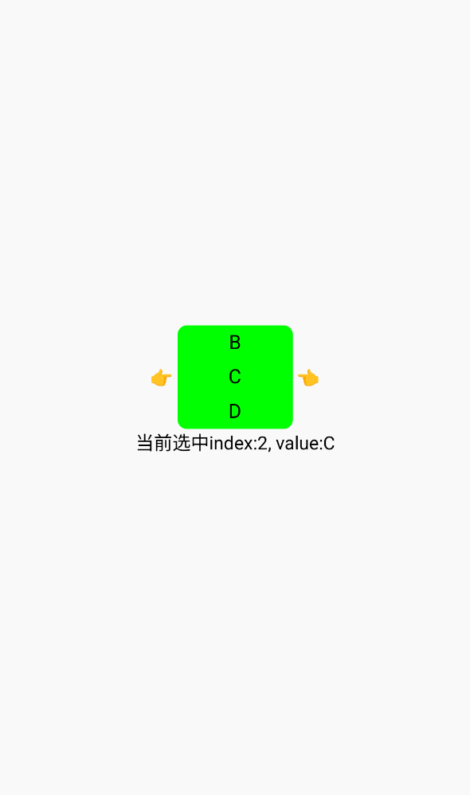

# ScrollPicker(滚动选择器)

`ScrollPicker`是基于`Scroller`实现的滚动选择器，可多个组合用作地区选择等自定义场景。如组件行为不符合业务实际预期也可自行基于`Scroller`实现。

`ScrollPicker`的创建可传入两个参数：

| 参数 | 描述 | 类型 |
| -- | -- | -- |
| itemList | 滚动选择器所包含的item列表 | Array\<String\> |
| defaultIndex | 滚动选择器初始Index | Int? |

[组件使用示例](https://github.com/Tencent-TDS/KuiklyUI/blob/main/demo/src/commonMain/kotlin/com/tencent/kuikly/demo/pages/demo/kit_demo/DeclarativeDemo/ScrollPickerExamplePage.kt)

## 属性

支持所有[基础属性](basic-attr-event.md#基础属性)，此外还支持：

### itemWidth

单个item选项的宽度，`Float`类型

### itemHeight

单个item选项的高度，`Float`类型

### countPerScreen

每屏item的个数，`Int`类型

### itemBackGroundColor

每个item的背景色，`Color`类型

### itemTextColor

每个item的文字色，`Color`类型

## 事件

支持所有[基础事件](basic-attr-event.md#基础事件)，此外还支持：

### dragEndEvent

停止滚动后选中item时的回调，回调会传入中间item的value和index

| 参数 | 描述 | 类型 |
| -- | -- | -- |
| centerValue | 中间item的值 | String |
| centerItemIndex | 中间item在选择器中的index | Int |

:::tabs

@tab:active 示例

```kotlin{22-37}
@Page("demo_page")
internal class TestPage : BasePager() {
    private var chooseIdx: Int by observable(0)
    private var chooseValue: String by observable("")

    override fun body(): ViewBuilder {
        val ctx = this
        return {
            attr {
                allCenter()
            }
            View {
                attr {
                    flexDirectionRow()
                    allCenter()
                }
                Text {
                    attr {
                        text("👉 ")
                    }
                }
                ScrollPicker(arrayOf("A","B","C","D","E","F")) {
                    attr {
                        borderRadius(8f)
                        itemWidth = 100f
                        itemHeight = 30f
                        countPerScreen = 3
                        itemBackGroundColor = Color.GREEN
                        itemTextColor = Color.BLACK
                    }
                    event {
                        dragEndEvent { centerValue, centerItemIndex ->
                            ctx.chooseIdx = centerItemIndex
                            ctx.chooseValue = centerValue
                        }
                    }
                }
                Text {
                    attr {
                        text(" 👈")
                    }
                }
            }
            Text {
                attr {
                    marginTop(3f)
                    text("当前选中index:${ctx.chooseIdx}, value:${ctx.chooseValue}")
                }
            }
        }
    }
}
```

@tab 效果

<div align="center">

</div>

:::