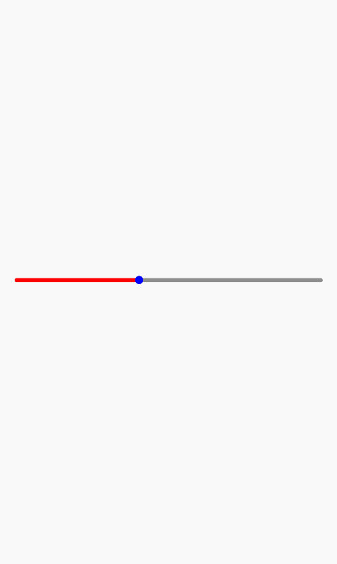

# Slider(滑动器)

滑动选择器组件，可用于拖动进度条场景

[组件使用示例](https://github.com/Tencent-TDS/KuiklyUI/blob/main/demo/src/commonMain/kotlin/com/tencent/kuikly/demo/pages/demo/SliderExamplePage.kt)

## 属性

支持所有[基础属性](basic-attr-event.md#基础属性)，此外还支持：

### currentProgress

设置当前进度百分比, 取值范围[0, 1]

| 参数 | 描述 | 类型 |
| -- | -- | -- |
| progress01 | 进度百分比, 取值范围[0, 1] | Float |

### progressViewCreator

当前进度view自定义创建（可选，有默认实现）

| 参数 | 描述 | 类型 |
| -- | -- | -- |
| creator | 自定义当前进度view | ViewContainer<*, *>.() -> Unit |

### trackViewCreator

背景轨道view自定义创建（可选，有默认实现）

| 参数 | 描述 | 类型 |
| -- | -- | -- |
| creator | 自定义背景轨道view | ViewContainer<*, *>.() -> Unit |

### thumbViewCreator

滑块view自定义创建（可选，有默认实现）

| 参数 | 描述 | 类型 |
| -- | -- | -- |
| creator | 自定义滑块view | ViewContainer<*, *>.() -> Unit |

### progressColor

当前进度颜色

| 参数 | 描述 | 类型 |
| -- | -- | -- |
| color | 当前进度颜色 | Color |

### trackColor

背景轨道颜色

| 参数 | 描述 | 类型 |
| -- | -- | -- |
| color | 背景轨道颜色 | Color |

### thumbColor

滑块颜色

| 参数 | 描述 | 类型 |
| -- | -- | -- |
| color | 滑块颜色 | Color |

### trackThickness

轨道厚度

| 参数 | 描述 | 类型 |
| -- | -- | -- |
| thickness | 轨道厚度 | Float |

### thumbSize

滑块大小（高度和宽度，尺寸）

| 参数 | 描述 | 类型 |
| -- | -- | -- |
| thickness | 滑块大小 | Size |

### sliderDirection

滑动方向（是否是横向, 默认横向）

| 参数 | 描述 | 类型 |
| -- | -- | -- |
| horizontal | 滑动方向 | Boolean |


## 事件

支持所有[基础事件](basic-attr-event.md#基础事件)，此外还支持：

### progressDidChanged

进度变化时的回调，回调会传入进度参数

| 参数 | 描述 | 类型 |
| -- | -- | -- |
| progress | 当前滑动进度 | Float |

### beginDragSlider

开始拖动滑动器的回调，回调会传入Pan手势参数[PanGestureParams](./basic-attr-event.md#pan事件)

| 参数 | 描述 | 类型 |
| -- | -- | -- |
| params | 滑动手势参数 | PanGestureParams |

### endDragSlider

结束拖动滑动器的回调，回调会传入Pan手势参数[PanGestureParams](./basic-attr-event.md#pan事件)

| 参数 | 描述 | 类型 |
| -- | -- | -- |
| params | 滑动手势参数 | PanGestureParams |

:::tabs

@tab:active 示例

```kotlin{8-27}
@Page("demo_page")
internal class TestPage : BasePager() {
    override fun body(): ViewBuilder {
        return {
            attr {
                allCenter()
            }
            Slider {
                attr {
                    width(pagerData.pageViewWidth - 40f)
                    height(30f)
                    trackColor(Color.GRAY)
                    thumbColor(Color.BLUE)
                    progressColor(Color.RED)
                }
                event {
                    progressDidChanged {
                        KLog.i("Slider", "progressDidChanged: $it")
                    }
                    beginDragSlider {
                        KLog.i("Slider", "beginDragSlider")
                    }
                    endDragSlider {
                        KLog.i("Slider", "endDragSlider")
                    }
                }
            }
        }
    }
}
```

@tab 效果

<div align="center">

</div>

:::