# Text(文本)

用于显示文本的组件

[组件使用示例](https://github.com/Tencent-TDS/KuiklyUI/tree/main/demo/src/commonMain/kotlin/com/tencent/kuikly/demo/pages/demo/kit_demo/DeclarativeDemo/TextExamplePage.kt)

## 属性

支持所有[基础属性](basic-attr-event.md#基础属性)

### text方法

设置文本

<div class="table-01">

**text方法**

| 参数  | 描述     | 类型 |
|:----|:-------|:--|
| text | 文本  | String |

</div>

:::tabs

@tab:active 示例

```kotlin {10}
@Page("demo_page")
internal class TextViewPage : BasePager() {
    override fun body(): ViewBuilder {
        return {
            attr {
                allCenter()
            }
            Text { 
                attr { 
                    text("这是一个文本")
                }
            }
        }
    }
}
```

@tab 效果

<div align="center">
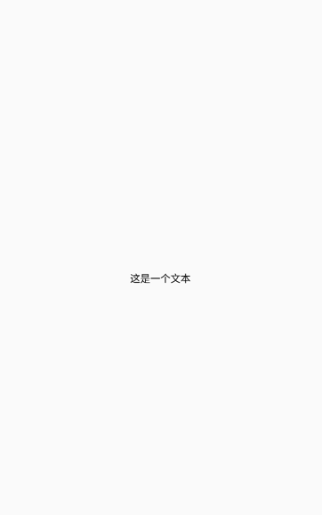
</div>

:::

### color方法

设置字体颜色

<div class="table-01">

**color属性**

| 参数  | 描述     | 类型 |
|:----|:-------|:--|
| color | 字体颜色  | Long `|` Color |

</div>

:::tabs

@tab:active 示例

```kotlin {13,20}
@Page("demo_page")
internal class TextColorPage : BasePager() {
    override fun body(): ViewBuilder {
        return {
            attr {
                allCenter()
            }

            Text {
                attr {
                    marginBottom(20f)
                    text("第一个文本")
                    color(Color.BLUE) // 传递Color对象
                }
            }

            Text {
                attr {
                    text("第二个文本")
                    color(0xff0000FFL) // 传递十六进制颜色
                }
            }
        }
    }
}
```

@tab 效果

<div align="center">
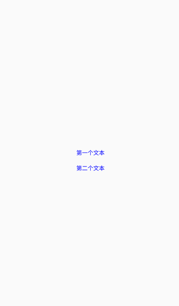
</div>

:::

### fontSize方法

设置字体大小

<div class="table-01">

**fontSize方法**

| 参数  | 描述     | 类型 |
|:----|:-------|:--|
| size | 字体大小  | Float |

</div>

::: tabs

@tab:active 示例

```kotlin {14}
@Page("demo_page")
internal class FontSizePage : BasePager() {
    override fun body(): ViewBuilder {
        return {
            attr {
                allCenter()
            }

            Text {
                attr {
                    marginBottom(20f)
                    text("第一个文本")
                    color(Color.BLUE) // 传递Color对象
                    fontSize(20f)
                }
            }
        }
    }
}
```

@tab 效果
<div align="center">
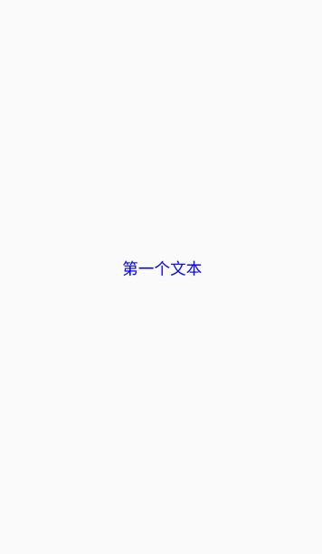
</div>

:::

### fontWeight400方法

设置字重为400.

:::tabs

@tab:active 示例

```kotlin{15}
@Page("demo_page")
internal class FontWeightPage : BasePager() {
    override fun body(): ViewBuilder {
        return {
            attr {
                allCenter()
            }

            Text {
                attr {
                    marginBottom(20f)
                    text("第一个文本")
                    color(Color.RED) // 传递Color对象
                    fontSize(20f)
                    fontWeight400()
                }
            }
        }
    }
}
```

@tab 效果

<div align="center">
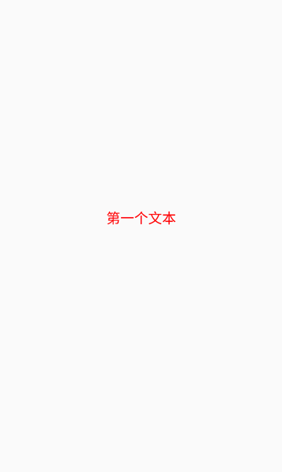
</div>

:::

### fontWeight500方法

设置字重为500

::: tabs

@tab:active 示例

```kotlin{15}
@Page("demo_page")
internal class FontWeightPage : BasePager() {
    override fun body(): ViewBuilder {
        return {
            attr {
                allCenter()
            }

            Text {
                attr {
                    marginBottom(20f)
                    text("第一个文本")
                    color(Color.RED) // 传递Color对象
                    fontSize(20f)
                    fontWeight500()
                }
            }
        }
    }
}
```

@tab 效果

<div align="center">
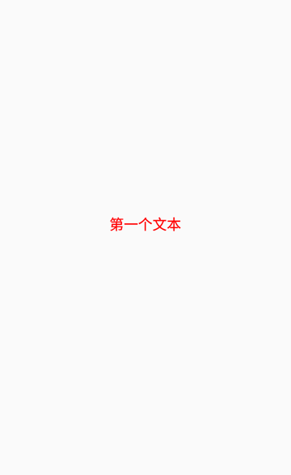
</div>

:::

### fontWeight600方法

设置字重为600

:::tabs

@tab:active 示例

```kotlin{15}
@Page("demo_page")
internal class FontWeightPage : BasePager() {
    override fun body(): ViewBuilder {
        return {
            attr {
                allCenter()
            }

            Text {
                attr {
                    marginBottom(20f)
                    text("第一个文本")
                    color(Color.RED) // 传递Color对象
                    fontSize(20f)
                    fontWeight600()
                }
            }
        }
    }
}
```

@tab 效果

<div align="center">

</div>

:::

### fontWeight700方法

设置字重为700

:::tabs

@tab:active 示例

```kotlin{15}
@Page("demo_page")
internal class FontWeightPage : BasePager() {
    override fun body(): ViewBuilder {
        return {
            attr {
                allCenter()
            }

            Text {
                attr {
                    marginBottom(20f)
                    text("第一个文本")
                    color(Color.RED) // 传递Color对象
                    fontSize(20f)
                    fontWeight700()
                }
            }
        }
    }
}
```

@tab 效果

<div align="center">
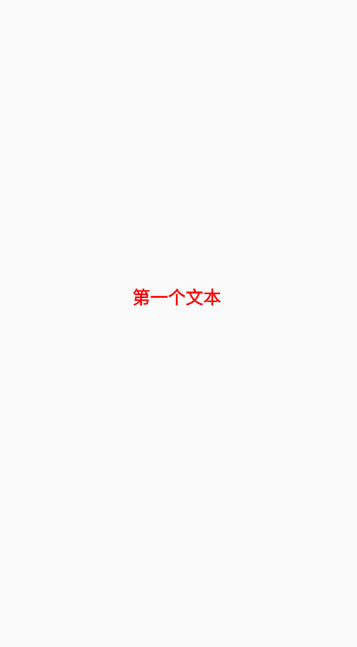
</div>

:::

### fontWeightNormal方法

效果与[fontWeight400方法](#fontWeight400方法)一致

### fontWeightMedium方法

效果与[fontWeight500方法](#fontWeight500方法)一致

### fontWeightSemisolid方法

效果与[fontWeight600方法](#fontWeight600方法)一致

### fontWeightBold方法

效果与[fontWeight700方法](#fontWeight700方法)一致

### fontFamily方法

设置字体

<div class="table-01">

**fontFamily方法**

| 参数  | 描述     | 类型 |
|:----|:-------|:--|
| fontFamily | 字体名称  | String |

:::tip 注意
如果需要使用自定义字体，安卓和鸿蒙端需要实现[自定义字体适配器](../../QuickStart/android.md#自定义字体适配器)，iOS端需要在系统中[注册字体](https://developer.apple.com/documentation/uikit/adding-a-custom-font-to-your-app?language=objc)。
:::
示例：
```kotlin
    Text {
        attr {
            fontSize(20f)
            text("123456kmm")
        }
    }
    Text {
        attr {
            fontFamily("Satisfy-Regular")
            fontSize(20f)
            text("123456kmm")
        }
    }
```

<div>
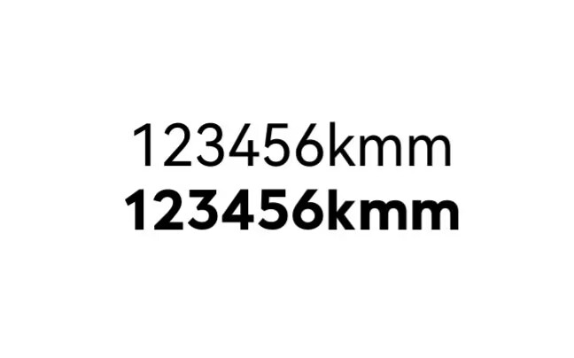
</div>


</div>

### lines方法

设置文本最大行数, 文本超出行数的部分以"..."显示

<div class="table-01">

**lines方法**

| 参数  | 描述     | 类型 |
|:----|:-------|:--|
| lines | 文本行数  | Int |

</div>

:::tabs

@tab:active 示例

```kotlin {17}
@Page("demo_page")
internal class FontWeightPage : BasePager() {
    override fun body(): ViewBuilder {
        return {
            attr {
                allCenter()
            }

            Text {
                attr {
                    text("这是一个很长的文本这是一个很长的文本这是一个很长的文本" +
                            "这是一个很长的文本这是一个很长的文本这是一个很长的文本" +
                            "这是一个很长的文本这是一个很长的文本这是一个很长的文本" +
                            "这是一个很长的文本这是一个很长的文本这是一个很长的文本" +
                            "这是一个很长的文本这是一个很长的文本")
                    fontSize(20f)
                    lines(2)
                }
            }
        }
    }
}
```

@tab 效果

<div align="center">

</div>

:::

### lineBreakMargin<Badge text="鸿蒙实现中" type="warn"/>

最后一行折叠"..." 距离最右边距离，常用于显示"更多"展开场景使用

| 参数 | 描述 | 类型 |
| -- | -- | -- |
| lineBreakMargin | 最后一行折叠距离text组件frame.right距离 | String |

:::tabs

@tab:active 示例

```kotlin {28}
@Page("demo_page")
internal class LineBreakMarginPager : BasePager() {

    var lineBreak by observable(false)
    var top by observable(0f)
    var left by observable(0f)

    override fun body(): ViewBuilder {
        val ctx = this
        return {
            attr {
                allCenter()
            }

            Text {
                attr {
                    fontSize(16f)
                    text("这是一个普通文本这是一个普通文本这是一个普通文本这是一个普通文本这是一个普通文本这是一个普通文本" +
                            "这是一个普通文本这是一个普通文本这是一个普通文本这是一个普通文本这是一个普通文本这是一个普通文本" +
                            "这是一个普通文本这是一个普通文本这是一个普通文本这是一个普通文本这是一个普" +
                            "这是一个普通文本这是一个普通文本这是一个普通文本这是一个普通文本这是一个普" +
                            "这是一个普通文本这是一个普通文本这是一个普通文本这是一个普通文本这是一个普" +
                            "这是一个普通文本这是一个普通文本这是一个普通文本这是一个普通文本这是一个普")
                    color(Color.GRAY)
                    fontStyleItalic()
                    textDecorationLineThrough()
                    lines(2)
                    lineBreakMargin(100f)
                    lineHeight(16f)
                }
                event {
                    onLineBreakMargin {
                        ctx.lineBreak = true
                    }
                    layoutFrameDidChange {
                        ctx.top = it.y + it.height - 16f
                        ctx.left = it.x + it.width - 90f
                    }
                }
            }
            vif({ ctx.lineBreak }) {
                Text {
                    attr {
                        text("更多")
                        fontSize(16f)
                        lineHeight(16f)
                        absolutePosition(top = ctx.top, left = ctx.left)
                    }
                }
            }
        }
    }
}
```

@tab 效果

<div align="center">
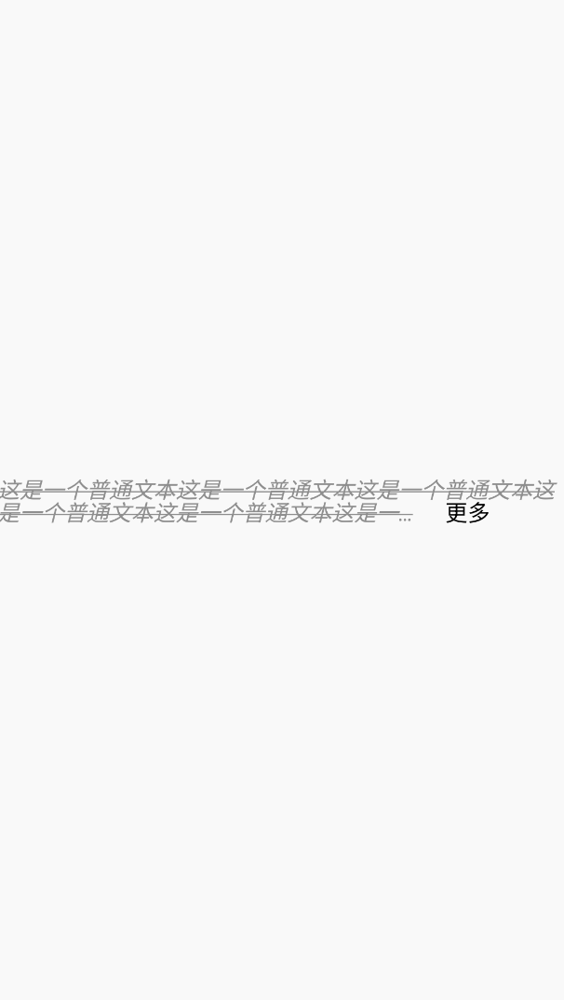
</div>

:::

### textOverFlowMiddle方法<Badge text="安卓实现中" type="warn"/>

文本超出最大行数时，"..."显示在中间位置

:::tabs

@tab:active 示例

```kotlin {18}
@Page("demo_page")
internal class TestPage : BasePager() {
    override fun body(): ViewBuilder {
        return {
            attr {
                allCenter()
            }

            Text {
                attr {
                    text("这是一个很长的文本这是一个很长的文本这是一个很长的文本" +
                            "这是一个很长的文本这是一个很长的文本这是一个很长的文本" +
                            "这是一个很长的文本这是一个很长的文本这是一个很长的文本" +
                            "这是一个很长的文本这是一个很长的文本这是一个很长的文本" +
                            "这是一个很长的文本这是一个很长的文本")
                    fontSize(20f)
                    lines(2)
                    textOverFlowMiddle()
                }
            }
        }
    }
}
```

@tab 效果

<div align="center">
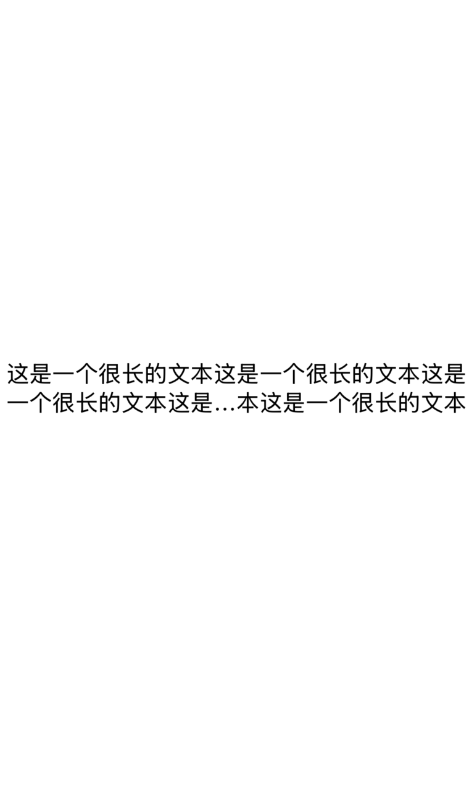
</div>

:::

### textOverFlowTail方法

文本超出最大行数时，"..."显示在尾部位置

:::tabs

@tab:active 示例

```kotlin {18}
@Page("demo_page")
internal class TestPage : BasePager() {
    override fun body(): ViewBuilder {
        return {
            attr {
                allCenter()
            }

            Text {
                attr {
                    text("这是一个很长的文本这是一个很长的文本这是一个很长的文本" +
                            "这是一个很长的文本这是一个很长的文本这是一个很长的文本" +
                            "这是一个很长的文本这是一个很长的文本这是一个很长的文本" +
                            "这是一个很长的文本这是一个很长的文本这是一个很长的文本" +
                            "这是一个很长的文本这是一个很长的文本")
                    fontSize(20f)
                    lines(2)
                    textOverFlowTail()
                }
            }
        }
    }
}
```

@tab 效果

<div align="center">
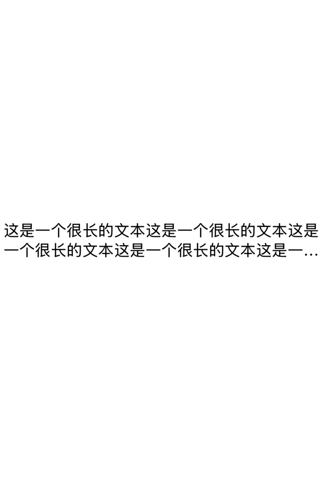
</div>

:::

### textOverFlowClip方法<Badge text="安卓实现中" type="warn"/>

文本超出最大行数时，直接截断，不显示"..."

:::tabs

@tab:active 示例

```kotlin {18}
@Page("demo_page")
internal class TestPage : BasePager() {
    override fun body(): ViewBuilder {
        return {
            attr {
                allCenter()
            }

            Text {
                attr {
                    text("这是一个很长的文本这是一个很长的文本这是一个很长的文本" +
                            "这是一个很长的文本这是一个很长的文本这是一个很长的文本" +
                            "这是一个很长的文本这是一个很长的文本这是一个很长的文本" +
                            "这是一个很长的文本这是一个很长的文本这是一个很长的文本" +
                            "这是一个很长的文本这是一个很长的文本")
                    fontSize(20f)
                    lines(2)
                    textOverFlowClip()
                }
            }
        }
    }
}
```

@tab 效果

<div align="center">
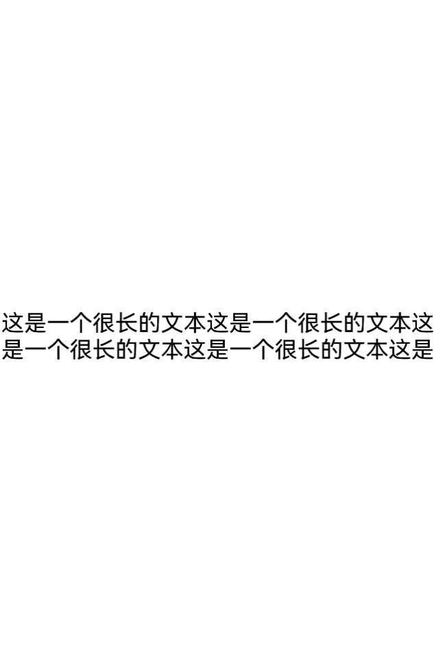
</div>

:::

### textDecorationUnderLine方法

为文本添加下划线的装饰

:::tabs

@tab:active 示例

```kotlin {13}
@Page("demo_page")
internal class UnderLinePage : BasePager() {
    override fun body(): ViewBuilder {
        return {
            attr {
                allCenter()
            }

            Text {
                attr {
                    text("这是一个很长的文本这是一个很长的文本这是一个很长的文本")
                    fontSize(20f)
                    textDecorationUnderLine()
                }
            }
        }
    }
}
```

@tab 效果

<div align="center">
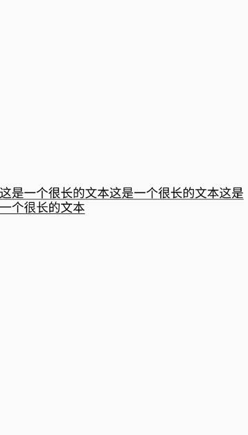
</div>

:::

### textDecorationLineThrough方法

为文本添加删除线装饰

:::tabs

@tab:active 示例

```kotlin{13}
@Page("demo_page")
internal class TestPage : BasePager() {
    override fun body(): ViewBuilder {
        return {
            attr {
                allCenter()
            }

            Text {
                attr {
                    text("这是一个很长的文本这是一个很长的文本这是一个很长的文本")
                    fontSize(20f)
                    textDecorationLineThrough()
                }
            }
        }
    }
}
```

@tab 效果

<div align="center">
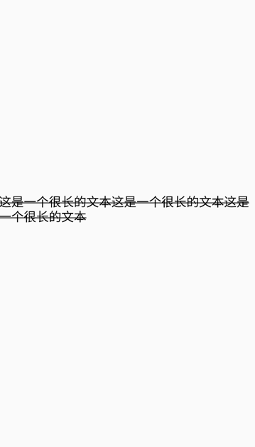
</div>

:::

### textShadow方法

文字阴影

:::tabs

@tab:active 示例

```kotlin{13}
@Page("demo_page")
internal class TestPage : BasePager() {
    override fun body(): ViewBuilder {
        return {
            attr {
                allCenter()
            }

            Text {
                attr {
                    text("red text shadow")
                    size(100f, 50f)
                    fontSize(18f)
                    backgroundColor(Color.YELLOW)
                    textShadow(2f, 2f, 2f, Color.RED)
                    boxShadow(BoxShadow(2f,2f,2f, Color.GRAY))
                }
            }
        }
    }
}
```


@tab 效果

<div align="center">
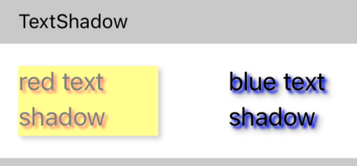
</div>


:::

### textAlignLeft方法

文字左对齐

:::tabs

@tab:active 示例

```kotlin{13}
@Page("demo_page")
internal class TestPage : BasePager() {
    override fun body(): ViewBuilder {
        return {
            attr {
                allCenter()
            }

            Text {
                attr {
                    text("这是一个很长的文本这是一个很长的文本这是一个很长的文本")
                    fontSize(20f)
                    textAlignLeft()
                }
            }
        }
    }
}
```

@tab 效果

<div align="center">
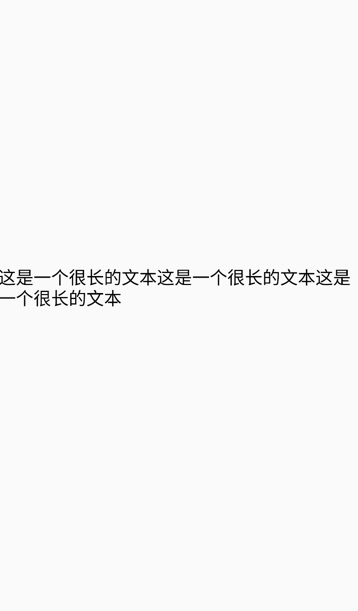
</div>

:::

### textAlignCenter方法

文本居中对齐

:::tabs

@tab:active 示例

```kotlin{13}
@Page("demo_page")
internal class TestPage : BasePager() {
    override fun body(): ViewBuilder {
        return {
            attr {
                allCenter()
            }

            Text {
                attr {
                    text("这是一个很长的文本这是一个很长的文本这是一个很长的文本")
                    fontSize(20f)
                    textAlignCenter()
                }
            }
        }
    }
}
```

@tab 效果

<div align="center">
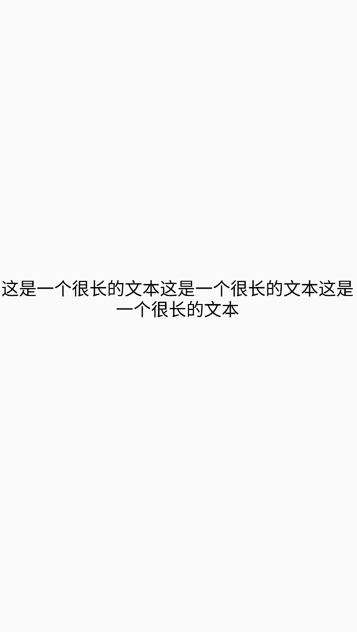
</div>

:::

### textAlignRight方法

文本右对齐

:::tabs

@tab:active 示例

```kotlin{13}
@Page("demo_page")
internal class TestPage : BasePager() {
    override fun body(): ViewBuilder {
        return {
            attr {
                allCenter()
            }

            Text {
                attr {
                    text("这是一个很长的文本这是一个很长的文本这是一个很长的文本")
                    fontSize(20f)
                    textAlignRight()
                }
            }
        }
    }
}
```

@tab 效果

<div align="center">
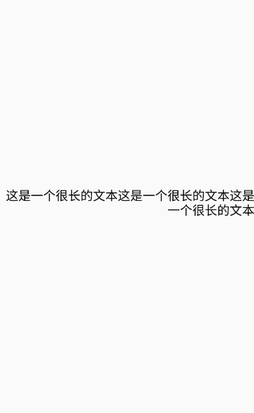
</div>

:::

### lineHeight方法

文字行高

<div class="table-01">

**lineHeight方法**

| 参数  | 描述     | 类型 |
|:----|:-------|:--|
| lineHeight | 行高  | Float |

</div>

:::tabs

@tab:active 示例

```kotlin{14}
@Page("demo_page")
internal class TestPage : BasePager() {
    override fun body(): ViewBuilder {
        return {
            attr {
                allCenter()
            }

            Text {
                attr {
                    backgroundColor(Color.GREEN)
                    text("这是一个很长的文本这是一个很长的文本这是一个很长的文本")
                    fontSize(20f)
                    lineHeight(50f)
                }
            }
        }
    }
}
```

@tab 效果

<div align="center">
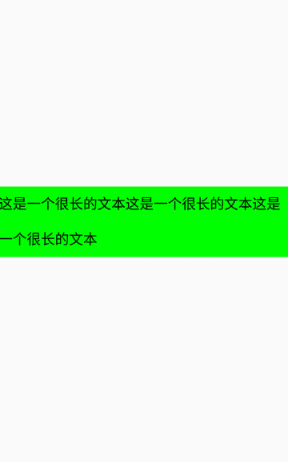
</div>

:::

### lineSpacing方法

设置文本行间距

<div class="table-01">

**lineSpacing方法**

| 参数  | 描述     | 类型 |
|:----|:-------|:--|
| value | 行距  | Float |

</div>

:::tabs

@tab:active 示例

```kotlin{14}
@Page("demo_page")
internal class TestPage : BasePager() {
    override fun body(): ViewBuilder {
        return {
            attr {
                allCenter()
            }

            Text {
                attr {
                    backgroundColor(Color.GREEN)
                    text("这是一个很长的文本这是一个很长的文本这是一个很长的文本")
                    fontSize(20f)
                    lineSpacing(50f)
                }
            }
        }
    }
}
```

@tab 效果

<div align="center">
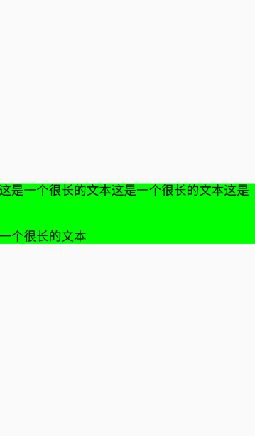
</div>

:::

### letterSpacing方法

设置文本字间距

<div class="table-01">

| 参数  | 描述     | 类型 |
|:----|:-------|:--|
| value | 字间距  | Float |

</div>

:::tabs

@tab:active 示例

```kotlin{14}
@Page("demo_page")
internal class TestPage : BasePager() {
    override fun body(): ViewBuilder {
        return {
            attr {
                allCenter()
            }

            Text {
                attr {
                    backgroundColor(Color.GREEN)
                    text("这是一个很长的文本这是一个很长的文本这是一个很长的文本")
                    fontSize(20f)
                    letterSpacing(10f)
                }
            }
        }
    }
}
```

@tab 效果

<div align="center">
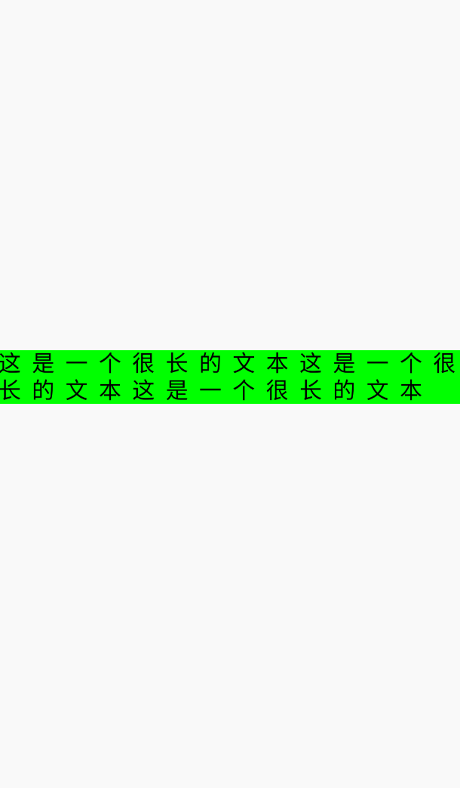
</div>

:::

### fontStyleItalic方法

设置文本为斜体

:::tabs

@tab:active 示例

```kotlin{14}
@Page("demo_page")
internal class TestPage : BasePager() {
    override fun body(): ViewBuilder {
        return {
            attr {
                allCenter()
            }

            Text {
                attr {
                    backgroundColor(Color.GREEN)
                    text("这是一个很长的文本这是一个很长的文本这是一个很长的文本")
                    fontSize(20f)
                    fontStyleItalic()
                }
            }
        }
    }
}
```

@tab 效果

<div align="center">
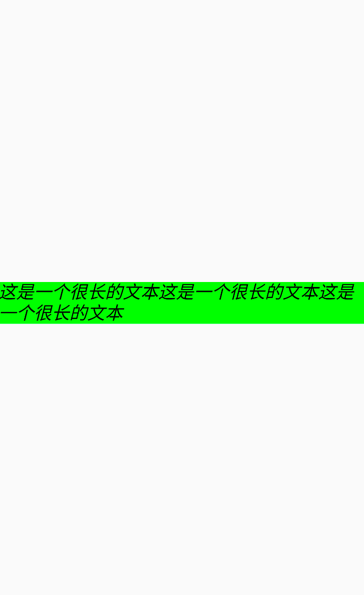
</div>

:::

### firstLineHeadIndent方法

文本首行缩进距离

:::tabs

@tab:active 示例

```kotlin{14}
@Page("demo_page")
internal class TestPage : BasePager() {
    override fun body(): ViewBuilder {
        return {
            attr {
                allCenter()
            }

            Text {
                attr {
                    backgroundColor(Color.GREEN)
                    text("这是一个很长的文本这是一个很长的文本这是一个很长的文本")
                    fontSize(20f)
                    firstLineHeadIndent(10f)
                }
            }
        }
    }
}
```

@tab 效果

<div align="center">
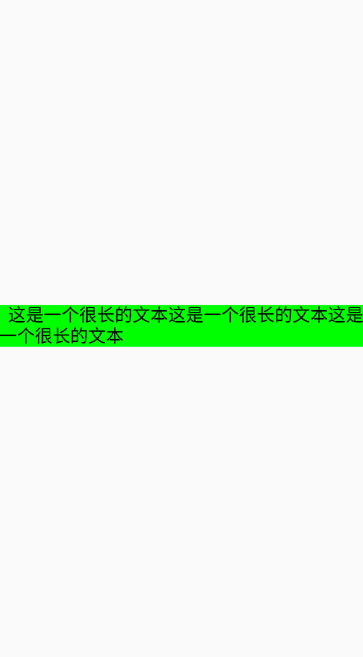
</div>

:::

## 事件

支持所有[基础事件](basic-attr-event.md#基础事件)