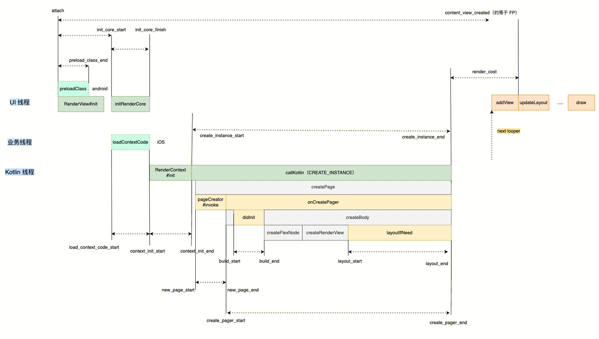

# **PerformanceModule**

在`Kuikly`中，有专门用于性能指标监控的`PerformanceModule`，使用它可以让你了解`Kuikly`使用过程中的性能表现。

## **使用方式**
在宿主侧进行性能监控类型的注册后，即可在 宿主侧 和 `Kuikly`侧 获取性能数据

### **安卓**

1. 重写 `performanceMonitorTypes` 函数，注册所需要的性能监控类型，默认只打开 `LAUNCH` 启动监控

```kotlin
// KuiklyRenderActivity.kt

class KuiklyRenderActivity : AppCompatActivity(), KuiklyRenderViewDelegatorDelegate {
    ...

    override fun performanceMonitorTypes(): List<KRMonitorType> {
        return listOf(KRMonitorType.LAUNCH, KRMonitorType.FRAME, KRMonitorType.MEMORY)    
    }
    
    ...
}

/**
 * 性能监控类型
 */
enum class KRMonitorType {
    LAUNCH, // 启动监控
    FRAME,  // FPS监控
    MEMORY  // 内存监控
}
```

2. 页面退出时，进行回调

```objc
# KuiklyRenderActivity.kt
class KuiklyRenderActivity : AppCompatActivity(), KuiklyRenderViewDelegatorDelegate {
    ...
    
    override fun onGetPerformanceData(data: KRPerformanceData) {
      // 相关逻辑
      
    }
    
    ...
}
```

### **iOS**

1. 注册需要的性能监控类型

```objc
// KuiklyRenderViewController.m
- (instancetype)initWithPageName:(NSString *)pageName pageData:(NSDictionary *)pageData {
    if (self = [super init]) {
        ...

        [_delegator.performanceManager setMonitorType:KRMonitorType_ALL];

        ...
    }
    return self;
}


/**
 * 性能监控类型
 */
typedef NS_OPTIONS(NSInteger, KRMonitorType) {
    /// 加载时间
    KRMonitorType_LoadTime  = 0,
    /// 主线程FPS
    KRMonitorType_MainFPS   = 1 << 0,
    /// kotlin线程FPS
    KRMonitorType_KotlinFPS = 1 << 1,
    /// 内存增量
    KRMonitorType_Memory    = 1 << 2,
    /// 所有监控全开
    KRMonitorType_ALL       = 0xffffffff,
};
```

2. 建议在VC退出的时候进行回调

```objc
// KuiklyRenderViewController.m
- (void)onPageLoadComplete:(BOOL)isSucceed error:(NSError *)error mode:(KuiklyContextMode)mode {

    id<KRPerformanceDataProtocol> performance = _delegator.performanceManager;
    // 获取performance相关信息
    
}
```

### **鸿蒙**
鸿蒙端目前仅有启动耗时(默认开启)，暂不支持在宿主侧获取数据。
<br>
<br>

### **H5**
H5目前拿到的性能数据无内存和FPS数据

### **微信小程序**
微信小程序目前拿到的性能数据无内存和FPS数据

除了在宿主侧获取性能数据方式外，还可以在`Kuikly`跨端侧获取。
### **Kuikly**
通过`performanceModule`调用`getPerformanceData`获取性能数据

```kotlin
PagerManager.getCurrentPager().acquireModule<PerformanceModule>(PerformanceModule.MODULE_NAME).getPerformanceData {
     ...
}
```

## 通用属性及指标
**通用属性**

| **属性**      | **类型** | **描述**                        |
| ------------- | -------- |-------------------------------|
| pageName      | String   | 页面名                           |
| mode          | Int      | 执行模式                          |
| pageExistTime | long     | 页面停留时间（ms）                    |
| coldLaunch    | Int      | 是否为进程首次启动 Kuikly，0 - 不是，1 - 是 |

**具体指标对应下面字段**

### 指标1：启动耗时

定义：记录页面启动到首帧渲染完成，各个阶段的耗时；
<div align="center">

</div>

<span style="font-size: 12px;">

| **属性（单位：ms）**  | **定义**                                          | **计算**                                     |
| --------------------- | ------------------------------------------------- | -------------------------------------------- |
| initRenderViewCost    | 初始化renderview                                  | init_core_start- attach                      |
| preloadClassCost      | 预加载 class 的耗时(按需)   | preload_class_end - attach                   |
| initRenderCoreCost    | 创建 RenderCore 的耗时                            | init_core_finish - init_core_start           |
| loadContextCodeCost   | 下载、加载动态化包耗时             | context_init_start - load_context_code_start |
| initRenderContextCost | 初始化渲染环境耗时                                | context_init_end - context_int_start         |
| createInstanceCost    | 调用 kotlin 侧创建页面实例耗时                    | create_instance_end - create_instance_start  |
| newPageCost           | 创建页面实例耗时                                  | new_page_end - create_page_start             |
| pageCreateCost        | 页面创建耗时，执行 onPageCreate 的耗时            | create_pager_end - create_pager_start        |
| pageBuildCost         | 构建业务 shadow tree 耗时，会执行各view的body函数 | build_end - build_start                      |
| pageLayoutCost        | 页面布局总耗时                                    | layout_end - layout_start                    |
| renderCost            | 创建实例结束到首帧渲染的耗时                      | content_view_created - create_instance_end   |
| firstFramePaintCost   | 从进入首次到首次渲染的耗时                        | content_view_created - attach                |

</span>


### 指标2：主线程FPS

定义：主线程 平均FPS

统计范围：完成首帧加载 - 退出页面 （退后台，切其他页面暂停）


### 指标3：Kotlin FPS

定义：kotlin线程 平均FPS

统计范围：完成首帧加载 - 退出页面 （退后台，切其他页面暂停）

### 指标4：内存增量

| **指标** | **定义**                                                     | **计算**                                                     |
| -------- | ------------------------------------------------------------ | ------------------------------------------------------------ |
| 页面内存 | 页面首帧渲染完成后开始记录，后续每隔10秒记录一次内存信息；页面退后台暂停记录，页面退出停止记录； | 平均内存：avgMem峰值内存：maxMem                             |
| 内存增量 | 页面启动时记录一次内存信息 initMem                           | 平均内存增量：avgMem - initMem峰值内存增量：maxMen - initMem |
