# Kuikly跨平台UI渲染

## 一、跨平台UI渲染方案对比

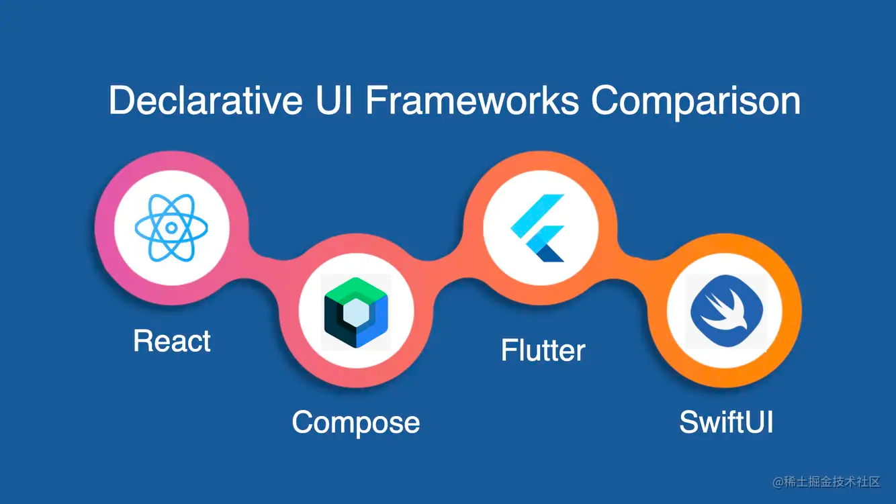

目前市场主流的跨平台UI框架渲染方案存在两大类，一类为以类RN为代表的原生渲染，另一类为Flutter/Compose为代表的基于Skia自渲染的自绘方案。

###  1.1原生渲染和自渲染方案对比：

| UI渲染方案 | 代表框架              | UI一致性 | UI内存    | UI生态  | 混合开发 | 冷启性能      |
|--------|-------------------|-------|---------|-------|------|-----------|
| 原生渲染   | ReactNative/Hippy | 一般    | 低(原生一致) | 原生生态  | 强    | 高(原生一致)   |
| 自绘渲染   | Flutter/Compose   | 强     | 高(60m+) | 自绘体系  | 一般   | 低(引擎启动耗时) |

**对比结论：原生渲染方案除了UI一致性不如自渲染方案，其它方面均有优势。**

附1：Flutter内存和耗时摘自：(https://flutter.cn/docs/development/add-to-app/performance）

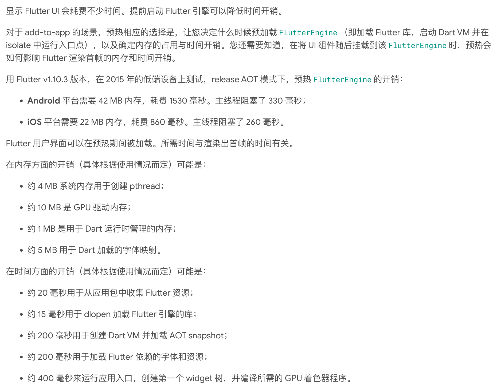

附2: 自渲染与原生UI混合开发存在问题：

1. **PlatformView与自绘无法同步渲染和布局**：以在Flutter 列表中嵌套原生播放器为例，由于Flutter渲染管道独立于原生渲染管道，所有在flutter列表滚动时，滚动偏移无法与嵌套的原生播放器同步布局滚动，造成该嵌入的原生播放器在Flutter列表中存在一种滚动慢半拍的非同步滚动体验（低端机尤其明显）。
2. **PlatformView与自绘交叉层级带来的多画布性能开销**：当一个PlatformView嵌套在自绘画布中，此时PlatformView上方还需要布局自绘控件时，由于自绘只单画布单层级方案，所以这种场景下，Flutter会多增加一个画布来解决层级问题，造成内存和性能的额外开销。

> 注：PlatformView为原生（宿主/平台）View。

## 二、Kuikly渲染方案

### 2.1 跨平台原生渲染方案-UI一致性差的原因分析：

类RN 框架跨平台渲染机制：

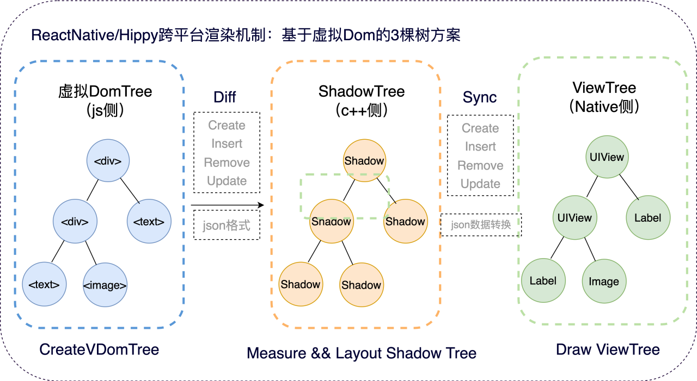

类RN的原生渲染方案在跨平台层，分别在JS侧维护了一颗虚拟Dom树，抽象了页面UI结构和数据，接着通过Diff驱动C++侧生成Shadow树，其负责测量和布局后，同步驱动到Native侧，对应生成Native View（每个UI组件封装了原生控件）树实现绘制渲染。该设计方案为经典基于Dom的3颗树方案，该方案虽然解决了UI跨平台的抽象设计和实现，但是因其跨了多个语言，分别为JS，C++，平台的OC或者Java，带来了原生渲染方案复杂度的提升和Diff效率低问题。

 

**Native侧渲染架构图：**

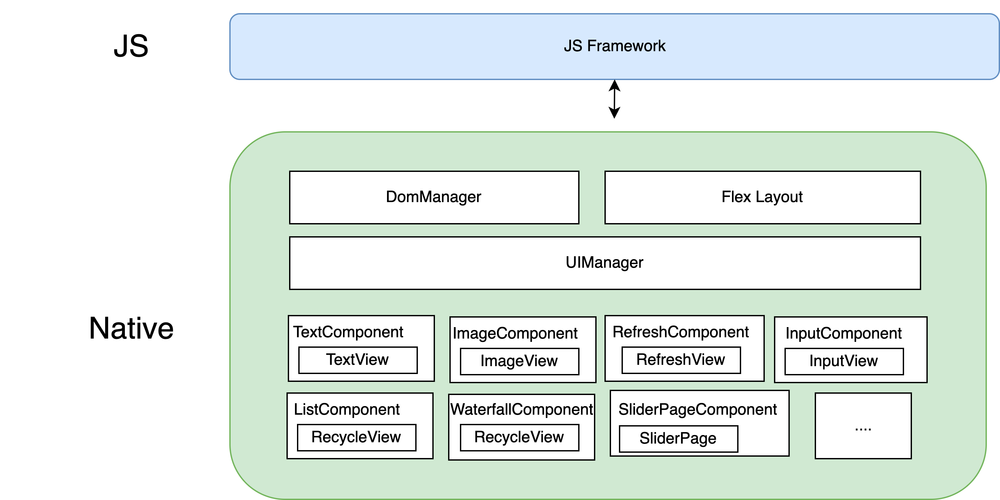

通过Native侧结构图可以看出，该设计将渲染的实现大部分放在了Native侧，涉及Dom树构建和排版布局，以及对应的跨平台UI组件实现（为了对齐CSS属性和能力，其封装了原生的控件），该UI组件存在大量UI逻辑，尤其**ListComponent的实现，为高阶组件中最复杂组件，涉及懒加载和Item复用，均为Native侧多平台各自实现，该设计为多平台UI容易不一致的最大原因**

### 2.2 如何设计高一致性的原生渲染方案：

思路推导：既然类RN存在大量Native逻辑和代码引起了UI表现不一致，那 如果Native侧0代码可实现最高的一致性，但是理论上无法实现，你还需要原生控件来渲染其UI，所以能否保留原生渲染的基础上，尽可能降低Native侧代码呢？或者说Native侧无逻辑化，来尽量避免逻辑不一致引起的UI表现不一致的问题呢？

 

分析Native渲染流程：

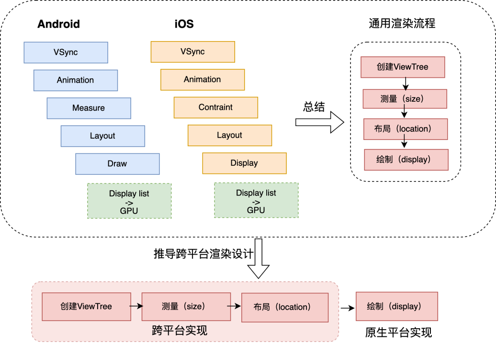

分析了Native的渲染流程，发现一个完整的渲染过程，都需要创建ViewTree，测量，布局，绘制，因此我们可以推导出一个跨平台的渲染设计，将前三步都放在平台无关的kotlin侧实现，将仅需要原生渲染的绘制保留在Native侧

由此我们设计了基于直调的2颗树渲染机制设计：

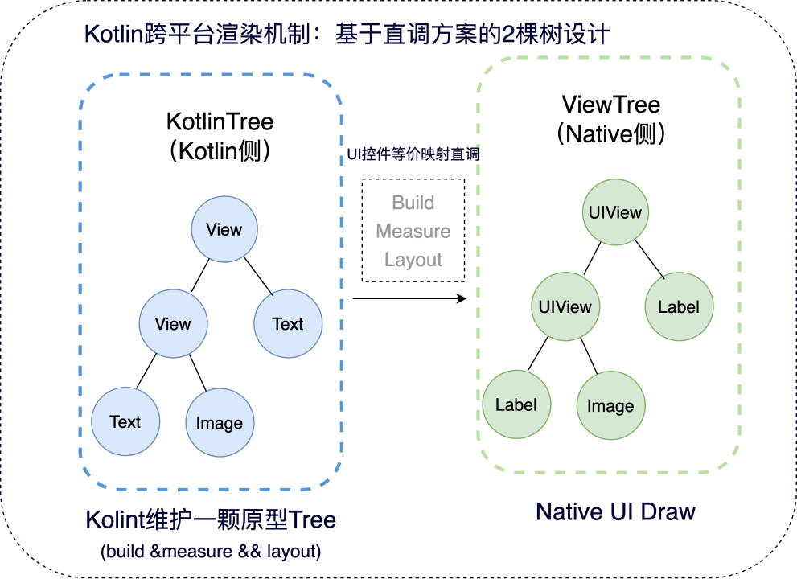

Kuikly跨平台渲染机制：**虚拟Dom方案优化为直调方案**

对比推导出Kotlin无跨语言通信损耗语言只要2棵树:
  1. KotlinView Api直调，避免JSON序列化/反序列化损耗
  2. kotlin只维护一棵树，更轻量和O(1)同步UI更新

但是问题来了，如果将绘制放在Native侧，**如何避免类RN的Naitve侧的渲染逻辑过重问题？**

思考: 借鉴KMM思想，MVVM设计，数据&逻辑与UI分离解耦，逻辑跨平台实现，UI各自平台实现

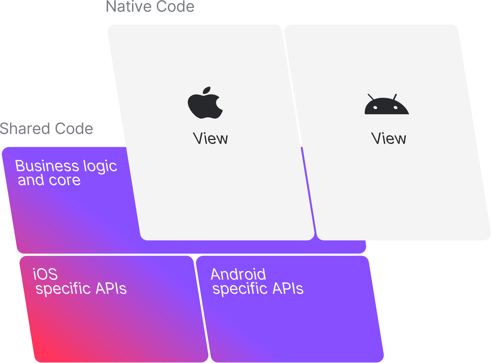

**将MVVM中的ViewModel角色提升到Kotlin跨平台来实现？**

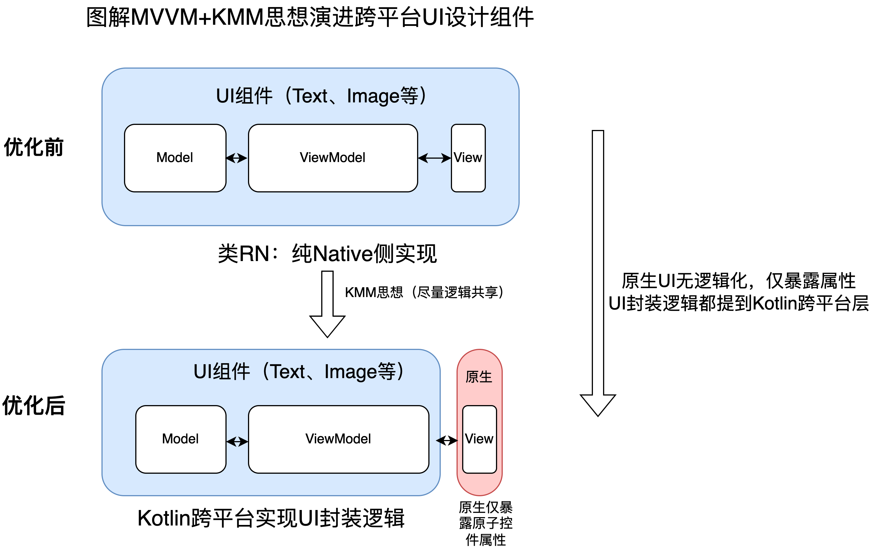

**根据UI组件实现按照MVVM设计模式将VM与原生原子View分离解耦，将VM提到跨平台层实现，Native侧只要暴露原生View属性提供给Kotlin侧调用**

### 2.3 如何设计通用的原生View映射接口？

核心思路：对UI对象的操作过程抽象为通用的增删改接口，提供映射调用

 

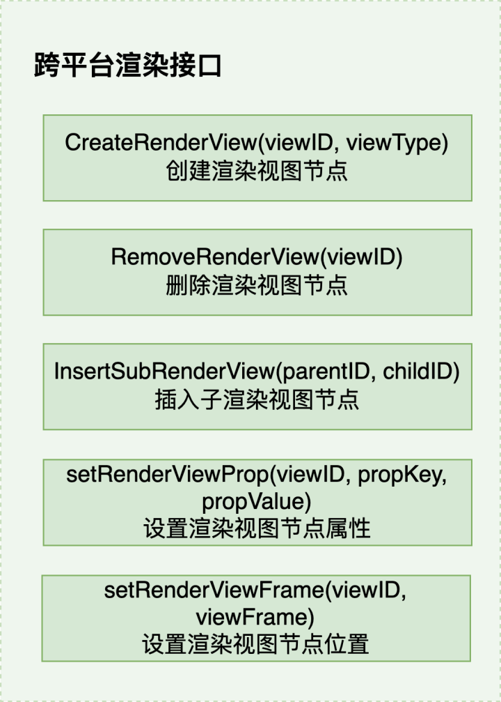

 

各个平台实现该渲染接口

 

我们用一个例子来看看这套接口是如何运作过程：

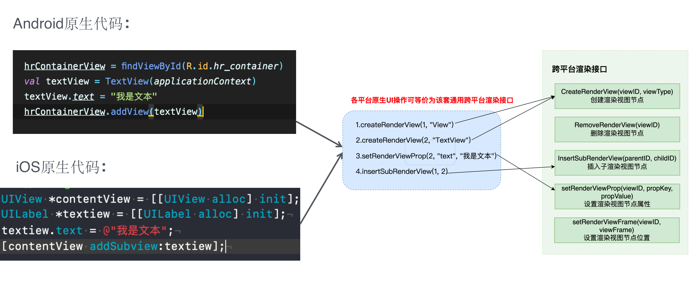

我们可以发现任何原生的UI代码都是可以通过这套增删改UI原子接口进行操作，Native侧实现该接口也无需UI逻辑，只要映射属性。

一个例子来看Kotlin侧UI代码如何驱动原生渲染过程：

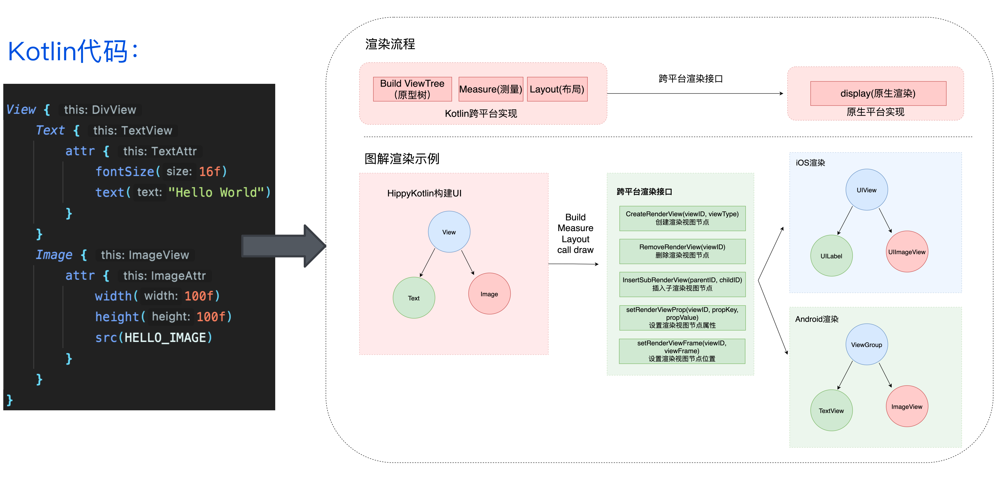

在Kotlin侧的UI原型树的生成过程，在自身经过Build，Mearsure，Layout后，然后Darw的过程就是Kotlin UI组件内部调用渲染API

### 2.4 Kuikly的最终设计架构：

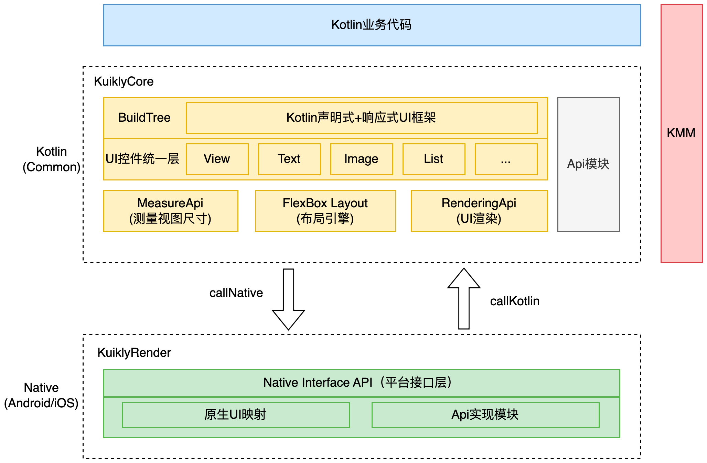

从架构上我们可以看出，Kuikly对Native的依赖极少，仅原生UI控件原子性暴露，UI组件的封装都提到了Kotlin跨平台层，所以Native UI已无逻辑化，最大化UI一致性

 

UI组件对齐Native实现和设计关系：

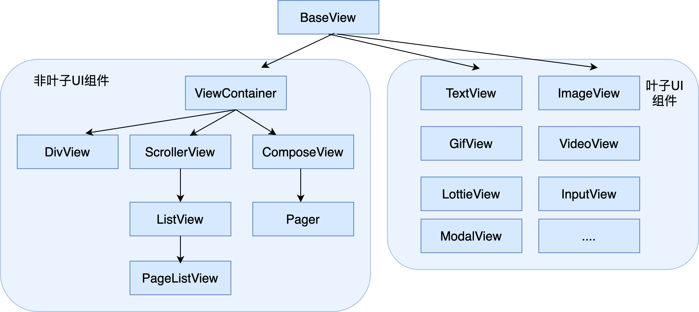

 

内置组件列表：

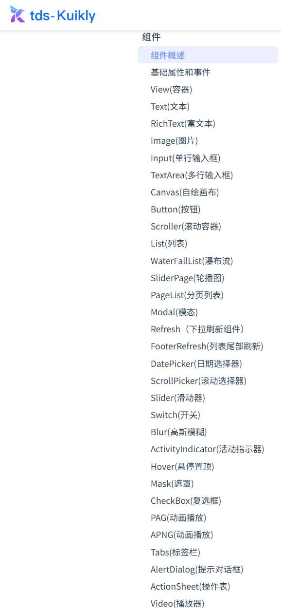

基于该设计，我们实现了60%UI组件的纯Kotlin组合封装实现，不需要Native提供原子控件，如：Button，List，PageList，WaterFallList（瀑布流），SliderPage（轮播图），Modal（模态），Refresh（下拉刷新），FooterRefresh（上拉刷新），DatePicker，ScollerPicker，Switch，Slider，CheckBox等的纯Kotlin实现。

可以看出，最容易出现不一致的高阶组件均为Kotlin实现，如List组件，Kuikly通过对齐Native的List内部实现原理再用Kotlin重写一次，从而实现真正的高一致性UI组件跨平台实现。

