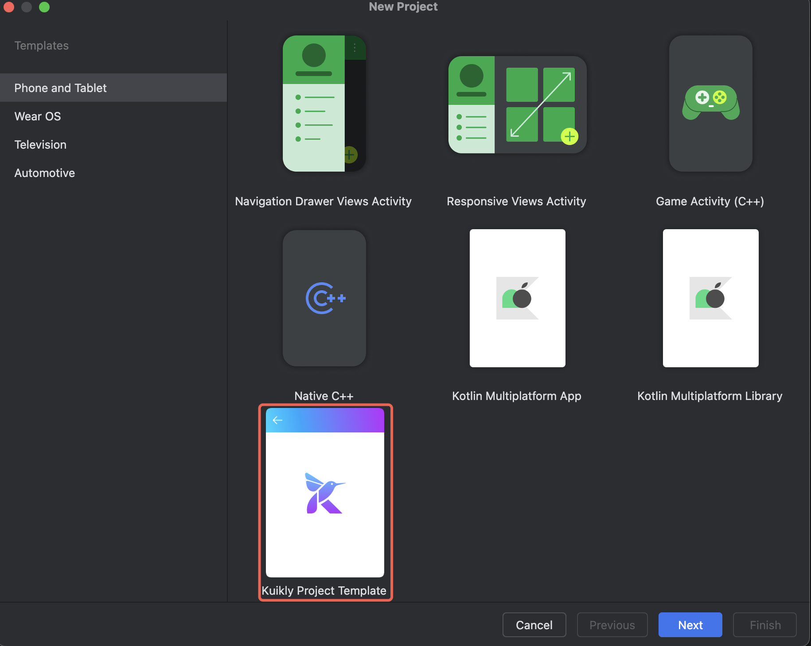
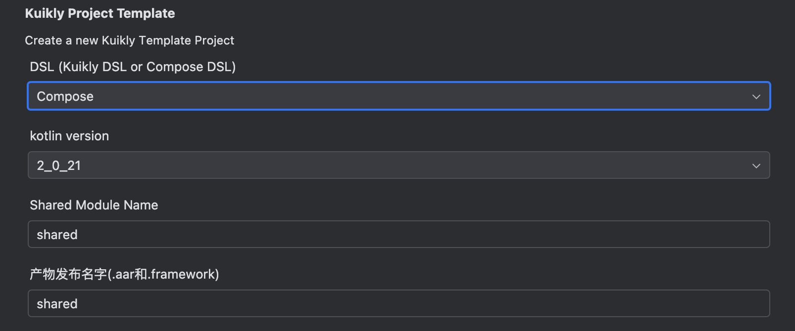

# 快速开始

Kuikly Compose 是基于Kuikly核心架构与通用渲染层之上，扩充对标准Compose DSL的支持，让开发者能够使用标准的Compose代码构建多端应用。本文档将指导您快速开始使用 Kuikly Compose。

## 前置条件

在开始之前，请确保您已完成 [环境搭建](../QuickStart/env-setup.html) 中介绍的所有环境配置

## 创建新项目

### 1. 获取模板工程

Kuikly 提供了预配置的模板工程，这是开始使用 Kuikly Compose 最简单的方式：
1. 创建工程，并选择Kuikly project template （需要完成环境搭建中的ide插件安装）

2. 填好基本信息后，下一步，注意DSL选择Compose，最后点击Finish完成工程创建

3. 执行gradle sync 同步项目（File > Sync Project with Gradle Files）
4. 运行项目，查看示例页面

### 2. 创建 Compose 页面

以下是一个简单的 Compose 页面示例：

```kotlin
@Page("helloWorld")
internal class HelloWorldPage : ComposeContainer() {
   override fun willInit() {
      super.willInit()
      setContent {
         // 编写Compose代码
      }
   }
}
```

### 3. 关键步骤说明

1. **创建页面类**
   - 继承 `ComposeContainer`
   - 使用 `@Page` 注解定义页面名称

2. **实现 Compose UI**
   - 在`setContent`中使用 Compose DSL 编写 UI 代码
   - 可以使用标准的 Compose 组件和修饰符

3. **运行和测试**
   - 使用 Android Studio 运行项目
   - 在模拟器或真机上查看效果
