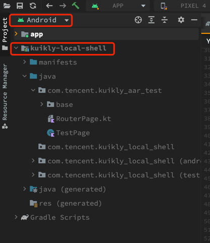

# Android平台开发方式


## aar本地开发模式

``Kuikly``的aar本地开发模式, 支持让宿主工程以源码的形式集成``Kuikly``业务工程，这种模式需要开发者按照以下步骤完成配置

1. 在宿主工程的**settings.gradle**文件中，添加以下代码，集成本地``Kuikly``业务工程

:::tabs

@tab groovy(settings.gradle)

```groovy
String readLocalProperty(String key) {
    File file = file(rootDir.getAbsolutePath() + '/local.properties')
    if(file.exists()){
        InputStream inputStream = file.newDataInputStream();
        Properties properties = new Properties()
        properties.load(inputStream)
        return properties.getProperty(key)
    } else {
        return ""
    }
}
def kuiklyBizDir = readLocalProperty("kuikly.biz.dir")
void includeKuikly(String moduleName) {
    include(":$moduleName")
    project(":$moduleName").projectDir = file("${gradle.ext.kuiklyBizDir}/$moduleName")
}
if (kuiklyBizDir != null && !kuiklyBizDir.isEmpty()) {
    gradle.ext.kuiklyBizDir = kuiklyBizDir
    gradle.beforeProject { project ->
        // 为了区分Kuikly业务工程和宿主工程的依赖，这里添加一个标识
        project.ext.kuiklyEmbed = true
    }
    // 从Kuikly业务工程中引入模块
    includeKuikly("shared")
}
```

@tab:active kotlin(settings.gradle.kts)

```kotlin
fun readLocalProperty(key: String): String {
    val file = file("${rootDir.absolutePath}/local.properties")
    if(file.exists()){
        val inputStream = file.inputStream()
        val properties = java.util.Properties()
        properties.load(inputStream)
        return properties.getProperty(key) ?: ""
    } else {
        return ""
    }
}
val kuiklyBizDir = readLocalProperty("kuikly.biz.dir")
if (kuiklyBizDir.isNotEmpty()) {
    fun includeKuikly(moduleName: String) {
        include(":$moduleName")
        project(":$moduleName").projectDir = file("$kuiklyBizDir/$moduleName")
    }
    gradle.beforeProject {
        // 为了区分Kuikly业务工程和宿主工程的依赖，这里添加一个标识
        extra["kuiklyEmbed"] = true
    }
    // 从Kuikly业务工程中引入模块
    includeKuikly("shared")
}
```

:::

2. 在集成了Kuikly业务产物的Module中，修改以下代码

:::tabs

@tab groovy(build.gradle)

```groovy
def kuiklyEmbed = hasProperty("kuiklyEmbed")
dependencies {
    ...
    if (!kuiklyEmbed) {
        // 远程依赖接入Kuikly产物
    } else {
        // 本地依赖接入Kuikly产物
        implementation(project(":shared"))
    }
}
```

@tab:active kotlin(build.gradle.kts)

```kotlin
val kuiklyEmbed = rootProject.extra.has("kuiklyEmbed")
dependencies {
    ...
    if (!kuiklyEmbed) {
        // 远程依赖接入Kuikly产物
    } else {
        // 本地依赖接入Kuikly产物
        implementation(project(":shared"))
    }
}
```

:::

3. sync工程，此时可能报错，按需把Kuikly业务工程根目录`build.gradle.kts`的部分配置拷贝到宿主工程的`build.gradle.kts`中，
再使用`kuiklyEmbed`标识按需屏蔽Kuikly业务工程的配置，例如：
```kotlin
    val kuiklyEmbed = rootProject.extra.has("kuiklyEmbed")
    if (!kuiklyEmbed) {
        cocoapods {
            ...
        }
    }
```

4. 将步骤1、2、3的配置分别push到宿主仓库和kuikly业务仓库，供其他人使用

:::tip 注意
以上步骤1, 2, 3, 4只需要一个人完成配置后, 然后提交到远程仓库即可
:::

<br/>

5. 当Kuikly业务开发者想要使用aar本地开发模式时，在宿主工程的**local.properties**文件中, 添加本地``Kuikly``业务工程路径即可开启aar本地开发模式

```gradle
kuikly.biz.dir=xxxx // xxxx替换成本地Kuikly业务工程的路径
```

6. sync工程, 然后就可以在Project窗口看到引入的Kuikly业务工程的模块，你可以在宿主工程中修改该模块的代码，开发需求

