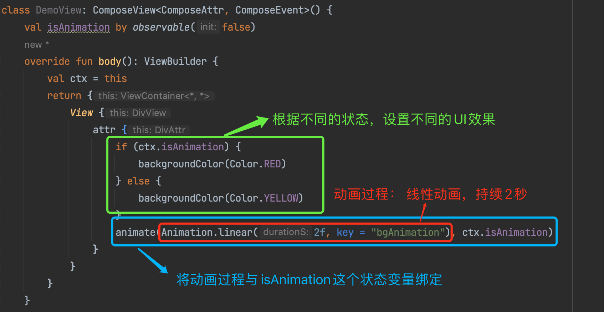
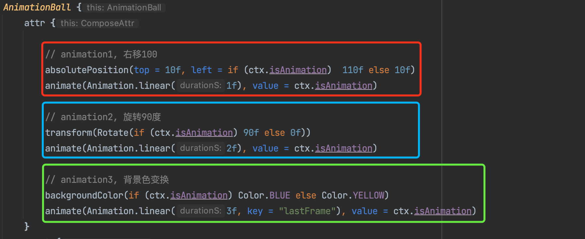
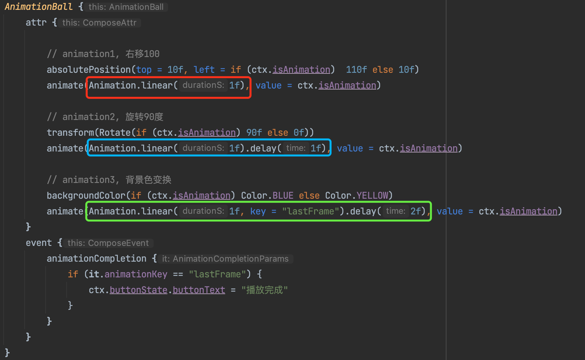

# 声明式动画

Kuikly的声明式动画通过状态变量来控制不同状态下视图的UI效果，并将由状态变量的改变引起的UI效果的变化用`Animation`描述的动画表现出来。在声明式动画的使用中有三大要素

* 对动画过程的定义，比如动画的时间曲线、时长、是否repeat、是否delay启动等等
  * 该动画过程，通过`Animation`对象来设置
* 将状态变量与动画过程进行关联的声明
  * `attr`里面提供了`animate(animation: Animation, value: Any)`函数来进行绑定
* 一个依赖于状态的可动画部件，通常不同状态有不同的表现
  * 这里就是正常view了，我们需要给view根据不同状态来设置不同的UI属性



## animate作用域

### animate父子作用域

**场景：**

* 期望一个动画对象，能够同时作用到多个view节点；
* 典型的情况是一个View的布局发生变化，会影响到多个其他view的布局同时变化；这种情况给每个受影响的view都去绑定`Animation`是不太可能的，我们只需要找到共同的父亲节点来绑定就行了。 

**定义：**

* **animate绑定的动画，会影响到当前节点，以及其子节点；如果子节点已经有animate绑定，则优先用子节点的**

```kotlin
attr {
  // OptionA: 绑定到ViewA 和ViewB的父节点上
  animate(Animation.linear(2f, key = "bgAnimation"), ctx.isAnimation)
  ViewA {
    attr {
      height(if (ctx.isAnimation) 300f else 100f)		// ViewA做高度变化
      
      // OptionB: 绑定到ViewA上
      animate(Animation.linear(2f, key = "bgAnimation"), ctx.isAnimation)
    }
  }
  ViewB { ... }				// ViewB 由于布局重新计算，Y轴的起点（originY）会变大，也就是下移
}
```

可以看到，设置animate绑定动画有两种选择：

**OptionA：** 绑定到父节点，则默认会影响到所有的子节点；也就是ViewA的height变化，和ViewB的OriginY的变化，都会受到父节点绑定的`Animation`对象影响，从而都有动画效果

**OptionB：** 只绑定到ViewA上，那么只有ViewA有动画效果，ViewB的originY变化是瞬时完成的。


### animate同级作用域

**场景：** 

* 对不同的UI属性，分别控制不同的动画过程。 
* 比如，小球下落动画，有可能希望X轴以`linear`的时间曲线来运动，Y轴以`easyOut`的时间曲线来运动；这个时候我们就可以分别给不同的属性，来分别的绑定`Animation`对象

**定义：** 

* **同级attr范围内，定义多个animate绑定时，animate的作用范围只影响到起前面部分的属性变化**



 比如这段动画，当`isAnimation`状态变为`true`的时候：

* 小球的右移动画受到红色`animate`绑定的影响，会以持续1秒
* 旋转90度的动画过程则受到蓝色`animate`绑定的影响，持续2秒
* 背景颜色的动画过程，会收到绿色`animate`的影响，持续3秒

这里每个`animate`的作用域，仅限于其上方的代码部分，到上一个`animate`或者大括号的起点为止

## 动画事件监听

动画的结束监听比较简单，直接监听`animationCompletion`事件即可

```kotlin
View {
    attr {
        if (ctx.isAnimation) {
                        backgroundColor(Color.RED)
        } else {
                        backgroundColor(Color.YELLOW)
        }
        animate(Animation.linear(2f, key = "bgAnimation"), ctx.isAnimation)
    }
    event {
        animationCompletion {
                        ...
        }
    }
}
```

## 声明式动画使用示例

### opacity动画

::: tabs

@tab:active 示例

```kotlin{4,17-22,31}
@Page("1")
internal class TestPage : BasePager() {

    private var opacityAnmationFlag by observable(false)

    override fun body(): ViewBuilder {
        val ctx = this
        return {
            attr {
                allCenter()
            }

            View {
                attr {
                    size(150f, 150f)
                    backgroundColor(Color.GREEN)
                    if (ctx.opacityAnmationFlag) {
                        opacity(0f)
                    } else {
                        opacity(1f)
                    }
                    animate(Animation.linear(0.5f), ctx.opacityAnmationFlag)
                }
            }
        }
    }

    override fun created() {
        super.created()
        setTimeout(500) {
            opacityAnmationFlag = true
        }
    }

}
```

@tab 效果

<div align="center">
<video src="https://vfiles.gtimg.cn/wuji_dashboard/xy/componenthub/tMt8jrhE.mp4" style="height:500px; " controls="controls" autoplay="autoplay" loop="loop"></video>
</div>

:::

在上述代码中, 我们先定义了一个定义了响应式变量``opacityAnmationFlag``来控制动画的起始和终止状态，接着我们在``View``组件的``attr{}``内，根据``opacityAnmationFlag``设置动画的起始和终止值，最后我们调用了``animate``方法来配置动画曲线以及动画时间。

<br/>

在运行时，一开始``opacityAnmationFlag``的值为false，所以组件一开始的``opacity``属性是1f, 接着，我们在``created``方法内，延时500ms后，将``opacityAnmationFlag``设置为true，会触发组件``attr{}``重新运行, 让View的opacity属性以动画的形式从起始值1f变化到0f。

<br/>

每个组件的``attr{}``内，都含有``animate``方法，此方法用于描述组件的动画时间，动画曲线类型。它接收两个参数

* animation: 类型为Animation, 用于表示动画的曲线以及动画持续时间，默认提供的动画曲线类型参见[动画基础](./animation-basic.md#动画类型)
* value: 需传入一个控制动画状态的响应式变量, 在上面的例子为``opacityAnmationFlag``, 该字段用于标识响应式字段关联的动画曲线和动画时间以及控制动画的状态

### backgroundColor动画

学习了``opacity``动画后, 接下来我们来看如何对组件的背景颜色进行动画

::: tabs

@tab:active 示例

```kotlin{4,16-21,30}
@Page("1")
internal class TestPage : BasePager() {

    private var backgroundColorAnmationFlag by observable(false)

    override fun body(): ViewBuilder {
        val ctx = this
        return {
            attr {
                allCenter()
            }

            View {
                attr {
                    size(150f, 150f)
                    if (ctx.backgroundColorAnmationFlag) {
                        backgroundColor(Color.GREEN)
                    } else {
                        backgroundColor(Color.RED)
                    }
                    animate(Animation.linear(0.5f), ctx.backgroundColorAnmationFlag)
                }
            }
        }
    }

    override fun created() {
        super.created()
        setTimeout(500) {
            backgroundColorAnmationFlag = true
        }
    }

}
```

@tab 效果

<div align="center">
<video src="https://vfiles.gtimg.cn/wuji_dashboard/xy/componenthub/32UqW3ZZ.mp4" style="height:500px; " controls="controls" autoplay="autoplay" loop="loop"></video>
</div>

:::

在上述代码中, 跟opacity动画类似, 使用了``backgroundColorAnmationFlag``控制背景颜色的起始和终止值，并绑定到一个时间为0.5s的线性动画描述。当``backgroundColorAnmationFlag``设置为true时, 背景颜色以动画的形式从红色变为绿色

### transform动画

transform动画支持对组件进行位移、缩放和旋转属性作动画。

#### transform位移动画

::: tabs

@tab:active 示例

```kotlin{4,16-18,20,29}
@Page("1")
internal class TestPage : BasePager() {

    private var translateAnimationFlag by observable(false)

    override fun body(): ViewBuilder {
        val ctx = this
        return {
            attr {
                allCenter()
            }

            View {
                attr {
                    size(150f, 150f)
                    if (ctx.translateAnimationFlag) {
                        transform(Translate(0.5f, 0.5f))
                    }
                    backgroundColor(Color.GREEN)
                    animate(Animation.easeIn(0.5f), ctx.translateAnimationFlag)
                }
            }
        }
    }

    override fun created() {
        super.created()
        setTimeout(500) {
            translateAnimationFlag = true
        }
    }

}
```

@tab 效果

<div align="center">
<video src="https://vfiles.gtimg.cn/wuji_dashboard/xy/componenthub/8zJ2coHo.mp4" style="height:500px; " controls="controls" autoplay="autoplay" loop="loop"></video>
</div>

:::

在上述代码中，我们使用``translateAnimationFlag``来控制组件``transform(Translate)``的起始(默认值)和终止值, 然后将**Animation.easeIn(0.5f)绑定到``translateAnimationFlag``变量**, 最后在创建页面，延迟500ms，将``translateAnimationFlag``设置为true, 从而触发``translate``动画

#### scale缩放动画

::: tabs


@tab:active 示例

```kotlin{4,19-24,32}
@Page("2")
internal class TestPage : BasePager() {

    private var scaleAnimationFlag by observable(false)

    override fun body(): ViewBuilder {
        val ctx = this

        return {
            attr {
                allCenter()
            }

            View {
                attr {
                    size(100f, 100f)
                    backgroundColor(Color.GREEN)

                    if (ctx.scaleAnimationFlag) {
                        transform(Scale(0.5f, 0.5f))
                    } else {
                        transform(Scale(1f, 1f))
                    }
                    animate(Animation.linear(0.5f), ctx.scaleAnimationFlag)
                }
            }
        }
    }

    override fun viewDidLayout() {
        super.viewDidLayout()
        scaleAnimationFlag = true // 启动动画
    }
}
```

@tab 效果

<div align="center">
<video src="https://vfiles.gtimg.cn/wuji_dashboard/xy/componenthub/qpX0h1sV.mp4" style="height:500px; " controls="controls" autoplay="autoplay" loop="loop"></video>
</div>

:::

在上述代码中, 我们使用``transform(Scale(x, y)``方法来设置组件的缩放属性, ``Scale(x, y)``需要传入相对于组件自身大小的百分比, 取值为[0~max]。比如缩放为原来大小的0.5倍时，需传入``Scale(0.5f, 0.5f)``。
接着我们定义了响应式变量``scaleAnimationFlag``来控制**scale动画**的动画起始和终止值, 并绑定到一个0.5s的线性动画曲线上, 最后在页面回调``viewDidLayout``时, 将**scaleAnimationFlag**设置为true来启动动画


#### rotate旋转动画

::: tabs

@tab:active 示例

```kotlin{4,19-24,32}
@Page("2")
internal class TestPage : BasePager() {

    private var rotateAnimationFlag by observable(false)

    override fun body(): ViewBuilder {
        val ctx = this

        return {
            attr {
                allCenter()
            }

            View {
                attr {
                    size(100f, 100f)
                    backgroundColor(Color.GREEN)

                    if (ctx.rotateAnimationFlag) {
                        transform(Rotate(20f))
                    } else {
                        transform(Rotate(0f))
                    }
                    animate(Animation.linear(0.5f), ctx.rotateAnimationFlag)
                }
            }
        }
    }

    override fun viewDidLayout() {
        super.viewDidLayout()
        rotateAnimationFlag = true // 启动动画
    }
}
```

@tab 效果

<div align="center">
<video src="https://vfiles.gtimg.cn/wuji_dashboard/xy/componenthub/GpcSswQn.mp4" style="height:500px; " controls="controls" autoplay="autoplay" loop="loop"></video>
</div>

:::

在上述代码中, 我们调用``transform(Rotate(angle))``来设置组件的旋转属性, ``Rotate(angle)``需传入旋转的角度, 负值为逆时针旋转，正值为顺时针旋转，取值范围为[-360, 360]之间。
接着我们定义了响应式变量``rotateAnimationFlag``来控制旋转动画的初始和结束值, 并绑定到一个0.5f的线性动画曲线上, 最后在页面回调``viewDidLayout``时, 将**rotateAnimationFlag**设置为true来启动动画。

:::tip 注意
transform动画默认是以组件的中心点作为轴心来做动画, 你可以在transform方法传入Anchor来控制transform的中心点
:::

### frame动画

``frame动画``是指对组件的位置(x, y)和大小(width, height)进行动画, 例如:

::: tabs

@tab:active 示例

```kotlin{4,16,18,26}
@Page("2")
internal class TestPage : BasePager() {

    private var frameHeight by observable(100f)

    override fun body(): ViewBuilder {
        val ctx = this

        return {
            attr {
                allCenter()
            }

            View {
                attr {
                    size(100f, ctx.frameHeight)
                    backgroundColor(Color.GREEN)
                    animate(Animation.linear(0.5f), ctx.frameHeight)
                }
            }
        }
    }

    override fun viewDidLayout() {
        super.viewDidLayout()
        frameHeight = 200f // 启动动画
    }
}
```

@tab 效果

<div align="center">
<video src="https://vfiles.gtimg.cn/wuji_dashboard/xy/componenthub/4bF2NNUA.mp4" style="height:500px; " controls="controls" autoplay="autoplay" loop="loop"></video>
</div>

:::

上面的代码是使用``frame``动画对组件的高度进行动画, 首先定义了响应式变量``frameHeight = 100f``, 接着我们将组件的高度设置为``frameHeight``, 并绑定到一个0.5s的线性动画曲线，最后在``viewDidLayout``回调中，将``frameHeight``设置为200f，此时你可以看到组件会做一个高度从100f变换到200f的动画。

## 串行动画

### 方案一：通过delay来做到模拟串行



可以参考这里，通过给3种不同的UI属性变化来分别绑定`Animation`，设置了不同的delay启动时间，来模拟串行启动的过程。

>  **注意点：** 如果是针对同一个属性变量，来做串行动画，则不能用该方案，需要使用方案二。这是因为同一个属性，一次只能够设置一个动画对象。

### 方案二：通过监听每段动画的结束事件，来启动下一段动画

::: tabs

@tab:active 示例

```kotlin{4,5,17-22,24-29,33-37,45}
@Page("2")
internal class TestPage : BasePager() {

    private var transformAnimationFlag by observable(false)
    private var backgroundColorAnimationFlag by observable(false)

    override fun body(): ViewBuilder {
        val ctx = this
        return {
            attr {
                allCenter()
            }

            View {
                attr {
                    size(100f, 100f)
                    if (ctx.backgroundColorAnimationFlag) {
                        backgroundColor(Color.GREEN)
                    } else {
                        backgroundColor(Color.RED)
                    }
                    animate(Animation.easeIn(0.5f), ctx.backgroundColorAnimationFlag) // 背景颜色动画

                    if (ctx.transformAnimationFlag) {
                        transform(Translate(0f, 0.5f))
                    } else {
                        transform(Translate(0f, 0f))
                    }
                    animate(Animation.easeInOut(0.5f), ctx.transformAnimationFlag) // transform动画
                }

                event {
                    animationCompletion {
                        if (it.attr == Attr.StyleConst.TRANSFORM) {
                            ctx.backgroundColorAnimationFlag = true
                        }
                    }
                }
            }
        }
    }

    override fun viewDidLayout() {
        super.viewDidLayout()
        transformAnimationFlag = true
    }
}
```

@tab 效果

<div align="center">
<video src="https://vfiles.gtimg.cn/wuji_dashboard/xy/componenthub/FgTh0WsL.mp4" style="height:500px; " controls="controls" autoplay="autoplay" loop="loop"></video>
</div>


:::

在上述例子中, 会先进行``transform``动画后, 再进行背景颜色改变动画。
我们首先定义了两个响应式变量来控制两个动画, 接着在``viewDidLayout``回调中, 我们先将``transformAnimationFlag``设置为true来启动``transform``动画，
然后监听``animationCompletion``动画结束事件，在识别到``transform``动画结束后，我们将``backgroundColorAnimationFlag``设置为true来启动背景颜色动画，从而实现串行的动画

> ps: 这里使用了2个不同的状态变量来控制，实际上也可以通过1个变量的2种不同的状态来控制


## 并行动画

并行动画比较简单，可以直接参考两段代码：


**场景1：** 多个并行动画的动画过程一样，直接绑定同一个`Animation`来控制

```kotlin
AnimationBall {
    attr {
        if (ctx.isAnimation) {
            // animation1, 右移100
            absolutePosition(top = 10f, left = 110f)
            // animation2, 旋转90度
            transform(Rotate(90f))
            // animation3, 背景色变换
            backgroundColor(Color.BLUE)
        } else {
            // animation1, 右移100
            absolutePosition(top = 10f, left =  10f)
            // animation2, 旋转90度
            transform(Rotate(0f))
            // animation3, 背景色变换
            backgroundColor(Color.YELLOW)
        }
        animate(Animation.linear(2f), value = ctx.isAnimation)
    }

```

这里一个动画，即可控制3个不同的属性变化


**场景2：** 多个并行动画的动画过程不一样（比如持续时间不一样），可以分别绑定不同的`Animation`来并行

```kotlin
AnimationBall {
    attr {
        // animation1, 右移100
        absolutePosition(top = 10f, left = if (ctx.isAnimation)  110f else 10f)
        animate(Animation.linear(1f), value = ctx.isAnimation)

        // animation2, 旋转90度
        transform(Rotate(if (ctx.isAnimation) 90f else 0f))
        animate(Animation.linear(2f), value = ctx.isAnimation)

        // animation3, 背景色变换
        backgroundColor(if (ctx.isAnimation) Color.BLUE else Color.YELLOW)
        animate(Animation.linear(3f, key = "lastFrame"), value = ctx.isAnimation)
    }
}
```


## 动画执行过程中执行其他动画

有时候，你可能想在动画执行的过程中启动另外一个动画，那这种需求在``Kuikly``上如何用声明式动画实现呢？请看下面例子

::: tabs

@tab:active 示例

```kotlin{4,5,17-22,24-29,38-41}
@Page("2")
internal class TestPage : BasePager() {

    private var transformAnimationFlag by observable(false)
    private var backgroundColorAnimationFlag by observable(false)

    override fun body(): ViewBuilder {
        val ctx = this
        return {
            attr {
                allCenter()
            }

            View {
                attr {
                    size(100f, 100f)
                    if (ctx.backgroundColorAnimationFlag) {
                        backgroundColor(Color.GREEN)
                    } else {
                        backgroundColor(Color.RED)
                    }
                    animate(Animation.easeIn(0.5f), ctx.backgroundColorAnimationFlag) // 背景颜色动画

                    if (ctx.transformAnimationFlag) {
                        transform(Translate(0f, 0.5f))
                    } else {
                        transform(Translate(0f, 0f))
                    }
                    animate(Animation.easeInOut(0.5f), ctx.transformAnimationFlag) // transform动画
                }

            }
        }
    }

    override fun viewDidLayout() {
        super.viewDidLayout()
        transformAnimationFlag = true
        setTimeout(300) {
            backgroundColorAnimationFlag = true
        }
    }
}
```

@tab 效果

<div align="center">
<video src="https://vfiles.gtimg.cn/wuji_dashboard/xy/componenthub/Y9sOe8XP.mp4" style="height:500px; " controls="controls" autoplay="autoplay" loop="loop"></video>
</div>


:::

在上述代码中，我们先执行了``transform``动画, 然后在动画执行到300ms时，启动背景颜色动画。

