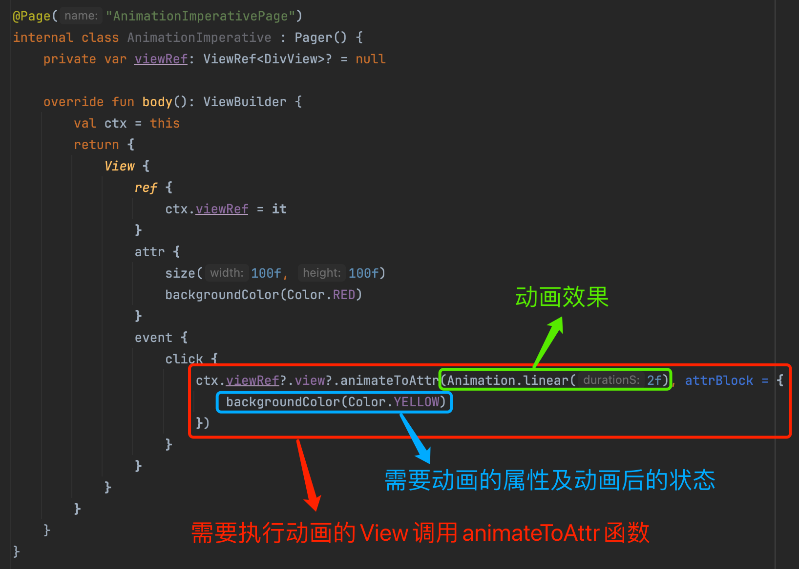
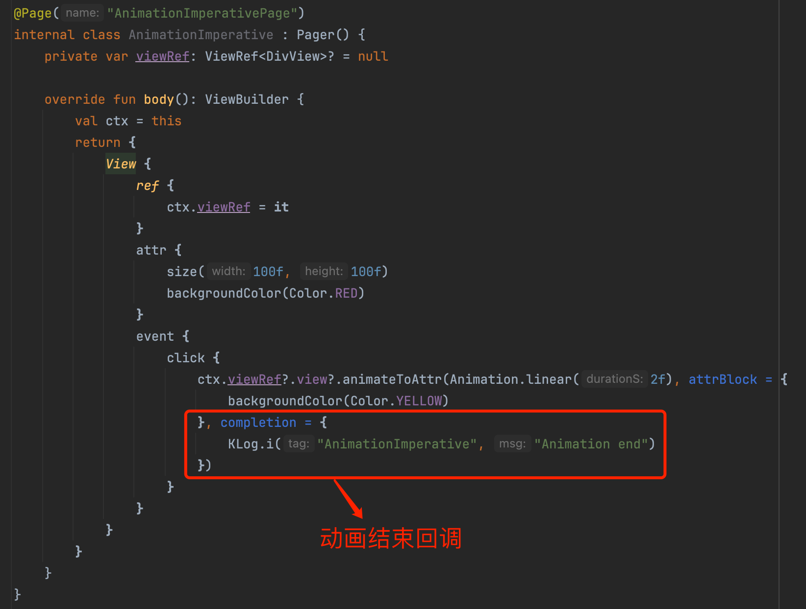
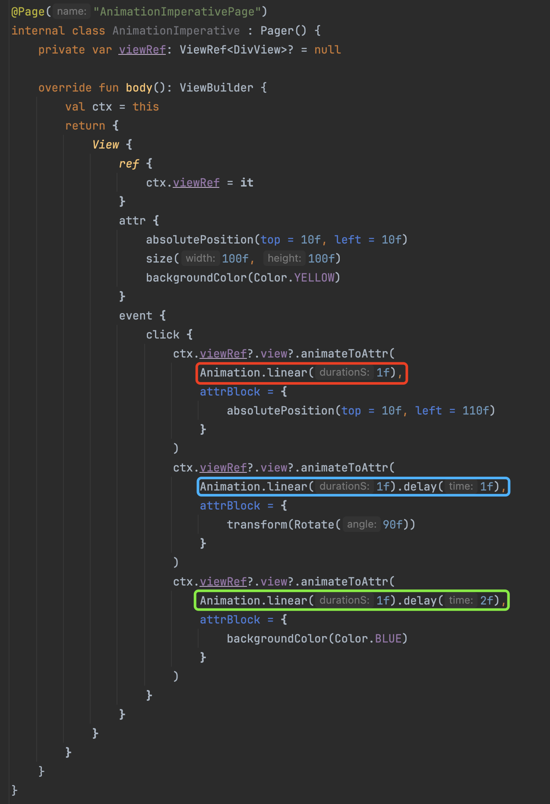

# 命令式动画

Kuikly的命令式动画用属性闭包的方式描述视图变化后的效果，并将属性变化过程用`Animation`设置的动画表现出来。命令式动画相较于声明式动画更加简单直接，如果是要实现复杂动画，推荐使用命令式动画。在命令式动画的使用中有三大要素

* 执行动画的视图
  * 这里就是正常view了，通过调用`animateToAttr`函数来执行动画
* 动画效果
  * 动画的时间曲线、时长、是否repeat、是否delay启动等，通过`animateToAttr`函数中的`Animation`对象参数来设置，具体类型参见[动画基础](./animation-basic.md#动画类型)
* 需要动画的属性及其动画后的状态
  * 通过`animateToAttr`函数中的属性闭包`attrBlock`参数来设置





## 动画事件监听

命令式动画函数`animateToAttr`提供`completion: ((Boolean)->Unit)?`回调参数，会在动画结束后调用并传入一个`Boolean`参数，如果为`true`表示动画完成，为`false`表示动画取消。



## 命令式动画使用示例

与[声明式动画示例](./animation-declarative.md#声明式动画使用示例)对应，在这里改写为命令式动画写法。

### opacity动画

::: tabs

@tab:active 示例

```kotlin{28-30}
@Page("1")
internal class TestPage : BasePager() {

    private var viewRef: ViewRef<DivView>? = null

    override fun body(): ViewBuilder {
        val ctx = this
        return {
            attr {
                allCenter()
            }
            View {
                ref {
                    ctx.viewRef = it
                }
                attr {
                    size(150f, 150f)
                    backgroundColor(Color.GREEN)
                    opacity(1f)
                }
            }
        }
    }

    override fun created() {
        super.created()
        setTimeout(500) {
            viewRef?.view?.animateToAttr(Animation.linear(0.5f), attrBlock = {
                opacity(0f)
            })
        }
    }
}
```

@tab 效果

<div align="center">
<video src="https://vfiles.gtimg.cn/wuji_dashboard/xy/componenthub/tMt8jrhE.mp4" style="height:500px; " controls="controls" autoplay="autoplay" loop="loop"></video>
</div>

:::

在上述代码中, View组件一开始的``opacity``属性是1f, 接着，我们在``created``方法内，延时500ms后，调用View组件的`animateToAttr`方法，将opacity属性以动画的形式从起始值1f变化到0f。


### backgroundColor动画

学习了``opacity``动画后, 接下来我们来看如何对组件的背景颜色进行动画

::: tabs

@tab:active 示例

```kotlin{28-30}
@Page("1")
internal class TestPage : BasePager() {

    private var viewRef: ViewRef<DivView>? = null

    override fun body(): ViewBuilder {
        val ctx = this
        return {
            attr {
                allCenter()
            }
            View {
                ref {
                    ctx.viewRef = it
                }
                attr {
                    size(150f, 150f)
                    backgroundColor(Color.GREEN)
                    opacity(1f)
                }
            }
        }
    }

    override fun created() {
        super.created()
        setTimeout(500) {
            viewRef?.view?.animateToAttr(Animation.linear(0.5f), attrBlock = {
                backgroundColor(Color.RED)
            })
        }
    }
}
```

@tab 效果

<div align="center">
<video src="https://vfiles.gtimg.cn/wuji_dashboard/xy/componenthub/32UqW3ZZ.mp4" style="height:500px; " controls="controls" autoplay="autoplay" loop="loop"></video>
</div>

:::

在上述代码中, 跟opacity动画类似, 在延时500ms后背景颜色以动画的形式从红色变为绿色。

### transform动画

transform动画支持对组件进行位移、缩放和旋转属性作动画。

#### transform位移动画

::: tabs

@tab:active 示例

```kotlin{27-29}
@Page("1")
internal class TestPage : BasePager() {

    private var viewRef: ViewRef<DivView>? = null

    override fun body(): ViewBuilder {
        val ctx = this
        return {
            attr {
                allCenter()
            }
            View {
                ref {
                    ctx.viewRef = it
                }
                attr {
                    size(150f, 150f)
                    backgroundColor(Color.GREEN)
                }
            }
        }
    }

    override fun created() {
        super.created()
        setTimeout(500) {
            viewRef?.view?.animateToAttr(Animation.easeIn(0.5f), attrBlock = {
                transform(Translate(0.5f, 0.5f))
            })
        }
    }
}
```

@tab 效果

<div align="center">
<video src="https://vfiles.gtimg.cn/wuji_dashboard/xy/componenthub/8zJ2coHo.mp4" style="height:500px; " controls="controls" autoplay="autoplay" loop="loop"></video>
</div>

:::

在上述代码中，我们在延迟500ms后使用`Animation.easeIn(0.5f)`效果实现组件`translate`动画。

#### scale缩放动画

::: tabs


@tab:active 示例

```kotlin{27-29}
@Page("1")
internal class TestPage : BasePager() {

    private var viewRef: ViewRef<DivView>? = null

    override fun body(): ViewBuilder {
        val ctx = this
        return {
            attr {
                allCenter()
            }
            View {
                ref {
                    ctx.viewRef = it
                }
                attr {
                    size(150f, 150f)
                    backgroundColor(Color.GREEN)
                }
            }
        }
    }

    override fun created() {
        super.created()
        setTimeout(500) {
            viewRef?.view?.animateToAttr(Animation.linear(0.5f), attrBlock = {
                transform(Scale(0.5f, 0.5f))
            })
        }
    }
}
```

@tab 效果

<div align="center">
<video src="https://vfiles.gtimg.cn/wuji_dashboard/xy/componenthub/qpX0h1sV.mp4" style="height:500px; " controls="controls" autoplay="autoplay" loop="loop"></video>
</div>

:::

在上述代码中, 我们使用``transform(Scale(x, y)``方法来设置组件的缩放属性, ``Scale(x, y)``需要传入相对于组件自身大小的百分比, 取值为[0~max]。比如缩放为原来大小的0.5倍时，需传入``Scale(0.5f, 0.5f)``。
接着我们使用一个0.5s的线性动画曲线来对缩放设置动画。


#### rotate旋转动画

::: tabs

@tab:active 示例

```kotlin{27-29}
@Page("1")
internal class TestPage : BasePager() {

    private var viewRef: ViewRef<DivView>? = null

    override fun body(): ViewBuilder {
        val ctx = this
        return {
            attr {
                allCenter()
            }
            View {
                ref {
                    ctx.viewRef = it
                }
                attr {
                    size(150f, 150f)
                    backgroundColor(Color.GREEN)
                }
            }
        }
    }

    override fun created() {
        super.created()
        setTimeout(500) {
            viewRef?.view?.animateToAttr(Animation.linear(0.5f), attrBlock = {
                transform(Rotate(20f))
            })
        }
    }
}
```

@tab 效果

<div align="center">
<video src="https://vfiles.gtimg.cn/wuji_dashboard/xy/componenthub/GpcSswQn.mp4" style="height:500px; " controls="controls" autoplay="autoplay" loop="loop"></video>
</div>

:::

在上述代码中, 我们调用``transform(Rotate(angle))``来设置组件的旋转属性, ``Rotate(angle)``需传入旋转的角度, 负值为逆时针旋转，正值为顺时针旋转，取值范围为[-360, 360]之间。
接着我们使用一个0.5s的线性动画曲线来对旋转设置动画。。

:::tip 注意
transform动画默认是以组件的中心点作为轴心来做动画, 你可以在transform方法传入Anchor来控制transform的中心点
:::

### frame动画

``frame动画``是指对组件的位置(x, y)和大小(width, height)进行动画, 例如:

::: tabs

@tab:active 示例

```kotlin{27-29}
@Page("1")
internal class TestPage : BasePager() {

    private var viewRef: ViewRef<DivView>? = null

    override fun body(): ViewBuilder {
        val ctx = this
        return {
            attr {
                allCenter()
            }
            View {
                ref {
                    ctx.viewRef = it
                }
                attr {
                    size(100f, 100f)
                    backgroundColor(Color.GREEN)
                }
            }
        }
    }

    override fun created() {
        super.created()
        setTimeout(500) {
            viewRef?.view?.animateToAttr(Animation.linear(0.5f), attrBlock = {
                size(100f, 200f)
            })
        }
    }
}
```

@tab 效果

<div align="center">
<video src="https://vfiles.gtimg.cn/wuji_dashboard/xy/componenthub/4bF2NNUA.mp4" style="height:500px; " controls="controls" autoplay="autoplay" loop="loop"></video>
</div>

:::

上面的代码是使用``frame``动画对组件的高度进行动画, 我们使用一个0.5s的线性动画曲线，将组件高度从100f变换到200f。

## 串行动画

### 方案一：通过delay来做到模拟串行



参考上图，通过给3种不同的UI属性变化来分别绑定`Animation`，设置了不同的delay启动时间，来模拟串行启动的过程（先右移100f，再旋转90度，再变换背景颜色）。

>  **注意点：** 如果是针对同一个属性变量，来做串行动画，则不能用该方案，需要使用方案二。这是因为同一个属性，一次只能够设置一个动画对象。

### 方案二：在一个动画的结束回调中启动下一段动画

::: tabs

@tab:active 示例

```kotlin{27-33}
@Page("2")
internal class TestPage : BasePager() {

    private var viewRef: ViewRef<DivView>? = null

    override fun body(): ViewBuilder {
        val ctx = this
        return {
            attr {
                allCenter()
            }
            View {
                ref {
                    ctx.viewRef = it
                }
                attr {
                    size(100f, 100f)
                    backgroundColor(Color.RED)
                }
            }
        }
    }

    override fun viewDidLayout() {
        super.viewDidLayout()
        // 先向下位移，位移结束后改变背景颜色
        viewRef?.view?.animateToAttr(Animation.easeInOut(0.5f), attrBlock = {
            transform(Translate(0f, 0.5f))
        }, completion = {
            viewRef?.view?.animateToAttr(Animation.easeIn(0.5f), attrBlock = {
                backgroundColor(Color.GREEN)
            })
        })
    }
}
```

@tab 效果

<div align="center">
<video src="https://vfiles.gtimg.cn/wuji_dashboard/xy/componenthub/FgTh0WsL.mp4" style="height:500px; " controls="controls" autoplay="autoplay" loop="loop"></video>
</div>


:::

在上述例子中, 会先进行``transform``动画后, 在``transform``动画的结束回调中开启`backgroundColor`背景颜色动画，从而实现串行的动画。


## 并行动画

并行动画比较简单，可以直接参考两段代码：


**场景1：** 多个并行动画的动画过程一样，直接将需要动画的属性放在同一个attrBlock中：

```kotlin{19-26}
@Page("AnimationImperativePage")
internal class AnimationImperative : Pager() {
    private var viewRef: ViewRef<DivView>? = null

    override fun body(): ViewBuilder {
        val ctx = this
        return {
            View {
                ref {
                    ctx.viewRef = it
                }
                attr {
                    absolutePosition(top = 10f, left = 10f)
                    size(100f, 100f)
                    backgroundColor(Color.YELLOW)
                }
                event {
                    click {
                        ctx.viewRef?.view?.animateToAttr(Animation.linear(1f), attrBlock = {
                                // animation1, 右移100
                                absolutePosition(top = 10f, left = 110f)
                                // animation2, 旋转90度
                                transform(Rotate(90f))
                                // animation3, 背景色变换
                                backgroundColor(Color.BLUE)
                        })
                    }
                }
            }
        }
    }
}
```

这里一个动画，即可控制3个不同的属性变化

<br>

**场景2：** 多个并行动画的动画过程不一样（比如持续时间不一样），与[通过delay来做到模拟串行](#方案一通过delay来做到模拟串行)类似，使用多个`animateToAttr`函数启动动画，且不设置`delay`。


## 动画执行过程中执行其他动画

有时候，你可能想在动画执行的过程中启动另外一个动画，那这种需求在``Kuikly``上如何实现呢？请看下面例子

::: tabs

@tab:active 示例

```kotlin{26-33}
@Page("2")
internal class TestPage : BasePager() {

    private var viewRef: ViewRef<DivView>? = null

    override fun body(): ViewBuilder {
        val ctx = this
        return {
            attr {
                allCenter()
            }
            View {
                ref {
                    ctx.viewRef = it
                }
                attr {
                    size(100f, 100f)
                    backgroundColor(Color.RED)
                }
            }
        }
    }

    override fun viewDidLayout() {
        super.viewDidLayout()
        viewRef?.view?.animateToAttr(Animation.easeInOut(0.5f), attrBlock = {
            transform(Translate(0f, 0.5f))
        })
        setTimeout(300) {
            viewRef?.view?.animateToAttr(Animation.easeIn(0.5f), attrBlock = {
                backgroundColor(Color.GREEN)
            })
        }
    }
}
```

@tab 效果

<div align="center">
<video src="https://vfiles.gtimg.cn/wuji_dashboard/xy/componenthub/Y9sOe8XP.mp4" style="height:500px; " controls="controls" autoplay="autoplay" loop="loop"></video>
</div>


:::

在上述代码中，我们先执行了``transform``动画, 然后在动画执行到300ms时，启动背景颜色动画。

