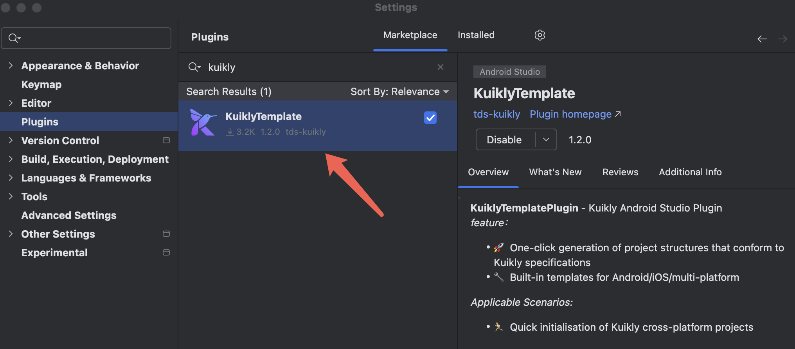
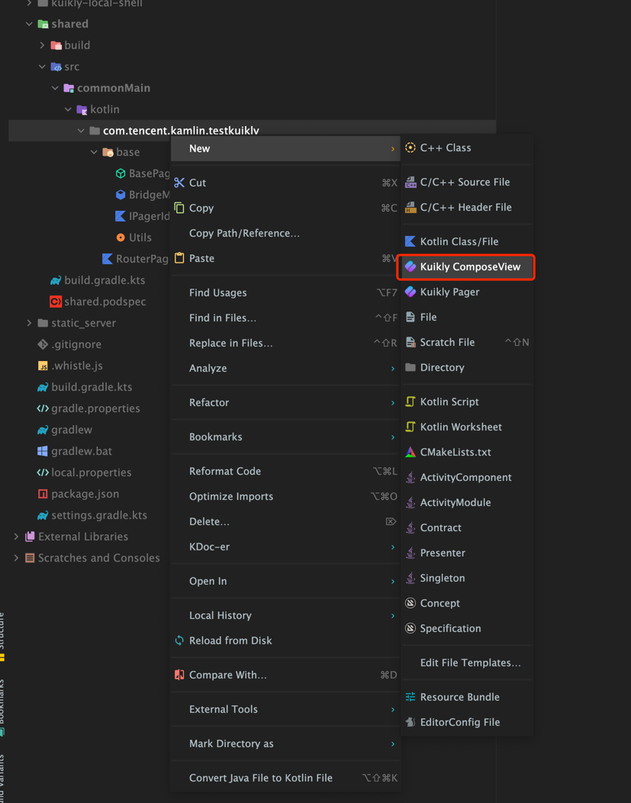

# Kuikly Android Studio插件

``Kuikly``提供了一个Android Studio插件, 来一键完成Kuikly的一些工程配置和代码生成等任务, 免去业务接入的成本和提高开发效率。

## 安装

1. Android Studio -> Setting->Preferences -> Plugins->Marketplace -> Manage Plugin Repositories

2. 在Marketplace页签，输入Kuikly回车搜索，点击Install，然后Restart IDE即可

   

      
   

目前``Kuikly`` Android Studio插件提供了以下功能

1. 新建``Kuikly``业务工程: 一键生成``Kuikly``业务工程，自动集成``Kuikly``依赖，产物发布流水线等
2. 新建``Kuikly``的ComposeView类: 自动帮业务开发者生成组合组件的模板代码
3. 新建``Kuikly``的Pager类: 自动帮业务开发者生成Pager的模板代码

## 新建Kuikly业务工程

1. 使用Android Studio新建Kuikly工程。 File -> New -> New Project -> Kuikly Project Template

2. 新建完后你会自动集成Kuikly相关的依赖，以下为新建工程的目录

   

      
   

* shared: 存放跨平台逻辑的目录
* androidApp: android demo工程目录
* iosApp: ios demo工程目录

## 新建ComposeView

Kuikly插件提供了便捷的新建ComposeView的功能，帮助开发者更快的创建ComposeView

## 新建Pager

Kuikly插件提供了便捷的新建Pager的功能，帮助开发者更快的创建Pager

## 尝鲜版插件
支持鸿蒙工程编译，一站式编译

初次打开，需用鸿蒙IDE打开ohosApp执行sync操作，并执行签名操作。
{:width="200"}

>若初次打开鸿蒙IDEsync出错，尝试点击.npmrc 重新sync

对Kuikly代码修改后，可在Andriod Studio IDE/鸿蒙IDE 运行鸿蒙App查看效果。

>ps: 若Andriod Studio运行栏无ohosApp重新打开即可

