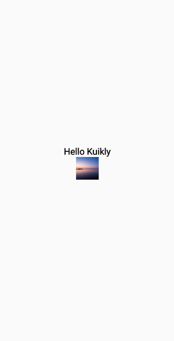

# 组件属性attr

在[页面入口Pager](pager.md)中，我们在``Text``组件中, 调用了``attr``闭包，并在闭包里面指定``Text``组件的属性。

```kotlin{11-14}
@Page("HelloWorld")
internal class HelloWorldPage : Pager() {

    override fun body(): ViewBuilder {
        return {
            attr {
                allCenter()
            }

            Text {
                attr {
                    text("Hello Kuikly")
                    fontSize(14f)
                }
            }
        }
    }
}
```

在``Kuikly``中, 每个组件都会有一个声明式的API, 例如``TextView``的声明式API为``Text``, 组件的声明式API内，含有``attr``方法，用于指定组件的属性。

在编写``Kuikly``代码时，每个组件都可通过``attr {}``闭包指定组件的属性。``Attr``可分为两大类

* 布局属性
* 样式属性

## 布局属性

布局属性用于指定组件的孩子如何布局。在原生开发中，不管是``Android``还是``iOS``系统，都有他们的一套布局规则。
在``Android``上布局规则比较多，有``LinearLayout``，``RelativeLayout``等；而iOS一般使用``Frame``布局。
``Kuikly``为了达到跨平台的目的，它不使用``Android``和``iOS``的布局规则，而是选择了跨平台的**FlexBox**布局作为``Kuikly``的布局规则。

:::tip 建议
关于在Kuikly中如何布局，详细可参考[Kuikly中布局](layout.md), 建议先学习FlexBox布局规则后, 再继续以下教程
:::

在上述例子中，我们在``Pager``的``attr``里面，指定了其孩子的布局规则，这两个属性表示让``Pager``的孩子居中布局
```
attr {
    allCenter()
}
```

如果想查阅组件支持的布局属性列表，可移步[组件布局属性](../API/components/basic-attr-event.md#width方法)

> Pager本身也是一个组件，因此也有attr闭包

## 样式属性

样式属性用于描述组件的``UI``样式，在``Kuikly``中，样式可分为两大类

* **基础样式**：所有组件都支持的样式, ``Kuikly``实现了一套``css``样式的子集，可作用于``Kuikly``的所有组件。例如：``backgroundColor``, ``boxShadow``,
  ``border``等属性
* **组件样式**：组件特有的样式，例如``Text``组件有``text``和``fontSize``属性；``Image``组件有``src``属性

如果想查阅组件的支持的样式列表, 可移步[组件文档](../API/components/override.md)


## 加载图片

下面我们在之前的例子上，添加上图片加载, 以演示在``Kuikly``中如何显示图片

::: tabs

@tab:active 示例

```kotlin
@Page("HelloWorldPage")
internal class HelloWorldPage : Pager() {

    override fun body(): ViewBuilder {
        val ctx = this
        return {
            attr {
                allCenter()
            }

            Text {
                attr {
                    text("Hello Kuikly")
                    fontSize(20f)
                    fontWeightBold()
                }
            }

            Image {
                attr {
                    size(50f, 50f)
                    src("https://vfiles.gtimg.cn/wupload/xy/componenthub/TbyiIqBP.jpeg")
                }
            }
        }
    }
}
```

@tab 效果

<div align="center">

</div>

:::

## 自定义属性
如果想要扩展组件的属性，可以参考[组件自定义属性](view-external-prop.md)


## 下一步

学习完组件的属性之后, 我们下面来学习``Kuikly``中[组件的事件](event.md)