# Kuikly Flexbox布局 - 基础教程

Kuikly作为一个跨平台的UI框架, 它不使用Android或者iOS的布局方式，而是选择了**跨平台的标准Flexbox**布局作为Kuikly的基础布局方式。下面我们结合Kuikly提供的Flexbox布局API, 
来学习Flexbox的一些基本概念以及如何布局。

## Flexbox布局基本概念

在学习 Flexbox 布局前，我们先来了解 Flexbox 布局的几个基本概念，熟悉掌握这几个基本概念后，能让你更得心应手的使用 Flexbox 布局

### Flex Container

**Flex Container**意为 Flex 容器，可以理解为采用 Flexbox布局它的子孩子的一个容器，对应到 Kuikly 中，
我们平常写的 View 组件就是一个 Flex 容器，例如：

```kotlin
View { // Flex 容器，使用 Flexbox 布局来布局子孩子，比如这里的 Text 节点
    attr {
    
    }
    
    Text {}
}
```

### Flex Item

**Flex Item**意为 Flex 项目，可以理解为一个 Flex 容器的孩子，会按照 Flex 容器的布局规则进行布局，对应到 Kuikly 中，
我们平常写在 View 组件下的孩子就是 Flex Item，例如

```kotlin
View { // Flex 容器
    attr {
    
    }
    
    Text {} // Flex Item
    
    View {} // Flex Item
}
```

### 主轴与交叉轴

在 Flex 容器中，存在两根轴，这两根轴决定着 Flex 容器下的孩子如何布局，这两根轴为
1. 主轴(main axis)
2. 交叉轴(cross axis)：与主轴垂直的轴

主轴的方向与 Flex 容器设置的 FlexDirection 有关，例如

```kotlin
View {
    attr {
        flexDirectionRow() // 主轴为水平方向，交叉轴为竖直方向
    }
}
```

> View 容器默认的主轴为垂直方向，因为flexDirection的值默认为flexDirectionColumn


Flex 容器下的孩子，会按照Flex 容器的主轴开始排列，比如

```kotlin
View {
    attr {
        flexDirectionRow() // 主轴为水平方向，因此 Text 和 Image 组件会在水平方向进行排列
    }
    
    Text {}
    Image {}
}
```

```kotlin
View {
    attr {
        flexDirectionColumn() // 主轴为竖直方向，因此 Text 和 Image 组件会在竖直方向进行排列
    }
    
    Text {}
    Image {}
}
```

## Flexbox 布局属性

在学习了解 Flexbox 的几个基本概念后，接下来，我们来看 Flexbox 布局的布局属性，通过组合这些布局属性，你能够组合出各式各样的布局效果

### Flex Container 布局属性

在一个 Flex 容器中，它可以通过设置布局属性来控制它的子孩子该如何布局。在 Kuikly 中支持的 Flex 容器属性有:

1. **flexDirection**: 设置Flex 容器的主轴方向，即Flex 容器的子孩子的布局方向
2. **justifyContent**: 设置 Flex Item 在 **Flex 容器的主轴方向上的对齐方式**
3. **alignItems**: 设置 Flex Item 在 **Flex 容器的交叉轴方向上的对齐方式**
4. **flexWrap**: 当 Flex Item 超出 Flex Container 时，是否需要换行排列

#### flexDirection

设置 Flex 容器的主轴方向，即 Flex 容器的子孩子的布局方向, 默认值为**flexDirectionColumn**

1. **flexDirectionColumn**: 主轴方向为竖直方向，子孩子从上往下布局
```kotlin
View {
    attr {
        flexDirectionColumn()
    }
    
    // 从上往下布局排列
    Text {}
    Image {}
}
```

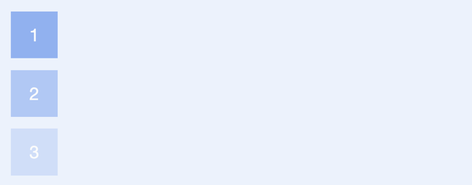

2. **flexDirectionRow**: 主轴方向为水平方向，子孩子从左往右布局
```kotlin
View {
    attr {
        flexDirectionRow()
    }
    
    // 从左往右布局排列
    Text {}
    Image {}
}
```

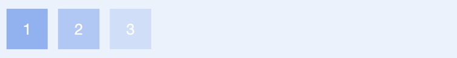

3. **flexDirectionColumnReverse**: 主轴方向为竖直方向，子孩子从下往上布局
```kotlin
View {
    attr {
        flexDirection(FlexDirection.COLUMN_REVERSE)
    }
    
    // 从下往上布局排列
    Text {}
    Image {}
}
```

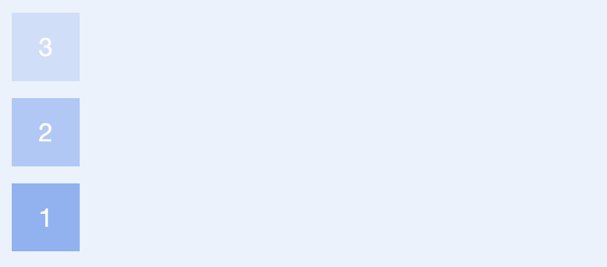

4. **flexDirectionRowReverse**: 主轴方向为水平方向，子孩子从右往左布局
```kotlin
View {
    attr {
        flexDirection(FlexDirection.ROW_REVERSE)
    }
    
    // 从右往左布局排列
    Text {}
    Image {}
}
```

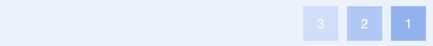

#### justifyContent

设置了**flexDirection**主轴的方向后，我们可以设置 Flex Item 在 **Flex 容器的主轴方向上的对齐方式**, 默认值为**justifyContentFlexStart**, 从主轴开始的位置开始排列，
可选值有:

1. **justifyContentFlexStart**: 主轴开始的位置进行对齐
2. **justifyContentFlexEnd**: 主轴结束的位置进行对齐
3. **justifyContentCenter**: 主轴的中间位置进行对齐
4. **justifyContentSpaceBetween**: 主轴两端对齐，子孩子之间的间隔都相等
5. **justifyContentSpaceAround**: 每个项目两侧的间隔相等。所以，子孩子之间的间隔比项目与边框的间隔大一倍
6. **justifyContentSpaceEvenly**: Flex Item之间的间距相等，包括与边缘位置的距离

具体的对齐方向与flexDirection有关

* 设置 flex 容器的 flexDirection 为 flexDirectionRow 时，justifyContent 各个属性的效果为:

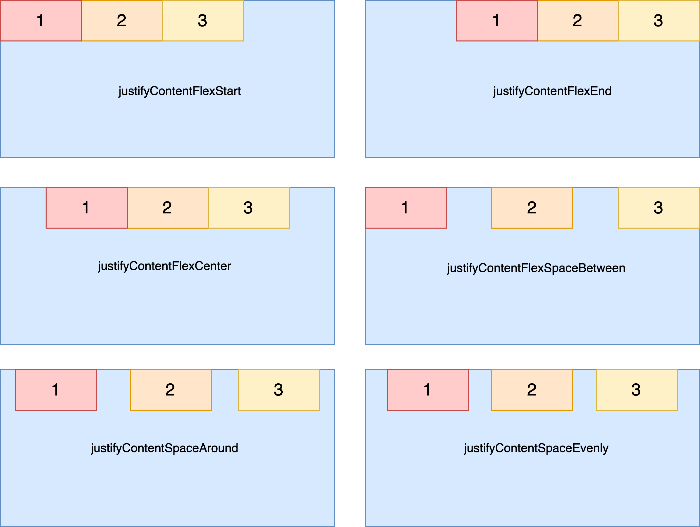

* 设置 flex 容器的 flexDirection 为 flexDirectionColumn 时，justifyContent 各个属性的效果为:

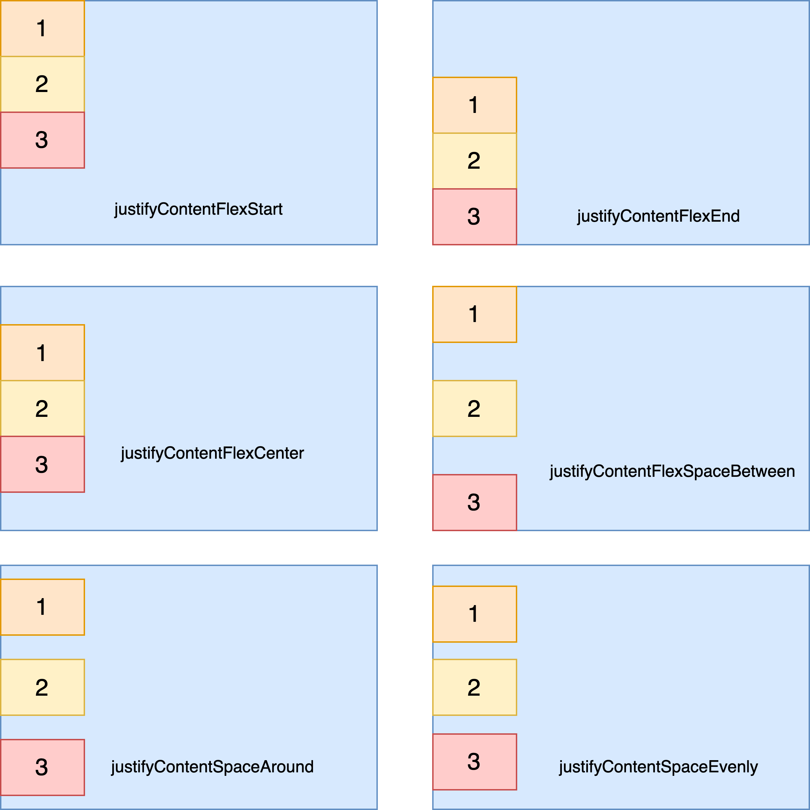

#### alignItems

设置 Flex Item 在 **Flex 容器的交叉轴方向上的对齐方式**, 默认值为**alignItemsStretch**，可选值为

1. **alignItemsFlexStart**: 交叉轴的起点对齐
2. **alignItemsFlexEnd**: 交叉轴的终点位置对齐
3. **alignItemsCenter**: 交叉轴的中点位置对齐
4. **alignItemsStretch**: 如果 Flex 容器的孩子没有指定大小（高度或者宽度，取决于交叉轴是水平还是竖直）的话，将占满 Flex 容器

具体的对齐方向与flexDirection有关

* 当 flexDirection 为 flexDirectionRow 时，交叉轴的方向为竖直方向，此时 alignItems 各个属性的效果为:

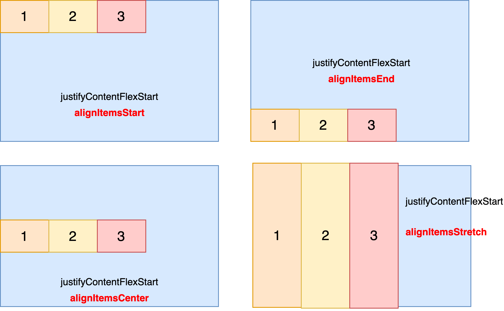

* 当 flexDirection 为 flexDirectionColumn 时，交叉轴的方向为水平方向，此时 alignItems 的各个属性效果为:

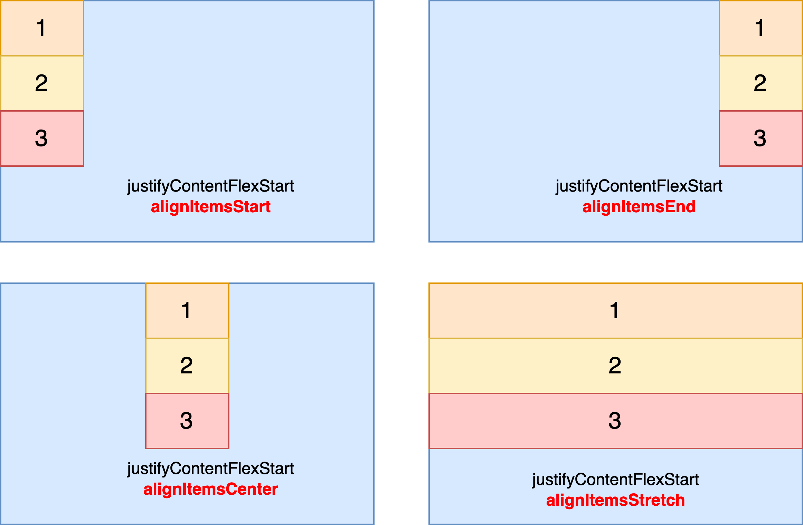

#### flexWrap

默认情况下，Flex 容器的子孩子都在 Flex 容器的主轴上布局。flexWrap属性定义，如果子孩子在 Flex 容器排不下，如何换行。
默认值为 **flexWrapNoWrap**, 表示子孩子超出 Flex容器时，不换行，超出的部分不可见。可选值有:

1. **flexWrapNoWrap**: 子孩子超出 Flex容器时，不换行
2. **flexWrapWrap**: 子孩子超出 Flex容器时，换行排列

下面是以主轴方向为水平方向为例，即 flexDirection 的值为 flexDirectionRow 时，**flexWrap** 的效果

* **flexWrapNoWrap**

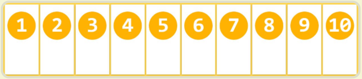

* **flexWrapWrap**

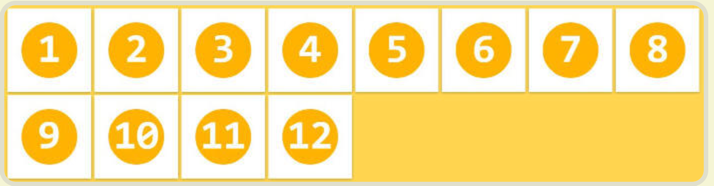

### Flex Item 布局属性

上面讲述的 Flex Container 属性，是针对 Flex Container 下的所有孩子生效。Flex Item 也可自己设置布局属性，覆盖 Flex Container 的属性。
Flex Item 属性，在 Kuikly 中，有以下两个

1. **alignSelf**: Flex Item 自身在 Flex 容器的交叉轴上的对齐
2. **flex**: Flex Item 在主轴上，占据 Flex 容器的可用空间的比例

#### alignSelf

**alignSelf**属性是控制Flex Item自身在 Flex 容器的交叉轴上的对齐方式，会覆盖 Flex 容器指定的 alignItems 属性，可选值为:

1. **alignSelfFlexStart**: Flex Item 自身在 Flex 容器的交叉轴的起点对齐
2. **alignSelfCenter**: Flex Item 自身在 Flex 容器的交叉轴中点对齐
3. **alignSelfFlexEnd**: Flex Item 自身在 Flex 容器的交叉轴终点对齐
4. **alignItemsStretch**: Flex Item 自身在交叉轴方向上铺满Flex 容器

alignSelf 与 alignItems 差不多，具体的对齐方向与 flexDirection 的值有关。

* 当 flexDirection 的值为 flexDirectionRow 时，Flex Item 设置 alignSelf 的效果如下:

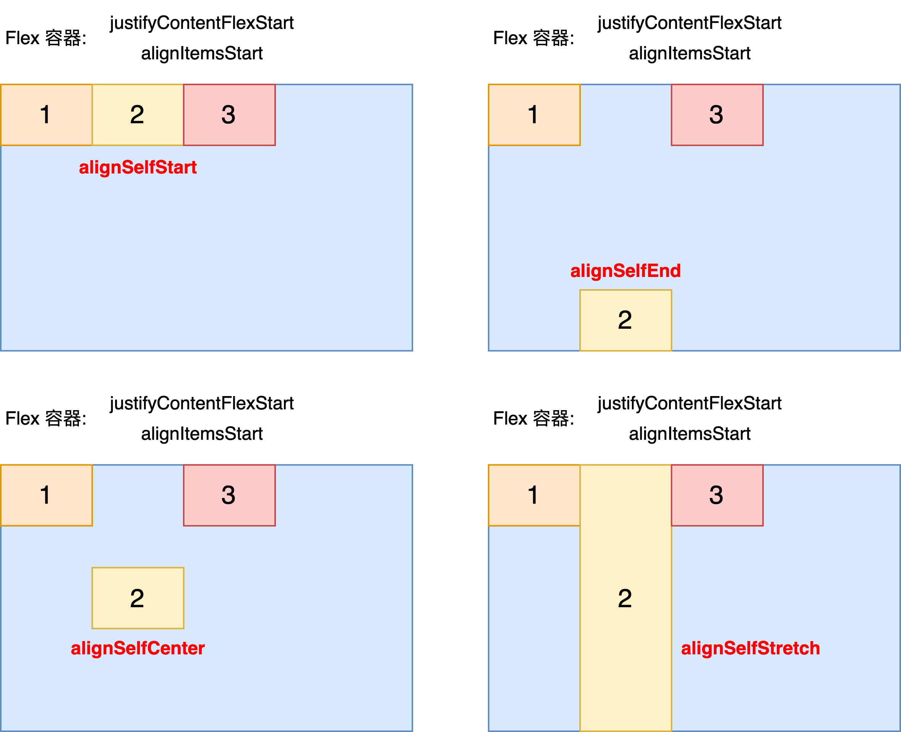

* 当 flexDirection 的值为 flexDirectionColumn 时，Flex Item 设置 alignSelf 的效果如下:

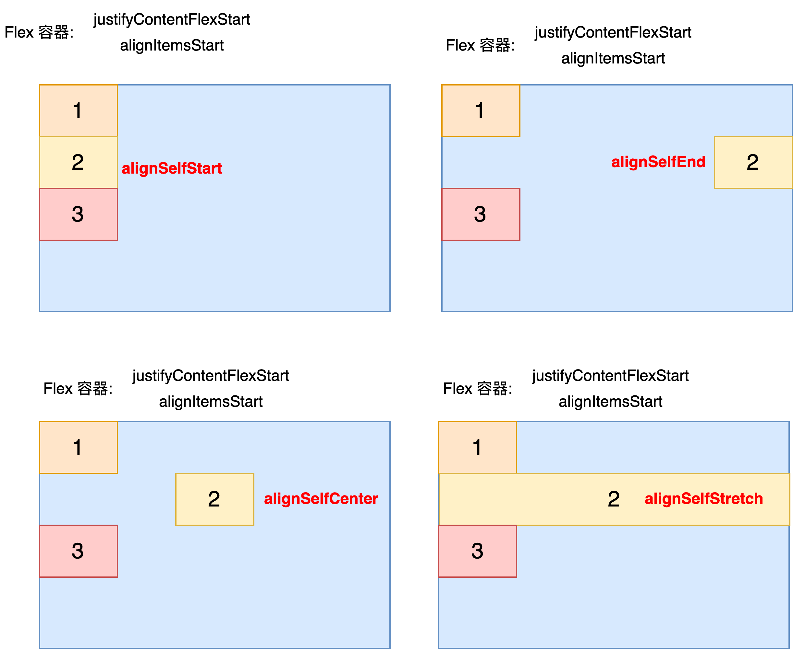

#### flex

Flex Item 在**主轴**上，占据 Flex 容器的**剩余可用空间**的比例。
可用空间是指 Flex 容器除去已经被占用的空间，剩下的空间大小。例如:

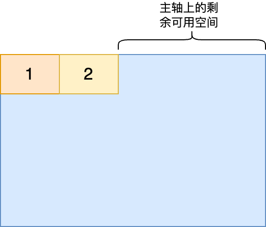

flex 属性一般用于占据 Flex 容器剩余的可用空间，一般设置为 1f, 例如：

我们在 app 布局中，很常见的一种布局是：顶部是一个标题栏，剩下的空间分配给列表

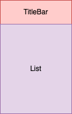

一般这种在这种布局下，我们会把 List 组件设置 flex(1f)属性，让 List 占据 父容器在**主轴上剩余的可用空间**

```kotlin
View {
    attr {
        size(screenWidth, screenHeight)
        flexDirectionColumn() // 主轴方向为竖直方向，孩子从上往下排列
        // alignItems默认值为 alignItemsStretch, 因此在交叉轴，即水平方向上
        // 其孩子的宽度与父亲一样大
    }
    
    View { // title bar
        attr {
            height(56f)
            // 宽度为父亲的宽度, 因为父亲的alignItems 默认为 alignItemsStretch,
            // 在交叉轴上的大小会占满父亲
        }
    }
    
    List {
        attr {
            flex(1f) // 表示占满父容器主轴上的可用空间，即占满父亲可用的高度(screenHeight - 56f)
        }
    }
}
```

## 绝对布局

在原生开发中，有个很常见的布局需求，要求布局层叠，比如Android 的 FrameLayout 和 iOS的 Frame 布局。
那在 Flexbox 布局中，如何实现这种层叠布局的效果呢？

在 Flexbox 布局中，我们可以将组件设置成**绝对布局**，然后这个组件就能叠在父亲上。例如：有时候，我们想要在屏幕中放置一张图片作为布局的背景，
然后这个背景图铺满父亲，最后按照正常的布局诉求进行布局

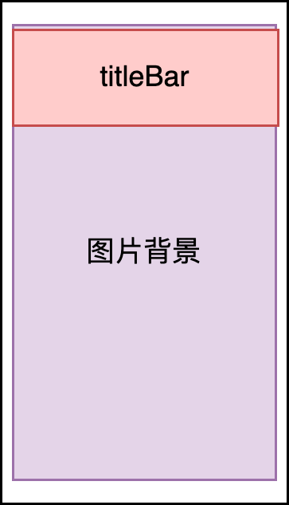

```kotlin

View {
    attr {
        size(screenWidth, screenHeight)
        flexDirectionColumn()
    }
    
    Image { // 铺满父容器的背景图
        attr {
            positionAbsolute() //设置为绝对布局
            // 设置在父亲中的位置
            left(0f)
            right(0f)
            top(0f)
            bottom(0f)
        }
    }

    View { // title bar
        attr {
            height(56f)
        }
    }
    ...
}
```

在组件中，我们可以设置 **positionAbsolute**，**将组件设置成绝对布局，这样该组件可脱离父容器的 Flex 布局的对齐元素的布局，
然后通过 left，top, right, bottom 这四个位置来定位组件在父亲的位置，并且绝对布局的组件的大小不会影响到父容器的大小**

我们通过**positionAbsolute**将组件设置成绝对布局后，还要按需设置组件的四个位置来定位组件的位置和大小

1. left: 组件的左边距离父容器的左边的距离
2. top: 组件的上边距离父容器的上边的距离
3. right: 组件的右边距离父容器的右边的距离
4. bottom: 组件的下边距离父容器的下边的距离

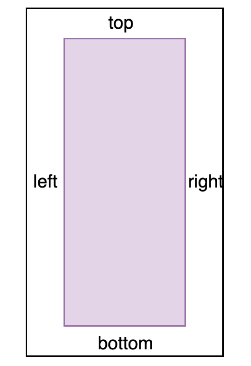

我们如果设置left 和 right 为 0f，表示绝对布局的组件的宽度与父布局宽度一样

```kotlin
View {
    attr {
        size(screenWidth, screenHeight)
    }
    
    Image {
        attr {
            positionAbsolute()
            // left 和 right 设置为 0f，表示宽度与父容器的宽度一致
            left(0f)
            right(0f)
        }
    }
}
```

我们如果设置 top 和 bottom 为 0f 时，表示绝对布局的组件的高度与父布局的高度一致

```kotlin
View {
    attr {
        size(screenWidth, screenHeight)
    }
    
    Image {
        attr {
            positionAbsolute()
            // top 和 bottom 设置为 0f，表示宽度与父容器的高度一致
            top(0f)
            bottom(0f)
        }
    }
}
```

我们如果设置 left，right， top 和 bottom 为 0f 时，表示绝对布局的组件的高度和宽度与父布局一致

```kotlin
View {
    attr {
        size(screenWidth, screenHeight)
    }
    
    Image {
        attr {
            positionAbsolute()
            // 表示宽高与父容器的宽高一样大
            top(0f)
            bottom(0f)
            right(0f)
            left(0f)
        }
    }
}
```

## 学习教程推荐

Flexbox 布局是一款有标准规则的跨平台布局，非 Kuikly 独有，因此网上关于 Flexbox 的教程也适用于 Kuikly，这里推荐一些网上的教程

1. [阮一峰的FlexBox教程](https://www.ruanyifeng.com/blog/2015/07/flex-grammar.html)
2. [mdn Flexbox 教程](https://developer.mozilla.org/zh-CN/docs/Web/CSS/CSS_flexible_box_layout/Basic_concepts_of_flexbox)
3. [w3c school的FlexBox教程](https://www.w3school.com.cn/css/css3_flexbox.asp)

## 下一步

学习往了 Flexbox 的基础教程后，下一步，我们来结合实际的布局常见需求，[来看如何使用 Flexbox 来布局](flexbox-in-action.md)
