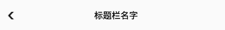
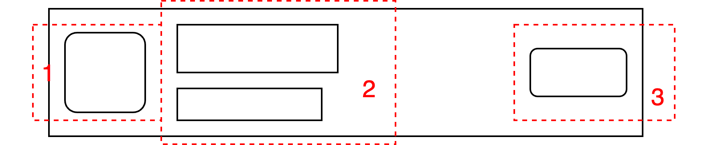

# Kuikly Flexbox布局 - 实战教程

在学习了 Kuikly 中的 Flexbox 布局的基础教程后，接下来，我们来学习如何使用 Flexbox 布局来实现常用的布局效果。

:::tip
此文档会不定期更新, 收录业务实践中，常见的 UI 布局效果如何实现
:::

## TitleBar


上图是一个页面的 title bar 的 UI，这是一个非常常见的 UI 效果，接下来我们来看，使用 Kuikly，如何实现 title bar 的效果。

首先，title bar 的标题是居中显示的，因此我们需要在title bar 容器上, 将主轴和交叉轴的对齐属性设置为居中

```kotlin{11-12}
@Page("333")
internal class LayoutTestPager : BasePager() {
    
    override fun body(): ViewBuilder {
        val ctx = this
        return {
            View {
                attr {
                    height(56f)
                    marginTop(pagerData.statusBarHeight)
                    justifyContentCenter()
                    alignItemsCenter()
                }
               
            }
        }
    }
}
```

接着，我们编写居中的文本 Text

```kotlin{15-22}
@Page("333")
internal class LayoutTestPager : BasePager() {
    
    override fun body(): ViewBuilder {
        val ctx = this
        return {
            View {
                attr {
                    height(56f)
                    marginTop(pagerData.statusBarHeight)
                    justifyContentCenter()
                    alignItemsCenter()
                }
                
                 Text {
                    attr {
                        text("标题栏名字")
                        color(Color.BLACK)
                        fontSize(16f)
                        fontWeightBold()
                    }
                }
            }
        }
    }
}
```

然后我们加上返回箭头UI。

```kotlin{1,17-23}
const val BACK_ICON_SRC = "data:image/png;base64,iVBORw0KGgoAAAANSUhEUgAAAAsAAAASBAMAAAB/WzlGAAAAElBMVEUAAAAAAAAAAAAAAAAAAAAAAADgKxmiAAAABXRSTlMAIN/PELVZAGcAAAAkSURBVAjXYwABQTDJqCQAooSCHUAcVROCHBiFECTMhVoEtRYA6UMHzQlOjQIAAAAASUVORK5CYII="
        
@Page("333")
internal class LayoutTestPager : BasePager() {
    
    override fun body(): ViewBuilder {
        val ctx = this
        return {
            View {
                attr {
                    height(56f)
                    marginTop(pagerData.statusBarHeight)
                    justifyContentCenter()
                    alignItemsCenter()
                }
                
                Image {
                    attr {
                        width(14f)
                        height(14f)
                        src(BACK_ICON_SRC)
                    }
                }
                
                 Text {
                    attr {
                        text("标题栏名字")
                        color(Color.BLACK)
                        fontSize(16f)
                        fontWeightBold()
                    }
                }
            }
        }
    }
}
```

加上了以后，你会发现，返回箭头不是在最左侧，而是跟文本一样，居中显示了。这是因为 title bar 容器的主轴和交叉轴都设置为居中。

所以对于返回箭头的布局，我们可以设置为绝对布局，然后脱离父布局的对齐属性的约束

```kotlin{1,17-38}
const val BACK_ICON_SRC = "data:image/png;base64,iVBORw0KGgoAAAANSUhEUgAAAAsAAAASBAMAAAB/WzlGAAAAElBMVEUAAAAAAAAAAAAAAAAAAAAAAADgKxmiAAAABXRSTlMAIN/PELVZAGcAAAAkSURBVAjXYwABQTDJqCQAooSCHUAcVROCHBiFECTMhVoEtRYA6UMHzQlOjQIAAAAASUVORK5CYII="
        
@Page("333")
internal class LayoutTestPager : BasePager() {
    
    override fun body(): ViewBuilder {
        val ctx = this
        return {
            View {
                attr {
                    height(56f)
                    marginTop(pagerData.statusBarHeight)
                    justifyContentCenter()
                    alignItemsCenter()
                }

                View {
                    attr {
                        positionAbsolute() // 设置为绝对布局
                        left(14f)

                        // top和 bottom 设置为 0f. 占满父亲的高度
                        top(0f)
                        bottom(0f)

                        // 让返回箭头居中显示
                        justifyContentCenter()
                        alignItemsCenter()
                    }

                    Image {
                        attr {
                            width(14f)
                            height(14f)
                            src(BACK_ICON_SRC)
                        }
                    }
                }
                
                 Text {
                    attr {
                        text("标题栏名字")
                        color(Color.BLACK)
                        fontSize(16f)
                        fontWeightBold()
                    }
                }
            }
        }
    }
}
```

在上述代码中，我们新增一个绝对布局的 View，然后让它高度占满父亲，设置左偏移，接着就把返回箭头 UI 放置在绝对布局的 View 下，这样就能够实现竖直方向上居中，然后 位于title bar 的左边

:::tip 提示
在实现 title bar 的效果时，虽然我们多嵌套了一层 View，但是这不会影响性能，因此这层 View 只包含布局属性，因此框架不会创建对应的 View
:::

以上就是实现 title bar 的代码。在实现的过程中，我们利用到了绝对布局。其实我们不使用绝对布局，也能够实现 title bar 的效果。
下面介绍，不使用绝对布局来实现title bar效果的方法

<br/>

上图的 title bar 含有两个元素，一个是返回箭头 icon，另外一个是 Text 文本。他们是横向排列在容器中, 因此，flex container 的 flexDirection 为 **flexDirectionRow**

```kotlin{11}
@Page("333")
internal class LayoutTestPager : BasePager() {
    
    override fun body(): ViewBuilder {
        val ctx = this
        return {
            View { // title bar 容器
                attr {
                    height(56f)
                    marginTop(pagerData.statusBarHeight)
                    flexDirectionRow()
                }
            }
        }
    }
}
```

由于返回箭头和标题栏文本的 UI 是在父容器中的**竖直方向(交叉轴)**居中的，因此，我们需要将父容器的**alignItems**属性设置为**alignItemsCenter**, 让 title bar 的子孩子的竖直方向上居中显示

```kotlin{12}
@Page("333")
internal class LayoutTestPager : BasePager() {
    
    override fun body(): ViewBuilder {
        val ctx = this
        return {
            View { // title bar 容器
                attr {
                    height(56f)
                    marginTop(pagerData.statusBarHeight)
                    flexDirectionRow()
                    alignItemsCenter()
                }
            }
        }
    }
}
```

接着我们编写返回**箭头和文本 UI**，然后放置在父容器内

```kotlin{1,17-32}
const val BACK_ICON_SRC = "data:image/png;base64,iVBORw0KGgoAAAANSUhEUgAAAAsAAAASBAMAAAB/WzlGAAAAElBMVEUAAAAAAAAAAAAAAAAAAAAAAADgKxmiAAAABXRSTlMAIN/PELVZAGcAAAAkSURBVAjXYwABQTDJqCQAooSCHUAcVROCHBiFECTMhVoEtRYA6UMHzQlOjQIAAAAASUVORK5CYII="

@Page("333")
internal class LayoutTestPager : BasePager() {
    
    override fun body(): ViewBuilder {
        val ctx = this
        return {
            View { // title bar 容器
                attr {
                    height(56f)
                    marginTop(pagerData.statusBarHeight)
                    flexDirectionRow()
                    alignItemsCenter()
                }
                
                 Image {
                    attr {
                        width(14f)
                        height(14f)
                        src(BACK_ICON_SRC) // BACK_ICON_SRC 为返回箭头 icon 的 url
                    }
                }

                Text {
                    attr {
                        text("标题栏名字")
                        color(Color.BLACK)
                        fontSize(16f)
                        fontWeightBold()
                    }
                }
            }
        }
    }
}
```

点击运行，查看效果，你会得到以下效果


我们可以看到目前，标题的布局没有在父容器居中显示，这是因为，父容器没有指定子孩子在主轴上(水平方向上)如何排列，按照默认值**justifyContentFlexStart**方式布局孩子，
这个效果显然不符合我们的预期, 我们需要指定下**justifyContent**属性。

我们可以使用**justifyContentSpaceBetween**, 然后额外添加一个占位的 View，这样就能让第二个元素 Text，在水平方向上居中显示

```kotlin{15,35-39}
const val BACK_ICON_SRC = "data:image/png;base64,iVBORw0KGgoAAAANSUhEUgAAAAsAAAASBAMAAAB/WzlGAAAAElBMVEUAAAAAAAAAAAAAAAAAAAAAAADgKxmiAAAABXRSTlMAIN/PELVZAGcAAAAkSURBVAjXYwABQTDJqCQAooSCHUAcVROCHBiFECTMhVoEtRYA6UMHzQlOjQIAAAAASUVORK5CYII="

@Page("333")
internal class LayoutTestPager : BasePager() {
    
    override fun body(): ViewBuilder {
        val ctx = this
        return {
            View { // title bar 容器
                attr {
                    height(56f)
                    marginTop(pagerData.statusBarHeight)
                    flexDirectionRow()
                    alignItemsCenter()
                    justifyContentSpaceBetween()
                }
                
                 Image {
                    attr {
                        width(14f)
                        height(14f)
                        src(BACK_ICON_SRC) // BACK_ICON_SRC 为返回箭头 icon 的 url
                    }
                }

                Text {
                    attr {
                        text("标题栏名字")
                        color(Color.BLACK)
                        fontSize(16f)
                        fontWeightBold()
                    }
                }

                View { // 添加一个不可见的占位 View，让中间文本在justifyContentSpaceBetween下能够居中显示
                    attr {
                        width(1f)
                    }
                }
                
            }
        }
    }
}
```

运行后，我们可以得到下面的效果


这个效果已经是符合我们预想的 title bar效果了，但是左边的箭头还需要设置间距，这时候，我们可以设置容器的 paddingLeft 和 paddingRight，预留出间距。

```kotlin{16-17}
const val BACK_ICON_SRC = "data:image/png;base64,iVBORw0KGgoAAAANSUhEUgAAAAsAAAASBAMAAAB/WzlGAAAAElBMVEUAAAAAAAAAAAAAAAAAAAAAAADgKxmiAAAABXRSTlMAIN/PELVZAGcAAAAkSURBVAjXYwABQTDJqCQAooSCHUAcVROCHBiFECTMhVoEtRYA6UMHzQlOjQIAAAAASUVORK5CYII="

@Page("333")
internal class LayoutTestPager : BasePager() {
    
    override fun body(): ViewBuilder {
        val ctx = this
        return {
            View { // title bar 容器
                attr {
                    height(56f)
                    marginTop(pagerData.statusBarHeight)
                    flexDirectionRow()
                    alignItemsCenter()
                    justifyContentSpaceBetween()
                    paddingLeft(14f)
                    paddingRight(14f)
                }
                
                 Image {
                    attr {
                        width(14f)
                        height(14f)
                        src(BACK_ICON_SRC) // BACK_ICON_SRC 为返回箭头 icon 的 url
                    }
                }

                Text {
                    attr {
                        text("标题栏名字")
                        color(Color.BLACK)
                        fontSize(16f)
                        fontWeightBold()
                    }
                }

                View { // 添加一个不可见的占位 View，让中间文本在justifyContentSpaceBetween下能够居中显示
                    attr {
                        width(1f)
                    }
                }
                
            }
        }
    }
}
```

运行以后，我们可以得到最终的效果



## flex 属性如何使用？

flex 属性意为，将节点在**主轴上**的大小撑满父容器的可用空间，通常会设置为 **flex(1f)**。下面我们举例实际应用的场景，让你更好理解 flex 属性的作用

### 让 List 组件在高度上撑满父亲

一个页面的 UI 结构，很多时候通常由 title bar + List 组成，title bar 上顶部，接着就是List 组件，如：


这个页面的 UI 结构由两部分组成
1. 顶部 title bar
2. List 组件，背景颜色为绿色，它的高度为页面高度 - title bar 高度

顶部的 title bar，我们来前面已经讲述了它如何实现，我们这里就不再讲了，我们主要关注 List的高度实现

```kotlin{8,55}
@Page("333")
internal class LayoutTestPager : BasePager() {
    
    override fun body(): ViewBuilder {
        val ctx = this
        return {
            attr { 
                flexDirectionColumn()
            }
            
            View {
                attr {
                    height(56f)
                    marginTop(pagerData.statusBarHeight)
                    justifyContentCenter()
                    alignItemsCenter()
                }

                View {
                    attr {
                        positionAbsolute()
                        left(14f)

                        // top
                        top(0f)
                        bottom(0f)

                        justifyContentCenter()
                        alignItemsCenter()
                    }

                    Image {
                        attr {
                            width(14f)
                            height(14f)
                            src(BACK_ICON_SRC)
                        }
                    }
                }


                Text {
                    attr {
                        text("标题栏名字")
                        color(Color.BLACK)
                        fontSize(16f)
                        fontWeightBold()
                    }
                }

            }

            List {
                attr {
                    flex(1f) // 父容器是竖直布局，因此主轴是竖直方向，设置 flex(1f), 表示
                    backgroundColor(Color.GREEN)
                }
            }
        }
    }

    companion object {
        const val BACK_ICON_SRC = "data:image/png;base64,iVBORw0KGgoAAAANSUhEUgAAAAsAAAASBAMAAAB/WzlGAAAAElBMVEUAAAAAAAAAAAAAAAAAAAAAAADgKxmiAAAABXRSTlMAIN/PELVZAGcAAAAkSURBVAjXYwABQTDJqCQAooSCHUAcVROCHBiFECTMhVoEtRYA6UMHzQlOjQIAAAAASUVORK5CYII="

    }
}
```

在上述代码中，由于title bar 和 List 组件是从上往下布局，因此父容器的 flexDirection 设置为 flexDirectionColumn,
因此父容器的主轴为竖直方向，然后我们在 List 组件上设置了 **flex(1f)** 属性, **这表示我们想要 List 组件在主轴上(也就是高度)占满父容器剩余的高度(除去 title bar 后的高度)。**

<br/>

在上述代码中，你可能会疑惑，我们没有设置 List 组件的宽度，为什么 List 组件的宽度会跟父容器一样大呢？

这是因为在 Flexbox 布局中，alignItems 默认为 alignItemsStretch, 表示组件在交叉轴上，撑满父容器的大小。
在这个例子中, List 组件所在的父容器，它的交叉轴为水平方向，因此 List的宽度(水平方向)会跟父容器的宽度一致。

:::tip 注意
在 Flexbox 布局中, 组件的 alignItems 默认为 alignItemsStretch, 表示组件在交叉轴上会撑满父容器
:::

### 宽度上撑满剩余空间

在前面，我们讲了List 组件通过设置 flex(1f), 然后让 List 组件在高度上能够占满父亲的剩余高度。下面，我们讲述另外一种场景，在组件设置 flex(1f),
让其在宽度上占满父容器的剩余宽度。


在上图中，我们来看如何实现红框中的 UI 效果。

<br/>

我们首先来分析UI 结构



上面的 UI 结构分为三部分:
1. 头像区域
2. 上下排列的文本区域
3. 最右侧的按钮区域

这三个区域在水平方向上排列, 实现上述的布局效果，对应的 Kuikly 代码为:

```kotlin
@Page("333")
internal class LayoutTestPager : BasePager() {
    
    override fun body(): ViewBuilder {
        val ctx = this
        return {
            attr {
                paddingTop(200f)
            }

            View {
                attr {
                    backgroundColor(Color.YELLOW) // 设置背景颜色，方便查看布局
                    paddingTop(10f)
                    paddingBottom(10f)
                    flexDirectionRow()
                    alignItemsCenter() // 竖直方向上居中显示
                }

                View { // 头像
                    attr {
                        size(40f, 40f)
                        backgroundColor(Color.GREEN)
                    }
                }

                View { // 文本区域
                    attr {
                        marginLeft(10f)
                        flexDirectionColumn()
                    }

                    Text {
                        attr {
                            fontWeightBold()
                            fontSize(18f)
                            color(Color.BLACK)
                            text("签到礼包")
                        }
                    }

                    Text {
                        attr {
                            marginTop(4f)
                            fontWeightBold()
                            fontSize(15f)
                            color(Color.GRAY)
                            text("钻石✖10")
                        }
                    }
                }

                View {
                    attr {
                        flex(1f)
                        flexDirectionRow()
                        justifyContentFlexEnd()
                        backgroundColor(Color.GREEN)
                    }

                    Button {
                        attr {
                            backgroundColor(Color.GRAY)
                            width(70f)
                            height(35f)
                            borderRadius(10f)
                            titleAttr {
                                text("领取")
                                fontSize(19f)
                                fontWeightBold()
                            }
                        }
                    }
                }
            }
        }
    }
}
```

首先，三部分区域是在水平方向上排列的，因此，我们设置容器的 flexDirection 为 flexDirectionRow,
然后设置容器的 alignItems 为 alignItemsCenter, 让其子元素在竖直方向上居中。接着头像区域，我们使用 View 组件来模拟，这个不多说，
然后文本区域，我们使用 View 区域作为容器，并且把 flexDirection 设置为 flexDirectionColumn, 让两个文本组件能够上下排列。
最后的按钮区域，由于要在最右边，因此，我们在 View 上设置了 flex(1f), 让其在宽度上占满父容器剩余的宽度，最后把justifyContent设置为 **justifyContentFlexEnd**，
让子元素从右边排列，最后达到按钮区域在容器的最右边的效果


> 最后的按钮区域，不一定要使用 flex 属性来实现，也可以使用绝对布局来实现

## 绝对布局实践

在 Flexbox 布局中，将组件的布局设置成绝对布局后，组件可脱离父容器的主轴和交叉轴的对齐约束，
然后通过 left, top, right 和 bottom 属性，在父布局中定位，常常用于实现层叠的 UI 效果。
比如，我们想要实现，让一个 Image 作为屏幕的背景，然后其他 UI 元素叠加在上面布局。

```kotlin{11-21}
@Page("333")
internal class LayoutTestPager : BasePager() {
    
    override fun body(): ViewBuilder {
        val ctx = this
        return {
            attr {
                paddingTop(200f)
            }

            Image {
                attr {
                    positionAbsolute()
                    left(0f)
                    top(0f)
                    right(0f)
                    bottom(0f)

                    src("https://vfiles.gtimg.cn/wupload/xy/componenthub/eQobegGo.jpeg")
                }
            }

            View {
                attr {
                    backgroundColor(Color.YELLOW) // 设置背景颜色，方便查看布局
                    paddingTop(10f)
                    paddingBottom(10f)
                    flexDirectionRow()
                    alignItemsCenter() // 竖直方向上居中显示
                }

                View { // 头像
                    attr {
                        size(40f, 40f)
                        backgroundColor(Color.GREEN)
                    }
                }

                View { // 文本区域
                    attr {
                        marginLeft(10f)
                        flexDirectionColumn()
                    }

                    Text {
                        attr {
                            fontWeightBold()
                            fontSize(18f)
                            color(Color.BLACK)
                            text("签到礼包")
                        }
                    }

                    Text {
                        attr {
                            marginTop(4f)
                            fontWeightBold()
                            fontSize(15f)
                            color(Color.GRAY)
                            text("钻石✖10")
                        }
                    }
                }

                View {
                    attr {
                        flex(1f)
                        flexDirectionRow()
                        justifyContentFlexEnd()
                        backgroundColor(Color.GREEN)
                    }

                    Button {
                        attr {
                            backgroundColor(Color.GRAY)
                            width(70f)
                            height(35f)
                            borderRadius(10f)
                            titleAttr {
                                text("领取")
                                fontSize(19f)
                                fontWeightBold()
                            }
                        }
                    }
                }
            }
        }
    }
}
```

在上面的代码中，我们新增了一个 Image 组件，然后设置positionAbsolute，将组件设置成绝对布局，
接着将 left, top, right 和 bottom 设置成0f, 表示宽度和高度与父布局一样， 然后设置 src 图片，
最后我们可以看到，整个图片叠在其他 UI 的下面


## 最后

以上就是在 Kuikly 中，Flexbox 布局的一些实践。Flexbox 布局思想与传统客户端的布局思想会有一些差异，
开发者一开始可能会觉得不习惯，但是一旦掌握了 Flexbox 布局，你会发现 Flexbox 布局能力的强大与便捷