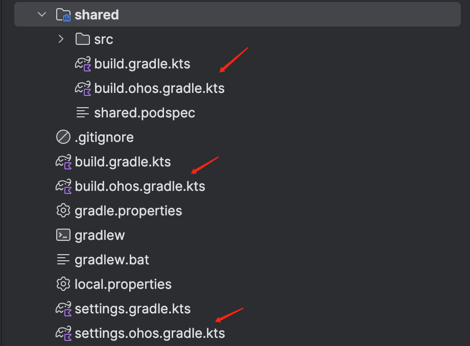
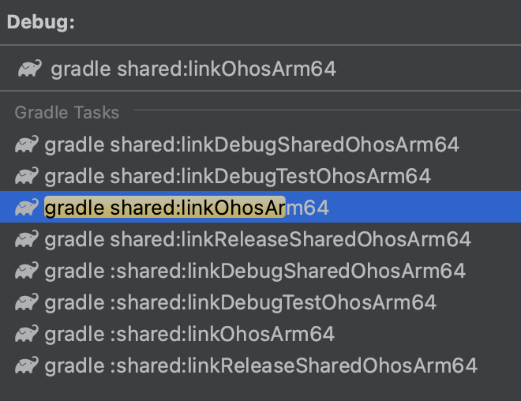

# 鸿蒙平台开发方式

## so模式
:::tip 注意
1. 鸿蒙平台跨端产物的需要使用鸿蒙SDK的LLVM工具编译生成，官方版的Kotlin工具链并不支持鸿蒙平台，因此我们需要使用定制版的Kotlin工具链。
2. 当前鸿蒙Kotlin工具链仅支持Mac平台，Kuikly鸿蒙跨端产物请使用Mac编译，Windows可以使用编译好的跨端产物运行Ohos APP。
:::

### 配置kuikly Ohos编译环境
#### 方式1: Ohos单独配置编译链(推荐)

给ohos单独配置gradle配置项，使用此配置项编译鸿蒙产物

在[编写第一个Kuikly页面](../QuickStart/hello-world.md)中，Android Studio中创建的Kuikly工程中会默认带了鸿蒙产物的gradle设置项，可以参考使用。
(若创建的工程无鸿蒙模版可以升级Andriod Studio Kuikly plugin)
<div>

</div>
在编译产物的时候可以指定此gradle设置，进行鸿蒙产物的编译

`./gradlew -c settings.ohos.gradle.kts :shared:linkOhosArm64`


#### 方式2: 统一编译链形式

由于方式1中ohos工具链并非默认设置，ohosArm64Main中的代码会缺乏相应编译器提示。

可以在工程使用此ohos工具链作为默认设置，按照以下的方式配置


- 在你现有工程中添加maven源：
```gradle
repositories {
    // 定制版kotlin工具链
    maven {
        url = uri("https://mirrors.tencent.com/nexus/repository/maven-public/")
    }
}
```

- 修改版本号

把工程的Kotlin版本改为**2.0.21-KBA-004**，Kuikly版本改为**KUIKLY_VERSION-2.0.21-KBA-004**，ksp版本改为**2.0.21-1.0.27**。改完后，执行 ./gradlew bE 和 ./gradlew :shared:d 命令确认依赖项的版本resolve正确。

:::tip 注意
目前鸿蒙编译链仅支持此版本 **2.0.21-KBA-004**
:::

以插件创建的模板工程为例，需要修改的有：

**build.gradle.kts**

```gradle
plugins {
    kotlin("android").version("2.0.21-KBA-004").apply(false)
    kotlin("multiplatform").version("2.0.21-KBA-004").apply(false)
    ...
}
```

**shared/build.gradle.kts**

```gradle
kotlin{
    ...
    sourceSets {
        val commonMain by getting {
            dependencies {
                // KUIKLY_VERSION 用实际使用的Kuikly版本号替换
                implementation("com.tencent.kuikly-open:core:KUIKLY_VERSION-2.0.21-KBA-004")
                implementation("com.tencent.kuikly-open:core-annotations:KUIKLY_VERSION-2.0.21-KBA-004")
            }
        }
        ...
    }
}
...
dependencies {
    // KUIKLY_VERSION 用实际使用的Kuikly版本号替换
    compileOnly("com.tencent.kuikly-open:core-ksp:KUIKLY_VERSION-2.0.21-KBA-004") {
        ...
    }
}
```

- 添加构建目标

在shared/build.gradle中添加ohosArm64构建目标：
```gradle
kotlin {
    ....
    ohosArm64 {
        binaries {
            sharedLib()
        }
    }
}
dependencies {
    compileOnly("com.tencent.kuikly-open:core-ksp:KUIKLY_VERSION-2.0.21-KBA-004") {
        ....
        add("kspOhosArm64", this)
    }
}
```

### 编写Kuikly页面

参照[编写第一个Kuikly页面](../QuickStart/hello-world.md)的指引编写页面。在页面中可以通过以下方式判断鸿蒙平台：
```kotlin
internal class RouterPage : BasePager() {
  override fun body(): ViewBuilder {
    val isOhos = pagerData.platform === "ohos"
    ...
  }
}
```

### 生成so产物和头文件

1. 如果采用上述方式1配置：

命令行执行 `./gradlew -c settings.ohos.gradle.kts :shared:linkOhosArm64` 编译产物

2. 如果采用上述方式2配置：

执行shared module的**linkOhosArm64**任务（或者命令行执行 ./gradlew :shared:linkOhosArm64）

<div>

</div>

构建成功后，so产物和头文件在shared/build/bin/ohosArm64/

<div>

</div>

### 同步so产物和头文件至鸿蒙宿主工程

#### 方式1：Kuikly Hvigor插件

Kuikly简单封装了一个鸿蒙hvigor插件
插件可以实现在鸿蒙工程运行的时候编译kuiklyOhos产物并拷贝至对应文件夹，实现编译联动

使用方式:
1. ohosProject -> .npmrc
```text
registry=https://registry.npmjs.org/
```

2. ohosProject -> hvigor/hvigor-config.json5
```text
  ...
  "dependencies": {
    ...
    "kuikly-ohos-compile-plugin": "latest"
    ...
  },
  ...
```
3. ohosProject根目录中local.properties配置相应信息

```
# kuiklyCompilePlugin
# REQUIRED Parameters
kuikly.projectPath=Your kuikly project root path
kuikly.moduleName=Your kuikly module name
kuikly.ohosGradleSettings=settings.ohos.gradle

# OPTIONAL Parameters
kuikly.soPath=Your so product path(Relative path to the Ohos project root directory, the default is entry/libs/arm64-v8a)
kuikly.headerPath=Your header product path(Relative path to the Ohos project root directory, the default is entry/src/main/cpp)
```
:::tip 注意
插件会在 `projectPath` 中执行 `./gradlew -c ohosGradleSettings moduleName:linkOhosArm64`

并把编译的产物拷贝到 `kuikly.soPath`、`kuikly.headerPath`

若你的工程结构比较复杂，插件可能无法支持
:::

4. ohosProject -> entry/hvigorfile.ts 启用插件
```text
import { kuiklyCompilePlugin } from 'kuikly-ohos-compile-plugin';
export default {
...

    plugins:[kuiklyCompilePlugin()]         /* Custom plugin to extend the functionality of Hvigor. */

    ...
}
```

在此基础上，如果想要在`Android Studio`运行鸿蒙App，可以参考模版工程添加

`模版工程根目录/.run/ohosApp.run.xml`和`模版工程根目录/ohosApp/runOhosApp.sh`

#### 方式2：自行注册Gradle Task拷贝编译产物
若你的工程结构较为复杂，可以自定义相关Gradle Task实现编译联动的功能