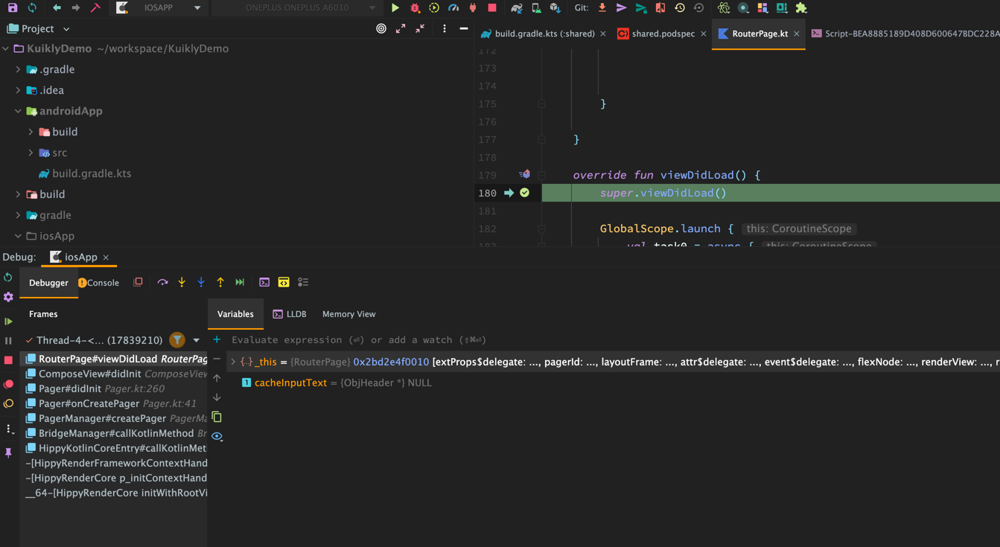

# iOS平台调试

ios平台有两种方式可供调试
1. 使用Android Studio在kmp工程调试: 适合在demo验证期使用
2. 安装第三方插件，在xcode调试: 适合在iOS宿主侧使用

## 使用Android Studio调试

这种方式是复用Android Studio本身的调试能力

## 使用XCode调试

安装<a href="https://github.com/touchlab/xcode-kotlin" target="_blank">xcode-kotlin插件</a>。按照官方提供的指引即可在xcode中调试。下面是实际中使用xcode调试kotlin代码的例子:

<video src="https://vfiles.gtimg.cn/wuji_dashboard/xy/componenthub/Re2j2xSy.mov" width=100% controls="controls"></video>
