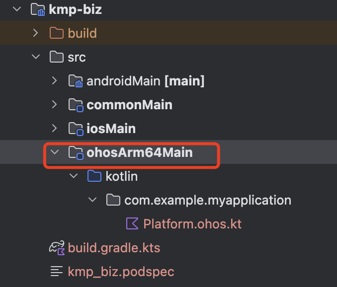

# KMP模块鸿蒙Kotlin/Native适配

在Kuikly工程中，可能会需要集成本地其他KMP模块。目前官方的KMP模块还不支持编译到鸿蒙平台，为了使Kuikly工程在集成其他KMP模块后仍能编译到鸿蒙平台，需要对KMP模块进行鸿蒙Kotlin/Native的适配。现假设你的Kuikly工程目录如下：

<div align="center">

</div>

其中，`kmp-biz`是`shared`模块依赖的其他KMP模块，对`kmp-biz`进行鸿蒙Kotlin/Native适配需要以下步骤：

## 使用定制化Kotlin版本
Kuikly定制化了特定的Kotlin版本，以支持鸿蒙Kotlin/Native编译。

1. 添加maven源

maven("https://mirrors.tencent.com/nexus/repository/maven-public/")

2. 设置依赖插件的版本

修改`kmp-biz`模块的`build.gradle.kts`，将`kotlin("multiplatform")`插件的版本设为`2.0.21-KBA-004`

```gradle
plugins {
    kotlin("multiplatform").version("2.0.21-KBA-004")
    ...
}
```

## 配置鸿蒙平台Target

### 配置ohosArm64编译目标

在KMP模块的`build.gradle.kts`中加入鸿蒙平台`ohosArm64`编译目标

<div align="center">

</div>

:::tip 注意
如果业务KMP模块只作为子模块被依赖的话，只需要添加`ohosArm64()`即可。如果业务KMP模块需要单独打包成so产物接入到鸿蒙工程，则需要在`ohosArm64`中加上`binaries.sharedLib()`，之后即可单独为该KMP模块打包so产物和头文件，打包方式见[生成so产物和头文件](./harmony-dev.md#生成so产物和头文件)
:::

### 添加鸿蒙平台目录ohosArm64Main

多平台函数`expect fun`同样需要在鸿蒙平台实现，因此需要在KMP模块中添加平台目录`ohosArm64Main`，实现鸿蒙平台的`actual fun`。


<div align="center">

</div>

### 配置依赖关系

如果ohosArm64Main有其他依赖，需要在KMP模块`build.gradle.kts`文件中的`sourceSets`中配置

<div align="center">

</div>

:::tip 注意
完成以上配置后，如果在工程sync的时候报错，可以尝试注释掉其他平台的target，单独sync鸿蒙平台。
:::

## 开发KMP鸿蒙平台代码

完成以上配置后，即可在业务KMP模块进行鸿蒙平台相关开发与集成。如果业务在KMP模块开发过程中需要对鸿蒙平台的相关代码进行互相调用，可以使用[knoi插件](https://github.com/Tencent-TDS/KuiklyBase-components/tree/master/knoi)，knoi插件的接入和使用方式参见github仓库readme文档。

:::tip 注意
如果业务KMP模块使用了knoi插件对鸿蒙平台的相关代码进行互相调用，则该KMP模块与依赖该模块的Kuikly模块均无法动态化。如需要动态化，可通过Kuikly扩展Module的方式解耦调用业务KMP模块产物，详见[扩展原生API](./expand-native-api.md)
:::
