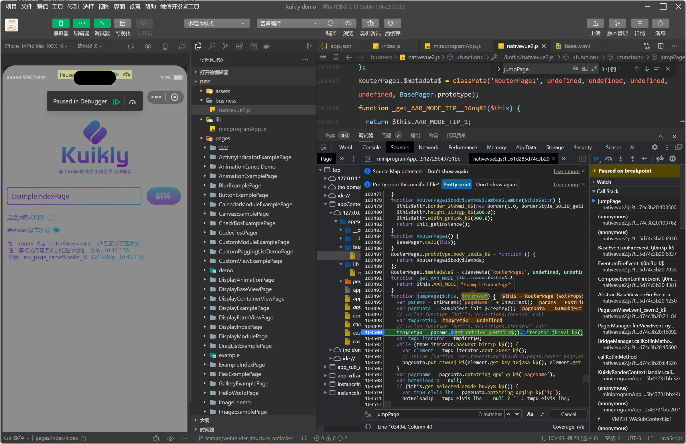
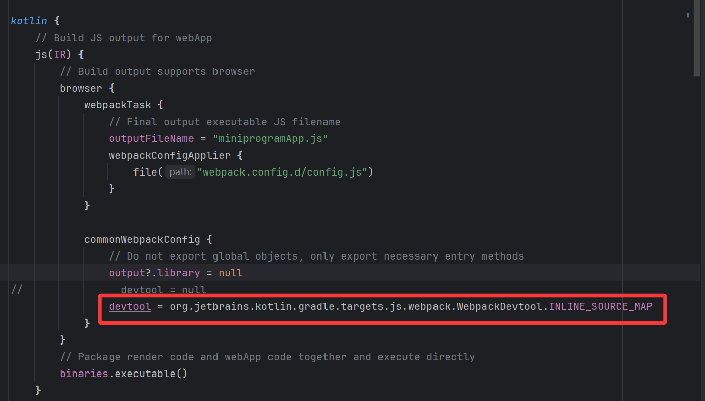
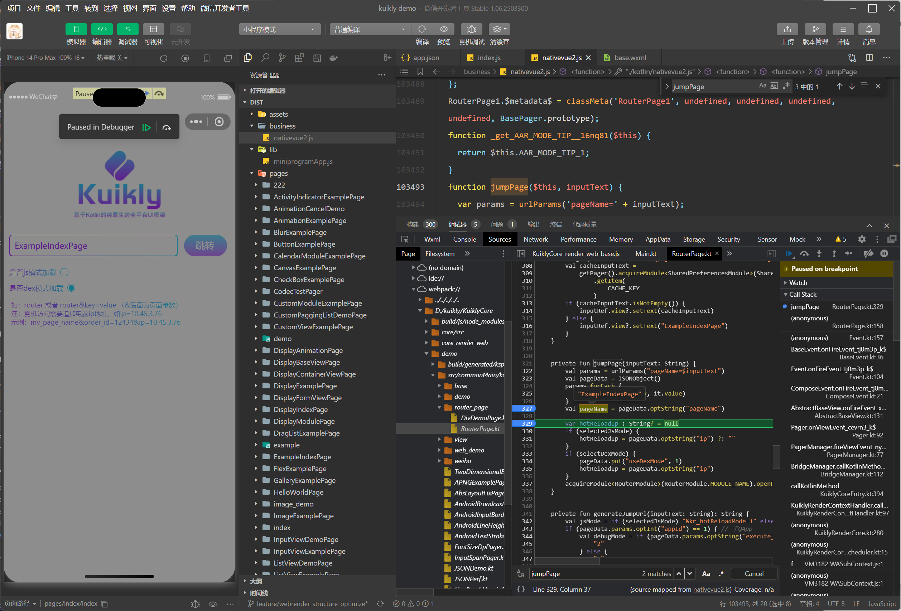

# 微信小程序平台调试

``Kuikly``在微信小程序平台运行时，与正常的微信小程序应用是没有差别，可以编译出开发模式的产物，然后直接使用微信开发者工具来调试

## 配置 sourcemap

如果要调试 ``kotlin`` 源码，则需要配置 ``sourcemap``，在微信小程序项目工程 miniApp 和业务工程的 shared 目录中的 build.gradle.kts 文件中开启 ``sourcemap`` 即可(注意小程序不支持eval，部分sourcemap选项是无法工作的，建议配置inline_source_map，生产环境建议不要配置sourcemap)

配置完，就可以在微信小程序开发者工具中，看到Kotlin文件，直接在kotlin文件上打断点

