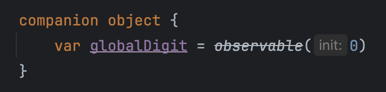

# 多页面场景案例与原理解析

本章节，我们将介绍应用中的多个Kuikly页面如何进行交互和数据传递。

## 场景案例
这是一个简单的页面，点击数字会使数字+1，点击“open”会打开同一页面的另一个实例。
::: tabs
@tab:active 示例

```kotlin
@Page("foo")
internal class FooPage : BasePager() {

    private var digit by observable(0)
    private val routerModule by lazy(LazyThreadSafetyMode.NONE) {
        acquireModule<RouterModule>(RouterModule.MODULE_NAME)
    }

    override fun body(): ViewBuilder {
        val ctx = this
        return {
            attr {
                allCenter()
            }
            Text {
                attr {
                    text(ctx.digit.toString())
                    fontSize(100f)
                }
                event {
                    click {
                        ++ctx.digit
                    }
                }
            }
            Text {
                attr {
                    text("open")
                }
                event {
                    click {
                        ctx.routerModule.openPage("foo")
                    }
                }
            }
        }
    }
}
```

@tab 效果
<div align="center">
<video src="/assets/multi-page-new-demo.webm" width=360 height=640 controls></video>
</div>
:::

## 数据传递
下面我们修改一下，让打开的第二个页面的数字和第一个页面的数字保持一致。
::: tabs
@tab:active 示例

```kotlin
@Page("foo")
internal class FooPage : BasePager() {

    companion object {
        // 使用全局变量，记录数字
        private var globalDigit = 0
    }
    // 使用全局变量，初始化当前页面的数字
    private var digit by observable(globalDigit)
    private val routerModule by lazy(LazyThreadSafetyMode.NONE) { ... }

    override fun body(): ViewBuilder {
        val ctx = this
        return {
            attr { ... }
            Text {
                attr { ... }
                event {
                    click {
                        // 同时更新全局变量和当前页面的数字
                        ctx.digit = ++globalDigit
                    }
                }
            }
            Text { ... }
        }
    }
}
```

@tab 内置模式效果
<div align="center">
<video src="/assets/multi-page-init-assemble.webm" width=360 height=640 controls></video>
</div>

@tab 动态化模式效果
<div align="center">
<video src="/assets/multi-page-init-dynamic.webm" width=360 height=640 controls></video>
</div>
:::

可以看出内置模式下第二个页面正确地和第一个页面保持一致，但是在动态化模式下，第二个页面的数字重新从0开始了。

### 原理解析
这是因为**每个动态化页面的数据是互相隔离**的，页面直接无法使用全局变量来共享数据。

### 正确做法
正确的跨页面传递数据的方式是使用[页面数据PagerData](page-data.md)传递初始数据；使用[Kuikly页面事件通知](notify.md)来进行页面间的交互。

::: tabs
@tab:active 示例

```kotlin
@Page("foo")
internal class FooPage : BasePager() {

    private var digit by observable(0)
    private val routerModule by lazy(LazyThreadSafetyMode.NONE) { ... }
    private val notifyModule by lazy(LazyThreadSafetyMode.NONE) {
        acquireModule<NotifyModule>(NotifyModule.MODULE_NAME)
    }
    private lateinit var notifyRef: CallbackRef

    override fun created() {
        super.created()
        // 从PagerData（页面数据）中获取初始值
        digit = pageData.params.optInt("digit")
        // 监听页面事件通知
        notifyRef = notifyModule.addNotify("digit_change") {
            // 更新当前页面的数字
            digit = it?.optInt("digit") ?: return@addNotify
        }
    }

    override fun pageWillDestroy() {
        // 移除页面事件通知
        notifyModule.removeNotify("digit_change", notifyRef)
        super.pageWillDestroy()
    }

    override fun body(): ViewBuilder {
        val ctx = this
        return {
            attr { ... }
            Text {
                attr { ... }
                event {
                    click {
                        val newDigit = ++ctx.digit
                        // 发送页面事件通知
                        ctx.notifyModule.postNotify(
                            eventName = "digit_change",
                            eventData = JSONObject().put("digit", newDigit)
                        )
                    }
                }
            }
            Text {
                attr {
                    text("open")
                }
                event {
                    click {
                        // 打开第二个页面，并传递PagerData（页面数据）
                        val param = JSONObject().put("digit", ctx.digit)
                        ctx.routerModule.openPage("foo", param)
                    }
                }
            }
        }
    }
}
```

@tab 效果
<div align="center">
<video src="/assets/multi-page-notify.webm" width=360 height=640 controls></video>
</div>
:::

## 页面作用域
:::tip 提问
对于非动态化的页面，是否可以使用全局的observable变量来同时控制多个页面的状态？
:::

**答案是否定的。**

首先，当我们尝试在`companion object`中创建一个`observable`变量时，IDE会提示`observable`方法已经被弃用，



原因是`observable`需要`PageScope`（页面作用域）的上下文，我们需要在一个有效的`PgageScope`（例如`Pager`）中创建`observable`对象。

让我们再修改一下：

::: tabs
@tab:active 示例

```kotlin{4-15}
@Page("foo")
internal class FooPage : BasePager() {

    companion object {
        private var globalDigit: ReadWriteProperty<Any, Int>? = null
    }

    init {
        // 在Pager中创建observable变量
        if (globalDigit == null) {
            globalDigit = observable(0)
        }
    }

    private var digit by globalDigit!!
    private val routerModule by lazy(LazyThreadSafetyMode.NONE) { ... }

    override fun body(): ViewBuilder { ... }
}
```

@tab 效果
<div align="center">
<video src="/assets/multi-page-observable-scope.webm" width=360 height=640 controls></video>
</div>

:::

在这个例子中，虽然在第二个页面打开时全局observable传递了正确的值，但是在第二个页面上点击却未能驱动第二个页面的更新，回到第一个页面时发现，第一个页面的数字更新了。

### 原理解析
observable与创建它的`PageScope`（页面作用域）是绑定关系，虽然我们把`observable`变量放在了`companion object`中，但是它依然只能驱动创建它的Pager的UI更新。

## 总结
1. 动态化页面与其它页面的数据是隔离的，不能直接使用全局变量来共享数据；
2. 使用[页面数据PagerData](page-data.md)和[Kuikly页面事件通知](notify.md)来进行动态化页面与其它页面的数据交互；
3. `observable`只能驱动创建它的`PageScope`的UI更新，不能跨页面使用。
