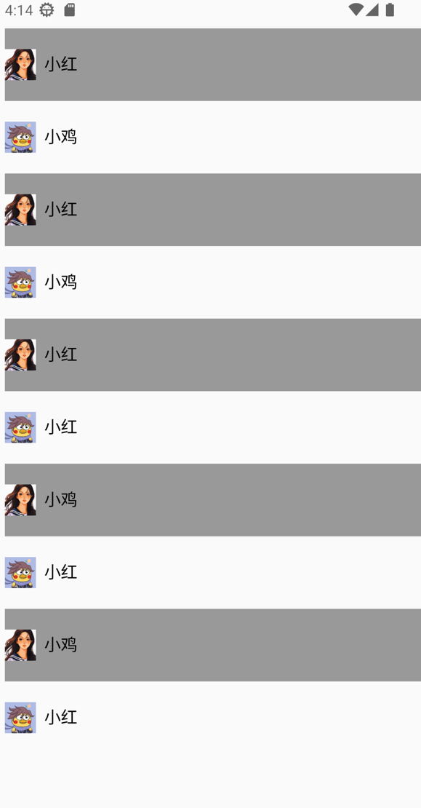

# 发送网络请求

``Kuikly``提供了**NetworkModule**，供业务发送HTTP请求。下面我们来学习，在``Kuikly``中如何发送HTTP请求

## 发送GET请求

我们以URL: 
<br>https://11006487-ff05-41ed-98bd-200377b92859.mock.pstmn.io/NetworkModule 
<br>作为请求例子, 来讲解如何发送HTTP GET请求

该url返回json格式数据，其中**dataList**表示列表，在列表item中，含有**avatar**和**name**字段。

具体参考[Demo使用示例](https://github.com/Tencent-TDS/KuiklyUI/blob/main/demo/src/commonMain/kotlin/com/tencent/kuikly/demo/pages/demo/NetworkPage.kt)

```json
{
    "dataList": [
        {
            "avatar": "https://vfiles.gtimg.cn/wuji_dashboard/xy/componenthub/SmA5owm4.jpeg",
            "name": "小红"
        },
        {
            "avatar": "https://vfiles.gtimg.cn/wuji_dashboard/xy/componenthub/nm6gqV8J.jpeg",
            "name": "小鸡"
        },
        {
            "avatar": "https://vfiles.gtimg.cn/wuji_dashboard/xy/componenthub/SmA5owm4.jpeg",
            "name": "小红"
        },
        {
            "avatar": "https://vfiles.gtimg.cn/wuji_dashboard/xy/componenthub/nm6gqV8J.jpeg",
            "name": "小鸡"
        },
        {
            "avatar": "https://vfiles.gtimg.cn/wuji_dashboard/xy/componenthub/SmA5owm4.jpeg",
            "name": "小红"
        },
        {
            "avatar": "https://vfiles.gtimg.cn/wuji_dashboard/xy/componenthub/nm6gqV8J.jpeg",
            "name": "小红"
        },
        {
            "avatar": "https://vfiles.gtimg.cn/wuji_dashboard/xy/componenthub/SmA5owm4.jpeg",
            "name": "小鸡"
        },
        {
            "avatar": "https://vfiles.gtimg.cn/wuji_dashboard/xy/componenthub/nm6gqV8J.jpeg",
            "name": "小红"
        },
        {
            "avatar": "https://vfiles.gtimg.cn/wuji_dashboard/xy/componenthub/SmA5owm4.jpeg",
            "name": "小鸡"
        },
        {
            "avatar": "https://vfiles.gtimg.cn/wuji_dashboard/xy/componenthub/nm6gqV8J.jpeg",
            "name": "小红"
        }
    ]   
}
```

下面我们来看，如何请求数据，并将数据显示到UI上

::: tabs

@tab:active 示例

```kotlin{8-16}
@Page("3")
internal class NetworkPage : Pager() {

    var profileItemList by observableList<ProfileItem>()

    override fun created() {
        super.created()
        acquireModule<NetworkModule>(NetworkModule.MODULE_NAME).httpRequest("https://11006487-ff05-41ed-98bd-200377b92859.mock.pstmn.io/NetworkModule", false, param = JSONObject().apply {
            put("id", 1)
        }, responseCallback = {data, success, errorMsg ->
            val dataList = data.optJSONArray("dataList") ?: JSONArray()
            val size = dataList.length()
            for (i in 0 until size) {
                profileItemList.add(ProfileItem().decode(dataList.optJSONObject(i) ?: JSONObject()))
            }
        })
    }

    override fun body(): ViewBuilder {
        val ctx = this
        return {
            List {
                attr {
                    marginTop(30f)
                    flex(1f)
                }

                vforIndex({ ctx.profileItemList }) { item, index, count ->
                    View {
                        attr {
                            height(70f)
                            flexDirectionRow()
                            alignItemsCenter()
                            marginLeft(8f)
                            if (index % 2 == 0) {
                                backgroundColor(Color.GRAY)
                            }
                        }

                        Image {
                            attr {
                                size(30f, 30f)
                                src(item.avatar)
                            }
                        }
                        Text {
                            attr {
                                marginLeft(8f)
                                fontSize(16f)
                                color(Color.BLACK)
                                text(item.name)
                            }
                        }
                    }
                }
            }
        }
    }
}

internal class ProfileItem {
    var name = ""
    var avatar = ""

    fun decode(itemJSONObject: JSONObject): ProfileItem {
        name = itemJSONObject.optString("name")
        avatar = itemJSONObject.optString("avatar")
        return this
    }
}
```

@tab 效果

<div align="center">

</div>

:::

在上面的代码中, 我们在created方法中，使用**NetworkModule**发送了HTTP GET请求, 然后在回包中解析数据, 最后绑定到UI上。

## 发送POST请求

**NetworkModule**支持发送HTTP POST请求，使用方式与GET请求基本一致，这里不做详细演示, 大家可以参考[NetworkModule文档](../API/modules/network.md)
