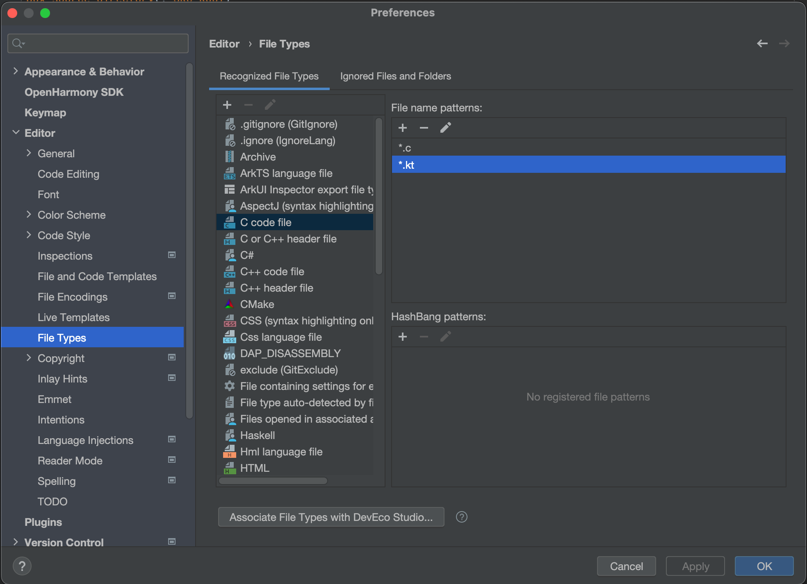
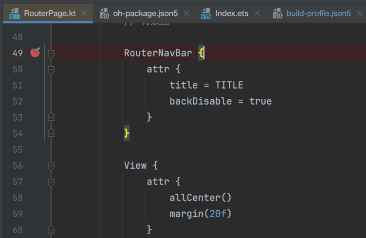
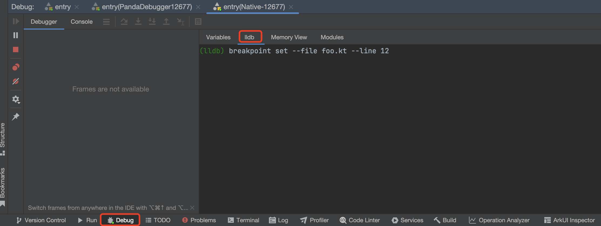
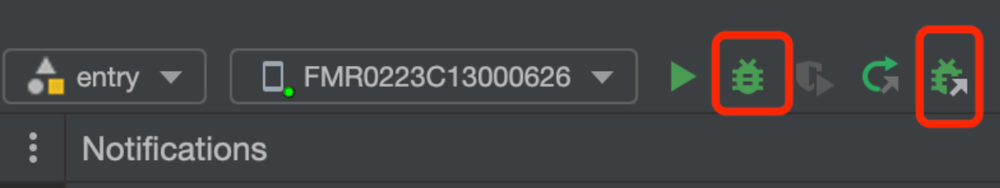
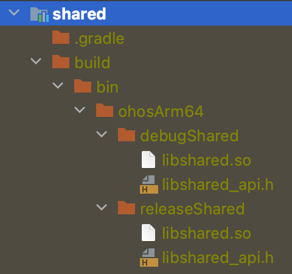
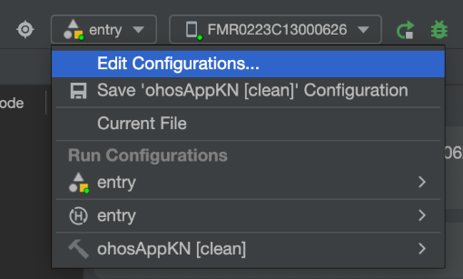
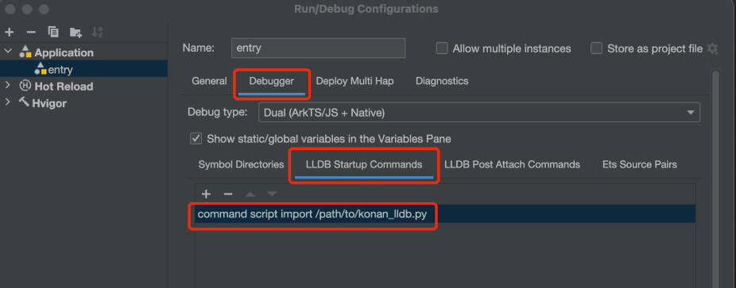
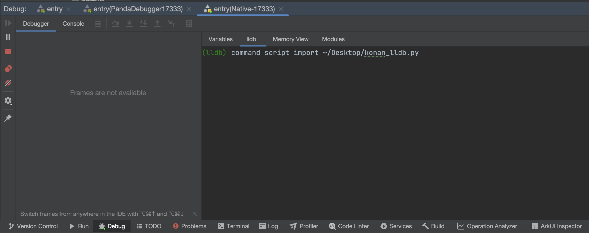
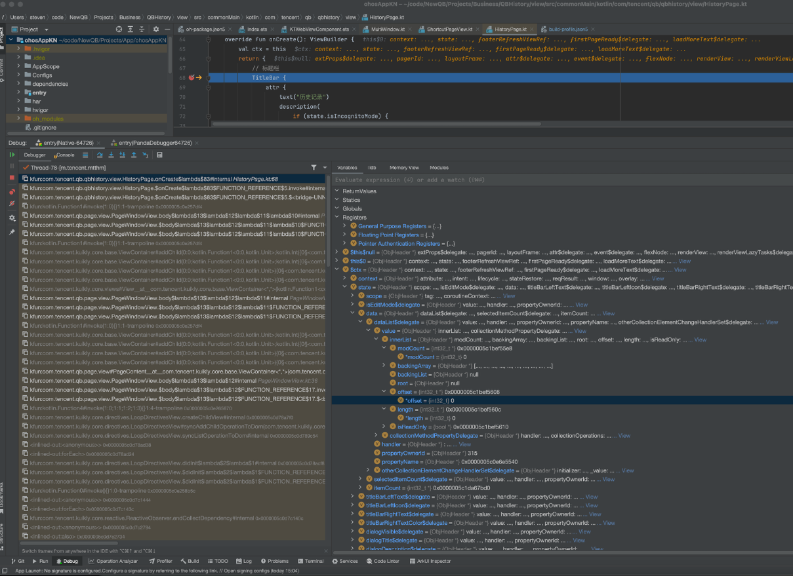

# 鸿蒙平台调试

在开发模式上，日常需求开发阶段，建议以安卓平台开发调试工具为主。在遇到鸿蒙平台特有相关问题时，可按本文档指引，从鸿蒙宿主侧进行调试分析。

## Kotlin版本选择

设置kotlin版本和maven源如下

Kotlin版本：kotlinVersion=2.0.21-KBA-004

maven源：maven("https://mirrors.tencent.com/nexus/repository/maven-public/")


## IDE设置

打开DevEco Studio，并设置使其识别kt文件，以方便通过ide进行断点设置。
Preferences -> Editor -> File Types，选中C code file，右侧pannel中点击加号增加*.kt条目




## 断点设置指引

* 方式1

进行上述IDE设置后，可将对应的kt文件拖到鸿蒙IDE，这时可正常同其他文件一样，为文件设置断点。



* 方式2
在鸿蒙IDE Debug->debugger->lldb窗口中 用命令行进行设置用命令行进行断点设置

``` shell
(lldb) breakpoint set --file foo.kt --line 12
```


## 断点调试

### Debug/Attach调试目标进程


* 方式1

在鸿蒙DevEco IDE中点击Debug按钮调试App

* 方式2

如果App已经事先运行起来，可点右侧按钮Attach进程

这两种方式调试器attach上后，会有以下提示：

``` log
************** start native debugger process ****************
11/25 17:10:58: Native Debug Started
11/25 17:10:59.002: library-loaded,target-name="...appspawn" ...
11/25 17:11:03.591: library-loaded,target-name="[vdso]"...
... 其他library-loaded日志 ....
11/25 17:11:03: Debuggee Program Continued, total time spent: 5809 ms
```
:::tip 注意
调试Kotlin跨端代码，需使用debug产物
<div>

</div>
:::

## 加载Kotlin调试脚本
对于2.0.21-KBA-004kotlin版本，需下载[konan_lldb.py](https://vfiles.gtimg.cn/wuji_dashboard/xy/starter/2a6c8dff.py)文件
加载文件有两中方式，一种自动，一种手动，一般而言，如果不介意加载脚本带来的轻微启动耗时，建议在ide配置自动加载。

### 自动加载

点击module名称下拉框，点Edit Configurations



点击Debugger Tab，选中LLDB Startup Commands Tab，并输入加载命令




### 手动加载
手动加载即是在需要用到kotlin调试到时候，手工在lldb命令窗口中输入加载指令
鸿蒙IDE Debug->debugger->lldb窗口

``` shell
(lldb) command script import ~/Desktop/konan_lldb.py
Success
```


:::tip 注意
Kotlin调试脚本命名必须是``konan_lldb.py``
:::

### 执行业务逻辑断点命中后检查变量情况



## KuiklyBase鸿蒙调试插件
通过上述方式，可以实现Kotlin 跨端代码与鸿蒙 ArkTS 的联合调试，但现有流程仍需较多人工操作。为进一步提升开发效率，Kuikly 团队计划推出鸿蒙调试插件，进一步提升调试体验。具体进展可关注[Roadmap](../Blog/roadmap2025.md)鸿蒙调试插件开发进度。