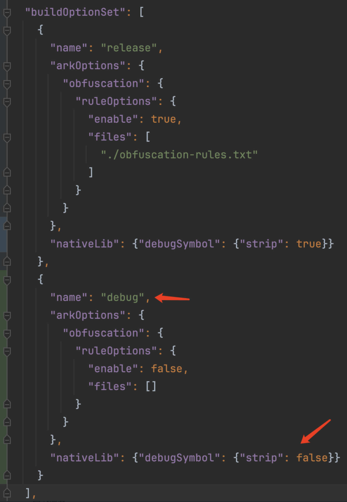
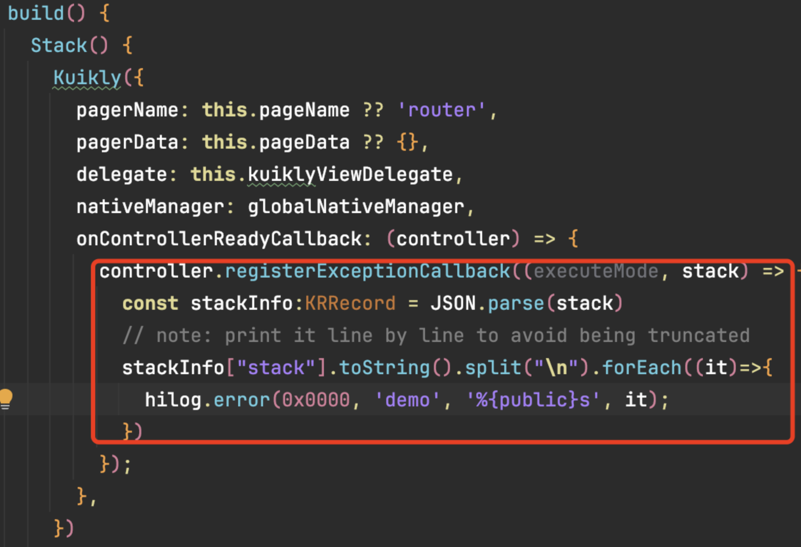
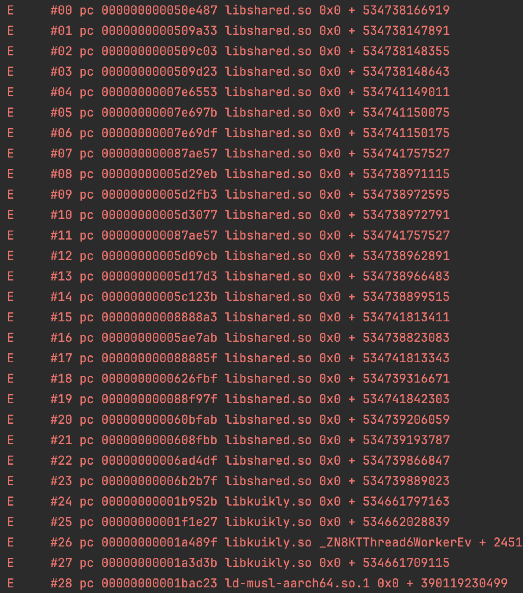
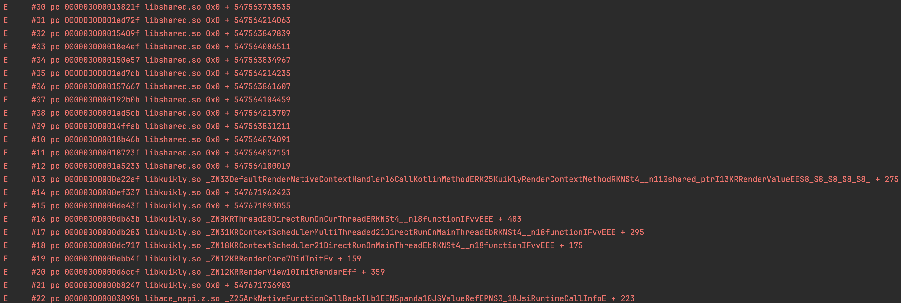

# 鸿蒙KN堆栈符号翻译

## 1.编译选项设置

### Kotlin侧设置

在build.gradle.kts中配置堆栈回溯能力为libbacktrace。
<br>参考源码工程：demo 模块配置。

:::danger 注意
1. 由于libbacktrace性能消耗大，所以只建议在Debug中使用。
2. 性能一般的设备上libbacktrace也可能导致断点调试超时，因此在断点调试的时候也建议不要启用libbacktrace，性能特别好的设备除外。
:::

```gradle.kts
kotlin {
    ...
    ohosArm64 {
        binaries.sharedLib(){
            if(debuggable){
                freeCompilerArgs += "-Xadd-light-debug=enable"
                freeCompilerArgs += "-Xbinary=sourceInfoType=libbacktrace"
            }else{
                freeCompilerArgs += "-Xadd-light-debug=enable"
                freeCompilerArgs += "-Xbinary=sourceInfoType=noop"
            }
        }
        val main by compilations.getting
    }
    ...
}
```


### 鸿蒙侧设置

编译打包的时候，鸿蒙默认会有符号移除操作，因此，需要显式在build-profile.json5中，为debug build配置保留符号。
<br>参考源码工程：core-render-ohos/entry 模块配置。

```json5
  "buildOptionSet": [
    ...
            
    {
      "name": "debug",
      "arkOptions": {
        "obfuscation": {
          "ruleOptions": {
            "enable": false
          }
        }
      },
      "nativeLib": {
        "debugSymbol": {
          "strip": false
        }
      }
    }

  ...
  ]
```




## 2.堆栈信息输出

### 回调注册
Kuikly默认会尽可能catch住业务kotlin的异常，避免整个app闪退，并通过回调进行输出。
业务可通过注册回调获得这些被统一捕获到到异常：

```ts
    onControllerReadyCallback: (controller) => {
      controller.registerExceptionCallback((executeMode, stack) => {
        const stackInfo:KRRecord = JSON.parse(stack)
        stackInfo["stack"].toString().split("\n").forEach((it)=> {
          hilog.error(0x0000, 'demo', '%{public}s', it)
        })
      })
    }
```



### Debug Build输出示例
经过上述的编译选项设置和异常回调注册后，将可获得包括文件名行号在内的具体信息


### Release Build输出示例
一般在发布包中，Release Build由于移除了符号，无法自动还原到符号信息。这种情况一般有以下两种符号还原方式。


#### Crash监控后台自动还原
发版本时将符号表上传到Crash监控平台。收到回调时，可将堆栈以及产物对应的uuid上报到监控后台。Crash监控平台可通过uuid匹配符号表，并自动进行符号还原。
<br>以Bugly平台为例，可通过Bugly的postCustomError接口进行Crash上报。同时发版时将符号表自动推送到Bugly平台，即可在Bugly Crash详情查看带符号的堆栈信息。

#### 本地手动还原
KN的异常堆栈入下图所示，每行末尾括号中的是Kuikly修正后的符号地址，可以使用鸿蒙SDK中的llvm-addr2line工具以及带符号表的so文件，还原出调用堆栈。

```shell
> {OpenHarmonySDK路径}/native/llvm/bin/llvm-addr2line -a -C -i -f -e libshared.so 00000000001ad72f
0x1ad72f
kfun:kotlin.collections.ArrayList#get(kotlin.Int){}1:0
/Users/xxx/WorkSpace/external/kotlin/libraries/stdlib/native-wasm/src/kotlin/collections/ArrayList.kt:56
kfun:com.tencent.ohosdemo.test.body$lambda$2$lambda$1$lambda$0#internal
/Users/xxx/AndroidStudioProjects/ohosdemo/shared/src/commonMain/kotlin/com/tencent/ohosdemo/test.kt:20
```
OpenHarmonySDK路径一般为`DevEco-Studio`安装路径下: 

`/Applications/DevEco-Studio.app/Contents/sdk/default/openharmony/`
