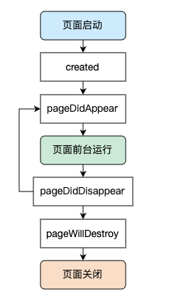

# Pager生命周期

在``Kuikly``中, ``Pager``作为承载页面UI的容器, 它的生命周期如下:

1. **created**: ``Pager``已经创建, 可以在此方法内进行初始化和数据拉取操作, 此方法会在``body``方法前调用
2. **pageDidAppear**: ``Pager``在屏幕上可见, 可以在此方法做一些页面可见性的操作
3. **pageDidDisappear**: ``Pager``不可见
4. **pageWillDestroy**: 页面即将销毁，可以在此方法内做一些释放工作

::: tip 注意
`pageWillDestroy`回调函数中无法通过Module调用Native方法，如有需要可以考虑在原生侧的生命周期函数中调用
:::

## 下一步

下一步我们接着学习``Kuikly``中[页面事件](pager-event.md)