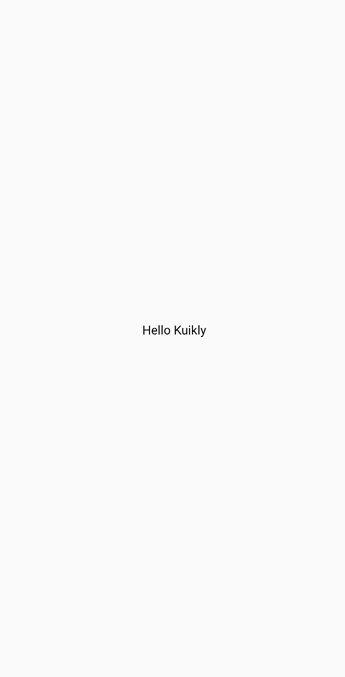

# 页面入口Pager

``Pager``作为``Kuikly``页面的入口类，类似``Android``的``Activity``和``iOS``的``VC``。``KuiklyCore``在运行时，根据各个的平台``Kuikly``容器跳转``Kuikly``页面时，
传递过来的``pageName``来找到对应的``Pager``创建闭包，最后创建对应``Pager``类。

## 使用@Page注解注册Pager

当你编写一个``Kuikly``页面时，你需要新建一个类，然后继承``Pager``, 接着在新建的类上添加``@Page``, 将``Pager``注册到``KuiklyCore``中

```kotlin
@Page("HelloWorld")
internal class HelloWorldPage : Pager() {
    ...
}
```

## 实现body方法, 返回UI结构描述

当一个类继承Pager后, 必须要实现的方法为：``body``方法，``body``方法用于返回**页面UI结构描述的闭包**, 然后``KuiklyCore``根据返回的``body``方法返回的闭包来创建页面的UI。

::: tabs

@tab:active 示例

```kotlin
@Page("HelloWorld")
internal class HelloWorldPage : Pager() {

    override fun body(): ViewBuilder {
        return {
            attr {
                allCenter()
            }

            Text {
                attr {
                    text("Hello Kuikly")
                    fontSize(14f)
                }
            }
        }
    }
}
```

@tab 效果

<div align="center">

</div>

:::

在上述代码中,``body``方法返回了一个``Text``文本组件，并指定了文本的值和字体大小；同时也指定了``Pager``中的组件居中布局。
运行以上代码后，你将得到一个居中显示的文本

## 下一步

对``Kuikly``中的``Pager``有了基本的了解以后，下一步我们来学习``Kuikly``中[页面数据PagerData](page-data.md)