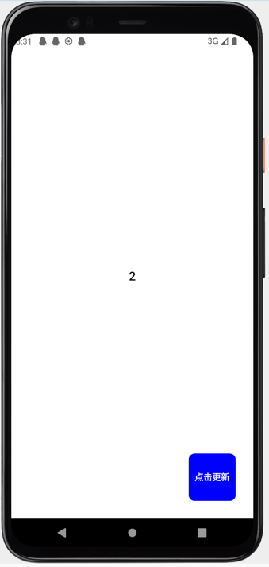

# UI响应式更新

在客户端原生开发中，我们更新UI的步骤通常为：
1. 更新数据
2. 拿到``View``引用
3. 将数据设置给``View``

而在``Kuikly``中，我们可省掉这些步骤，**只专注于数据的更新**，``KuiklyCore``会负责帮你将数据更新到``UI``。举个例子：

::: tabs

@tab:active 示例

```kotlin
@Page("HelloWorldPage")
internal class HelloWorldPage : Pager() {

    private var counter by observable(0)

    override fun body(): ViewBuilder {
        val ctx = this
        return {
            attr {
                backgroundColor(Color.WHITE)
                justifyContentCenter()
                alignItemsCenter()
            }

            Text {
                attr {
                    text(ctx.counter.toString())
                    fontSize(20f)
                    fontWeightBold()
                }
            }

            Button {
                attr {
                    absolutePosition(bottom = 30f, right = 30f)
                    size(80f, 80f)

                    borderRadius(10f)
                    backgroundColor(Color.BLUE)

                    titleAttr {
                        text("点击更新")
                        fontSize(15f)
                        color(Color.WHITE)
                        fontWeightBold()
                    }
                }

                event {
                    click {
                        ctx.counter++
                    }
                }
            }
        }
    }
}
```

@tab 效果

<div align="center">

</div>

:::

在这个例子中，含有一个居中的Text组件和右下角有一个Button组件。在Text组件中，我们将``counter``变量的值设置给Text组件，
然后我们监听了Button组件的click事件，并在click事件触发的时候，对``counter``变量进行累加，每次累加的时候，你会发现Text的文本会自动更新。

## 响应式字段observable<``T``>

在上述例子中，为什么Text组件的文本会自动更新呢? 答案是Text组件的text属性绑定了一个响应式字段``counter``。
``counter``字段与普通的变量不一样，它通过``by observable``代理，将字段变成一个响应式字段, 这样当响应式字段被设置到组件的属性后, 每次响应式字段更新时, 依赖该字段的属性都会自动更新，
从而到达UI属性响应式更新的目的。

<br/>

在``Kuikly``中，你可以通过``by observable<``T``>``将一个字段变成响应式字段，然后绑定到UI组件的属性，这样UI组件的属性就能自动监听数据变化而自动更新, 例如:

```kotlin
private var counter by observable(0)
```

## 响应式容器observableList<``T``>()和observableSet<``T``>()

在``Kuikly``中，响应式字段可分为两类
1. **单值类型**: ``observable<T>()``
2. **容器类型**: ``observableList<T>()``, ``observableSet<T>()``

其中``observableList``和``observableSet``为响应式容器, 常用于结合``vfor``语句来用来循环创建列表下的Item, 并且当往响应式容器添加数据时, 列表能够自动新建Item。

举个例子:

::: tabs

@tab:active 示例

```kotlin{4,26}
@Page("HelloWorldPage")
internal class HelloWorldPage : Pager() {

    private var list by observableList<String>()

    override fun created() {
        super.created()
        // mock data
        for (i in 0 until 10) {
            list.add(i.toString())
        }
    }

    override fun body(): ViewBuilder {
        val ctx = this
        return {
            attr {
                backgroundColor(Color.WHITE)
            }

            List {
                attr {
                    flex(1f)
                }

                vfor({ ctx.list }) { item ->
                    View {
                        attr {
                            flexDirectionRow()
                            margin(20f)
                        }

                        Text {
                            attr {
                                text(item)
                                fontSize(20f)
                                fontWeightBold()
                            }
                        }

                        Image {
                            attr {
                                marginLeft(20f)
                                size(50f, 50f)
                                src("https://vfiles.gtimg.cn/wupload/xy/componenthub/TbyiIqBP.jpeg")
                            }
                        }
                    }
                }
            }
        }
    }
}
```

@tab 效果

<div align="center">

</div>

:::

在上面的例子中，我们先通过by observableList<``T``>声明了一个响应式容器, 并在``List``组件下将容器绑定在``vfor``语句的闭包中, 让List的列表具有自动更新的能力。
例如，一开始我们往数据list容器添加10个数据，因此当开始运行的时候，``List``组件下会有10个Item。当我们在运行时的某个时刻往数据list中再添加一个数据，此时你会发现List组件会自动创建第11个Item。

## 下一步

在这节中，我们学习了如何使用响应式字段和响应式容器来达到UI自动更新的目的。下一步，我们来学习``Kuikly``中的[语句指令](directive.md)
