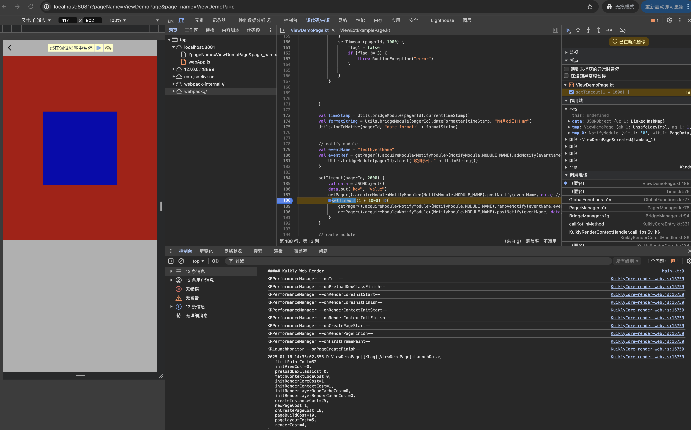
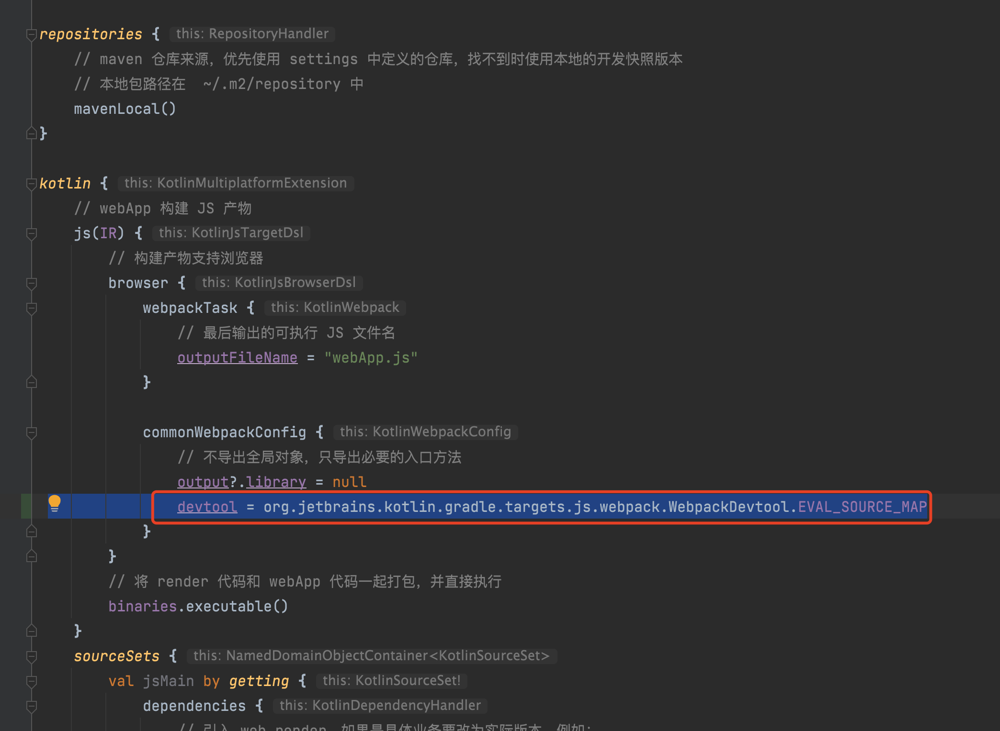

# H5平台调试

``Kuikly``在H5平台运行时，与正常的H5应用是没有差别，可直接使用``Chrome``等浏览器调试

## 配置 sourcemap

如果要调试 ``kotlin`` 源码，则需要配置 ``sourcemap``，在H5项目工程 h5App 和业务工程的 shared 目录中的 build.gradle.kts 文件中开启 ``sourcemap`` 即可

