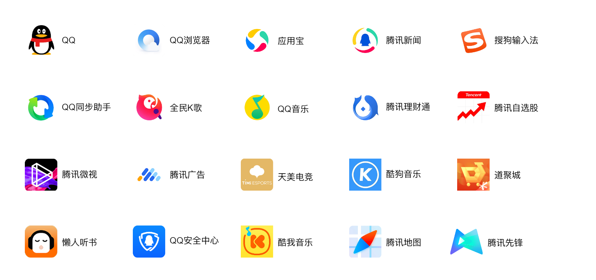
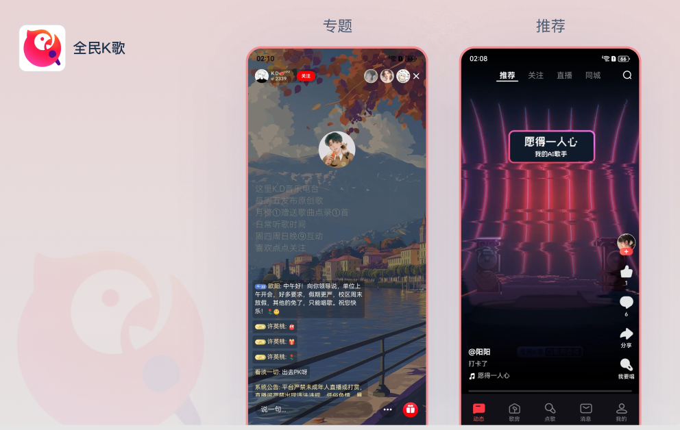
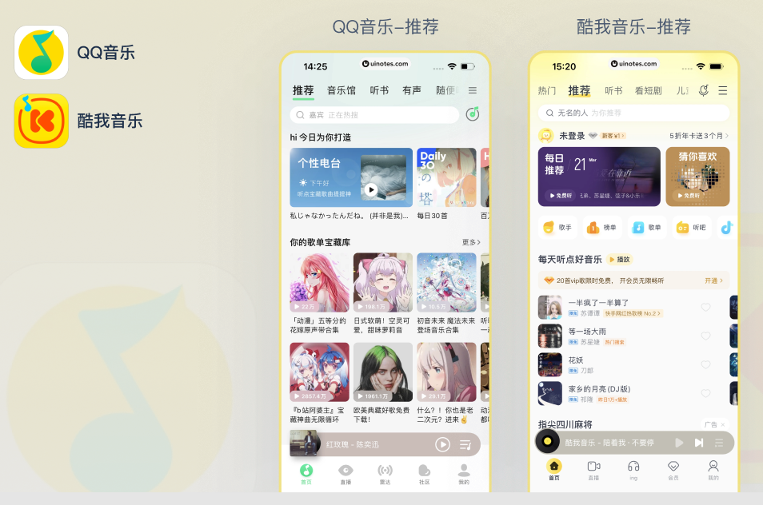
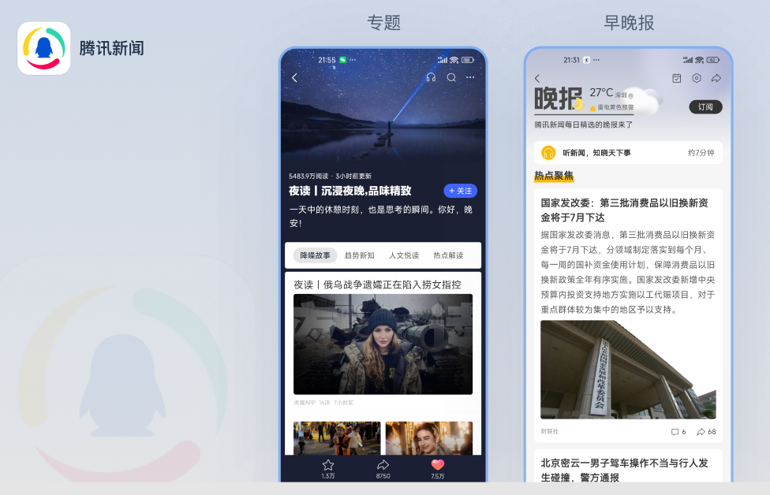
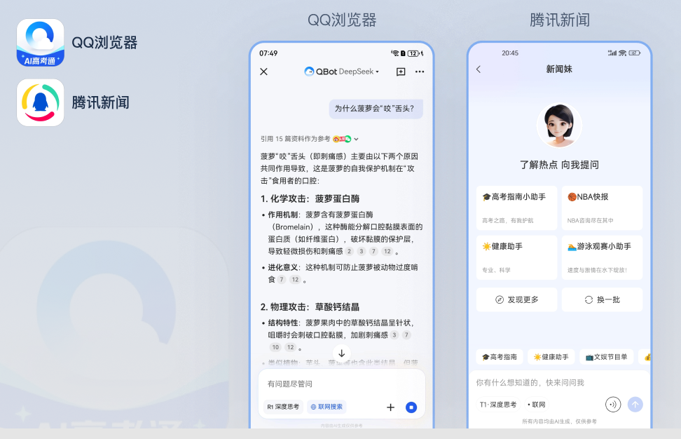
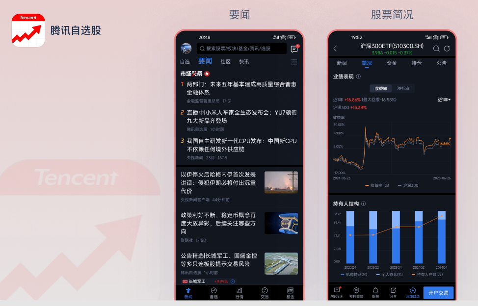
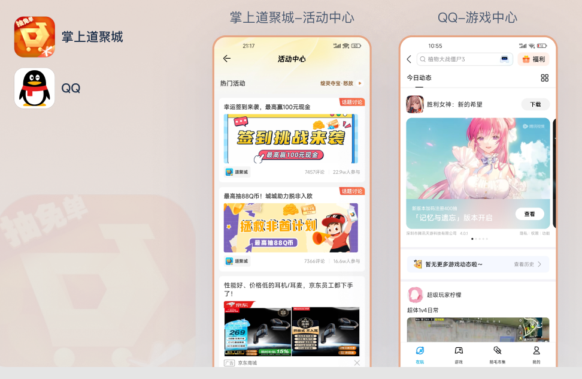
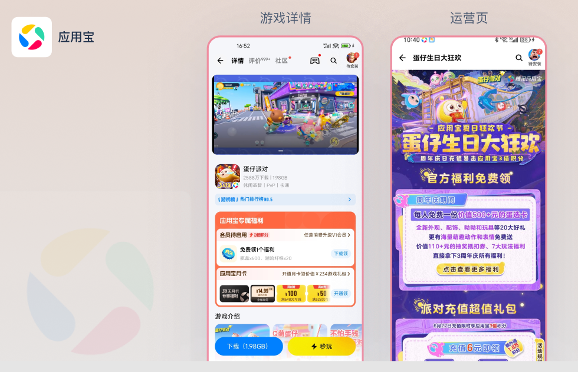

# 应用场景案例
Kuikly以其原生级性能体验、高性能动态化、原生技术栈、支持鸿蒙平台等特色，在腾讯是一款非常受欢迎的跨平台开发框架。目前Kuikly已经有20+业务深度使用，页面数1000+，日活用户5亿+，满足了这些业务在众多场景下的各类复杂需求。下面从业务接入和典型应用场景，列举部分应用场景案例，以供体验和参考。
 同时，开源后，很多业务已在积极体验并接入到项目进行跨平台开发。当前这些业务均在开发阶段，待上线后，在征得同意的情况下，也会逐步选择一些典型业务将其加入到业务接入和应用场景案例中。

## 使用业务

## 典型场景
1. **短视频直播**

2. **音乐**

3. **信息Feeds流**

4. **AI对话**

5. **金融**

6. **游戏社区**

7. **高性能动态化运营场景**

