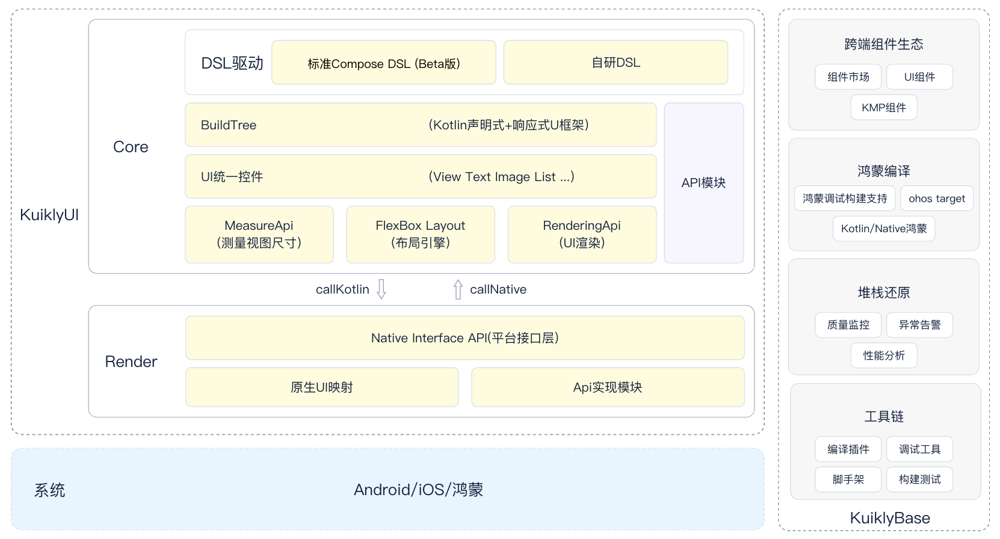

# 架构介绍

## Kuikly概念

``Kuikly``是基于``Kotlin MultiPlatform(KMP)``构建的跨端开发框架。它利用了``KMP``逻辑跨平台的能力, 并抽象出通用的跨平台UI渲染接口，复用平台的UI组件，从而达到UI跨平台，具有轻量、高性能、可动态化等优点；同时，KuiklyBase基建同样支持逻辑跨端。

## Kuikly整体架构

1. **KuiklyUI**

- Core模块
  - 提供跨端的高级组件、动画、手势、布局等能力
  - API模块:提供统一的API接口
  - DSL驱动:支持标准Compose DSL (Beta版）和自研DSL
- Render模块
  - 支持Android、iOS、HarmonyOS和H5/微信小程序等多个平台

2. **KuiklyBase**

> 在打造`kuikly`过程中沉淀的下来的一套基于kotlin的跨端基建能力和设施，侧重高性能的逻辑跨端，结合`kuikly` UI框架助力业务**打造完整全面的跨端App**。

- 鸿蒙平台支持
  - 支持KN鸿蒙编译以及鸿蒙调试构建

- 组件生态
  - 兼容标准的Kotlin Multiplatform组件，可复用业界成熟的KMP组件生态 
  - 未来会建设KuiklyBase组件市场，进一步扩充`kuikly`组件生态

- 强大的多线程协程能力
  - 支持跨端并行处理复杂业务逻辑，满足高性能场景需求
  - 提供标准的Kotlin多线程协程能力，并扩展鸿蒙端支持

- 完善的开发工具链
  - 从脚手架到调试、构建、发布，监控全流程覆盖。
    在打造`kuikly`过程中，[Bugly](https://bugly.tds.qq.com/v2/index/tds-main)和[Shiply](https://shiply.tds.qq.com/?utm_source=kuikly&source=kuikly&utm_medium=referral)与`kuikly`密切配合，提供了匹配`kuikly`特性的配套能力，推荐使用
    - Bugly 支持查看`kuikly`的质量监控、异常告警和性能分析
    - Shiply 提供`kuikly`全流程发布，同时联动Bugly，在发布过程中提供`kuikly`质量指标的监控和自动止损能力
  - 内置性能优化工具，让您的应用运行更快
  - 优化鸿蒙与iOS调试体验，debug数据更快更全
