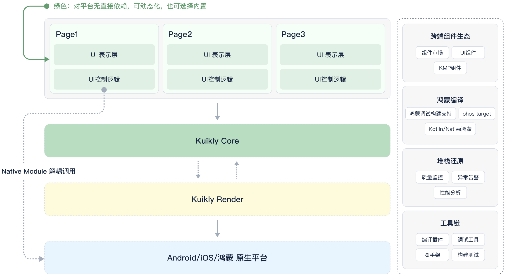
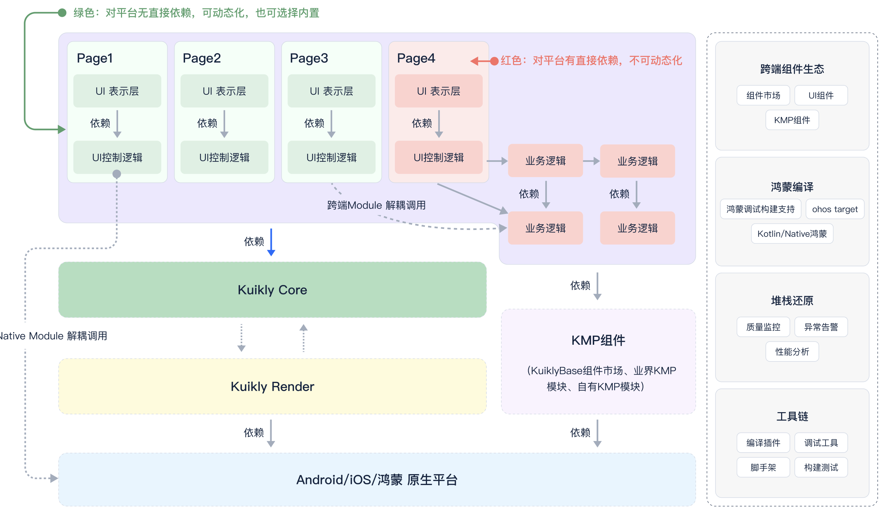
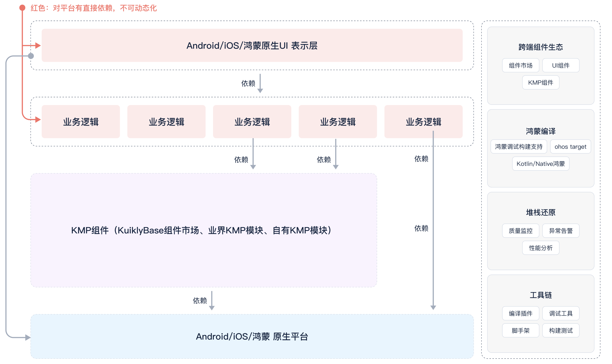

# 跨端工程模式

### 1. 标准模式

标准模式是业务使用最多的模式，在这个模式中业务使用Kuikly进行页面的开发，其中每个Page都用Kuikly DSL和Kotlin来实现，包含了UI及其配套逻辑，结构如图所示。

> * UI表示层：通过Kuikly DSL实现UI页面
> * UI控制逻辑：通过kotlin实现业务逻辑，控制UI的展示

* 特点
  * 业务代码（绿框部分）可以进行内置，也可以动态化方式下发

* 约束
  1. 使用单线程模型，逻辑完全在kuikly线程中执行
  2. 不直接依赖平台能力，当确实需要平台能力的时候，通过Module方式进行解耦，避免形成依赖
  3. 不能依赖使用协程或带有`{platform}Main`的KMP组件

### 2. 进阶模式

有些时候随着跨端提效的要求进一步提高，业务往往不满足于标准模式，希望在提效上更进一步，把更多的底层逻辑通过跨端实现。可以参考下图结构，可以把底层逻辑实现到跨端层。
其中绿色部分可动态化也可内置，红色部分只能内置。

> * UI表示层：通过Kuikly DSL实现UI页面
> * UI控制逻辑：通过kotlin实现业务逻辑，控制UI的展示
> * 业务逻辑：泛指通过kotlin实现业务逻辑，比如底层的网络请求、回包处理、数据存储等模块逻辑

* 特点
  1. 在Kuikly单线程模型，基础上，业务可以使用协程、多线程等能力
  2. 可使用丰富的KMP组件
  
进阶模式灵活性自由度很高，其模块页面分为两种类型：**可动态化类型**(内置和动态灵活切换)、**纯内置类型**(只能内置)。业务可按需选择，确定页面类型后，要注意如下相关类型的使用约束：

1. 可动态化类型

  * 不可直接依赖平台能力
  * 不可使用多线程，协程只支持[Kuikly内建协程](../DevGuide/thread-and-coroutines.md#kuikly-coroutinescope-api)
  * 不可依赖内置部分
  * 不可依赖使用到了平台能力的KMP组件，如果无法避免需要使用相关能力，请通过Kuikly Module方式进行解耦调用
  
2. 纯内置类型

该类型属于标准的KMP模块，可以使用业界组件，遵从标准KMP开发方式。

  * 可直接依赖平台能力
  * 可使用多线程和协程
  * 如果使用到多线程或者协程，***更新Kuikly UI***的时务必***切换回Kuikly线程***进行更新！！！

:::tip 注意
1. 在实际项目中，可动态化和纯内置两种类型会同时存在，其中动态化类型页面也可保留内置版本，运营过程中按需下发动态化版本。
2. 动态化时产物会运行在js环境中，由于js单线程、无法直接提供平台能力等限制，决定了动态化部分不能直接使用多线程和平台能力，
所以业务在开发过程中需要特别注意在调用平台能力的时候需要通过Kuikly Module方式进行解耦调用，避免直接依赖。
:::

当前，动态化部分和平台能力之间的解耦需要业务手工进行，有一定工作量，所以Kuikly计划在未来在解耦合方面继续做一些改进，比如：
1. 支持Kotlin跨端实现内置Module，并进行自动化/半自动桥接，当前规划中，如果有需求，可以与我们联系
2. 自动解耦方案，当前规划中，如果有需求，可与我们联系

### 3. 纯逻辑跨端模式

在实际项目中，有些业务各端都已经有UI层的实现，仅仅需要非UI的业务逻辑实现跨端。
通过KuiklyBase的基础设施，也可满足这种场景的需求。

> * 业务逻辑：泛指通过kotlin实现业务逻辑，比如底层的网络请求、回包处理、数据存储等模块逻辑

