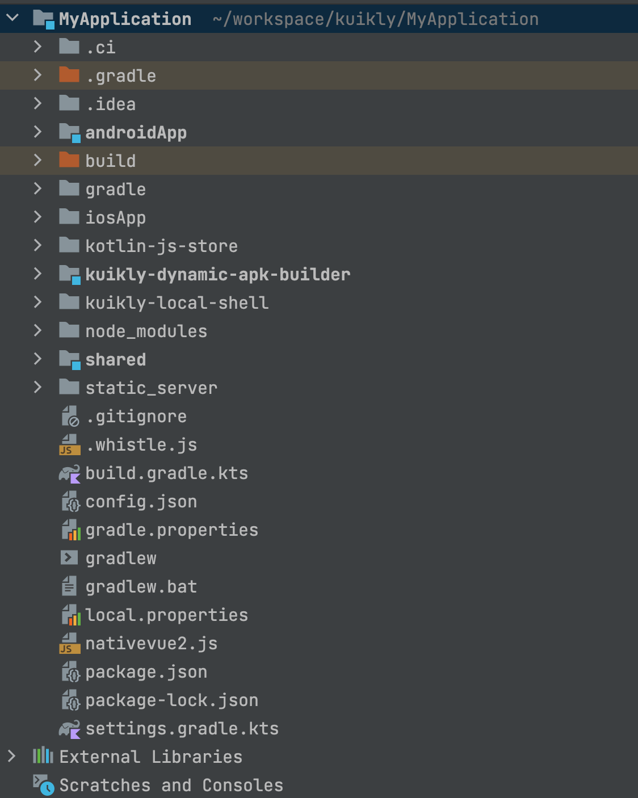

# 微信小程序工程接入

:::tip 注意
本文档旨在说明Kuikly项目微信小程序相关工程的接入，接入之前您应该已经有了Kuikly的工程，包括了Android和iOS，如果您还没有Kuikly工程，请先参考[编写第一个Kuikly页面](hello-world.md)进行工程创建
:::

## 新建项目

### 新建App目录

首先我们要新建miniApp项目，我们以kuikly工程的示例项目为例进行说明。

<div align="left">

</div>

我们有形如这样的目录结构，其中androidApp为安卓宿主APP，iosApp为iOS的宿主APP，shared则是平台无关的业务逻辑代码。
然后我们要在项目根目录下新建 miniApp 目录，目录结构如下：

<div align="left">

</div>

build.gradle.kts：项目构建配置文件<br>
kotlin：业务逻辑代码<br>
dist：微信小程序壳工程

### 配置项目

接下来我们要将我们的miniApp项目加入到整体的项目依赖中

```gradle{6-8}
# 根目录 settings.gradle.kts
# 添加 miniApp 的依赖
include(":miniApp")
```

此时我们的 miniApp 被添加到项目依赖中，我们可以配置项目构建相关逻辑了。
然后我们在 miniApp 目录下新建 build.gradle.kts 文件，内容如下：

``` gradle{6-8}
import java.nio.file.Paths

plugins {
    // Import KMM plugin
    kotlin("multiplatform")
}

kotlin {
    // Build JS output for webApp
    js(IR) {
        // Build output supports browser
        browser {
            webpackTask {
                // Final output executable JS filename
                outputFileName = "miniApp.js"
                webpackConfigApplier {
                    val tempConfigFile = File(projectDir.absolutePath, "/webpack.config.d/config.js")
                    tempConfigFile.parentFile.mkdirs()
                    // use node target
                    tempConfigFile.writeText("""
                        config.target = 'node';
                    """.trimIndent())
                    file(tempConfigFile.absolutePath)
                }
            }

            commonWebpackConfig {
                // Do not export global objects, only export necessary entry methods
                output?.library = null
                devtool = null
            }
        }
        // Package render code and webApp code together and execute directly
        binaries.executable()
    }
    sourceSets {
        val jsMain by getting {
            dependencies {
                // Import web render
                implementation(project(":core-render-web:base"))
                implementation(project(":core-render-web:miniapp"))
            }
        }
    }
}

// Business project path name
val businessPathName = "demo"

/**
 * Copy locally built unified JS result to miniApp's dist/business directory
 */
fun copyLocalJSBundle(buildSubPath: String) {
    // Output target path
    val destDir = Paths.get(project.buildDir.absolutePath, "../",
        "dist", "business").toFile()
    if (!destDir.exists()) {
        // Create directory if it doesn't exist
        destDir.mkdirs()
    } else {
        // Remove original files if directory exists
        destDir.deleteRecursively()
    }

    val sourceDir = Paths.get(
        project.rootDir.absolutePath,
        businessPathName,
        "build", buildSubPath
    ).toFile()

    // Copy files
    project.copy {
        // Copy js files from business build result
        from(sourceDir) {
            include("nativevue2.js")
        }
        into(destDir)
    }
}

project.afterEvaluate {

    tasks.register<Copy>("syncRenderProductionToDist") {
        from("$buildDir/productionExecutable")
        into("$projectDir/dist/lib")
        include("**/*.js", "**/*.d.ts")
    }

    tasks.register<Copy>("syncRenderDevelopmentToDist") {
        from("$buildDir/developmentExecutable")
        into("$projectDir/dist/lib")
        include("**/*.js", "**/*.d.ts")
    }

    tasks.register<Copy>("copyAssets") {
        val assetsDir = Paths.get(
            project.rootDir.absolutePath,
            businessPathName,
            "src/commonMain/assets"
        ).toFile()
        from(assetsDir)
        into("$projectDir/dist/assets")
        include("**/**")
    }


    tasks.named("jsBrowserProductionWebpack") {
        finalizedBy("syncRenderProductionToDist")
    }

    tasks.named("jsBrowserDevelopmentWebpack") {
        finalizedBy("syncRenderDevelopmentToDist")
    }

    tasks.register("jsMiniAppProductionWebpack") {
        group = "kuikly"
        // First execute jsBrowserProductionWebpack build task
        dependsOn("jsBrowserProductionWebpack")
        // Then copy corresponding nativevue2.zip from business build result and copy nativevue2.js to miniApp's release directory
        copyLocalJSBundle("productionExecutable")
    }

    tasks.register("jsMiniAppDevelopmentWebpack") {
        group = "kuikly"
        // First execute jsBrowserDevelopmentWebpack build task
        dependsOn("jsBrowserDevelopmentWebpack")
        // Then copy corresponding nativevue2.zip from business build result and copy nativevue2.js to miniApp's release directory
        copyLocalJSBundle("developmentExecutable")
    }
}

```

需要重点注意的是，build.gradle.kts 中有 kuikly core 和 core 注解的依赖引入，这里需要改为实际的版本，可以参考 shared 目录中 build.gradle.kts 中的依赖，使用该版本依赖即可。webRender 的版本目前先固定引入上面配置中的版本

完成后可以在 Build 中 同步一下新依赖

<div align="left">

</div>

此时我们项目配置完成，接下来进行 webRender 的接入

## WebRender接入

miniApp 项目配置完成后，即可进行 webRender 的接入。

### 实现代理接口

我们首先在 miniApp/src/jsMain/kotlin 下新建 KuiklyWebRenderViewDelegator.kt 文件，内容如下：

``` kotlin
// KuiklyWebRenderViewDelegator.kt
import com.tencent.kuikly.core.render.web.IKuiklyRenderExport
import com.tencent.kuikly.core.render.web.runtime.miniapp.expand.KuiklyRenderViewDelegator
import com.tencent.kuikly.core.render.web.expand.KuiklyRenderViewDelegatorDelegate
import com.tencent.kuikly.core.render.web.runtime.miniapp.core.Transform
import components.KRMyView
import components.KRWebView
import dom.MiniWebViewElement
import module.HRBridgeModule
import module.HRCacheModule

/**
 * Implement the delegate interface provided by Web Render
 */

class KuiklyWebRenderViewDelegator : KuiklyRenderViewDelegatorDelegate {

    // mini render delegate
    val delegate = KuiklyRenderViewDelegator(this)

    /**
     * Register custom modules
     */
    override fun registerExternalModule(kuiklyRenderExport: IKuiklyRenderExport) {
        // Register bridge module
        kuiklyRenderExport.moduleExport(HRBridgeModule.MODULE_NAME) {
            HRBridgeModule()
        }
        kuiklyRenderExport.moduleExport(HRCacheModule.MODULE_NAME) {
            HRCacheModule()
        }
        super.registerExternalModule(kuiklyRenderExport)
    }

    override fun registerExternalRenderView(kuiklyRenderExport: IKuiklyRenderExport) {
        super.registerExternalRenderView(kuiklyRenderExport)

        // Add template alias for custom views
        Transform.addComponentsAlias(
            MiniWebViewElement.NODE_NAME,
            MiniWebViewElement.componentsAlias
        )
        
        // Register custom views to enable miniapp <web-view>
        kuiklyRenderExport.renderViewExport(KRWebView.VIEW_NAME, {
            KRWebView()
        })
        
        // Register custom views
        kuiklyRenderExport.renderViewExport(KRMyView.VIEW_NAME, {
            KRMyView()
        })
    }
}


```

本文件用于实现 webRender 提供的代理接入，传入 web 页面初始化相关参数，以及进行自定义模块/自定义view的注册等。

### 自定义模块

KuiklyWebRenderViewDelegator中依赖的HRBridgeModule内容如下：

``` kotlin
// module/HRBridgeModule.kt
package module

import com.tencent.kuikly.core.render.web.export.KuiklyRenderBaseModule
import com.tencent.kuikly.core.render.web.ktx.KuiklyRenderCallback
import com.tencent.kuikly.core.render.web.nvi.serialization.json.JSONException
import com.tencent.kuikly.core.render.web.nvi.serialization.json.JSONObject
import com.tencent.kuikly.core.render.web.runtime.miniapp.core.NativeApi
import com.tencent.kuikly.core.render.web.utils.Log
import kotlin.js.json

/**
 * Bridge interface module used by business side
 */
class HRBridgeModule : KuiklyRenderBaseModule() {
    override fun call(method: String, params: String?, callback: KuiklyRenderCallback?): Any? {
        return when (method) {
            "toast" -> {
                showToast(params)
            }
            else -> {
                Log.error("$method not found")
                callback?.invoke("{}")
            }
        }
    }

    private fun showToast(params: String?) {
        if (params == null) {
            return
        }
        try {
            val data = JSONObject(params)

            val icon = mapOf(
                1 to "success",
                2 to "error",
                3 to "none"
            )[data.optInt("mode")] ?: "none"
            
            // NativeApi.plat.showToast = wx.showToast
            NativeApi.plat.showToast(
                json(
                    "title" to data.optString("content"),
                    "icon" to icon
                )
            )
        } catch (e: JSONException) {
            console.error("toast json parse error", e)
        }
    }
    companion object {
        const val MODULE_NAME = "HRBridgeModule"
    }
}

```

如果要实现自定义扩展模块，可以参考HRBridgeModule的实现

``` kotlin
package components

import com.tencent.kuikly.core.render.web.export.IKuiklyRenderViewExport
import com.tencent.kuikly.core.render.web.runtime.miniapp.dom.MiniDivElement
import com.tencent.kuikly.core.render.web.runtime.miniapp.dom.MiniSpanElement
import org.w3c.dom.Element

class KRMyView : IKuiklyRenderViewExport {
    private val div = MiniDivElement()
    override val ele: Element
        get() = div.unsafeCast<Element>()
    private val innerText = MiniSpanElement()

    init {
        ele.appendChild(innerText.unsafeCast<Element>())
    }

    override fun setProp(propKey: String, propValue: Any): Boolean {
        return when (propKey) {
            MESSAGE -> {
                innerText.textContent = propValue.unsafeCast<String>()
                return true
            }

            else -> super.setProp(propKey, propValue)
        }
    }

    companion object {
        const val MESSAGE = "message"
        const val VIEW_NAME = "KRMyView"
    }
}

```
如果要实现自定义view,可以参考这个KRMyView

### 页面接入

以上步骤完成后，即可进行页面的接入，在 kotlin 目录下新建 Main.kt，内容如下：

``` kotlin
import com.tencent.kuikly.core.render.web.collection.FastMutableMap
import com.tencent.kuikly.core.render.web.ktx.SizeI
import com.tencent.kuikly.core.render.web.runtime.miniapp.MiniDocument
import com.tencent.kuikly.core.render.web.runtime.miniapp.core.App
import com.tencent.kuikly.core.render.web.runtime.miniapp.core.NativeApi

const val TAG = "Main"

fun main() {
    App.onShow {
        console.log(TAG, "app show")
    }

    App.onLaunch {
        console.log(TAG, "app launch")
    }

    App.onHide {
        console.log(TAG, "app hide")
    }
}

/**
 *  Mini program page entry, use renderView delegate method to initialize and create renderView
 */
@JsName(name = "renderView")
@JsExport
@ExperimentalJsExport
fun renderView(json: dynamic) {
    // Write to global render function
    val renderParams = FastMutableMap<String, dynamic>(json)
    // View size
    var size: SizeI? = null
    if (json.width != null && json.height != null) {
        size = SizeI(json.width.unsafeCast<Int>(), json.height.unsafeCast<Int>())
    }

    MiniDocument.initPage(renderParams) { pageId: Int, pageName: String, paramsMap: FastMutableMap<String, Any> ->
        val systemInfo = NativeApi.plat.getSystemInfoSync()
        val isAndroid = systemInfo.platform == "android"
        val params = paramsMap["param"].unsafeCast<FastMutableMap<String, Any>>()
        params["is_wx_mp"] = "true"

        paramsMap["platform"] = if (isAndroid) "android" else "iOS"
        paramsMap["isIOS"] = !isAndroid
        paramsMap["isIphoneX"] = !isAndroid && systemInfo.safeArea.top > 30
        
        KuiklyWebRenderViewDelegator().delegate.onAttach(
            pageId,
            pageName,
            paramsMap,
            size,
        )
    }
}

/**
 * Register callback methods on the mini program App object, needs to be called in the app.js of the mini program
 */
@JsName(name = "initApp")
@JsExport
@ExperimentalJsExport
fun initApp(options: dynamic = js("{}")) {
    App.initApp(options)
}

```
小程序模版的配置，内容可以参考dist目录
此时我们项目接入已经完成，如有问题也可以参考我们github中的miniApp项目内容进行调整

## 项目启动

```shell
# 运行 shared 项目 dev server 服务器，没有安装 npm 包则先 npm install 安装一下依赖
npm run serve
#  构建 shared 项目 Debug 版
./gradlew :shared:packLocalJsBundleDebug
```

然后构建 miniApp 项目
```shell
#  运行 miniApp 服务器 Debug 版
./gradlew :miniApp:jsMiniAppDevelopmentWebpack
# 复制业务的assets文件到小程序目录
./gradlew :miniApp:copyAssets
```

构建 release 版本
```shell
# 首先构建业务 Bundle
./gradlew :demo:packLocalJSBundleRelease

# 然后构建 miniApp
./gradlew :miniApp:jsMiniAppProductionWebpack
```

使用微信小程序开发者工具打开miniApp下的dist目录，根据你的实际页面，修改app.json里面的pages数组和在pages里新建对应的页面。
然后编译即可看到微信小程序的效果
(如果发现Demo路由页没有成功跳转页面, 可以检查是否有在 miniApp/dist/pages 下新建页面模版，可以通过dist/create_page.sh脚本来生成)
```javascript
// 例如demo里存在router的Page, 就需要在app.json的pages数组里添加 "pages/router/index", 同时在pages的目录里新建router目录补充和pages/index目录一样的内容

// pages/index/index.js内容
var render = require('../../lib/miniApp.js')
render.renderView({
    // 这里的pageName是最高优先级，如果没配置，会去拿微信小程序启动参数里的page_name，如果都没有会报错
    // 建议微信小程序的第一个页面必须配置pageName
    // pageName: "router",
    statusBarHeight: 0 // 如果要全屏，需要把状态栏高度设置为0
})
```
## 补充说明

### 微信小程序平台逻辑处理
如果业务逻辑中需要对来自微信小程序平台的进行特殊逻辑处理，可以在Main.kt文件业务入口中，添加业务代码中通过 pageData.params.optString("is_wx_mp") == "1" 来进行处理，比如微信小程序登录等等
### 特殊样式设置
由于微信小程序的某些特性比如滚动条是否隐藏必须通过 WXSS 来设置，因此无法通过编程实现，所以目前是通过在微信小程序壳工程里的app.wxss里添加对应样式实现


