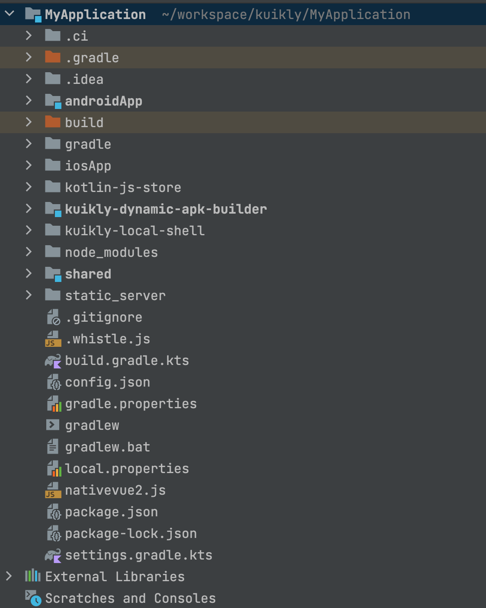
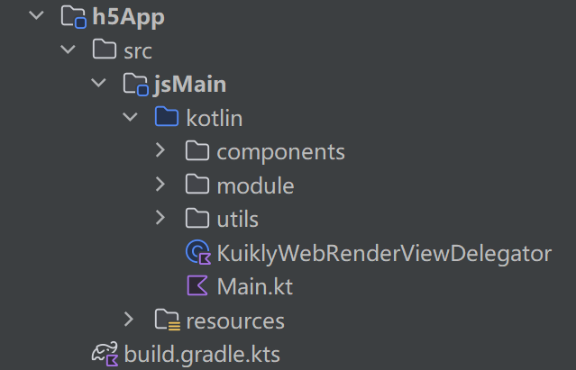
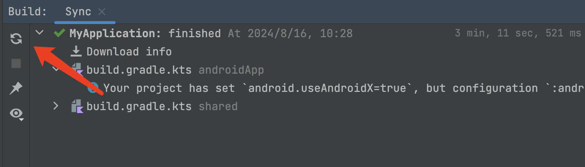

# H5工程接入

:::tip 注意
本文档旨在说明Kuikly项目H5相关工程的接入，接入之前您应该已经有了Kuikly的工程，包括了Android和iOS，如果您还没有Kuikly工程，请先参考[编写第一个Kuikly页面](hello-world.md)进行工程创建
:::

## 新建项目

### 新建App目录

首先我们要新建h5App项目，我们以kuikly工程的示例项目为例进行说明。

<div align="left">

</div>

我们有形如这样的目录结构，其中androidApp为安卓宿主APP，iosApp为iOS的宿主APP，shared则是平台无关的业务逻辑代码。
然后我们要在项目根目录下新建 h5App 目录，目录结构如下：

<div align="left">

</div>

build.gradle.kts：项目构建配置文件<br>
kotlin：业务逻辑代码<br>
resources：资源文件

### 配置项目

接下来我们要将我们的h5App项目加入到整体的项目依赖中

```gradle{6-8}
# 根目录 settings.gradle.kts
# 添加 h5App 的依赖
include(":h5App")
```

此时我们的 h5App 被添加到项目依赖中，我们可以配置项目构建相关逻辑了。
然后我们在 h5App 目录下新建 build.gradle.kts 文件，内容如下：

``` gradle{6-8}
import java.nio.charset.StandardCharsets
import java.nio.file.Files
import java.nio.file.Paths

plugins {
    // Import KMM plugin
    kotlin("multiplatform")
}

repositories {
    // Maven repository source, prioritize using repositories defined in settings,
    // fall back to local development snapshot version if not found
    // Local package path is in ~/.m2/repository
    mavenLocal()
}

kotlin {
    // Build JS output for h5App
    js(IR) {
        // Build output supports browser
        browser {
            webpackTask {
                // Final output executable JS filename
                outputFileName = "h5App.js"
            }

            commonWebpackConfig {
                // Do not export global objects, only export necessary entry methods
                output?.library = null
            }
        }
        // Package render code and h5App code together and execute directly
        binaries.executable()
    }
    sourceSets {
        val jsMain by getting {
            dependencies {
                // Import web render, for specific business should use actual version, for example:
                implementation(project(":core-render-web:base"))
                implementation(project(":core-render-web:h5"))
            }
        }
    }
}

// Business project path name
val businessPathName = "demo"

/**
 * Copy locally built unified JS result to h5App's build/dist/js/productionExecutable/page directory
 */
fun copyLocalJSBundle() {
    // Output target path
    val destDir = Paths.get(project.buildDir.absolutePath,
        "dist/js/productionExecutable", "page").toFile()
    if (!destDir.exists()) {
        // Create directory if it doesn't exist
        destDir.mkdirs()
    } else {
        // Remove original files if directory exists
        destDir.deleteRecursively()
    }

    // Input target path, in demo/outputs/kuikly/js/release/local/nativevue2.zip
    val sourceDir = Paths.get(project.buildDir.absolutePath, "dist/js/productionExecutable", "kotlin2js").toFile()

    // File to be decompressed
    val zipFile = Paths.get(
        project.rootDir.absolutePath,
        businessPathName,
        "build", "outputs", "kuikly", "js", "release", "local", "nativevue2.zip"
    ).toFile()
    // Compressed file directory
    val zipDir = Paths.get(project.buildDir.absolutePath, "dist/js/productionExecutable/kotlin2js").toFile()
    if (!zipDir.exists()) {
        zipDir.mkdirs()
    } else {
        zipDir.deleteRecursively()
    }
    // Decompress
    project.copy {
        from(zipTree(zipFile))
        into(zipDir)
    }
    // Copy files
    project.copy {
        // Copy js files from business build result
        from(sourceDir) {
            include("nativevue2.js")
        }
        into(destDir)
    }
    // Remove redundant decompressed directory kotlin2js
    delete(sourceDir)

}

/**
 * Copy business built page JS result to h5App's build/dist/js/productionExecutable/page directory
 */
fun copySplitJSBundle() {
    // Output target path
    val destDir = Paths.get(project.buildDir.absolutePath,
        "dist/js/productionExecutable", "page").toFile()
    if (!destDir.exists()) {
        // Directory does not exist, create it
        destDir.mkdirs()
    } else {
        // Remove original files if directory exists
        destDir.deleteRecursively()
    }
    // Input target path, in demo/outputs/kuikly/js/release/split/page
    val sourceDir = Paths.get(
        project.rootDir.absolutePath,
        businessPathName,
        "build", "outputs", "kuikly", "js", "release", "split", "page"
    ).toFile()

    // Copy files
    project.copy {
        // Copy js files from business build result
        from(sourceDir) {
            include("*.js")
        }
        into(destDir)
    }
}

/**
 * Generate unified build page html file
 */
fun generateLocalHtml() {
    // File path to be processed
    val filePath = Paths.get(project.buildDir.absolutePath,
        "dist/js/productionExecutable", "index.html")
    val fileContent = Files.readString(filePath)
    // Placeholder to be replaced
    val placeText = "http://127.0.0.1:8899/nativevue2.js"
    // Replace development environment JSBundle link with production environment link
    val updatedContent = fileContent.replace(placeText, "page/nativevue2.js")
    // Write new file content
    Files.writeString(filePath, updatedContent, StandardCharsets.UTF_8)
    // Write success
    println("generate local html file success.")
}

/**
 * Generate page build html file
 */
fun generateSplitHtml() {
    // File path to be processed
    val htmlFilePath = Paths.get(project.buildDir.absolutePath,
        "dist/js/productionExecutable", "index.html")
    val fileContent = Files.readString(htmlFilePath)
    // Placeholder to be replaced
    val placeText = "http://127.0.0.1:8899/nativevue2.js"
    // Need to read all js files in page, get file names, then modify business js in index.html to corresponding
    val pagePath = Paths.get(project.buildDir.absolutePath,
        "dist/js/productionExecutable", "page")
    val pageDir = file(pagePath)
    if (pageDir.exists()) {
        // File names, and change new html file name to page name
        val files = pageDir.listFiles()
        files?.forEach { file ->
            if (file.isFile) {
                val fileName = file.name
                // Replace development environment JSBundle link with production environment link
                val updatedContent = fileContent.replace(placeText, "page/$fileName")
                // File path to be written
                val filePath = Paths.get(project.buildDir.absolutePath,
                    "dist/js/productionExecutable", "${file.nameWithoutExtension}.html")
                // Write new file content
                Files.writeString(filePath, updatedContent, StandardCharsets.UTF_8)
            }
        }
        // Remove index.html
        htmlFilePath.toFile().delete()
        // Write success
        println("generate local html file success.")
    } else {
        // Write failure
        println("generate local html file failure, no such files.")
    }
}

/**
 * Copy business assets resources to h5App's build/dist/js/productionExecutable/page directory
 */
fun copyAssetsResource() {
    // Source target path
    val sourceDir = Paths.get(project.rootDir.absolutePath,
        businessPathName,
        "build",
        "outputs",
        "kuikly",
        "assets")

    if (sourceDir.toFile().exists()) {
        // If directory does not exist, do not process
        // Output target path, in h5App
        val destDir = Paths.get(
            project.rootDir.absolutePath,
            "h5App",
            "build",
            "dist/js/productionExecutable",
            "assets"
        )

        // Copy files
        project.copy {
            // Copy assets resources from business build result to publish directory
            from(sourceDir)
            into(destDir)
        }
    } else {
        print("dest directory not exist")
    }
}

/**
 * Copy assets resources to webpack dev server static directory
 */
fun copyAssetsFileToWebpackDevServer() {
    // Source target path
    val sourceDir = Paths.get(project.rootDir.absolutePath,
        businessPathName,
        "src",
        "commonMain",
        "assets")

    if (sourceDir.toFile().exists()) {
        // If directory does not exist, do not process
        // Output target path, in h5App
        val destDir = Paths.get(
            project.rootDir.absolutePath,
            "h5App",
            "build", "processedResources", "js", "main", "assets"
        )

        // Copy files
        project.copy {
            // Copy assets resources from business build result to deServer directory
            from(sourceDir)
            into(destDir)
        }
    } else {
        print("dest directory not exist")
    }
}

project.afterEvaluate {
    // At this point, project configuration is complete,
    // register build h5 page release version related build methods here

    // Register Release unified packaging processing task
    tasks.register("publishLocalJSBundle") {
        group = "kuikly"

        // First execute h5App build task
        dependsOn("jsBrowserDistribution")
        // Then copy corresponding nativevue2.zip from business build result and copy nativevue2.js
        // to h5App's release directory
        copyLocalJSBundle()
        // Copy assets resources
        copyAssetsResource()
        doLast {
            // Finally modify html file page.js reference
            generateLocalHtml()
        }
    }

    // Register Release page packaging processing task
    tasks.register("publishSplitJSBundle") {
        group = "kuikly"

        // First execute h5App build task
        dependsOn("jsBrowserDistribution")
        // Then copy corresponding page js from business build result to h5App's release directory
        copySplitJSBundle()
        // Copy assets resources
        copyAssetsResource()
        doLast {
            // Finally modify html file page.js reference
            generateSplitHtml()
        }
    }

    // Copy assets resources to devServer directory when using webpack for development debugging
    tasks.register("copyAssetsToWebpackDevServer") {
        copyAssetsFileToWebpackDevServer()
    }
}
```

需要重点注意的是，build.gradle.kts 中有 kuikly core 和 core 注解的依赖引入，这里需要改为实际的版本，可以参考 shared 目录中 build.gradle.kts 中的依赖，使用该版本依赖即可。webRender 的版本目前先固定引入上面配置中的版本

完成后可以在 Build 中 同步一下新依赖

<div align="left">

</div>

此时我们项目配置完成，接下来进行 webRender 的接入

## WebRender接入

h5App 项目配置完成后，即可进行 webRender 的接入。

### 实现代理接口

我们首先在 h5App/src/jsMain/kotlin 下新建 KuiklyWebRenderViewDelegator.kt 文件，内容如下：

``` kotlin
// KuiklyWebRenderViewDelegator.kt
import com.tencent.kuikly.core.render.web.IKuiklyRenderExport
import com.tencent.kuikly.core.render.web.expand.KuiklyRenderViewDelegatorDelegate
import com.tencent.kuikly.core.render.web.ktx.SizeI
import com.tencent.kuikly.core.render.web.runtime.web.expand.KuiklyRenderViewDelegator

/**
 * Implement the delegate interface provided by Web Render
 */
class KuiklyWebRenderViewDelegator : KuiklyRenderViewDelegatorDelegate {
    // web render delegate
    private val delegate = KuiklyRenderViewDelegator(this)

    /**
     * Initialize
     */
    fun init(
        containerId: String,
        pageName: String,
        pageData: Map<String, Any>,
        size: SizeI,
    ) {
        // Initialize and create view
        delegate.onAttach(
            containerId,
            pageName,
            pageData,
            size,
        )
    }

    /**
     * Page becomes visible
     */
    fun resume() {
        delegate.onResume()
    }

    /**
     * Page becomes invisible
     */
    fun pause() {
        delegate.onPause()
    }

    /**
     * Page unload
     */
    fun detach() {
        delegate.onDetach()
    }

    /**
     * Register custom modules
     */
    override fun registerExternalModule(kuiklyRenderExport: IKuiklyRenderExport) {
        super.registerExternalModule(kuiklyRenderExport)

        // Register custom module
        kuiklyRenderExport.moduleExport(KRBridgeModule.MODULE_NAME) {
            KRBridgeModule()
        }
    }

    /**
     * Register custom views
     */
    override fun registerExternalRenderView(kuiklyRenderExport: IKuiklyRenderExport) {
        super.registerExternalRenderView(kuiklyRenderExport)

        // Register custom views
        // kuiklyRenderExport.renderViewExport(KRMyView.VIEW_NAME, {
        //    KRMyView()
        // })
    }
}

```

本文件用于实现 webRender 提供的代理接入，传入 H5页面初始化相关参数，以及进行自定义模块/自定义view的注册等。

### 自定义模块

其中依赖的KRBridgeModule内容如下：

``` kotlin
// module/KRBridgeModule.kt
package module

import com.tencent.kuikly.core.nvi.serialization.json.JSONObject
import com.tencent.kuikly.core.render.web.export.KuiklyRenderBaseModule
import com.tencent.kuikly.core.render.web.ktx.KuiklyRenderCallback
import utils.Ui

/**
 * 业务侧使用的 bridge 接口模块
 */
class KRBridgeModule : KuiklyRenderBaseModule() {
    override fun call(method: String, params: String?, callback: KuiklyRenderCallback?): Any? {
        return when(method) {
            "toast" -> {
                toast(params)
            }
            else -> {
                callback?.invoke(mapOf(
                    "code" to -1,
                    "message" to "方法不存在"
                ))
            }
        }
    }

    /**
     * 页面展示 toast 提示
     */
    private fun toast(params: String?) {
        if (params != null) {
            try {
                val message = JSONObject(params)
                Ui.showToast(message)
            } catch (e: Error) {
                // do nothing
            }
        }
    }

    companion object {
        const val MODULE_NAME = "HRBridgeModule"
    }
}
```

如果要实现自定义扩展模块，可以参考KRBridgeModule的实现。模块中引用的 utils 文件内容如下，关于 kotlin 中如何使用 JS 方法也可以参考此实现：

``` kotlin
// utils/Ui.kt
package utils

import com.tencent.kuikly.core.nvi.serialization.json.JSONObject
import kotlinx.browser.document
import kotlinx.browser.window

/**
 * 申明 JS 执行环境的 url decode 方法
 */
external fun decodeURIComponent(encoded: String): String

/**
 * 统一封装 UI 类操作
 */
object Ui {
    /**
     * 在页面上展示 toast 提示
     */
    internal fun showToast(message: JSONObject) {
        val content = message.optString("content")
        if (content != "") {
            // 展示提示
            val wrapDiv = document.createElement("div")
            val contentDiv = document.createElement("div")
            wrapDiv.classList.add("toast-wrapper")
            contentDiv.classList.add("toast-content")
            contentDiv.innerHTML = content
            wrapDiv.appendChild(contentDiv)
            // 添加 wrap
            document.body?.appendChild(wrapDiv)
            // 定时移除
            window.setTimeout({
                document.body?.removeChild(wrapDiv)
            }, 3000)
        }
    }
}

/**
 * 统一封装 URL 类操作
 */
object URL {
    /**
     * 格式化 url 参数并返回
     */
    internal fun parseParams(url: String): Map<String, String> {
        val params = mutableMapOf<String, String>()
        if (url.contains("?")) {
            val query = url.substringAfter("?")

            if (query != "") {
                // 有查询参数才处理
                query.split("&").forEach { param ->
                    val (name, value) = param.split("=")
                    params[name] = decodeURIComponent(value)
                }
            }
        }

        return params
    }
}
```

### 页面接入

以上步骤完成后，即可进行页面的接入，在 kotlin 目录下新建 Main.kt，内容如下：

``` kotlin
import com.tencent.kuikly.core.render.web.ktx.SizeI
import kotlinx.browser.document
import kotlinx.browser.window
import utils.URL

/**
 * WebApp entry, use renderView delegate method to initialize and create renderView
 */
fun main() {
    console.log("##### Kuikly Web Render")
    // Root container id, note that this needs to match the container id in the actual index.html file
    val containerId = "root"
    val H5Sign = "is_H5"
    // Process URL parameters
    val urlParams = URL.parseParams(window.location.href)
    // Page name, default is router
    val pageName = urlParams["page_name"] ?: "router"
    // Container size
    val containerWidth = window.innerWidth
    val containerHeight = window.innerHeight
    // Business parameters
    val params: MutableMap<String, String> = mutableMapOf()
    // Add business parameters
    if (urlParams.isNotEmpty()) {
        // Append all URL parameters to business parameters
        urlParams.forEach { (key, value) ->
            params[key] = value
        }
    }
    // Add web-specific parameters
    params[H5Sign] = "1"
    // Page parameter Map
    val paramMap = mapOf(
        "statusBarHeight" to 0f,
        "activityWidth" to containerWidth,
        "activityHeight" to containerHeight,
        "param" to params,
    )

    // Initialize delegator
    val delegator = KuiklyWebRenderViewDelegator()
    // Create render view
    delegator.init(
        containerId, pageName, paramMap, SizeI(
            containerWidth,
            containerHeight,
        )
    )
    // Trigger resume
    delegator.resume()

    // Register visibility event
    document.addEventListener("visibilitychange", {
        val hidden = document.asDynamic().hidden as Boolean
        if (hidden) {
            // Page hidden
            delegator.pause()
        } else {
            // Page restored
            delegator.resume()
        }
    })
}
}
```
然后在 resources 目录中新建 index.html，内容可以参考
github中的h5App实例项目的index.html 
此时我们项目接入已经完成，如有问题也可以参考我们github中的h5App项目内容进行调整

## 项目启动

首先构建 shared 项目

```shell
# 运行 shared 项目 dev server 服务器，没有安装 npm 包则先 npm install 安装一下依赖
npm run serve
#  构建 shared 项目 Debug 版
./gradlew :shared:packLocalJsBundleDebug
```

然后构建 h5App 项目
```shell
#  运行 h5App 服务器 Debug 版
./gradlew :h5App:jsBrowserRun -t
kotlin 2.0 以上运行: ./gradlew :h5App:jsBrowserDevelopmentRun -t
如果window平台因为编译iOS模块失败，可以参考"快速开始-环境搭建"指引配置
# 拷贝 assets 资源到 dev server
./gradlew :h5App:copyAssetsToWebpackDevServer
```
就可以在 http://localhost:8080/ 看到效果了，如果要访问不同的页面，可以通过 url 参数指定页面名称，如：http://localhost:8080/?page_name=router

## 补充说明

### H5平台逻辑处理
如果业务逻辑中需要对来自H5平台的进行特殊逻辑处理，可以在业务代码中通过 pageData.params.optString("is_H5") == "1" 来进行处理，比如打开页面的 https 链接等等。对于自定义模块的能力，如果H5端无法支持，我们可能需要业务降级处理，此时也可通过此判断来进行降级处理

### 特殊样式设置
由于H5的某些特性比如滚动条是否隐藏必须通过 CSS 来设置，因此无法通过 DOM 编程实现，所以目前是通过在宿主 APP 的 html 文件内提前定义好 CSS 名称，然后在 项目内引用来实现的，可以参考 ``KBridgeModule`` 的 toast 方法


