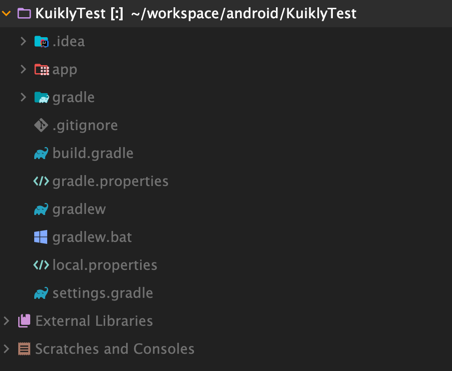
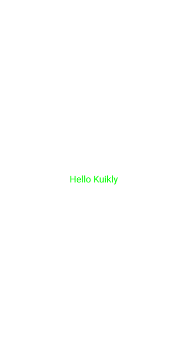

# Android工程接入

:::tip 注意
在此之前请确保已经完成**KMP侧 Kuikly**的接入，如还未完成，请移步[KMP跨端工程接入](./common.md)
:::

完成**Kuikly KMP**侧的配置后, 我们还需要将**Kuikly**渲染器和适配器接入到宿主平台中，此文档适用于您想把Kuikly渲染器接入到您现有的Android工程中。下面我们来看下，如何在现有Android工程中接入Kuikly渲染器。

我们先新建一个名为**KuiklyTest**新工程并假设这个工程是你现有的Android工程

<div align="center">

</div>

## 添加Kuikly渲染器依赖

在引入kuikly的宿主模块（即下方实现Kuikly承载容器的模块）下的gradle文件下添加``Kuikly``相关的依赖

:::tip 注意
此处 core-render-android 和 core 的 Kuikly 版本需要和KMM跨端工程使用的版本保持一致，否则可能会出现兼容性问题
:::

```gradle{2,3}
dependencies {
    implementation("com.tencent.kuikly-open:core-render-android:KUIKLY_RENDER_VERSION")
    implementation("com.tencent.kuikly-open:core:KUIKLY_CORE_VERSION")
    implementation 'androidx.core:core-ktx:1.7.0'
    implementation 'androidx.appcompat:appcompat:1.6.1'
    implementation 'com.google.android.material:material:1.8.0'
    implementation 'androidx.constraintlayout:constraintlayout:2.1.3'
    ...
}
```
:::tip 提示
* KUIKLY_RENDER_VERSION 需要替换为实际的 kuikly 版本号，在这里[查看最新版本](../ChangeLog/changelog.md)
* KUIKLY_CORE_VERSION 需要替换为实际的 kuikly 版本号，在这里[查看最新版本](../ChangeLog/changelog.md)
* 版本号需要和[KMP跨端工程](common.md)保持一致
:::

## 实现Kuikly承载容器

在你的android工程新建``KuiklyRenderActivity``, 用于承载**Kuikly页面**。具体实现代码，请参考源码工程androidApp模块的``KuiklyRenderActivity``类。

```kotlin
class KuiklyRenderActivity : AppCompatActivity() {

    private lateinit var hrContainerView: ViewGroup
    private lateinit var loadingView: View
    private lateinit var errorView: View

    private lateinit var kuiklyRenderViewDelegator: KuiklyRenderViewBaseDelegator

    protected val pageName: String
        get() {
            val pn = intent.getStringExtra(KEY_PAGE_NAME) ?: ""
            return if (pn.isNotEmpty()) {
                return pn
            } else {
                "router"
            }
        }
    private lateinit var contextCodeHandler: ContextCodeHandler

    override fun onCreate(savedInstanceState: Bundle?) {
        super.onCreate(savedInstanceState)
        // 1. 创建一个Kuikly页面打开的封装处理器
        contextCodeHandler = ContextCodeHandler(pageName)
        // 2. 实例化Kuikly委托者类
        kuiklyRenderViewDelegator = contextCodeHandler.initContextHandler()  
        setContentView(R.layout.activity_hr)
        setupImmersiveMode()
        // 3. 获取用于承载Kuikly的容器View
        hrContainerView = findViewById(R.id.hr_container)
        loadingView = findViewById(R.id.hr_loading)
        errorView = findViewById(R.id.hr_error)
        // 4. 触发Kuikly View实例化
        // hrContainerView：承载Kuikly的容器View
        // contextCode: jvm模式下传递""
        // pageName: 传递想要打开的Kuikly侧的Page名字
        // pageData: 传递给Kuikly页面的参数
        contextCodeHandler.openPage(this, hrContainerView, pageName, createPageData())
    }
    override fun onResume() {  // 5.通知Kuikly页面触发onResume
        super.onResume()
        kuiklyRenderViewDelegator.onResume()
    }
    override fun onPause() {  // 6. 通知Kuikly页面触发onStop
        super.onPause()
        kuiklyRenderViewDelegator.onPause()
    }
    override fun onDestroy() {  // 7. 通知Kuikly页面触发onDestroy
        super.onDestroy()
        kuiklyRenderViewDelegator.onDetach()
    }

    private fun createPageData(): Map<String, Any> {
        val param = argsToMap()
        param["appId"] = 1
        return param
    }

    private fun argsToMap(): MutableMap<String, Any> {
        val jsonStr = intent.getStringExtra(KEY_PAGE_DATA) ?: return mutableMapOf()
        return JSONObject(jsonStr).toMap()
    }

    private fun setupImmersiveMode() {
        window?.apply {
            addFlags(WindowManager.LayoutParams.FLAG_DRAWS_SYSTEM_BAR_BACKGROUNDS)
            window?.statusBarColor = Color.TRANSPARENT
            window?.decorView?.systemUiVisibility =
                View.SYSTEM_UI_FLAG_LAYOUT_FULLSCREEN or View.SYSTEM_UI_FLAG_LAYOUT_STABLE
            decorView.systemUiVisibility = View.SYSTEM_UI_FLAG_LAYOUT_FULLSCREEN or
                    View.SYSTEM_UI_FLAG_LAYOUT_STABLE or View.SYSTEM_UI_FLAG_LIGHT_STATUS_BAR
        }

    }

    companion object {
        private const val TAG = "KuiklyRenderActivity"
        private const val KEY_PAGE_NAME = "pageName"
        private const val KEY_PAGE_DATA = "pageData"

        fun start(context: Context, pageName: String, pageData: JSONObject) {
            val starter = Intent(context, KuiklyRenderActivity::class.java)
            starter.putExtra(KEY_PAGE_NAME, pageName)
            starter.putExtra(KEY_PAGE_DATA, pageData.toString())
            context.startActivity(starter)
        }
    }
}
```

```xml
// activity_hr.xml
    <?xml version="1.0" encoding="utf-8"?>
<FrameLayout xmlns:android="http://schemas.android.com/apk/res/android"
    android:layout_width="match_parent"
    android:layout_height="match_parent">

    <FrameLayout
        android:id="@+id/hr_container"
        android:layout_width="match_parent"
        android:layout_height="match_parent"/>

    <View
        android:id="@+id/hr_loading"
        android:layout_width="match_parent"
        android:layout_height="match_parent"/>

    <View
        android:id="@+id/hr_error"
        android:layout_width="match_parent"
        android:layout_height="match_parent"/>

</FrameLayout>
```

## 实现Kuikly适配器（必须实现部分）

``Kuikly``框架为了灵活和可拓展性，不会内置实现图片下载，异常处理，日志实现等功能，而是通过适配器的设计模式，将具体实现委托给宿主App实现。

``Kuikly``目前含有以下适配器, 需宿主平台按需实现

1. **图片加载适配器**: 用于给Kuikly的Image组件实现图片下载解码能力。**宿主侧必须实现**
2. **日志适配器**: 用于给Kuikly框架和Kuikly业务实现日志打印。**宿主侧必须实现**
3. **页面路由适配器**: 用于实现跳转到``Kuikly``容器。**宿主侧必须实现**
4. **线程适配器**: ``Kuikly``内部不会创建子线程, 复用宿主的子线程, 防止占用宿主太多资源。**宿主侧必须实现**
5. **异常适配器器**: 当Kuikly业务执行逻辑出错时，决定如何处理异常。**推荐宿主侧实现**
6. **颜色值转换适配器**: Kuikly框架对颜色值的处理，默认只处理十六进制的颜色值。**宿主按需实现**
7. **自定义字体适配器**: Kuikly框架不会内置一些自定义字体。业务如果有自定义字体的需求, 需实现此适配器来扩展字体。**宿主按需实现**

### 实现图片适配器
具体实现代码，请参考源码工程androidApp模块的``KRImageAdapter``类。

```kotlin
object KRImageAdapter : IKRImageAdapter {
    override fun fetchDrawable(
        imageLoadOption: HRImageLoadOption,
        callback: (drawable: Drawable?) -> Unit
    ) {
        TODO("Not yet implemented")
    }

}
```

### 实现日志适配器
具体实现代码，请参考源码工程androidApp模块的``KRLogAdapter``类。
```kotlin
object KRLogAdapter : IKRLogAdapter {
    override val asyncLogEnable: Boolean
        get() = TODO("Not yet implemented")

    override fun i(tag: String, msg: String) {
        TODO("Not yet implemented")
    }

    override fun d(tag: String, msg: String) {
        TODO("Not yet implemented")
    }

    override fun e(tag: String, msg: String) {
        TODO("Not yet implemented")
    }

}
```

### 实现异常适配器
具体实现代码，请参考源码工程androidApp模块的``KRUncaughtExceptionHandlerAdapter``类。
```kotlin
object KRExceptionAdapter : IKRUncaughtExceptionHandlerAdapter {
    override fun uncaughtException(throwable: Throwable) {
        if (BuildConfig.DEBUG) { // debuug版本crash
            throw throwable
        } else {
            Log.d("KRError", throwable.stackTraceToString()) // release版本打印日志
        }
    }
}
```

### 页面路由适配器

该适配器必须实现, 用于实现``Kuikly``页面之间的跳转

具体实现代码，请参考源码工程androidApp模块的``KRRouterAdapter``类。
```kotlin
object KRRouterAdapter : IKRRouterAdapter {

    override fun openPage(
        context: Context,
        pageName: String,
        pageData: JSONObject,
    ) {
        KuiklyRenderActivity.start(context, pageName, pageData)
    }

    override fun closePage(context: Context) {
        (context as? Activity)?.finish()
    }
}
```

### 线程适配器

该适配器必须实现，用于让``Kuikly``的任务在子线程执行

具体实现代码，请参考源码工程androidApp模块的``KRThreadAdapter``类。

```kotlin
class KRThreadAdapter : IKRThreadAdapter {
    override fun executeOnSubThread(task: () -> Unit) {
        execOnSubThread(task)
    }
}

private val subThreadPoolExecutor by lazy {
    Executors.newFixedThreadPool(2)
}

fun execOnSubThread(runnable: () -> Unit) {
    subThreadPoolExecutor.execute(runnable)
}
```

其他按需实现适配器示例参考[实现适配器（按需实现部分）](#实现适配器-按需实现部分)

### 将适配器设置给Kuikly
具体实现代码，请参考源码工程androidApp模块的``KuiklyRenderActivity``类。
```kotlin
class KuiklyRenderActivity : AppCompatActivity(), KuiklyRenderViewDelegatorDelegate {
    ...
    companion object {
        init {
            // 初始化Kuikly适配器
            initKuiklyAdapter()
        }
        
        private fun initKuiklyAdapter() {
            with(KuiklyRenderAdapterManager) {
                krImageAdapter = KRImageAdapter
                krLogAdapter = KRLogAdapter
                krUncaughtExceptionHandlerAdapter = KRUncaughtExceptionHandlerAdapter
                krRouterAdapter = KRRouterAdapter
                krThreadAdapter = KRThreadAdapter()
                // 按需实现其他适配器
                // krFontAdapter = KRFontAdapter
                // krColorParseAdapter = KRColorParserAdapter(KRApplication.application)
            }
        }
    }
    ...
}
```

## 编写TestPage验证

来到这步后, 我们已经完成Kuikly平台侧的接入, 下面我们在[KMP跨端工程接入](common.md)创建的KMP工程中的``shared``模块下新建``TestPage``, 测试我们的接入是否成功

```kotlin
@Page("test")
class TestPage : Pager(){
    override fun body(): ViewBuilder {
        return {
            attr {
                allCenter()
                backgroundColor(Color.WHITE)
            }

            Text {
                attr {
                    fontSize(20f)
                    color(Color.GREEN)
                    text("Hello Kuikly")
                }
            }
        }
    }
}
```

## 将业务代码集成到现有工程

1. 编写完业务代码后, 我们需要将业务代码编译成aar集成到现有工程，集成方式可以是**远程依赖**或者**本地依赖**的方式。

2. 我们在**KMP业务工程中**执行``./gradlew :shared:bundleDebugAar``命令，将业务代码编译成AAR, AAR产物位于``shared/build/output/aar``中

3. 将产物集成到你现有的工程中

## 跳转到KuiklyRenderActivity容器

1. 在合适的时机跳转到``KuiklyRenderActivity``容器, 并指定跳转的url为``TestPage``对应的``pageName: test``

```kotlin
KuiklyRenderActivity.start(context, "test", JSONObject())
```

运行androidApp，当出现下面界面时，证明已经接入成功

<div align="center">

</div>

## 实现适配器（按需实现部分）
### 实现颜色值转换适配器

通过该适配器自定义颜色转换逻辑，业务可根据实际使用需求来决定是否实现

具体实现代码，请参考源码工程androidApp模块的``KRColorParserAdapter``类。
```kotlin
object KRColorAdapter : IKRColorParserAdapter {
    override fun toColor(colorStr: String): Int? {
        // 自定义转换颜色
    }
}
```

### 自定义字体适配器

通过该适配器扩展自定义字体, 业务可根据实际使用需求来决定是否实现

具体实现代码，请参考源码工程androidApp模块的``KRFontAdapter``类。
```kotlin
object KRFontAdapter : IKRFontAdapter {
    override fun getTypeface(fontFamily: String, result: (Typeface?) -> Unit) {
        // 加载自定义字体, 结果通过result回调给Kuikly侧
        
        // 例：assets/font/ 存放Satisfy-Regular.ttf 自定义字体文件
        if (fontFamily.isEmpty()) {
            result(null)
        } else {
            var tfe: Typeface? = null
            when (fontFamily) {
                "Satisfy-Regular" -> {
                    tfe = Typeface.createFromAsset(KRApplication.application.assets, "fonts/$fontFamily.ttf")
                }
            }
            result(tfe)
        }
    }
}
```