# KMP跨端工程接入

:::tip 建议
如果您还没阅读过Kuikly接入概述，建议您先移步[Kuikly概述](overview.md). 了解下接入Kuikly涉及到的工作
:::

为了减少业务开发者接入的成本，我们基于Android Studio开发了Kuikly脚手架插件, 你可以通过Kuikly脚手架插件轻松创建带有``Kuikly``的KMP工程。这个工程也是平时你写业务代码的工程

## 新建Kuikly工程

:::tip 注意
在此之前请确保已经完成**Kuikly**环境搭建，如还未搭建环境，请移步[环境搭建文档](env-setup.md)
:::

1. 使用``Android Studio``新建``Kuikly``工程。 **File -> New -> New Project -> Kuikly Project Template**


:::tip 提示
* 新建工程后，可检查以下配置文件，把``Kuikly``的版本号替换为最新版本
  * 业务逻辑模块：``shared/build.gradle.kts``
  * Android壳工程：``androidApp/build.gradle.kts``
  * iOS壳工程：``iosApp/Podfile``
  * 鸿蒙壳工程：``ohosApp/entry/oh-package.json5``
* 在这里[查看最新版本](../ChangeLog/changelog.md)
* 各端的版本号需要保持一致
:::

## 按需创建额外的模块

新建后，工程结构如图所示

<div>

</div>

除了在shared中开发页面外，可以按需增加新的模块

<div>
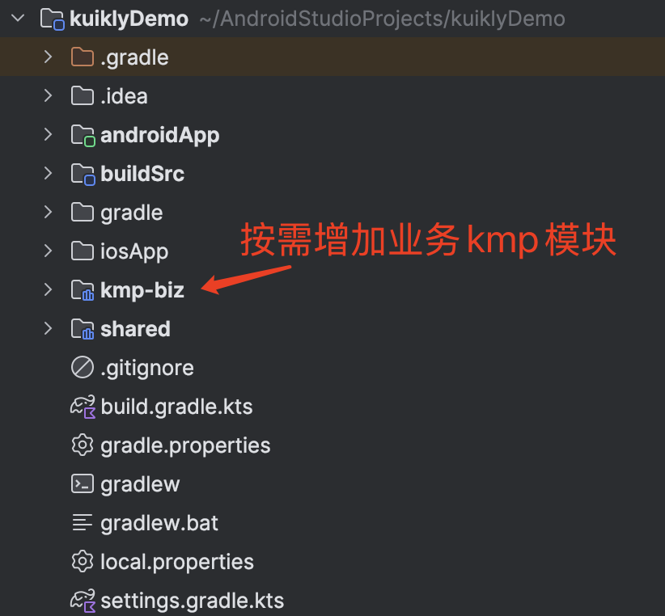
</div>

## 运行androidApp

1. 接着运行``androidApp``


2. 当手机出现**以下页面**时，说明已经成功运行``androidApp``

<div align="center">

</div>

## 运行iosApp

1. 如果是首次运行iOS的话，需要先进入iosApp目录，执行`pod install --repo-update`。
2. 将运行的scheme改为iosApp

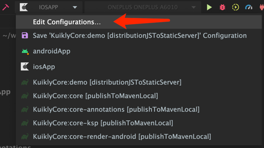
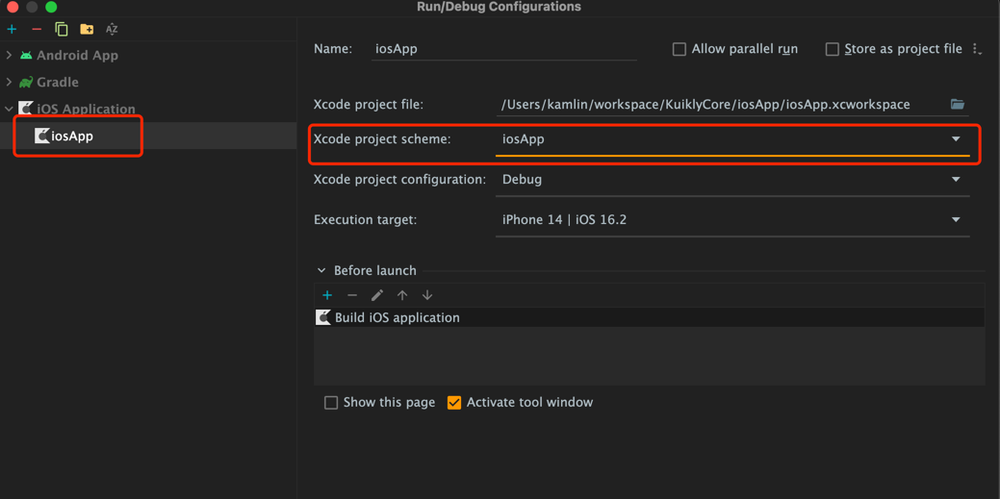

3. 运行``iosApp``

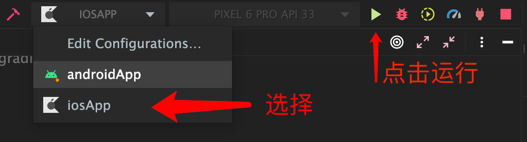

4. 当手机出现下面界面时，说明已运行成功

<div align="center">
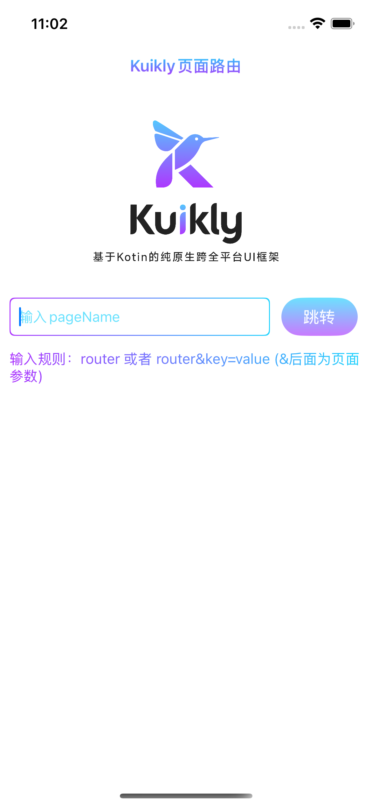
</div>

## 运行鸿蒙App
1. 如果是首次运行Ohos的话，需要用鸿蒙DevEco-Studio打开ohosApp目录
   >若初次打开鸿蒙IDEsync出错，打开ohosApp目录下的.npmrc文件，右上角点击sync重新sync即可
2. 在运行App之前，需要执行签名操作
   File -> Project Structure -> Signing Configs
    <div align="center">
        
    </div>
3. 运行``ohosApp``

   可以选择在 DevEco-Studio 内运行 或 Android Studio 内运行

   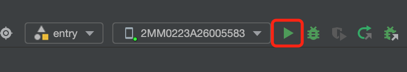

   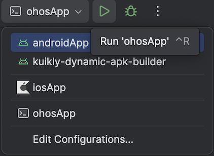
   > 若 Android Studio 无ohosApp选项 重新打开Android Studio即可
4. 当手机出现下面界面时，说明已运行成功ohosApp
    <div align="center">
        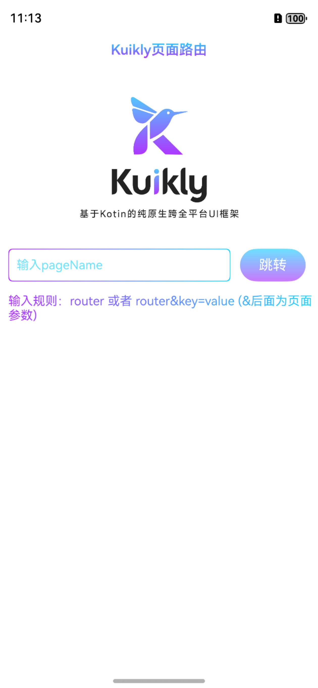
    </div>

## 运行H5
H5 是通过 gradle 启动 dev-server 来运行

1. 编译demo代码成js
```shell
# 运行 demo 项目 dev server 服务器，没有安装 npm 包则先 npm install 安装一下依赖
npm run serve
#  构建 shared 项目 Debug 版
./gradlew :shared:packLocalJsBundleDebug
```

2. 编译h5App代码成js，然后启动调试服务
```shell
#  运行 h5App 服务器 Debug 版
./gradlew :h5App:jsBrowserRun -t
kotlin 2.0 以上运行: ./gradlew :h5App:jsBrowserDevelopmentRun -t
如果window平台因为编译iOS模块失败，可以参考"快速开始-环境搭建"指引配置
# 拷贝 assets 资源到 dev server
./gradlew :h5App:copyAssetsToWebpackDevServer
```
3. 浏览器查看效果
就可以在 http://localhost:8080/ 看到效果了，如果要访问不同的页面，可以通过 url 参数指定页面名称，如：http://localhost:8080/?page_name=router

4. 浏览器下面界面时，说明已运行成功h5App

<div align="center">
    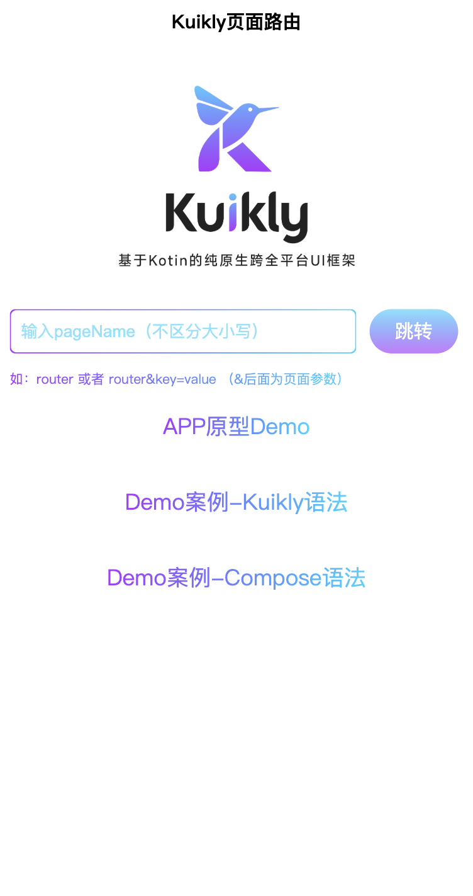
</div>


## 运行微信小程序
微信小程序先通过 gradle 编译js，然后通过微信开发者工具来运行
1. 编译demo代码成js
```shell
# 运行 demo 项目 dev server 服务器，没有安装 npm 包则先 npm install 安装一下依赖
npm run serve
#  构建 demo 项目 Debug 版
./gradlew :shared:packLocalJsBundleDebug
```

2. 编译miniApp代码成js，然后启动调试服务
```shell
#  运行 miniApp 服务器 Debug 版
./gradlew :miniApp:jsMiniAppDevelopmentWebpack
```

构建 release 版本
```shell
# 首先构建业务 Bundle
./gradlew :demo:packLocalJSBundleRelease

# 然后构建 miniApp
./gradlew :miniApp:jsMiniAppProductionWebpack
```

3.使用微信小程序开发者工具打开miniApp下的dist目录，根据你的实际页面，修改app.json里面的pages数组和在pages里新建对应的页面

4. 微信开发者工具编译运行，出现下面界面时，说明已运行成功miniApp
    <div align="center">
        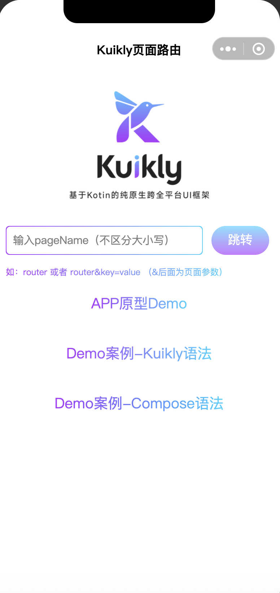
    </div>        

## 下一步

在成功运行androidApp和iosApp后我们就已经完成Kuikly KMP工程的新建。下一步，我们还需要在各个平台接入Kuikly的渲染器和设置一些适配器的工作。 以下是各个平台Kuikly渲染器的接入文档:

1. [Android KuiklyRender接入](android.md)
2. [iOS KuiklyRender接入](iOS.md)
3. [鸿蒙 KuiklyRender接入](harmony.md)
4. [H5 KuiklyRender接入](Web.md)
5. [微信小程序 KuiklyRender接入](Miniapp.md)

## 可能会遇到的问题

### :shared:podInstall错误

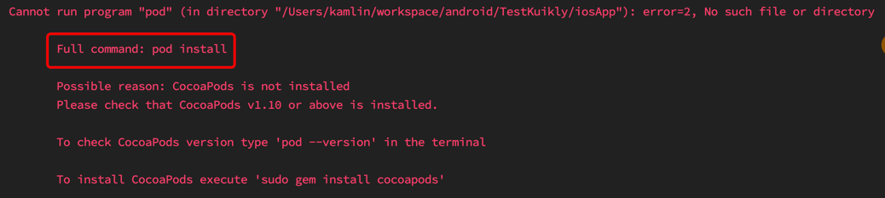

Android Studio本身的bug，可以查看[StackOverflow的解决方案](https://stackoverflow.com/questions/67813636/execution-failed-for-task-sharedpodinstall)

### Android Studio版本过低

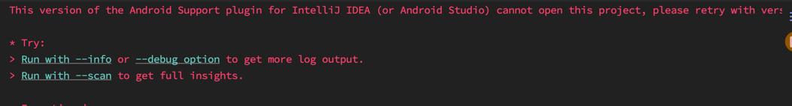

Android Studio版本过低，可下载最新的Android Studio版本
